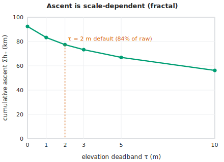
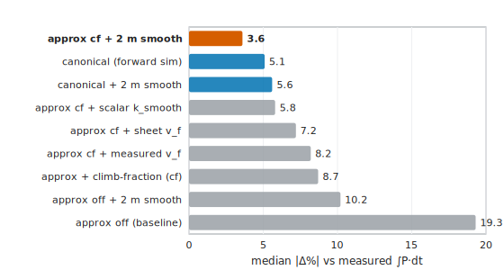
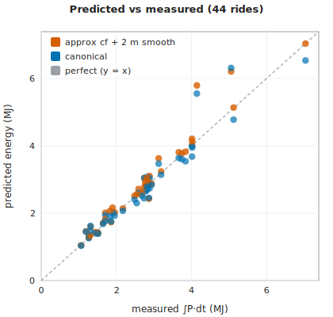
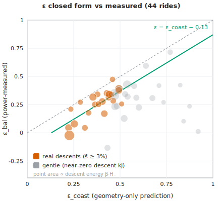
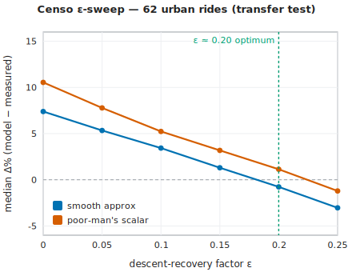
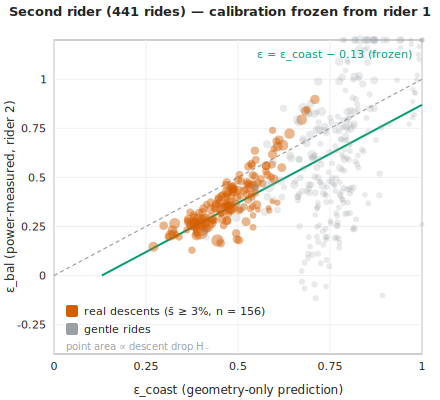

# A Closed-Form Descent-Recovery Factor for Bicycle Route Energy, and Its Energy↔Time Dual

> **DRAFT / working paper — Pedal Hidrográfico research notes** (v0.10, July 2026). Numbers and equations are drawn from the project's own benchmarks; novelty claims are corpus-bounded (see §11.3). Accuracy figures are self-reported against two collective members' power meters (see §10.4); the ε calibration is in-sample on rider 1 and confirmed frozen on rider 2 (§8.6); the reported ε correlations are part–whole (§8.3). Not peer-reviewed; circulated for internal review and comment.

**Danilo Lessa Bernardineli** — *Pedal Hidrográfico* (collective), São Paulo, Brazil — danilo.lessa@gmail.com

## Abstract

Planning community bicycle rides needs the *energy* of a route in kJ, but the standard tool is a forward-dynamics simulation [Martin et al. 1998] that is expensive and opaque for planning. We study a cheap closed-form alternative, `E ≈ α·x + β·(h₊ − ε·h₋)`, in which a single lumped factor `ε ∈ [0,1]` captures how much descent potential energy is recovered rather than wasted to excess drag and braking. We give `ε` a closed form in the coasting limit, `ε(s) = min(1, α/(β·s))`, drop-weighted over the profile with a calibrated −0.13 offset, and assess it against a power-meter descent-energy-balance `ε`: on real descents (mean slope ≥ 3%) the calibrated estimator cuts the RMS error by 37% relative to the best flat constant (in-sample; caveats in §8.3), and the offset transfers — calibrated on 44 open rides and applied frozen to 62 urban stop-go rides, it ties the constant selected in-sample there, and applied frozen to a **second rider's** 441-ride history (different power meter, faster open-road profile) it beats even that rider's own best flat constant by ~35% (RMS 0.091 vs 0.139 on real descents), with the −0.13 offset reproducing independently (measured gap 0.12). Run on the *same* physical constants as the simulation, the closed form reproduces measured `∫P·dt` to a 3.6% median over 44 power rides (best variant), to ~4–7% over 62 urban São Paulo rides with a generic assumed rider, and to ~5–7% over the second rider's 441 rides with only the mass data-implied. Because cumulative ascent is fractal and scale-dependent [Rapaport 2011], we fold a totals-only correction `k_smooth = 1 − c·x/h₊` (`c ≈ 3 m/km`) into the closed-form law to discount sub-metre noise without touching sustained climbs. We further derive an energy↔time dual, `x* = x + k₊·h₊ − k₋·h₋`, in which the descent coefficient `k₋` is the time-twin of `ε` through the same descent power; both halves of the time model have precedent individually, but we locate no prior work deriving the descent time-credit from the same descent power as the energy recovery factor — the *linkage* is the novel piece. Both engines and the shared law are deployed in open, local-first tools (sampasimu, amora, quilojaules).

## 1. Introduction

A self-organised cycling collective in São Paulo plans rides by *following the city's buried hydrography* — *"seguir as águas"* — tracing the creeks and relief the city paved over. Planning these community rides needs one number up front: the *energy* of a route, in kilojoules, so a ride can be advertised honestly as easy or punishing and matched to who is coming. The constraint is practical: the tooling is open-data and local-first, built to run in a browser or on a self-hosted box with no build step and no cloud lock-in, which rules out heavy per-route computation as the default planning primitive.

There are two ways to put a kJ number on a route. The **canonical** way is a forward-dynamics simulation: integrate the longitudinal force balance [Martin et al. 1998],

```
m·dv/ds = k_eff·P/v − C_rr·m·g·cosθ − ½·ρ·C_dA·(v + wind)² − m·g·sinθ,
```

regime by regime, with a brake/safe-speed cap on descents. It is accurate (here, 5.1% median absolute error against measured `∫P·dt` over 44 rides) but stiff, opaque, and needs a speed solver per segment — poorly suited to interactive planning over many candidate routes or to per-edge field computation over a DEM. The **approximate** way is a closed-form steady-speed energy integral,

```
E ≈ α·x + β·(h₊ − ε·h₋),
α = (C_rr·m·g + ½·ρ·C_dA·(v_f + wind)²)/k_eff,
β = m·g/k_eff,
```

linear in distance `x`, ascent `h₊` and descent `h₋`. Its `α·x + β·h₊` skeleton is a textbook result; the decisive — and under-specified — term is the descent credit `ε·h₋`. The recovery factor `ε ∈ [0,1]` lumps the descent-specific losses that `α` (charged at the flat reference speed `v_f`) does not carry: the excess aerodynamic drag of descending faster than `v_f`, plus braking. In the nearest road-cycling-power and elevation-routing literature we find no *validated, route-level, closed-form* expression for such a lumped `ε`: the idle/coasting boundary appears as a per-grade steady-state speed condition [Bigazzi & Lindsey 2019], and EV/e-bike energy routing treats descent recovery as a per-instant regeneration efficiency or a symmetric `m·g·Δh` potential, never as a calibrated `ε < 1` folded into a closed-form route law.

This paper closes that gap and draws out a structural consequence. We give `ε` a closed form in the coasting limit (`E_legs = 0`), where it collapses to a function of grade alone,

```
ε_coast(s) = min(1, α/(β·s)),     α/β = C_rr + ½·ρ·C_dA·(v_f + w)²/(m·g),
```

with `α/β` the *flat-resistance grade* — the slope whose gravity exactly balances flat rolling-plus-aero resistance. Aggregated drop-weighted over a profile and calibrated with a near-constant −0.13 offset, this geometry-only estimate, `ε ≈ clamp₀₁(ε_coast − 0.13)`, cuts the RMS error against a power-measured descent-energy-balance `ε` by 37% relative to the best flat constant on real descents (in-sample; §8.3). Crucially, we run the closed form and the simulation on the *same* physical constants `(m, C_rr, C_dA, ρ, k_eff, wind)`, so the residual gap between them is attributable to the *modelling simplifications, not the parameters*.

We then observe that energy has a **time twin**. Time is not `E/P` (degenerate on a coast), so it needs its own model; defining an *effective flat distance* `x* = x + k₊·h₊ − k₋·h₋` and reading time off the flat speed (`t = x*/v_f`) reproduces the same structure as the energy law term-for-term. The ascent coefficient `k₊ = v_f·β/P_climb` is clean and grade-independent — the equivalent-flat-distance idea with cycling precedent [Scarf & Grehan 2005; Scarf 2007] — while the descent coefficient `k₋` is a lumped, free parameter playing exactly the role `ε` plays for energy, with descent-time-credit precedent [Langmuir 1984; Tobler 1993]. Each half has precedent in isolation; what has no located precedent in the nearest corpus is the **linkage**: `ε` and `k₋` both encode the same hidden descent speed `v_desc` and become inter-derivable through the descent power `P̄_desc`,

```
k₋ = (1/s)·[1 − (v_f/P̄_desc)·(α − ε·β·s)].
```

### 1.1 Contributions

- **A route-level closed-form descent-recovery factor `ε`, assessed against measured power.** A single lumped `ε ∈ [0,1]` inside `E ≈ α·x + β·(h₊ − ε·h₋)`, with its coasting-limit closed form `ε(s) = min(1, α/(β·s))`, drop-weighted aggregate, and calibrated −0.13 offset. No precedent for such a lumped, closed-form `ε` was located in the nearest cycling-power, elevation-routing, or EV/e-bike energy corpus.
- **Assessment against a power-measured descent-energy-balance `ε`**: a 37% RMS reduction over the best flat constant on real descents (s̄ ≥ 3%, n = 22; in-sample, §8.3) — and, frozen, the same estimator beats a **second rider's** own best flat constant by ~35% on 156 real-descent rides it never saw, with the −0.13 offset reproducing independently (measured gap 0.12; §8.6).
- **An energy↔time duality** `x* = x + k₊·h₊ − k₋·h₋` whose descent coefficient `k₋` is the time-twin of `ε`, made inter-derivable through the shared descent power `P̄_desc`. Both halves of the time model have prior art individually; the *derivation of `k₋` from the same descent power as `ε`* is, to our knowledge, new.
- **A shared-constants comparison design** that runs the closed form and a Martin-1998 forward simulation on identical physical constants, isolating modelling error from parameter error — together with a clean open reference implementation of the simulation (energy-conservative, semi-implicit, brake-capped, no KE floor).
- **A `k_smooth` correction for fractal cumulative ascent** inside the closed-form law. Because measured ascent is scale-dependent [Rapaport 2011], raw `h₊` over-counts energy through sub-metre noise and short rollers; a per-segment ~2 m deadband (or the totals-only scalar `k_smooth = 1 − c·x/h₊`, `c ≈ 3 m/km`) removes that part while leaving sustained climbs at full strength (`k_h = 1`).
- **Assessment on real, non-racing social and urban rides** reproducing measured `∫P·dt` to a 3.6% median (best closed-form variant) over 44 power-meter rides, to ~4–7% median over 62 urban São Paulo rides with a generic assumed rider, and to ~5–7% median over a second rider's 441 rides with only the mass data-implied (§8.6) — with explicit physical-floor (`E_legs ≥ m·g·h₊/k_eff`) and cadence data-quality filters, and a documented São Paulo negative result (urban stop-go riding makes `ε` behave as an approximate constant rather than tracking braking density).
- **A per-DEM ascent-bias table `k_DEM`** (a parameter-error result, not a headline modelling claim) quantifying how the choice of elevation source biases the closed-form law's `h₊`/`h₋` inputs.
- **Deployment** of the shared law in three open, local-first tools: asymmetric energy *fields* over DEMs (sampasimu), per-ride kJ records (amora), and per-segment kJ via the canonical twin (quilojaules).

## 2. Related work

Our two-engine design and its closed-form half draw on five distinct strands of prior art: the standard force-balance power model, equivalent-flat-distance time models, descent time-credits, the fractal nature of cumulative ascent, and energy-aware routing with recuperation. We organize the review by theme, naming the canonical reference for each and stating precisely what is standard and what we add. Every "no located precedent" claim below is corpus-bounded; the full caveat is stated once in §11.3.

### 2.1 The force-balance power model (canonical engine)

The instantaneous mechanical power required to ride a bicycle is, by now, textbook. The canonical statement is the validated force-balance model of [Martin et al. 1998], which sums rolling resistance, aerodynamic drag, gravity, a changing-kinetic-energy term, wheel-bearing friction, and a tyre/road term, and which was validated against direct power measurement on a flat taxiway to R² = 0.97 (SE 2.7 W), with a wind-tunnel drag area of CdA = 0.269 ± 0.006 m² for racing drops. The same balance underlies the cyclist "equation of motion" of [di Prampero et al. 1979] and is the model adopted by the modern simulation literature: [Dahmen & Saupe 2011] integrate it with `ode45` and validate the speed prediction on real rural tracks (explicitly excluding steep descents and braking); [Danek et al. 2020] estimate its parameters from power data; and [Li et al. 2025] optimize race pacing on a Martin-1998 power model with a genetic algorithm.

Our `canonical()` engine *is* this model — the distance-marching longitudinal force balance

$$
m\,\frac{dv}{ds} = \frac{k_{eff}\,P}{v} - C_{rr}\,m g \cos\theta - \tfrac12\,\rho\,C_d A\,(v + w)^2 - m g \sin\theta
$$

integrated with a semi-implicit kinetic-energy update, a brake/safe-speed cap, and an enforced conservation identity `k_eff·legE = ΔKE + W_rr + W_aero + W_grav + W_brake`. We claim nothing new about the physics here. What we add is operational: a clean, open, no-build reference implementation, and its use as the *control* arm of a shared-constants comparison (§4). One point stated precisely: [Martin et al. 1998] make small-angle simplifications *inside* this instantaneous-power model but never publish a route-level energy closed form; the closed form of §4–5 is our own derivation, not something the 1998 paper licenses.

### 2.2 Closed-form steady-speed energy and the lumped descent factor ε

Integrating the force balance at steady speed over a segment gives the energy skeleton `E ≈ α·x + β·h₊`, where `α` collects rolling-plus-aero cost per horizontal metre and `β = m·g/k_eff` is the cost per metre climbed. That skeleton is standard — it is the textbook steady-speed energy integral, and we do not claim it.

What has no located precedent in the closest road-cycling-power and elevation-routing literature is the **lumped, route-level descent-recovery factor ε ∈ [0,1]** and its closed form. We write

$$
E \approx \alpha\,x + \beta\,(h_+ - \epsilon\,h_-),
$$

with ε a single scalar lumping the descent-specific losses (excess aero above flat speed, plus braking) that `α` — charged at flat speed `v_f` — does not carry, and we give it a geometry-only closed form in the coasting limit,

$$
\epsilon_{coast}(s) = \min\!\big(1,\ \alpha/(\beta s)\big), \qquad \alpha/\beta = C_{rr} + \tfrac12\rho C_d A\,(v_f+w)^2/(m g),
$$

drop-weighted over the descent profile and corrected by a near-constant offset, `ε ≈ clamp[0,1](ε_coast − 0.13)`.

The nearest located precedent for the *idle/coasting boundary* is [Bigazzi & Lindsey 2019], whose negative-grade condition `v² ≤ μ₁/(−μ₃)` zeroes tractive power on gentle descents — but they apply it to per-grade steady-state speed *choice*, never to a route-level closed-form recovery factor. The structural cousin in energy-optimal EV routing, [Ahmadi et al. 2024], uses a symmetric, path-independent gravitational potential `(M+m)·g·ΔH` — recovery is total and `ε`-free, not a calibrated `ε < 1`. Across the EV/e-bike and operations-research routing literature, downhill recovery is always either a per-instant/per-speed-range regeneration efficiency [Yuan et al. 2024], a symmetric `mgΔh` potential, or per-edge negative arc costs solved numerically [Perger & Auer 2020]; none is a lumped route-level closed-form factor in `[0,1]`. (We note explicitly that ε is *not* the eccentric/concentric muscle-efficiency asymmetry of [Minetti et al. 2002]: ε is the cyclist's gravity-and-brake budget, not a physiological efficiency. We invoke Minetti only as a conceptual analogy.)

### 2.3 Equivalent-flat-distance and ascent time models

The idea of converting climbing into an equivalent length of flat riding is old in the route-choice and hiking literatures. [Scarf & Grehan 2005] give a cycling "equivalent distance" in which 1 m of climb costs roughly 8 m of flat; [Scarf 2007] refines the cycling Naismith rule to 1 m of ascent ≈ 7.92 m horizontal; and [Norman 2004] gives analogous uphill-running equivalences. Our effective-flat-distance time model

$$
x^* = x + k_+\,h_+ - k_-\,h_-, \qquad k_+ = v_f\,\beta/P_{climb},
$$

extends — and does not invent — this equivalent-flat-distance idea for the ascent half: `k₊` converts climb to flat time and is, like Naismith, grade-independent on steep climbs (on a climb almost all power goes into lifting, so `dt = m·g·dh/(k_eff·P_climb)` depends on vertical gain, not road length).

### 2.4 Descent time-credits

The descent half of `x*` has its own precedent. [Langmuir 1984] corrects Naismith's rule with a descent term that *credits* gentle descents (−10 min per 300 m on slopes of 5–12°) but *penalizes* steep ones (+10 min per 300 m above 12°); [Tobler 1993] gives the hiking speed function `V = 6·e^(−3.5·|S+0.05|)`, whose maximum is at a downgrade of −2.86°, so gentle descents are faster than flat. These are the route-level descent time-credit precedents for our lumped `k₋`. As a time concept, `k₋` is therefore not new, and we say so: Langmuir's gentle-credit/steep-penalty split is the *same asymmetry* that our ε and brake-cap encode on the energy side.

The genuinely additive piece is the **linkage**, not either half on its own. [Langmuir 1984] and [Tobler 1993] are empirical time fits never tied to an energy budget. We instead *derive* the descent time-credit `k₋` and the energy recovery factor ε from the *same* descent power `P̄_desc`: both encode the same hidden descent speed `v_desc`, and equating the time-side (`v_desc = v_f/(1−k₋·s)`) and energy-side (`v_desc = P̄_desc/(α−ε·β·s)`) expressions yields the single relation tying them together. To our knowledge, no prior work derives the descent time-credit from the same descent power as the recovery factor; this **energy↔time duality** (§7) is the novel contribution of the time model.

### 2.5 Cumulative ascent as a fractal quantity

Total ascent `h₊` is not a well-defined number until a scale is fixed: the finer the elevation sampling, the more sub-metre wiggle it accumulates. [Rapaport 2011] makes this precise, showing cumulative ascent is scale-dependent (a Mandelbrot-style fractal measurement problem) and stating the roller-momentum intuition — that a rider coasting over a short bump does not "pay" its full ascent — in words, but only as a qualitative caveat, with no deadband and no energy-law correction. We formalize that caveat inside the closed-form law (§6): a per-segment deadband (≈ 2 m) on the profile, or, with totals only, the scalar `k_smooth = 1 − c·x/h₊` with `c ≈ 0.003` (= 3 m/km, a dimensionless "noise grade"). Folding `k_smooth` *into* the energy law to discount fractal-noise ascent without touching sustained climbs has, to our knowledge, no precedent; the canonical sim needs no such factor because it tracks kinetic energy and already pays roller momentum correctly.

### 2.6 Inferring hidden quantities and energy-aware routing

Two further strands frame our methods. First, recovering a hidden physical quantity by inverting an energy identity is exactly the logic of [Chung]'s "virtual elevation" method for estimating CdA from a power meter; our `epsFromFIT` (which recovers ε from a measured descent energy balance) and our `k_DEM` ascent-source corrections are Chung-adjacent — the inversion method is standard, only the inferred targets (the recovery factor; per-DEM ascent bias) are new. Second, in energy-aware electric-vehicle and e-bike routing, downhill *recuperation* is modelled explicitly: [Perger & Auer 2020] route EVs with regenerated (negative) edge energies, [Yuan et al. 2024] combine a symmetric `mgΔh` term with a per-instant regeneration efficiency, and the validation closest to ours on *real, non-racing* rides — [Gebhard et al. 2016], on WeBike e-bikes over OSM — predicts *battery range*, not mechanical `∫P·dt`. The contrast with these is the same throughout: their recovery is per-instant or symmetric and (in the OR work) solved numerically per edge, where ours is a single lumped closed-form factor validated against measured mechanical energy.

## 3. Two engines on shared constants

We model the mechanical energy of a ride twice, with two engines of deliberately different cost and fidelity, and run both on the **same physical constants**. The expensive engine is a forward-dynamics simulation of the standard road-cycling power balance [Martin et al. 1998]; the cheap one is a closed-form law that integrates that balance under a small set of simplifications. Because the two share every constant, the gap between them is attributable to the *modelling simplifications, not the parameters* — the central experimental control of this work.

### 3.1 The canonical engine: forward-dynamics simulation

The canonical engine, `canonical()`, integrates the longitudinal force balance of [Martin et al. 1998] by marching in distance `s` along the elevation profile:

$$
m\,\frac{dv}{ds} \;=\; \frac{k_{eff}\,P}{v} \;-\; C_{rr}\,m g \cos\theta \;-\; \tfrac12\,\rho\,C_d A\,(v + w)^2 \;-\; m g \sin\theta,
$$

with the per-segment grade taken from the profile (`slope = dh/dx`, `cosθ = 1/√(1+slope²)`, `sinθ = slope/√(1+slope²)`), and aero acting on the air speed `v + w` (signed, as `rel·|rel|`). Pedal power is **regime-selected per segment** by local grade — `P = P_climb` where `slope ≥ +2%`, `P = P_descent` where `slope ≤ −1.5%`, else `P = P_flat`. A safe-speed brake cap limits `v` to `v_max`; on descents the kinetic energy in excess of the cap is dumped to a brake-work term `W_brake`. The default thresholds are `v_max = 38 km/h`, `v_start = 15 km/h`, with the integrator on a `dx = 5 m` grid and adaptive sub-steps (`dt ≤ 0.25 s`, `ds ≥ 0.2 m`).

The kinetic-energy update is **semi-implicit**: the stiff propulsion term `k_eff·P/v` is evaluated at the *new* speed by a safeguarded Newton iteration (with bisection bracketing) on

$$
g(u) = u - \frac{A}{\sqrt{u}} - B, \qquad A = k_{eff}\,P\,ds\,\sqrt{m/2},\quad B = KE - R\,ds .
$$

This is energy-conservative at any step and **never injects energy**, so the predicted leg energy can never fall below the work actually done. The engine returns the leg energy `legE = ∫P·dt` (its predicted mechanical energy), elapsed time, the full speed profile, and the wheel-work breakdown `W_rr, W_aero, W_grav, W_brake, ΔKE`. These satisfy the enforced conservation identity

$$
k_{eff}\cdot legE \;=\; \Delta KE + W_{rr} + W_{aero} + W_{grav} + W_{brake},
$$

which holds to `1e-6` relative error and is used as the engine self-check. On a pure climb it guarantees `legE ≥ m g·h₊/k_eff` — leg energy never less than the potential energy lifted. Critically, there is **no VMIN/KE floor**: such a floor would inject energy and break this inequality on underpowered steep climbs. The canonical engine tracks kinetic energy directly, so it pays the momentum cost of short rollers correctly and needs no elevation smoothing.

### 3.2 The approximate engine: closed-form law

The approximate engine, `approximate()`, evaluates a closed-form integral of the same balance. In its simplest (v1) form,

$$
E \approx \alpha\,x + \beta\,(h_+ - \epsilon\,h_-),
$$

with horizontal distance `x`, total ascent `h₊`, total descent `h₋`, and

$$
\alpha = \frac{C_{rr}\,m g + \tfrac12\,\rho\,C_d A\,(v_f + w)^2}{k_{eff}}, \qquad \beta = \frac{m g}{k_{eff}} .
$$

Here `α` is energy per horizontal metre (rolling + aero, charged at the flat reference speed `v_f`), `β` is energy per vertical metre, and `ε ∈ [0,1]` is the lumped descent-recovery factor developed in §5. A per-edge clamp `max(0, α·dx − ε·β·|dh|)` on descent segments prevents negative segment energy. The leg energy is `E_leg = E_wheel/k_eff` (the legs supply *more* than the wheel receives; `α, β` above are already wheel-side quantities).

The current (v2) form refines this with three corrections, each of which removes a *systematic* bias measured against the power-meter rides:

$$
\boxed{\,E \approx \alpha_r\,x + \alpha_a\,x_{flat} + k_h\,k_{smooth}\,\beta\,(h_+ - \epsilon\,h_-),\qquad k_h = 1\,}
$$

**(i) α split — charge aero only off the climbs.** The rolling term is exact on any grade (`C_rr m g cosθ·s = C_rr m g·x`), but the aero term, billed at `v_f` over the *whole* distance, over-charges climbs where the rider actually moves far slower (`aero ∝ v²`). We split `α = α_r + α_a` and apply aero only over the non-climbing fraction:

$$
\alpha_r = \frac{C_{rr}\,m g}{k_{eff}}, \qquad
\alpha_a = \frac{\tfrac12\,\rho\,C_d A\,v_f^2}{k_{eff}}, \qquad
x_{flat} = x\,(1 - f_{climb}), \qquad
f_{climb} = \frac{x_+}{x},
$$

with `x₊` the horizontal distance on climbing segments (`slope ≥` the climb threshold). The headline runs zero climb aero (`climbAeroMode = 'zero'`; `'off'` is the full-aero baseline); a near-exact variant instead charges it at the quasi-steady climb speed `v_c ≈ k_eff·P_climb/(C_rr m g cosθ + m g sinθ)`, capped at `v_f`. Descent aero is left untouched — on descents it is paid by gravity and already sits inside `(1−ε)·β·h₋`; down-weighting it there would double-count. Empirically this correction cuts the median |Δ%| from 19.3% (baseline `off`) to 8.7% over the 44 power rides, beating `off` on 43/44 rides (median climb fraction 21%); the per-regime details are reported in §8.1.

**(ii) k_h = 1 — gravity is paid in full on real climbs.** A direct fit of the gravity coefficient on sustained climbs gives `k_h ≈ 1` (validated in §8.2): on real climbing `β·h₊` is correct and there is no uniform gravity discount.

**(iii) k_smooth — trim only the rollers and DEM noise.** What makes raw `h₊` over-count `E` is not sustained climbing but short rollers and sub-metre elevation jitter. The right correction is therefore an *ascent-smoothing* factor `k_smooth ∈ (0,1]` that trims those while leaving sustained climbs intact; it is developed in full in §6. **`k_smooth` applies to the approximate model only** — the canonical sim already pays the rollers' momentum through its kinetic-energy term.

### 3.3 The shared-constants design

Both engines read the *same* physical constants — `m, C_rr, C_dA, ρ, k_eff, wind`, plus the regime/grade thresholds — and the two are never allowed to diverge on any of them. This is the experimental control. If both engines used independently tuned parameters, a small gap between their predictions could be either a modelling artefact or a parameter mismatch, and the two would be inseparable. Holding the constants fixed makes the gap *unambiguously* the modelling simplification: the closed form's assumption of a single flat reference speed, its lumped descent recovery `ε`, and its linear treatment of `h₊`, set against the forward sim's explicit momentum and brake accounting.

Running two different engines on the *same* constants to isolate the modelling-simplification gap (rather than least-squares-calibrating one shared model to isolate *parameter* error, as in [Dahmen & Saupe 2011]) was not found in the nearest prior art; we frame it as an additive methodological contribution.

The comparison is anchored at a known calibration point. On flat ground the two engines coincide *iff* `v_f` equals the flat-equilibrium speed at the flat power, i.e. `v_f = flatEqSpeed(P_flat)`, where `flatEqSpeed(P)` solves the flat balance `(C_rr m g + ½ρ C_dA(v+w)²)·v = k_eff·P` by bisection (this is what "auto `v_f`" sets). With the engines pinned to agree on the flat, every divergence elsewhere — most prominently the uphill aero over-charge corrected by the `α`-split above — is the genuine modelling story rather than a calibration accident.

## 4. The descent-recovery factor ε

### 4.1 Definition

The factor ε ∈ [0,1] is the single lumped parameter that the closed-form law carries that the canonical simulation does not. It absorbs all descent-specific losses that the rolling-and-aero term α — charged at the *flat* reference speed v_f — does not account for: the excess aerodynamic drag incurred by descending faster than v_f, plus braking. For a descent of grade s, the **local** recovery is the fraction of that descent's released potential energy β h₋ that is *not* wasted:

$$
\epsilon(s) := 1 - \frac{(\text{aero excess} + \text{braking}) \text{ at the speed reached on grade } s}{m g\, h_- / k_{eff}}.
$$

Equivalently, from the segment energy balance (neglecting the kinetic term, which telescopes over a rest-to-rest ride),

$$
\epsilon(s) = \frac{\alpha\, dx - E_{legs}}{\beta\, h_-},
$$

i.e. the leg energy a descent *saves* relative to riding the same horizontal distance dx on the flat, expressed as a fraction of the released potential energy β h₋.

Because ε enters the model only through the total descent credit ε β H₋ (with $H_- = \sum_i h_{-,i}$), a single per-ride ε is unambiguously fixed as the **descent-drop-weighted average** of the local ε(s):

$$
\epsilon = \frac{\sum_i \epsilon(s_i)\, h_{-,i}}{\sum_i h_{-,i}}
        = \frac{1}{H_-}\int_{\text{descents}} \epsilon\big(s(x)\big)\,\big|h'(x)\big|\,dx .
$$

The weight is the **vertical drop** h₋ — not horizontal distance, and not time. Summed over a ride this reduces to the directly measurable form

$$
\epsilon = \frac{\alpha\,X_- - E_{legs,-}}{\beta\,H_-},
$$

with $X_-$, $E_{legs,-}$ and $H_-$ the horizontal distance, leg energy and drop summed over descent segments. This is the quantity recovered from a power track by `epsFromFIT()` on 30 m descent cells; critically, the α used there takes the *measured* flat ground speed (the time-weighted mean ground speed on |grade| < 1% cells), *not* the model's flat-equilibrium speed, so that a parameter mismatch (e.g. road C_rr applied to a gravel ride) cannot inflate α and misreport ε.

This lumped, route-level, closed-form ε ∈ [0,1] is the paper's first main claim; §2.2 locates it against the nearest prior art — Bigazzi & Lindsey's per-grade idle boundary, and the per-instant, symmetric, or per-edge-numerical treatments of recovery in EV/e-bike routing.

### 4.2 The coasting-limit closed form ε_coast(s)

The leg energy on a descent is bounded — $E_{legs} \ge 0$, hence $\epsilon \le 1$. Setting $E_{legs} = 0$ (a pure coast) collapses ε(s) to a function of **grade alone**:

$$
\epsilon_{coast}(s) = \min\!\Big(1,\ \frac{\alpha\, dx}{\beta\, h_-}\Big) = \min\!\Big(1,\ \frac{\alpha}{\beta\, s}\Big),
\qquad
\frac{\alpha}{\beta} = C_{rr} + \frac{\tfrac12 \rho C_d A\,(v_f + w)^2}{m g}.
$$

The ratio α/β is the **flat-resistance grade** — the slope whose gravity exactly balances flat rolling-plus-aero resistance. The clamp at 1 is the gentle-descent case $s < \alpha/\beta$. Drop-weighted over the profile, or from totals only:

$$
\epsilon_{coast} = \frac{1}{H_-}\sum_{\text{desc}} h_{-,i}\,\min\!\Big(1,\tfrac{\alpha}{\beta s_i}\Big)
\qquad\text{or, lumped,}\qquad
\epsilon_{coast} \approx \min\!\Big(1,\tfrac{\alpha}{\beta\,\bar s}\Big),\quad \bar s = \frac{H_-}{X_-}.
$$

This is the geometry-only planning estimate `epsGeom()`: it needs no power track, only the route's grade profile and the rider constants. We test it, derive the −0.13 offset, and assess the resulting estimator in §8.3 (a 37% RMS reduction over the best flat constant on real descents), calibrating to

$$
\boxed{\ \epsilon \approx \mathrm{clamp}_{[0,1]}\big(\epsilon_{coast} - 0.13\big)\ }.
$$

This inference machinery — inverting an energy identity to recover a hidden quantity from a power track — is methodologically Chung's virtual-elevation move [Chung], applied here to a new target (the recovery factor rather than CdA).

## 5. Energy↔time duality: x* = x + k₊h₊ − k₋h₋

### 5.1 Why time needs its own model

The naïve route $t = E/P$ is degenerate on a descent: both E → 0 and P → 0, so the quotient is ill-defined. Time is fundamentally $\int ds/v$ and needs a model of its own. We define an **effective flat distance** x* and read time off the flat reference speed, $t = x^*/v_f$:

$$
x^* := x + k_+\,h_+ - k_-\,h_- .
$$

The structure deliberately mirrors the energy law — a horizontal baseline, a "clean" ascent term, and a "lumped" descent term — and the parallel is exact.

### 5.2 The ascent half is clean and grade-independent

On a climb almost all power goes into lifting, $k_{eff} P_{climb} \approx m g\, v \sin\theta = m g\, dh/dt$, so $dt = m g\, dh/(k_{eff} P_{climb})$ — climb time depends on **vertical gain, not road length**. Hence

$$
k_+ = \frac{v_f\, m g}{k_{eff} P_{climb}} = \frac{v_f\,\beta}{P_{climb}}.
$$

(A constant $k_+$ slightly double-counts the horizontal baseline already in x on gentle climbs; the exact coefficient is $v_f mg/(k_{eff}P_{climb}) - 1/s$, but the $1/s$ term vanishes on steep climbs.)

This ascent half is **not novel**. It is the cycling instance of the equivalent-flat-distance idea: Naismith-type rules that convert a metre of climb into a fixed number of flat metres — [Scarf & Grehan 2005] (cycling "equivalent distance", 1 m climb ≈ 8 m flat), [Scarf 2007] (1 m ascent ≈ 7.92 m horizontal), and the uphill-running equivalences of [Norman 2004]. We frame x* as *extending* that idea, not inventing it.

### 5.3 The descent half is lumped — the time-twin of ε

Descent time is **speed-limited**, not lift-limited: $t = x_-/v_{desc}$. Pinning it instead to the drop h₋ forces $k_-$ to absorb the typical descent grade,

$$
k_- \approx \frac{1 - v_f/v_{desc}}{\bar s},
$$

so $k_-$ is a **lumped, free parameter** — playing for time exactly the role ε plays for energy (free, not fitted: no measured ride *time* calibrates it anywhere in this work — see §10.4). The term-for-term correspondence is the structural heart of the duality:

|  | clean term | lumped term |
|---|---|---|
| **energy** $\;\alpha x + \beta h_+ - \epsilon\,\beta h_-$ | $\beta = mg/k_{eff}$ | $\epsilon$ |
| **time** $\;x + k_+ h_+ - k_- h_-$ | $k_+ = v_f\beta/P_{climb}$ | $k_-$ |

With $t = x^*/v_f$, the average power $\bar P = E/t$ then behaves correctly everywhere — it goes to 0 on a coasting descent (where $E/P$ was degenerate) and recovers exactly the flat power $\alpha v_f$ on the flat.

The descent half, as a *time concept*, is also **not novel**: route-level descent time-credits are established in the hiking literature — [Langmuir 1984] (−10 min/300 m on gentle descents 5–12°, +10 min/300 m on steep > 12°) and [Tobler 1993] ($V = 6\,e^{-3.5|S+0.05|}$, speed peaking at −2.86°, so gentle descents are *faster* than flat). Langmuir's gentle-credit/steep-penalty split is the same asymmetry that ε and the canonical brake-cap encode on the energy side.

### 5.4 The duality is the novel piece: linking ε and k₋ through descent power

What has no located precedent is the **linkage**. ε (the energy-side lumped parameter) and k₋ (its time-side counterpart) are not derivable from one another in isolation, but they become so through the **descent power** $\bar P_{desc}$ — power being the exchange rate between energy and time. Both encode the same hidden descent speed $v_{desc}$.

From the **time** side, the descent's effective distance $x_-(1 - k_- s)$ must take real time $x_-/v_{desc}$:

$$
v_{desc} = \frac{v_f}{1 - k_- s}.
$$

From the **energy** side, the model descent leg-energy per horizontal metre is $\alpha - \epsilon\,\beta s$, and average power is energy × speed:

$$
\bar P_{desc} = (\alpha - \epsilon\,\beta s)\,v_{desc}
\;\Rightarrow\;
v_{desc} = \frac{\bar P_{desc}}{\alpha - \epsilon\,\beta s}.
$$

Equating the two expressions for $v_{desc}$ gives the single bridge relation

$$
\frac{v_f}{1 - k_- s} = \frac{\bar P_{desc}}{\alpha - \epsilon\,\beta\,s},
$$

and hence, given $\bar P_{desc}$ and grade s, each lumped parameter in terms of the other:

$$
k_- = \frac{1}{s}\!\left[1 - \frac{v_f}{\bar P_{desc}}(\alpha - \epsilon\,\beta s)\right],
\qquad
\epsilon = \frac{1}{\beta s}\!\left[\alpha - \frac{\bar P_{desc}}{v_f}(1 - k_- s)\right].
$$

**The degenerate case is instructive.** Set $\bar P_{desc} = 0$ (a pure coast): the bridge forces $\alpha - \epsilon\,\beta s = 0$, i.e. $\epsilon = \alpha/(\beta s)$ — pinned by grade alone, independent of speed, recovering exactly the coasting-limit ε_coast of §4.2 — while $v_{desc}$, and hence $k_-$, is set entirely by the terminal coasting speed. With no power to bridge them, the two **decouple**: ε becomes purely geometric, $k_-$ purely aerodynamic. They are inter-derivable only once the legs do measurable work on the descent.

In short: both halves of x* have precedent (§5.2, §5.3), but no prior work we located derives the descent time-credit k₋ from the *same descent power* $\bar P_{desc}$ that fixes the recovery factor ε — the duality is the paper's second main claim.

## 6. Cumulative ascent is scale-dependent: the `k_smooth` deadband

### 6.1 The fractal-ascent problem

Total ascent `h₊` — the quantity the gravity term `β·h₊` charges against — is not a well-defined property of a route but a property of the route *as measured*. Cumulative ascent grows as the sampling/elevation resolution increases: every finer subdivision resolves additional undulation, so `Σh₊` behaves like the length of a fractal coastline rather than a fixed integral. This scale-dependence of mountain-biking cumulative ascent is the subject of [Rapaport 2011], which also states *in words* the roller-momentum intuition — that a rider carries kinetic energy over short bumps and does not pay the full `mg·Δh` on each — but only as a qualitative caveat, with no deadband and no energy-law correction.

The effect is large in our data. Over the 44 power rides, total engine ascent shrinks monotonically with the hysteresis threshold applied to the profile:

| smoothing | Σ h₊ (km) | % of raw |
|---|--:|--:|
| raw | 92.4 | 100% |
| 1 m | 83.3 | 90% |
| 2 m | 77.4 | 84% |
| 3 m | 73.3 | 79% |
| 5 m | 66.9 | 72% |

About **20% of raw `h₊` is sub-3 m jitter**, much of it the 0.2 m altitude quantization of consumer GPS/baro tracks. In energy terms this is not a rounding detail: `β·h₊` falls from **69 039 kJ** (raw) to **54 758 kJ** at a 3 m threshold, and that **14 282 kJ** difference is **25% of the empirical climb energy** and accounts for **≈ 93% of the closed-form model's climb over-prediction** in the baseline run.



*Figure 3. Cumulative ascent Σh₊ summed over the 44 rides shrinks monotonically as the deadband threshold τ rises — the coastline-paradox signature of a fractal measurement. The chosen τ = 2 m default keeps 84% of raw ascent, trimming mostly sub-metre jitter.*

### 6.2 `k_h = 1`: the discount is in the ascent, not the gravity coefficient

A natural but wrong fix is to discount the gravity coefficient itself — to ride with some `k_h < 1` multiplying `β·h₊`. We reject this. Fitting `k_h` on **sustained** climbs only (mean slope `> 3%` over `> 100 m`, **2535 sections** across the 44 rides) shows the rider pays the *full* gravitational cost there: measured `∫P·dt` on climbs equals the expected gravity + rolling + aero to within 3% (`k_h(sustained) = 0.96`, per-ride median 1.03; full numbers in §8.2). So on real climbing `k_h ≈ 1`: `β·h₊` is correct and there is no uniform discount. Sustained climbs are only 54% of total ascent; the other 46% is rollers, gentle grade and noise — and *that* is what raw `h₊` over-counts. An earlier uniform scalar of 0.56 conflated the two effects and was an artefact. We therefore fix `k_h = 1` and move all correction into the separate ascent-smoothing factor `k_smooth ∈ (0,1]`:

$$
E \approx \alpha_r\, x + \alpha_a\, x_{flat} + k_h\,k_{smooth}\,\beta\,(h_+ - \epsilon\, h_-), \qquad k_h = 1.
$$

`k_smooth` applies to the **approximate model only**: the canonical forward simulation already tracks kinetic energy, so it pays the rollers' momentum correctly and needs no smoothing.

### 6.3 Two realisations of `k_smooth`

**(i) The correct realisation — a per-segment deadband.** A backlash/deadband filter `smoothElevation(τ)` with `τ ≈ 2 m` on the elevation profile keeps a 100 m climb at full strength and trims sub-`τ` undulation; then `h±` are the smoothed sums and `k_smooth = 1`. As a scalar this is equivalent to

$$
k_{smooth} := \frac{h_+^{\text{smoothed}}}{h_+^{\text{raw}}} \approx 0.74 \quad (\text{2 m deadband}),
$$

which is also the value `k_smooth` takes for FABDEM / IGC-SP 2010 elevation.

**(ii) The totals-only scalar (the "poor-man's" form).** When only route totals (`x`, `h₊`) are available, the cheapest estimate exploits the fact that spurious ascent accumulates with *distance*, not terrain — a roughly constant "noise grade" the DEM or track adds:

$$
h_+^{\text{corr}} = \max(0,\; h_+ - c\,x), \qquad
k_{smooth} = 1 - \frac{c\,x}{h_+}, \qquad c \approx 0.003 \;(=3\ \text{m/km}).
$$

Here `x` and `h₊` are both in metres (as in `α·x`), so `c` is **dimensionless** — a ≈ 0.3% noise grade. The measured value is **3.2 m/km (IQR 2.7–3.8)**, and should be calibrated per elevation source. The form auto-adapts to terrain: `k_smooth ≈ 0.89` on a flat ride (`h₊/x ≈ 30` m/km) and `≈ 0.98` on a hilly one (`≈ 150` m/km). The same correction is applied to `h₋`.

Both realisations recover energy comparably against the empirical `∫P·dt`; the real 2 m deadband (`k_smooth = 1`) is the single most accurate variant, while the totals-only scalar is unbiased but carries roughly twice the scatter — the price of having only totals rather than the profile (scoreboard in §8.1, cross-check in §8.2). We did not find `k_smooth = 1 − c·x/h₊` folded *inside* a closed-form energy law anywhere in the cycling-power or elevation-routing literature; [Rapaport 2011] supplies the scale-dependence diagnosis but not the correction.

## 7. Validation methodology

### 7.1 The benchmark: measured `∫P·dt`

The ground truth for every ride is its **measured mechanical energy `∫P·dt`**, computed directly from the power-meter FIT track as a time-weighted sum `Σ power·dt` over records. This is the quantity both engines are scored against; we do *not* use any pre-computed energy column from the source spreadsheets. (As a sanity check on the longões set, the FIT-integrated `∫P·dt` agrees with the catalogue's "Work Bike" column to **≈ 0.3% median**.) All scoring is reported as the median signed and absolute percent error of each model's predicted energy relative to this benchmark, with the convention `Δ% = (model − empirical)/empirical`.

Feature extraction is shared across both datasets. The profile (`buildProfile()`) builds cumulative horizontal distance by haversine plus elevation at native resolution for the integrator and the `h₊/h₋` sums; near-duplicate points (`Δdist < 0.5 m`) are dropped so no segment has `dx = 0`, and missing elevations are linearly gap-filled. The engine grid is `dx = 5 m`. Regime powers (`extractRegimePowers()`) bin each FIT record into climb/flat/descent by its grade over a **30 m distance window** (the raw per-record grade is unusable: 0.2 m altitude quantization over ~5 m/record quantizes grade to ~4%); samples below 0.5 km/h are skipped as stopped, and each regime power is the time-weighted mean. Regime thresholds throughout are climb `≥ +2%`, descent `≤ −1.5%`.

### 7.2 The four datasets

**Dataset 1 — Longões (44 power rides).** Of 52 catalogued rides, **44 have measured power plus a GPS track** (the remaining 8 are 6 pre-power-meter 2020 Strava rides and 2 planned routes). These are long, varied rides spanning flat, sustained-climb and real-descent terrain. For each ride the *real* `approximate()` and `canonical()` engines run on **that ride's own parameters and track**, putting closed-form approx (and its per-edge clamp), canonical `legE`, and empirical `Σ power·dt` side by side. The wiring mirrors the application's `recompute()` defaults: `engineDx = 5 m`, time-weighted-mean regime powers, `climbAeroMode = 'off'`, auto `v_f = flatEqSpeed(P_flat)`, `v_max = 38 km/h`, `v_start = 15 km/h`, deadband `τ = 2 m`. This dataset carries its *own* measured parameters, so it isolates the modelling gap with no assumed rider.

**Dataset 2 — Censo Hidrográfico (62 clean urban rides).** Short urban São Paulo social rides drawn from the censo spreadsheet's activity links (columns *Ativ. Strava* / *Ativ. RWGPS*, **RWGPS preferred**). The download funnel is **87 links → 70 downloadable** (16 are other riders' un-exportable Strava) **→ 69 with power → 62 after a physical-plausibility cut**. These rides are hilly but stop-go, with medians of **33 km, 454 m climb, 16.5 km/h, ~14 m·km⁻¹**. Every *factual* quantity is derived from the downloaded activity (geometry, FIT-extracted regime powers, `v_f`, `∫P·dt`); only the **rider physics is assumed**, and identically for every ride:

> `m = 78 kg`, `C_dA = 0.40`, `C_rr = 0.008` (100% paved), `ρ = 1.13 kg/m³` (São Paulo, ~760 m, ~22 °C), `wind = 0`, `k_eff = 0.98`.

Crucially, the closed form's two calibrated constants — the ε offset −0.13 (§8.3) and the noise grade c = 3 m/km (§6.3) — are fit on Dataset 1 **only** and applied to this dataset **frozen**. The censo set is therefore not just a different riding regime: it is an out-of-sample transfer test for both constants.

For each clean ride the canonical engine is fed the ride's own climb/flat/descent powers, and two closed-form variants are compared to measured `∫P·dt`: a **smooth approx** on a 2 m deadband-smoothed profile, and a **poor-man's** variant on the raw profile with gravity scaled by `k_smooth = 1 − 0.003·x/h₊`. The recovery factor `ε` is swept over the geometric `ε_geom` and the constant grid `{0.00, 0.10, 0.15, 0.20, 0.25}` (the underlying code also evaluates `ε = 0.05`, which never sets a reported floor). One deliberate asymmetry: in the censo comparison the closed-form `v_f` is the model `flatEqSpeed(P_flat)`, whereas the descent-balance `ε` "truth" (`epsFromFIT`) uses the *measured* flat speed, so that a parameter mismatch cannot inflate `α` and misreport `ε`. The braking-mechanism analysis of §8.5 is run on the 59 of these 62 rides that also carry a usable per-ride descent-balance ε.

**Dataset 3 — DEM comparison (12 rides, SP tile S24W047).** To quantify how the *elevation source* biases the closed form's `h₊`/`h₋` inputs (a parameter-error, not a modelling, question), 12 rides falling inside São Paulo tile S24W047 are sampled against five elevation sources — the recorded barometric track, the IGC-SP 2010 5 m bare-earth DTM (which covers 10 of the 12 rides and is taken as survey truth), FABDEM 30 m (bare-earth), and the COP30 and SRTM 30 m surface models — at a 3 m hysteresis with bilinear along-track sampling. Results are in §8.7.

**Dataset 4 — Second rider (441 power rides, P. Paz).** A second collective member — a faster, open-road rider — shared their full Strava history export (2023-10 → 2026-07; shared with consent, held locally, never published). Of 1 054 FIT activities, **753 rides carry power**; the harness keeps rides ≥ 20 km with ≥ 99% altitude coverage, excludes 45 virtual (Zwift) rides via the FIT `file_id` manufacturer, and lands on **441 usable rides** — none excluded by the physical floor. Rider physics is assumed as in Dataset 2 (CdA 0.40, C_rr 0.008, ρ 1.13) **except the total mass, which is inverted from the rider's own sustained-climb energy balance** (the §8.2 machinery): over 10 124 sustained sections (209 km of Δh), the per-ride median implied mass is **m̂ = 74.3 kg** [IQR 69.0–78.2]. This dataset is the paper's **cross-rider transfer test**: every calibrated constant — the ε offset −0.13, the noise grade c = 3 m/km — is frozen from Datasets 1–2, and the rider, power meter, and riding profile (median v_f 26.6 km/h vs 16.5 urban) are all new. Results in §8.6.

### 7.3 Data-quality filters: the physical floor and the cadence cross-check

The censo "physical-plausibility cut" that removes 7 rides (69 → 62) rests on a hard physical lower bound. By the canonical engine's energy-conservation identity, on a climb the measured pedalling energy must at least cover the (momentum-corrected, 2 m-deadband) climbing potential energy:

$$
\int P\,dt \;\ge\; \frac{m\,g\,h_+^{\text{sm}}}{k_{eff}}.
$$

**Seven rides measure below this floor**, down to 53% of it — physically impossible for a fully-pedalled ride, so they are excluded. (The excluded 7 also *over*-predict badly when retained, by +79 … +373%, confirming they are corrupt rather than merely recovery-rich.)

The mechanism is diagnosed, not assumed, via a **cadence cross-check** that distinguishes a power-channel dropout from a rider actually pushing the bike on foot (which would legitimately have `∫P·dt` below the PE floor). For **5 of the 7** excluded rides, cadence coverage is 73–100% while the walking signal (moving < 4 km/h with cadence 0) is only ~1% — i.e. the rider *was* pedalling and the deficit is a power-sensor problem, not walking. The other two (Mirantes, 31% cadence coverage; Cânions, 56%) are ambiguous — coverage too low to rule walking out, most plausibly a fuller sensor dropout. The filter is one-sided by construction (it can only remove rides the models *over*-predict): retaining the 7 would move the canonical mean Δ% from −0.8% to +12.8%, while the medians move by only ~1 pp — so the headline medians are robust to the cut, and the means are reported on the filtered set.

## 8. Results

### 8.1 The longões scoreboard (44 power rides)

We score each model variant by its median absolute percent error against the measured mechanical energy `∫P·dt`, the empirical benchmark for all 44 longões rides. The sign convention throughout is `Δ% = (model − empirical)/empirical`. The full scoreboard, best first:

| model / variant | median \|Δ%\| | median Δ% |
|---|--:|--:|
| **approximate `cf` + 2 m elevation smooth** (deadband) | **3.6** | +2.2 |
| canonical (forward sim) | 5.1 | −1.7 |
| canonical + 2 m elevation smooth | 5.6 | −3.5 |
| approximate `cf` + scalar `k_smooth` (no smoothing) | 5.8 | −0.5 |
| approximate `cf` + sheet `v_f` (`P_flat/P_avg`) | 7.2 | −0.5 |
| approximate `cf` + measured `v_f` | 8.2 | +6.7 |
| approximate + climb-fraction (`cf`) | 8.7 | +8.6 |
| approximate `off` + 2 m elevation smooth | 10.2 | +9.9 |
| approximate `off` (baseline) | 19.3 | +19.3 |

Three results stand out. First, the **closed-form approximate law, once the climb-aero over-charge is corrected (`cf`) and the profile is deadband-smoothed at τ = 2 m, beats the full forward simulation** — 3.6% median |Δ%| against the canonical sim's 5.1% — at a fraction of the cost. Second, the corrections are not cosmetic: the raw `off` baseline (full `v_f` aero over the whole distance, no smoothing) sits at 19.3% and over-predicts systematically (+19.3% median Δ%), because it bills aerodynamic drag at the flat reference speed even up the climbs and counts sub-metre ascent noise as real lifting work. The climb-fraction correction alone (`cf`) halves the error to 8.7% and beats `off` on 43 of 44 rides (median climb fraction 21%); the 2 m deadband then removes the ascent-noise half.

The per-regime decomposition localizes the residual error. The canonical sim is near-exact on flat (−3.6%) and climb (+7.5%) but under-predicts descents (−17.9%, only 7% of total energy); the uncorrected `off` closed form over-predicts climbs by +48.1% — the over-charge the `cf` split and deadband target. As shown in §6.1, of raw cumulative ascent `h₊` roughly 20% is sub-3 m jitter, and the corresponding 14 282 kJ of spurious `β·h₊` accounts for ≈ 93% of the `cf` climb over-prediction.

The conservation identity `k_eff·legE = ΔKE + W_rr + W_aero + W_grav + W_brake` is machine-checked per ride (`compare.mjs`); the worst relative residual across the 44 rides is 1.8×10⁻⁸, confirming the semi-implicit integrator never injects or leaks energy [Martin et al. 1998].



*Figure 1. Median absolute percent error against measured `∫P·dt` over the 44 power rides, per model variant (best at top). The corrected closed form (`cf` + 2 m deadband, vermillion) edges the full forward simulation (blue); the raw closed-form baseline sits at 19.3%.*



*Figure 2. Predicted vs measured ride energy for the two best models, one point per ride. Both hug the identity line (dashed); the shared over-prediction on the two highest-energy rides is the same pair flagged in §8.2.*

### 8.2 The sustained-climb fit `k_h ≈ 1` and the smoothing cross-check

The deadband smoothing is justified directly against the power meter. Fitting the gravity coefficient `k_h` on **sustained** climbs only (mean slope > 3% over > 100 m), across 2535 such sections over the 44 rides:

| | kJ |
|---|--:|
| measured Σ∫P·dt on climbs | 41 790 |
| expected (gravity 37 366 + roll 4 424 + aero 1 544) | 43 333 |
| measured / expected | **0.96** |
| `k_h(sustained) = (measured − roll − aero) / gravity` | **0.96** |

So on real, sustained climbing the rider pays essentially the full `mg·Δh/k_eff`: `k_h ≈ 1` (per-ride median 1.02, range 0.57–1.23). There is no uniform gravity discount; an earlier uniform scalar of 0.56 was an artifact of mixing genuine climbing with rollers and noise (sustained climbs are only 54% of total ascent, the other 46% being rollers, gentle grade, and noise). The correct treatment is therefore to keep `k_h = 1` (rounding 0.96 ≈ 1) and remove only the spurious ascent — either via the 2 m deadband (the "smoothed" realisation, `k_smooth = 1`) or via the totals-only scalar `k_smooth = 1 − c·x/h₊`. The cross-check confirms both work, with the scalar trading bias for scatter:

| model | median \|Δ%\| | median Δ% |
|---|--:|--:|
| smoothed (`cf` + real 2 m deadband, `k_smooth = 1`) | **3.6** | +2.2 |
| canonical (forward sim) | 5.1 | −1.7 |
| `k_smooth` scalar (`cf` + `1 − c·x/h₊`, no smoothing) | 5.8 | −0.5 |

The scalar is essentially unbiased (−0.5%) but carries roughly twice the scatter of the explicit deadband.

### 8.3 The ε closed-form fit (44 power rides)

The coasting-limit closed form `ε_coast(s) = min(1, α/(β·s))`, with `α/β = C_rr + ½ρC_dA(v_f+w)²/(mg)`, was tested against the per-ride descent-energy-balance ε measured from the FIT track (`ε_bal = (α·X₋ − E_legs,₋)/(β·H₋)` on 30 m cells, `α` evaluated at the *measured* flat speed):

| view | corr(ε_coast, ε_bal) | bias (ε_bal − ε_coast) |
|---|--:|--:|
| all 44 rides (unweighted) | 0.30 | −0.17 |
| weighted by descent energy `β·H₋` | **0.60** | −0.18 |
| real descents, s̄ ≥ 3.0% (n = 22) | **0.77** | −0.12 |
| real descents, s̄ ≥ 3.5% (n = 15) | **0.82** | −0.12 |

**These correlations are part–whole — read with care.** `ε_bal` and `ε_coast` are *not* independent: by construction `ε_bal = α/(β·s̄) − E_legs,₋/(β·H₋)` and `ε_coast` is (a clamped, drop-weighted version of) that same first term `α/(β·s̄)`, computed with the *same* per-ride α. So this is close to correlating `X` with `X − B`, and a shared α-error moves both together invisibly; on the s̄ ≥ 3% subset the shared geometry term `α/(β·s̄)` *alone* correlates 0.72 with `ε_bal` (vs the 0.77 headlined) and 0.99 with `ε_coast` itself — the two are nearly the same quantity. The informative statistic is therefore the **error reduction** of the calibrated estimator over a flat-constant baseline: at s̄ ≥ 3%, `ε_coast − 0.13` reaches RMS 0.08 against a flat-median baseline of RMS 0.13, a **37% RMS reduction** — that is the number we lead with, not the correlation. (Over *all* 44 rides the calibrated estimator actually *loses* to the flat median, skill −0.38, because of the flat-terrain reversal described next — restrict to real descents before using it.)



*Figure 4. Geometry-only `ε_coast` vs the power-measured descent-balance `ε_bal`, one point per ride, point area proportional to descent energy `β·H₋`. On real descents (s̄ ≥ 3%, vermillion) the calibrated line `ε = ε_coast − 0.13` (green) tracks the measurement; gentle rides (grey) scatter below the identity line but carry ≈ 0 descent energy, so the miss is harmless. The part–whole caveat above applies: `ε_bal` and `ε_coast` share their dominant geometry term.*

**The grade law tracks ε where ε carries energy.** With that caveat, correlation rises from 0.30 over all rides to 0.60 once weighted by descent energy `β·H₋`, and to 0.77 / 0.82 restricting to real, coastable descents (s̄ ≥ 3.0% / 3.5%). The low all-rides correlation is harmless: gentle rides carry `β·H₋ ≈ 0` descent energy, so a mispredicted ε on them costs almost nothing in kJ — which is why energy-weighting lifts the correlation from 0.30 to 0.60.

Across the rides where ε matters, the residual is a near-**constant −0.13 offset** — the residual descent pedalling and braking that the pure-coasting ideal omits. (This is distinct from the unweighted −0.17 and energy-weighted −0.18 biases in the table above; the −0.13 is the offset on the real-descent rows that the estimator adopts.) Subtracting it gives the working estimator `ε ≈ clamp_[0,1](ε_coast − 0.13)`, which turns the s̄ ≥ 3% median ε_coast of 0.39 into 0.26, matching the measured 0.27, and beats the spreadsheet's flat 0.23 / 0.27 constant. A *worked example* (RMC200 Mogi): `α/β = 0.0202`, `s̄ = 3.4%` ⇒ `min(1, 0.0202/0.0341) = 0.59`; minus 0.13 ⇒ 0.46, against a measured 0.47.

Two limits sharpen the picture. First, the clamp-to-1 prediction is **reversed on flat terrain**: gentle rides are pedalled *through* the dips, so measured ε → 0 rather than 1 (NS3 Caracaí: ε_coast ≈ 0.9, measured 0.01) — harmless, since those rides carry ≈ 0 descent energy. Second, the candidate **braking penalties do not survive** — curviness κ (rad/km) and unpaved fraction both fit with the *wrong sign* (+0.03, +0.14), confirming that the −0.13 offset, not a route-roughness term, is the right correction.

### 8.4 The censo ε-sweep (62 clean urban rides)

The second dataset is 62 short urban São Paulo social rides (median 33 km / 454 m climb / 16.5 km/h / ~14 m·km⁻¹), modelled with a *generic* assumed rider (m = 78 kg, CdA = 0.40, C_rr = 0.008, 100% paved) — only the rider physics is assumed; geometry, regime powers, `v_f`, and `∫P·dt` are all derived from each activity. Sweeping ε:

| model | med \|Δ%\| | med Δ% | mean Δ% |
|---|--:|--:|--:|
| canonical (fed ride powers) | 6.5 | −3.4 | −0.8 |
| smooth approx · ε = 0.10 | 4.5 | +3.4 | +5.7 |
| smooth approx · ε = 0.15 | 5.0 | +1.3 | +3.5 |
| smooth approx · ε = 0.20 | 4.6 | −0.8 | +1.2 |
| **poor-man's · ε = 0.20** | **3.9** | +1.1 | +4.7 |
| poor-man's · ε = 0.25 | 4.8 | −1.2 | +2.1 |
| poor-man's · ε = geom (0.29) | 6.3 | −3.2 | +1.1 |
| smooth approx · ε = geom (0.29) | 7.6 | −4.9 | −1.9 |
| smooth approx · ε = 0.00 | 7.6 | +7.4 | +10.2 |
| poor-man's · ε = 0.00 | 10.5 | +10.5 | +15.1 |



*Figure 5. Median Δ% against measured energy as the recovery factor ε is swept, on the 62 urban censo rides (an out-of-sample test — both closed-form constants were fit on the longões set). Both variants cross zero near ε ≈ 0.20; ε = 0 over-predicts by +7…+11%, confirming descent recovery is real.*

Three findings carry over to a completely different riding style. First, **all three models reproduce measured energy to ~4–7% median with a generic rider**, and the cheap poor-man's scalar `k_smooth` (3.9%) is as accurate as the full forward simulation (6.5%). Second, **descent recovery is physically real even in stop-go traffic**: setting ε = 0 over-predicts by +7…+11%, and the error floor sits at ε ≈ 0.15–0.20, with ε-sensitivity ~12–14 percentage points across the 0–0.29 ladder. Third, the geometric `ε_geom` (median 0.29) **over-credits recovery on urban stop-go riding** (it ignores the braking penalty), yielding ~3–5% under-prediction — so `ε_geom` is the right planning estimate on open, coastable routes, while a flat ε ≈ 0.20 fits urban stop-go.

### 8.5 The São Paulo negative result: ε is a constant, not braking-driven

A natural hypothesis is that the gap between the geometric prediction and the measured recovery in São Paulo's stop-go riding is set by braking density. It is not. On the 59 clean censo rides carrying a usable descent-balance ε (medians: ε_true 0.23, ε_coast 0.40, gap 0.15, sd 0.08), no candidate stop-go predictor explains the gap:

| predictor for the gap (ε_coast − ε_true) | corr | R² |
|---|--:|--:|
| Δε_brake (descent ½Δv²) | 0.11 | 0.01 |
| hard-brake (> 1 m/s, descent) | −0.16 | 0.02 |
| all-decel ½Δv² | 0.24 | 0.06 |
| stops/km | −0.26 | 0.07 |
| v_f | 0.37 | 0.14 |

`v_f` shows the strongest (still modest) association — plausibly because faster-descending rides simply have less braking to reconcile, not a stop-go effect — but none of these clear R² ≈ 0.14, and the braking-specific predictors remain weak or wrong-signed. The mechanistic correction `ε_coast − Δε_brake` over-corrects: the median Δε_brake of 0.34 is roughly double the actual gap of 0.15, giving an RMS of 0.19 — *worse* than a flat constant. Ranking the estimators by RMS against ε_true:

| estimator | RMS vs ε_true |
|---|--:|
| flat ε = 0.20 | 0.08 |
| `ε_coast − 0.13` | **0.08** |
| mechanistic (`ε_coast − Δε_brake`) | 0.19 |
| ε_coast (no penalty) | 0.18 |

The conclusion is a **documented negative result**: the over-credit of `ε_coast` is ≈ 0.15, close to the open-road 0.13 of §8.3, and it does *not* track braking. The mechanism is that on a descent it is **gravity, not the legs, that repays post-stop re-acceleration**, so the legs' braking budget does not predict the recovery gap.

The estimator table also carries the paper's **out-of-sample result**, and it is worth stating plainly: the −0.13 offset was calibrated on the open longões rides (§8.3) and applied to this urban set *frozen* — and it ties the flat constant that was selected in-sample **on this very set** (RMS 0.08 vs 0.08). The calibration transfers across riding regimes without refitting. The practical rule is therefore a constant — ε ≈ 0.20 (the sweep optimum) or the transferred `ε_coast − 0.13` (equivalent) for urban riding, or the pure descent-balance ε ≈ 0.23 for a direct measurement (the assumed C_rr = 0.008 may still be a touch low for rough city asphalt) — and the braking correction is dropped.

### 8.6 The second-rider test: the frozen estimator transfers across riders

Dataset 4 asks the question the previous sections cannot: does any of this survive a **different rider**? Everything below uses estimators frozen from rider 1 — nothing is refit.

**The energy law reproduces.** On the 441 clean rides, with fully assumed physics (only the mass data-implied, §7.2), all model variants land within ~5–7% median — and the ranking flips exactly as the corpus-bounded rule predicts. On this open-road corpus (median 58.2 km at v_f 26.6 km/h, ε_geom median 0.54) the **geometric ε is the best variant** — poor-man's · ε_geom reaches **4.9% median |Δ%| at +0.6% bias** — while the urban flat ε = 0.20 *under*-credits recovery and over-predicts by +5…+10%. The censo found the mirror image (`ε_geom` over-credits in stop-go; flat 0.20 wins). Together the two corpora bracket the rule from both sides: `ε_geom` on open, coastable riding; a flat ≈ 0.20 on urban stop-go. The canonical simulation sits at 6.8% median (+5.0% bias), consistent with slightly-off assumed drag/rolling constants for a rider we did not fit.

**The frozen ε estimator wins on a rider it never saw.** Per-ride descent-balance `ε_bal` vs the geometry-only `ε_coast` (30 m cells, α at the measured flat speed), RMS against `ε_bal`:

| estimator (frozen from rider 1) | all rides (n = 436) | real descents, s̄ ≥ 3% (n = 156) |
|---|--:|--:|
| **`clamp01(ε_coast − 0.13)`** | **0.280** | **0.091** |
| flat ε = 0.20 | 0.484 | 0.227 |
| flat ε = 0.23 | 0.464 | 0.204 |
| *in-sample* flat = median `ε_bal` | 0.356 | 0.139 |

Three things stand out. First, the calibrated geometric estimator **beats even the second rider's own best flat constant by ~35%** (RMS 0.091 vs 0.139) on a real-descent subset seven times larger (n = 156) than the one it was calibrated on (n = 22). Second, unlike on rider 1, it also wins over *all* rides (0.280 vs 0.356) — this rider's gentle rides still coast, so the clamp's gentle-terrain reversal (§8.3) barely bites. Third, **the −0.13 offset reproduces independently**: rider 2's measured gap med(ε_coast) − med(ε_bal) on real descents is **0.12** (0.48 − 0.36). Two riders, two power meters, the same near-constant offset.

The result is insensitive to the one in-sample calibration it rests on: rerunning with total mass 70/74.3/78 kg moves the frozen-estimator RMS only 0.096/0.091/0.088 (and the in-sample flat baseline 0.147/0.139/0.133) — the ~35% margin holds throughout. The correlation corr(ε_coast, ε_bal) = 0.81 at s̄ ≥ 3% carries the same part–whole caveat as §8.3; the frozen-vs-flat RMS comparison is the honest statistic, and it is genuinely out-of-sample. Remaining caveats: same collective and city region (shared roads and riding culture), rider-2 CdA/C_rr still assumed, and the evaluation shares its *method* (30 m cells, measured flat speed) with rider 1 — a method-level artifact would not be caught. Full log: journal Entry 12.



*Figure 6. The second-rider test: geometry-only `ε_coast` vs power-measured `ε_bal` for P. Paz's 436 rides, with the calibration line `ε = ε_coast − 0.13` frozen from rider 1 (green). On real descents (s̄ ≥ 3%, vermillion, n = 156) the frozen line tracks an independent rider's measurements; point area ∝ descent energy.*

### 8.7 The DEM / `k_DEM` table

Because the closed-form law is linear in `h₊` and `h₋`, the dominant source of *parameter* error in deployment is the elevation source, not the physics. Across the 12 rides in SP tile S24W047 (3 m-hysteresis, bilinear sampling), taking the bare-earth IGC-SP 2010 5 m DTM as survey truth (it covers 10 of 12 rides):

| source | res | Σ h₊ | vs IGC | `k_DEM` | per-ride median | min–max |
|---|---|--:|--:|--:|--:|---|
| recorded baro | — | 13 622 (raw 15 292) | −21% (raw −11%) | 1.26 | 1.23 | 1.10–1.54 |
| **IGC** (bare-earth) | **5 m** | **17 162** | reference | **1.00** | — | — |
| FABDEM (bare-earth) | 30 m | 18 160 | +6% | 0.95 | 0.93 | 0.81–1.09 |
| COP30 (DSM) | 30 m | 20 310 | +18% | 0.84 | 0.84 | 0.79–0.95 |
| SRTM (DSM) | 30 m | 22 951 | +34% | 0.75 | 0.72 | 0.59–0.90 |

with `k_DEM = IGC / source`. Two independent facts make this table actionable. First, **the bare-earth / surface-model distinction dominates**: the two bare-earth sources (IGC 5 m and FABDEM 30 m) agree to within 6%, while the digital *surface* models that retain canopy and buildings (COP30 +18%, SRTM +34%) systematically inflate ascent. SRTM sits ~7 m above FABDEM, and all DEMs track the recorded track shape to ~7–8 m RMS. Second, **the sampling method matters as much as the source**: nearest-neighbour sampling snaps a sub-pixel track to a staircase and adds ~30 percentage points of spurious ascent (FABDEM goes from +35% to +65%), so along-track sampling must be bilinear. The barometric track is the opposite bias — it under-records by −11% to −21% vs IGC (worst on rough/gravel, up to 1.54×) but is uniquely correct at the bridges and tunnels the DTMs cannot see. FABDEM with bilinear sampling, corrected by `k_DEM ≈ 0.95`, is therefore the practical default for São Paulo planning, landing within 5% of 5 m survey truth.

## 9. Applications and deployment

The same closed-form law is the shared physical core of three sibling projects in the *Pedal Hidrográfico* ecosystem — a collective that plans rides by following São Paulo's buried hydrography (*"seguir as águas"*). Each reuses the law at a different fidelity: as a per-edge routing cost, as a recorded per-ride number, or by way of its canonical twin. All three are static, build-step-free, local-first, and self-hostable.

### 9.1 sampasimu (Simujaules) — the closed-form law as a per-edge graph cost

sampasimu computes **asymmetric-cost cycling energy fields** over DEMs: Dijkstra on an 8-connected grid (plus A\* top-N routes, multi-reference density, and layered-DP maximum-cost paths), entirely in a Web Worker, with an optional Rust+rayon backend kept at byte-level bit-parity. Every engine routes through one cost function, which is the per-edge realisation of the energy law of §3. Verbatim from `energy-worker.js`:

```js
function v2Edge(dist, dh, c) {
  if (dh >= 0) {
    const aero = (dh < c.climbThr * dist) ? c.aAero * dist : 0;
    return c.aRoll * dist + aero + c.beta * dh;
  }
  const ndh = -dh;
  let eps = c.abRatio * dist / ndh;
  if (eps > 1) eps = 1;
  eps -= c.epsOffset;
  if (eps < 0) eps = 0;
  const e = c.aRoll * dist + c.aAero * dist - eps * c.beta * ndh;
  return e < 0 ? 0 : e;
}
```

The cost bundle decomposes `α` and `β` into exactly the constants of §3:

- `aRoll = m·g·C_rr / k_eff` — J per ground metre, charged on all distance;
- `aAero = ½·ρ·CdA·v_f² / k_eff` — J per ground metre, charged only *off* the climbs;
- `beta = m·g / k_eff` — J per metre of ascent;
- `abRatio = C_rr + ½ρCdA·v_f²/(m·g)` (= α/β), with `epsOffset = 0.13` and `climbThr ≈ 0.02`.

Per directed edge (`dist` = ground length in metres, `dh` = signed rise):

- **dh ≥ 0** (uphill / flat): `aRoll·dist + (grade < climbThr ? aAero·dist : 0) + beta·dh`;
- **dh < 0** (downhill): `max(0, aRoll·dist + aAero·dist − ε·beta·|dh|)`, with the geometric recovery factor `ε = clamp₀₁(min(1, abRatio·dist/|dh|) − 0.13)`.

This is the **asymmetric, downhill-clamped** realisation of `E ≈ α·x + β·(h₊ − ε·h₋)`, with the directionality (an edge is cheap downhill, expensive up) that makes the energy *field* asymmetric. The identical expression is reused for bridge/tunnel portal edges — a directed deck shortcut at `α·deckLenM + β·dh`, downhill-clamped, with the `reverse` direction reading the opposite-direction cost — built at bit-parity between the JS and Rust engines. **Deployment:** `https://simujaules.pedalhidrografi.co`; `deploy.sh` and the RDF `@vocab` IRI deliberately retain the legacy `telhas.pedalhidrografi.co/simujoules/` path (GCS bucket `gs://telhas/simujoules`, fronted by Cloudflare) so previously exported bundles keep resolving.

### 9.2 amora — recording per-ride kJ in RDF

amora is the flagship web-map PWA with a self-hosted Flask backend, all state in RDF/Turtle. It does *not* run the model; it **records its output**. Each tour carries `ph:energyEstimate` and `ph:measuredEnergy` as plain `xsd:decimal` kJ literals (`sh:minInclusive 0`, `sh:maxCount 1`, `sh:Warning` in `TourShape`) — the unit (kJ) is implicit in the property name, having been flattened from former `qudt:QuantityValue` nodes. A qualitative intensity label is *not* stored but derived from the kJ value in the readers (`censo.html`, `app.js`, `backend/main.py`) by fixed bands: *De boa* (0–150), *Ok* (150–300), *Endorfinado* (300–500), *Frito* (500–1000), *Insano* (≥ 1000). amora is thus the consumer of an energy number — estimated via the shared law of §3, or measured — rather than an implementer of it. **Deployment:** `https://amora.pedalhidrografi.co` (Cloud Run, project `pedal-hidrografico`, region `southamerica-east1`); also runs locally.

### 9.3 quilojaules — the canonical twin, per-segment

quilojaules is a static per-segment kJ/calories calculator (FABDEM elevation + OSRM routing + `shapes.ttl` state). It is worth being precise: it does *not* use the closed-form law but its canonical twin — the Martin et al. (1998) power equation integrated over segments [Martin et al. 1998]. Per segment between points *a* and *b*:

- `F_roll = C_rr·m·g·cosθ`, `F_grav = m·g·sinθ`, `F_aero = ½·ρ·CdA·v_eff·|v_eff|` (with `v_eff = v + headwind`);
- `P_wheel = (F_roll + F_grav + F_aero)·v`, `P_pedal = P_wheel / η`;
- **negative power is zeroed** — `E = max(P_wheel, 0)/η · Δt` — so descending and braking recover nothing. This is the per-segment analogue of the descent clamp, realised by clamping wheel power rather than through the `ε·β·h₋` recovery term.

The total is `E_total = Σ max(P_wheel, 0)/η · Δt`, with `kcal = (kJ/0.24)/4.184`. Speed comes from GPX timestamps when present, else from constant-effort-per-terrain target powers solved by bisection and brake-capped on descents. It shares the same physical constants (`C_rr`, `CdA`, `ρ`, mass, `η`, headwind) and the same per-regime climb/flat/descent power structure as the `canonical()` engine of §3 — making it the field deployment of the *forward* engine, complementing sampasimu's deployment of the *closed-form* one. **Deployment:** a static app (open `index.html`, or `python -m http.server`), with elevation served from `telhas.pedalhidrografi.co` (FABDEM, with an Open-Meteo fallback); no dedicated production URL is documented in-repo.

### 9.4 Summary

| Project | Model used | Form of the shared law | Deployment |
|---|---|---|---|
| **sampasimu** | Closed-form (approximate) law as a per-edge Dijkstra cost | `v2Edge`: uphill `aRoll·d + (grade<climbThr ? aAero·d : 0) + β·dh`; downhill `max(0, aRoll·d + aAero·d − ε·β·|dh|)`, `ε = clamp₀₁(min(1, abRatio·d/|dh|) − 0.13)`; same on portals, `reverse`-aware; Rust bit-parity | `simujaules.pedalhidrografi.co` (legacy `telhas.pedalhidrografi.co/simujoules/`) |
| **amora** | None — records the kJ output | `ph:energyEstimate` / `ph:measuredEnergy` as plain `xsd:decimal` kJ literals on `ph:Tour`; intensity bands derived in readers | `amora.pedalhidrografi.co` (Cloud Run) |
| **quilojaules** | Canonical forward-dynamics [Martin et al. 1998], not the closed form | `Σ max(P_wheel,0)/η · Δt`, `P_wheel = (F_roll+F_grav+F_aero)·v`; same constants and per-regime powers as `canonical()` | static app; elevation via `telhas.pedalhidrografi.co` |

## 10. Discussion

### 10.1 What is genuinely novel

Two contributions survive every expansion of our literature search and constitute the substance of this paper; everything else is either standard physics or a clean re-packaging of it.

**(i) The lumped, route-level closed-form recovery factor ε.** The skeleton `E ≈ α·x + β·h₊` is the textbook steady-speed energy integral and we claim nothing for it. What we have not located in the nearest prior art is a *single scalar* `ε ∈ [0,1]`, defined at route level, that lumps all descent-specific losses (excess aerodynamic drag above the flat reference speed `v_f`, plus braking) into the closed form `E ≈ α·x + β·(h₊ − ε·h₋)`, together with a *geometry-only* closed form for ε itself,

$$
\epsilon_{coast}(s) = \min\!\big(1,\ \alpha/(\beta s)\big), \qquad \alpha/\beta = C_{rr} + \tfrac12\rho C_d A\,(v_f+w)^2/(m g),
$$

drop-weighted over a profile and corrected by a near-constant calibration offset, `ε ≈ clamp_[0,1]( ε_coast − 0.13 )`. The closest cousins are all per-instant or per-speed-range constructs, never a route-level scalar credit: Bigazzi & Lindsey's negative-grade tractive-power-zero boundary [Bigazzi & Lindsey 2019] is a per-grade steady-state speed choice, not a `β·h₋` credit; the EV/e-bike and operations-research literature treats descent recovery as a per-instant regeneration efficiency [Yuan et al. 2024], a separate *symmetric* potential `(M+m)g·ΔH` [Ahmadi et al. 2024], or per-edge negative arc costs solved numerically [Perger & Auer 2020] — never a calibrated `ε < 1` folded into a closed form. The −0.13 offset is the one empirical knob: it absorbs the residual descent pedalling/braking that the coasting ideal omits. On the 44 power rides it is fit in-sample and turns the `s̄ ≥ 3%` median ε_coast of 0.39 into 0.26 against a measured 0.27 (worked example in §8.3); applied frozen to the censo set, it ties the flat constant selected in-sample there (RMS 0.08 vs 0.08, §8.5) — the calibration transfers across riding regimes, though the geometric ε itself over-credits on stop-go terrain (§8.4).

**(ii) The energy↔time duality `x* = x + k₊·h₊ − k₋·h₋`.** Neither half of the effective-flat-distance time model is itself new. The ascent half `x + k₊·h₊` is the cycling equivalent-flat-distance idea of [Scarf & Grehan 2005] (1 m climb ≈ 8 m flat), [Scarf 2007], and [Norman 2004]; the descent half `k₋` is the route-level descent time-credit of [Langmuir 1984] (−10 min/300 m on gentle 5–12° descents, +10 min/300 m on steep > 12°) and [Tobler 1993] (`V = 6·e^(−3.5|S+0.05|)`, speed peaking at −2.86°). What we have not located anywhere is the *linkage*: that `k₋` is the time-twin of ε, derivable from it through the single hidden descent speed `v_desc` once the descent power `P̄_desc` is known,

$$
\frac{v_f}{1 - k_- s} = \frac{\bar P_{desc}}{\alpha - \epsilon\,\beta s}
\;\;\Rightarrow\;\;
k_- = \frac{1}{s}\!\left[1 - \frac{v_f}{\bar P_{desc}}\,(\alpha - \epsilon\,\beta s)\right],
$$

with the clean degenerate limit of a pure coast (`P̄_desc = 0`): the bridge forces `ε = α/(β·s)`, pinned by grade alone, while `k₋` is set entirely by the terminal coasting speed — so without power to bridge them the two parameters decouple, ε purely geometric, `k₋` purely aerodynamic. Langmuir and Tobler are empirical time fits never tied to an energy budget; deriving the descent time-credit from the *same* descent power as the recovery factor is the genuinely additive piece.

### 10.2 What is standard, and what is additive framing

We are explicit about provenance to keep the novelty claims honest.

| Component | Status | Anchored to |
|---|---|---|
| `canonical()` forward simulation | **Standard** — it *is* the Martin model | [Martin et al. 1998]; [Dahmen & Saupe 2011]; [Danek et al. 2020] |
| `α·x + β·h₊` energy skeleton | **Standard** (textbook steady-speed integral) | — |
| Lumped route-level ε + its closed form | **Novel** (no located precedent) | nearest: [Bigazzi & Lindsey 2019] |
| Shared-constants closed-form-vs-sim comparison | **Incremental** framing | methodological cousin [Dahmen & Saupe 2011] |
| `k_smooth` deadband for fractal ascent *inside a closed-form law* | **Additive formalization** (not a headline novelty claim) | [Rapaport 2011] (qualitative, in words only) |
| `x* = x + k₊·h₊` ascent half | **Standard** (equivalent-flat-distance) | [Scarf & Grehan 2005]; [Scarf 2007]; [Norman 2004] |
| `k₋` descent time-credit | **Has precedent** | [Langmuir 1984]; [Tobler 1993] |
| ε↔k₋ duality (the linkage) | **Novel** | — |
| ε / k_DEM inference (invert an energy identity) | **Incremental**, Chung-adjacent | [Chung] virtual elevation |
| São Paulo ε negative result | **Additive** (negative results under-published) | — |

The `k_smooth` story is worth a note as additive formalization rather than discovery. That cumulative ascent is fractal and scale-dependent is established [Rapaport 2011], and Rapaport even states the roller-momentum intuition in words; what we add is folding it *inside* the closed-form energy law as the totals-only scalar `k_smooth = 1 − c·x/h₊` with `c ≈ 0.003` (3 m/km, a ~0.3% dimensionless "noise grade"; measured 3.2 m/km, IQR 2.7–3.8). It is only needed for the approximate model — the canonical simulation tracks kinetic energy and already pays the rollers' momentum correctly. The empirical justification for `k_h = 1` is the same sustained-climb finding of §8.2: over 2535 sustained sections measured `∫P·dt` on climbs (41 790 kJ) equals expected gravity+rolling+aero (43 333 kJ) to within 4% (ratio 0.96, `k_h(sustained) = 0.96`), so `β·h₊` is correct on real climbing and the over-count is entirely sub-metre noise and short rollers.

### 10.3 Corpus-bounded honesty

Every "novel" call in this paper means **"no precedent located in the nearest road-cycling-power and elevation-routing prior art,"** *not* "provably first." The search comprised two harness passes: a first over the cycling-power corpus and a follow-up extending into EV/e-bike energy and regeneration, electric-vehicle routing in operations research, and hiking equivalent-flat-distance time models. It did *not* sweep the full transportation, operations-research, or sports-physiology literatures. The two claims that survived *both* passes — the lumped route-level closed-form ε, and the ε↔k₋ duality — are the ones we put weight on; the lumped-ε claim was in fact *strengthened* by the EV/e-bike expansion, since that literature's descent recovery is invariably a per-instant or per-speed-range regeneration efficiency rather than a route-level scalar. We also note where a tempting analogy fails: ε is the cyclist's gravity-and-brake energy budget, not the physiological concentric/eccentric muscle efficiency of [Minetti et al. 2002], which we cite only as a conceptual asymmetry analogy.

### 10.4 Limitations

The limitations, in rough order of how much they bound the claims:

**Conditional on measured power, not blind prediction.** Both engines are *conditioned on the very ride they predict*: the canonical simulation is fed that ride's own FIT-extracted climb/flat/descent powers, and the closed form's reference speed is `v_f = flatEqSpeed(P_flat)` from the same ride. The accuracy figures therefore measure the *consistency of the energy accounting given the measured power*, not blind planning-mode prediction — no unconditional/planning-only figure is computed here. The 3.6% best-variant on the longões set additionally uses the rider's *hand-entered* per-ride ε from the source spreadsheet, not the closed-form ε; it is a best-of-≈9-variants headline.

**Two riders, two power meters — same collective.** The energy benchmarks come from two riders' own devices: rider 1 (Datasets 1–2, 106 rides) and rider 2 (Dataset 4, 441 rides), whose data arrived after the calibrations were frozen and on whom the ε estimator was confirmed out-of-sample (§8.6). External validity beyond n = 2 remains untested, and both riders belong to the same collective in the same city region — shared roads, shared riding culture — so the transfer does not probe different climates, traffic regimes, or bike categories. Rider 2's CdA/C_rr are assumed (only the mass is data-implied, with the ε result shown insensitive to it), and the ε evaluation shares its method (30 m cells, measured flat speed) across riders, so a method-level artifact would not be caught.

**The ε correlations are in-sample and part–whole.** The −0.13 offset is calibrated on the same 44 rides the correlations are reported on, and the predictor `ε_coast` shares its dominant term *and* its per-ride α with the "truth" `ε_bal`, so the reported 0.77/0.82 are inflated by construction — the shared geometry term `α/(β·s̄)` alone correlates 0.72 with `ε_bal` and 0.99 with `ε_coast` itself (§8.3). Read them as a within-sample skill signal, not out-of-sample validation; the RMS-reduction figure (37% at s̄≥3%) is the more defensible statistic. The censo set supplies the cross-regime check, with a split verdict: the frozen −0.13 offset ties the in-sample-optimal constant on the descent-balance target (§8.5), so the *calibration* transfers — but the full geometric `ε_geom` under-performs a flat ε = 0.20 on the energy sweep (§8.4), so the clamp's gentle-terrain behaviour does not. The second rider (§8.6) then supplies the cross-rider check, and there the verdict is unambiguous: the frozen estimator beats even that rider's own best flat constant by ~35% on real descents, and the offset reproduces independently (0.12 vs the calibrated 0.13).

**The time model is theory only.** The energy↔time duality `x* = x + k₊·h₊ − k₋·h₋` and the ε↔k₋ bridge (§5) are *not* empirically validated: nothing in this work compares predicted route times to measured times, so `k₋` is a *free* parameter, not fitted. All empirical results concern the *energy* law.

**Behaviour-driven ε scatter and a São Paulo negative result.** ε is not a property of terrain alone; it depends on how the rider descends. The coasting-limit clamp-to-1 reverses on gentle terrain — riders pedal *through* the dips, so measured ε → 0 rather than 1 (NS3 Caracaí: predicted ≈ 0.9, measured 0.01) — though this is harmless because such rides carry `β·H₋ ≈ 0` descent energy, which is why energy-weighting lifts the all-rides correlation from 0.30 to 0.60 (full ladder and caveats in §8.3). On the urban censo corpus we tested the natural hypothesis that the residual ε over-credit is braking-driven and **refuted it in our own data**: across 59 clean censo rides the gap (ε_coast − ε_true, medians 0.40 and 0.23) does not track stop-go density — Δε_brake corr 0.11, stops/km corr −0.26, all R² ≤ 0.07 — and the mechanistic correction over-corrects (Δε_brake median 0.34 ≫ gap 0.15), giving RMS 0.19, worse than a flat constant. The mechanism is that on a descent gravity, not the legs, repays post-stop re-acceleration, so the braking signal does not survive into ε. The closed form does no worse than a constant on stop-go terrain: `ε_geom` (median 0.29) over-credits, but `ε_coast − 0.13` *ties* the flat `ε ≈ 0.20` urban estimator (both RMS 0.08). ε is therefore corpus-bounded: use `ε_geom` on open coastable routes, flat `ε ≈ 0.20` (or `ε_coast − 0.13`, now equivalent) on urban stop-go.

**The ~4–7% accuracy is self-reported against a single benchmark.** All three models reproduce measured `∫P·dt` to ~4–7% median error with a generic assumed rider — on the 62 clean censo rides the poor-man's scalar `k_smooth` at ε = 0.20 reaches 3.9% median |Δ%|, as accurate as the forward simulation at 6.5% — but this is the repo's own self-report scored against one ground truth, the power-meter `∫P·dt` integral. There is no *external*, independently measured integrated-energy benchmark; the prior art validates instantaneous speed/power on controlled tracks ([Martin et al. 1998] on a flat taxiway; [Dahmen & Saupe 2011] on rural-track speed, excluding steep descents and braking), and the nearest real-non-racing-data precedent [Gebhard et al. 2016] predicts battery range, not mechanical `∫P·dt`. The accuracy figures should be read as *internal consistency against the power meter*, not as validation against an orthogonal energy measurement.

**Parameter/benchmark caveats.** The censo rider physics is *assumed* (m = 78 kg, C_dA = 0.40, C_rr = 0.008, ρ = 1.13, wind = 0, k_eff = 0.98), and the descent-balance `ε ≈ 0.23` may still be a touch deflated by `C_rr = 0.008` being low for rough city asphalt. The physical-floor filter (`legE ≥ mg·h₊/k_eff`) and cadence check excluded 7 rides that measured below the climbing potential energy (down to 53%, over-predicting by +79…+373%) — a data-quality cut that is principled but does prune the corpus.

## 11. Conclusion and future work

We presented two engines for the mechanical energy of pedalling a route — a standard Martin-1998 forward simulation [Martin et al. 1998] and a cheap closed-form law `E ≈ α_r·x + α_a·x_flat + k_h·k_smooth·β·(h₊ − ε·h₋)` — run on *shared* physical constants so the gap between them isolates modelling error from parameter error. The genuinely new pieces are the **lumped, route-level closed-form descent-recovery factor ε**, with its geometry-only estimator `ε ≈ clamp_[0,1](min(1, α/(β·s̄)) − 0.13)` assessed against a power-measured descent-energy-balance ε (a 37% in-sample RMS reduction over the best flat constant on real descents; the offset transfers frozen to the urban test set and to a second rider, where it beats that rider's own best constant by ~35% and reproduces as a measured 0.12 gap; §8.3, §8.5, §8.6), and the **ε↔k₋ energy-time duality** `x* = x + k₊·h₊ − k₋·h₋` that derives the descent time-credit from the same descent power as ε. Around these we formalized the fractal-ascent correction `k_smooth = 1 − c·x/h₊` (`c ≈ 3 m/km`) inside the closed-form law, and reported a DEM correction `k_DEM = IGC/source` (FABDEM 0.95, COP30 0.84, SRTM 0.75 against 5 m bare-earth survey truth). The law is already deployed at three fidelities across the collective's software: verbatim as a per-edge Dijkstra cost over DEMs in *sampasimu*, as a recorded per-ride `ph:energyEstimate` kJ literal in *amora*, and alongside the canonical forward engine in *quilojaules*.

Two open questions follow directly from the limitations and bound any claim of generality.

**1. An apples-to-apples integrated-energy benchmark.** Our ~4–7% median error is measured only against the power meter's own `∫P·dt`. We have no *independent* integrated-energy reference, and the controlled-track prior art validates instantaneous quantities, not whole-route energy. Closing this gap means a benchmark that measures total mechanical energy by a path orthogonal to the power channel — a controlled-rider, instrumented protocol, or cross-validation against a measurement that does not itself integrate the same power stream — so the ~4–7% can be attributed to the model rather than to internal consistency with the benchmark it is scored against.

**2. Does `k_smooth`-in-an-energy-law have a GPS-track-energy precedent?** That cumulative ascent is fractal and scale-dependent is established [Rapaport 2011], and equivalent-flat-distance time models exist for ascent [Scarf & Grehan 2005; Scarf 2007]; but we did not locate prior work that folds a scale-dependent ascent correction *into a closed-form energy law* over real GPS/DEM tracks, as our totals-only `k_smooth = 1 − c·x/h₊` does. Whether such a precedent exists in the broader transportation or geomorphometry literature — outside the corpus we swept — is an open question that would settle whether this piece is a genuine formalization or a re-derivation. Resolving it, along with a behaviour-aware model of ε that the São Paulo negative result shows is needed (ε depends on *how* one descends, not only the grade), is the natural next step.

## Data and code availability

All code is public: the comparison app (`energy-model-comparison.html`), the validation harnesses (`data/activities/compare.mjs`, `censo_compare.mjs`, `eps_hypothesis.mjs`, `eps_sp_test.mjs`), and the derivations (`notas.md`) live at <https://github.com/danlessa/bicycling-energy-model>; the deployed sibling tools (sampasimu, amora, quilojaules) are under the `pedalhidro` GitHub organisation. The raw ride recordings (FIT files carrying GPS tracks) and the source spreadsheets are **not** published — they contain location and private-activity data — but every number in this paper regenerates from them with one command per harness, and aggregated per-ride CSVs with coordinates stripped are available on request. The analysis provenance is logged entry-by-entry, with commit hashes, in `research/MODEL_COMPARISON_JOURNAL.md`.

## Ethics and privacy

The power and GPS recordings analysed here come from two collective members: the author (Datasets 1–2, on the author's own device, including on group rides) and a second member who shared their full activity-history export **with informed consent** for this analysis (Dataset 4; held locally, never published, referred to only by initials). No other rider's data is used — censo activities recorded by third parties (16 links) were excluded rather than accessed. Aggregates reported for rider 2 (energies, ε, implied mass) carry no location information. The repository history was audited for leaked personal data; all raw tracks, exports, and spreadsheets are excluded from version control.

## Acknowledgements

To the *Pedal Hidrográfico* collective — the rides, the census, and the reason this model exists. *Seguir as águas.*

## References

- **[Ahmadi et al. 2024]** Ahmadi, S., Tack, G., Harabor, D., Kilby, P. & Jalili, M. (2024). *Efficient Energy-Optimal Path Planning for Electric Vehicles Considering Vehicle Dynamics.* arXiv:2411.12964 (v1 Nov 2024; rev. Mar 2026). https://arxiv.org/abs/2411.12964
- **[Bigazzi & Lindsey 2019]** Bigazzi, A. & Lindsey, R. (2019). *A utility-based bicycle speed choice model with time and energy factors.* Transportation 46(3):995–1009. https://doi.org/10.1007/s11116-018-9907-2
- **[Chung]** Chung, R. *Estimating CdA with a power meter* (the "virtual elevation" method). http://anonymous.coward.free.fr/wattage/cda/indirect-cda.pdf
- **[Dahmen & Saupe 2011]** Dahmen, T. & Saupe, D. (2011). *Validation of a Model and a Simulator for Road Cycling on Real Tracks.* https://www.uni-konstanz.de/mmsp/pubsys/publishedFiles/DaSa11.pdf
- **[Danek et al. 2020]** Danek, T., Slawinski, M. A. & Stanoev, T. (2020). *On modelling bicycle power-meter measurements: Part I. Estimating effects of air, rolling and drivetrain resistance.* arXiv:2005.04229. https://arxiv.org/abs/2005.04229
- **[di Prampero et al. 1979]** di Prampero, P. E., Cortili, G., Mognoni, P. & Saibene, F. (1979). *Equation of motion of a cyclist.* J. Appl. Physiol. 47(1):201–206. PMID 468661.
- **[Gebhard et al. 2016]** Gebhard, V. et al. (2016). *Range prediction for electric bicycles* (WeBike, OSM). Proc. 7th ACM Int. Conf. on Future Energy Systems (e-Energy). https://doi.org/10.1145/2934328.2934349
- **[Langmuir 1984]** Langmuir, E. (1984). *Mountaincraft and Leadership.* Scottish Sports Council / MLTB. (Descent corrections to Naismith's rule.)
- **[Li et al. 2025]** Li, X., Zou, B., Wang, X. & Liu, C. (2025). *Optimization of physical energy and velocity allocation for cyclists in road cycling individual time trial using genetic algorithm.* Front. Physiol. 16:1683815. https://doi.org/10.3389/fphys.2025.1683815
- **[Martin et al. 1998]** Martin, J. C., Milliken, D. L., Cobb, J. E., McFadden, K. L. & Coggan, A. R. (1998). *Validation of a Mathematical Model for Road Cycling Power.* J. Appl. Biomech. 14(3):276–291. https://doi.org/10.1123/jab.14.3.276
- **[Minetti et al. 2002]** Minetti, A. E., Moia, C., Roi, G. S., Susta, D. & Ferretti, G. (2002). *Energy cost of walking and running at extreme uphill and downhill slopes.* J. Appl. Physiol. 93(3):1039–1046. https://doi.org/10.1152/japplphysiol.01177.2001 (conceptual asymmetry analogy only.)
- **[Norman 2004]** Norman, J. M. (2004). *Running uphill: energy needs and Naismith's rule.* J. Oper. Res. Soc. 55(3):308–311.
- **[Perger & Auer 2020]** Perger, T. & Auer, H. (2020). *Energy efficient route planning for electric vehicles with special consideration of the topography and battery lifetime.* Energy Efficiency 13:1705–1726. https://doi.org/10.1007/s12053-020-09900-5
- **[Rapaport 2011]** Rapaport, D. C. (2011). *Evaluating cumulative ascent: Mountain biking meets Mandelbrot.* Int. J. Mod. Phys. C 22(3):209–217. arXiv:1011.4778. https://arxiv.org/abs/1011.4778
- **[Scarf 2007]** Scarf, P. (2007). *Route choice in mountain navigation, Naismith's rule, and the equivalence of distance and climb.* J. Sports Sci. 25(6):719–726. PMID 17454539.
- **[Scarf & Grehan 2005]** Scarf, P. & Grehan, P. (2005). *An empirical basis for route choice in cycling.* J. Sports Sci. 23(9):919–925. https://doi.org/10.1080/02640410400023282
- **[Tobler 1993]** Tobler, W. (1993). *Three presentations on geographical analysis and modeling.* NCGIA Technical Report 93-1. (Hiking function `V = 6·e^(−3.5|S+0.05|)`.)
- **[Yuan et al. 2024]** Yuan, X., He, J., Li, Y., Liu, Y., Ma, Y., Bao, B., Gu, L., Li, L., Zhang, H., Jin, Y. & Sun, L. (2024). *Data-driven evaluation of electric vehicle energy consumption for generalizing standard testing to real-world driving.* Patterns 5(4):100950. https://doi.org/10.1016/j.patter.2024.100950
