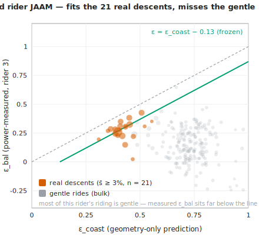
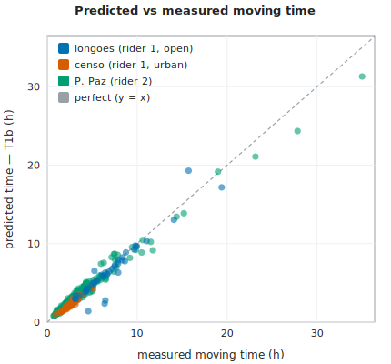

# Um Fator de Recuperação na Descida em Forma Fechada para a Energia de Rotas de Bicicleta, e Seu Dual Energia↔Tempo

> **RASCUNHO / artigo em elaboração — notas de pesquisa do Pedal Hidrográfico** (v0.13, julho de 2026). Os números e as equações provêm dos próprios benchmarks do projeto; as alegações de novidade são limitadas pelo corpus (ver §11.3). Os números de acurácia são autorrelatados contra os medidores de potência de três ciclistas — o autor mais dois ciclistas independentes, não membros do coletivo (ver §10.4); a calibração de ε é intra-amostra no ciclista 1, e nos dois ciclistas fora da amostra a lei de energia e o offset de −0,13 transferem-se enquanto a *habilidade* geométrica de ε mostra-se dependente do ciclista (§8.6); as correlações de ε relatadas são parte-todo (§8.3); o modelo de tempo está meio confirmado (subida transfere-se, ponte de descida não — §8.8); o CdA/C_rr assumidos dos ciclistas são corroborados independentemente como plausíveis (§10.4, entrada 15 do journal). Não revisado por pares; circulado para revisão e comentários internos.

## Resumo

O planejamento de pedaladas comunitárias de bicicleta precisa da *energia* de uma rota em kJ, mas a ferramenta padrão é uma simulação de dinâmica direta [Martin et al. 1998] que é cara e opaca para o planejamento. Estudamos uma alternativa barata em forma fechada, `E ≈ α·x + β·(h₊ − ε·h₋)`, na qual um único fator agregado `ε ∈ [0,1]` captura quanto da energia potencial da descida é recuperada em vez de desperdiçada em arrasto excedente e frenagem. Damos a `ε` uma forma fechada no limite de inércia, `ε(s) = min(1, α/(β·s))`, ponderada pela queda ao longo do perfil com um offset calibrado de −0.13, e a avaliamos contra um `ε` de balanço de energia na descida medido por medidor de potência: em descidas reais (inclinação média ≥ 3%) o estimador calibrado corta o erro RMS em 37% em relação à melhor constante fixa (intra-amostra; ressalvas na §8.3), e o offset transfere-se — calibrado em 44 pedaladas abertas e aplicado congelado a 62 pedaladas urbanas de para-e-anda, empata com a constante selecionada intra-amostra lá. Testamos o estimador congelado em **mais dois ciclistas independentes** (pessoas diferentes, medidores de potência diferentes, nenhum membro do coletivo): o offset calibrado de −0,13 recorre em ambos (gaps medidos 0,12, 0,13), mas a *habilidade* geométrica de ε mostra-se **dependente do ciclista** — supera a melhor constante fixa de um ciclista de inércia em ~35% (RMS 0,091 vs 0,139 em descidas reais), mas é estatisticamente inconclusiva para um ciclista rápido que pedala nas descidas e cuja recuperação medida é baixa. Rodada nas *mesmas* constantes físicas da simulação, a forma fechada reproduz o `∫P·dt` medido com uma mediana de 3,6% sobre 44 pedaladas com medidor de potência (melhor variante), com ~4–7% sobre 62 pedaladas urbanas em São Paulo, e com ~4–5% sobre as pedaladas de cada ciclista adicional com apenas a massa implicada pelos dados — de modo que a *lei de energia e o offset transferem-se entre os três ciclistas, enquanto a geometria de ε não.* Como a subida acumulada é fractal e depende da escala [Rapaport 2011], incorporamos uma correção apenas de totais `k_smooth = 1 − c·x/h₊` (`c ≈ 3 m/km`) à lei em forma fechada para descontar o ruído submétrico sem afetar as subidas sustentadas. Derivamos ainda um dual energia↔tempo, `x* = x + k₊·h₊ − k₋·h₋`, no qual o coeficiente de descida `k₋` é o gêmeo temporal de `ε` através da mesma potência na descida; o *vínculo* é inédito (nenhum trabalho anterior deriva o crédito de tempo na descida da mesma potência na descida que o fator de recuperação). Testado contra o tempo em movimento medido (§8.8), a metade de subida transfere-se fora da amostra (6,6% mediano vs 7,6% ingênuo num segundo ciclista) enquanto a ponte de descida não prevê a velocidade de descida medida, deixando `k₋` um coeficiente empírico. Ambos os motores e a lei compartilhada estão implantados em ferramentas abertas e local-first (sampasimu, amora, quilojaules).

## 1. Introdução

Um coletivo de ciclismo auto-organizado em São Paulo planeja pedaladas *seguindo a hidrografia soterrada da cidade* — *"seguir as águas"* — traçando os córregos e o relevo que a cidade pavimentou. Planejar essas pedaladas comunitárias precisa de um número logo de início: a *energia* de uma rota, em quilojoules, para que uma pedalada possa ser anunciada honestamente como fácil ou punitiva e ajustada a quem vai aparecer. A restrição é prática: a ferramentaria é de dados abertos e local-first, construída para rodar em um navegador ou em uma máquina auto-hospedada sem etapa de build e sem lock-in de nuvem, o que descarta computação pesada por rota como primitiva padrão de planejamento.

Há duas maneiras de colocar um número em kJ sobre uma rota. A maneira **canônica** é uma simulação de dinâmica direta: integrar o balanço de forças longitudinal [Martin et al. 1998],

```
m·dv/ds = k_eff·P/v − C_rr·m·g·cosθ − ½·ρ·C_dA·(v + wind)² − m·g·sinθ,
```

regime por regime, com um limite de freio/velocidade segura nas descidas. É precisa (aqui, 5.1% de erro absoluto mediano contra o `∫P·dt` medido sobre 44 pedaladas) mas rígida, opaca, e precisa de um solucionador de velocidade por segmento — pouco adequada ao planejamento interativo sobre muitas rotas candidatas ou ao cálculo de campo por aresta sobre um MDE. A maneira **aproximada** é uma integral de energia em velocidade constante em forma fechada,

```
E ≈ α·x + β·(h₊ − ε·h₋),
α = (C_rr·m·g + ½·ρ·C_dA·(v_f + wind)²)/k_eff,
β = m·g/k_eff,
```

linear na distância `x`, na subida `h₊` e na descida `h₋`. Seu esqueleto `α·x + β·h₊` é um resultado de livro-texto; o termo decisivo — e subespecificado — é o crédito de descida `ε·h₋`. O fator de recuperação `ε ∈ [0,1]` agrega as perdas específicas da descida que `α` (cobrado na velocidade de referência em plano `v_f`) não carrega: o arrasto aerodinâmico excedente de descer mais rápido que `v_f`, somado à frenagem. Na literatura mais próxima de potência no ciclismo de estrada e de roteamento por elevação não encontramos nenhuma expressão *validada, em nível de rota, em forma fechada* para tal `ε` agregado: a fronteira de inércia/marcha-lenta aparece como uma condição de velocidade em estado estacionário por inclinação [Bigazzi & Lindsey 2019], e o roteamento energético de VE/e-bike trata a recuperação na descida como uma eficiência de regeneração por instante ou um potencial simétrico `m·g·Δh`, nunca como um `ε < 1` calibrado incorporado a uma lei de rota em forma fechada.

Este artigo fecha essa lacuna e extrai uma consequência estrutural. Damos a `ε` uma forma fechada no limite de inércia (`E_legs = 0`), onde ela colapsa em uma função apenas da inclinação,

```
ε_coast(s) = min(1, α/(β·s)),     α/β = C_rr + ½·ρ·C_dA·(v_f + w)²/(m·g),
```

com `α/β` a *inclinação de resistência em plano* — a declividade cuja gravidade equilibra exatamente a resistência de rolamento mais aero em plano. Agregada com ponderação pela queda sobre um perfil e calibrada com um offset quase constante de `−0.13`, esta estimativa apenas-geométrica, `ε ≈ clamp₀₁(ε_coast − 0.13)`, corta o erro RMS contra um `ε` de balanço de energia na descida medido por potência em 37% em relação à melhor constante fixa em descidas reais (intra-amostra; §8.3). Crucialmente, rodamos a forma fechada e a simulação nas **mesmas** constantes físicas `(m, C_rr, C_dA, ρ, k_eff, wind)`, de modo que a lacuna residual entre elas é atribuível às *simplificações de modelagem, não aos parâmetros*.

Observamos então que a energia tem um **gêmeo temporal**. O tempo não é `E/P` (degenerado numa inércia), portanto precisa de seu próprio modelo; definir uma *distância plana efetiva* `x* = x + k₊·h₊ − k₋·h₋` e ler o tempo a partir da velocidade em plano (`t = x*/v_f`) reproduz a mesma estrutura da lei de energia termo a termo. O coeficiente de subida `k₊ = v_f·β/P_climb` é limpo e independente da inclinação — a ideia de distância plana equivalente com precedente no ciclismo [Scarf & Grehan 2005; Scarf 2007] — enquanto o coeficiente de descida `k₋` é um parâmetro agregado e livre que cumpre exatamente o papel que `ε` cumpre para a energia, com precedente de crédito de tempo na descida [Langmuir 1984; Tobler 1993]. Cada metade tem precedente isoladamente; o que não tem precedente localizado no corpus mais próximo é o **vínculo**: `ε` e `k₋` ambos codificam a mesma velocidade oculta de descida `v_desc` e tornam-se inter-deriváveis através da potência na descida `P̄_desc`,

```
k₋ = (1/s)·[1 − (v_f/P̄_desc)·(α − ε·β·s)].
```

### 1.1 Contribuições

- **Um fator de recuperação na descida `ε` em forma fechada, em nível de rota, avaliado contra potência medida.** Um único `ε ∈ [0,1]` agregado dentro de `E ≈ α·x + β·(h₊ − ε·h₋)`, com sua forma fechada no limite de inércia `ε(s) = min(1, α/(β·s))`, agregado ponderado pela queda e offset calibrado de `−0.13`. Nenhum precedente para tal `ε` agregado em forma fechada foi localizado no corpus mais próximo de potência no ciclismo, roteamento por elevação ou energia de VE/e-bike.
- **Avaliação contra um `ε` de balanço de energia na descida medido por potência**: uma redução de 37% no RMS sobre a melhor constante fixa em descidas reais (s̄ ≥ 3%, n = 22; intra-amostra, §8.3). Congelado e testado em mais dois ciclistas independentes (§8.6): o offset de −0,13 recorre em ambos (gaps 0,12, 0,13), mas a *habilidade* geométrica de ε é **dependente do ciclista** — supera a melhor constante de um ciclista de inércia em ~35%, e é inconclusiva-a-falha para um pedalador-de-descida rápido. A lei de energia e o offset transferem-se entre os três ciclistas; a geometria de ε não.
- **Uma dualidade energia↔tempo** `x* = x + k₊·h₊ − k₋·h₋` cujo coeficiente de descida `k₋` é o gêmeo temporal de `ε`, tornados inter-deriváveis através da potência na descida compartilhada `P̄_desc`. Ambas as metades têm arte anterior individualmente; a *derivação de `k₋` a partir da mesma potência na descida que `ε`* é, até onde sabemos, inédita. Testada contra o tempo em movimento medido nos três conjuntos de dados (§8.8): a **metade de subida transfere-se fora da amostra** (6,6% mediano vs 7,6% ingênuo no segundo ciclista, significativo, e superando um teto de coeficientes ajustados), enquanto a **ponte de descida não prevê a velocidade de descida medida** — `k₋` permanece um coeficiente livre, limitado por comportamento.
- **Um desenho de comparação de constantes compartilhadas** que roda a forma fechada e uma simulação direta de Martin-1998 em constantes físicas idênticas, isolando o erro de modelagem do erro de parâmetro — junto com uma implementação de referência aberta e limpa da simulação (conservativa em energia, semi-implícita, com limite de frenagem, sem piso de energia cinética).
- **Uma correção `k_smooth` para a subida acumulada fractal** dentro da lei em forma fechada. Como a subida medida depende da escala [Rapaport 2011], o `h₊` bruto conta a mais a energia por meio de ruído submétrico e ondulações curtas; uma banda morta por segmento de ~2 m (ou o escalar apenas-totais `k_smooth = 1 − c·x/h₊`, `c ≈ 3 m/km`) remove essa parte deixando as subidas sustentadas em força plena (`k_h = 1`).
- **Avaliação em pedaladas urbanas e passeios coletivos reais e não competitivos** reproduzindo o `∫P·dt` medido com uma mediana de 3.6% (melhor variante em forma fechada) sobre 44 pedaladas com medidor de potência, com mediana de ~4–7% sobre 62 pedaladas urbanas em São Paulo com um ciclista genérico assumido, e com mediana de ~4–5% sobre o histórico de cada um de mais dois ciclistas independentes (441 + 219 pedaladas) com apenas a massa implicada pelos dados (§8.6) — com filtros explícitos de piso físico (`E_legs ≥ m·g·h₊/k_eff`) e de qualidade de dados de cadência — e um resultado negativo documentado de São Paulo (a pedalada urbana de para-e-anda faz `ε` comportar-se como uma constante aproximada em vez de acompanhar a densidade de frenagem).
- **Uma tabela de viés de subida por MDE `k_DEM`** (um resultado de erro de parâmetro, não uma alegação de modelagem de destaque) quantificando como a escolha da fonte de elevação enviesa as entradas `h₊`/`h₋` da lei em forma fechada.
- **Implantação** da lei compartilhada em três ferramentas abertas e local-first: *campos* de energia assimétricos sobre MDEs (sampasimu), registros de kJ por pedalada (amora) e kJ por segmento via o gêmeo canônico (quilojaules).

## 2. Trabalhos relacionados

Nosso projeto de dois motores e sua metade em forma fechada baseiam-se em cinco vertentes distintas de trabalhos anteriores: o modelo padrão de potência por balanço de forças, os modelos de tempo por distância plana equivalente, os créditos de tempo na descida, a natureza fractal da subida acumulada e o roteamento ciente de energia com recuperação. Organizamos a revisão por tema, nomeando a referência canônica de cada uma e afirmando com precisão o que é padrão e o que acrescentamos. Toda afirmação de "nenhum precedente localizado" abaixo é limitada pelo corpus; a ressalva completa é declarada uma vez em §11.3.

### 2.1 O modelo de potência por balanço de forças (motor canônico)

A potência mecânica instantânea necessária para pedalar uma bicicleta é, a esta altura, matéria de livro-texto. O enunciado canônico é o modelo validado de balanço de forças de [Martin et al. 1998], que soma a resistência ao rolamento, o arrasto aerodinâmico, a gravidade, um termo de energia cinética variável, o atrito do rolamento da roda e um termo de pneu/estrada, e que foi validado contra a medição direta de potência em uma pista de táxi plana com R² = 0.97 (SE 2.7 W), com uma área de arrasto de túnel de vento de CdA = 0.269 ± 0.006 m² para guidão de corrida na posição baixa. O mesmo balanço fundamenta a "equação de movimento" do ciclista de [di Prampero et al. 1979] e é o modelo adotado pela literatura moderna de simulação: [Dahmen & Saupe 2011] o integram com `ode45` e validam a previsão de velocidade em trilhas rurais reais (excluindo explicitamente descidas íngremes e frenagem); [Danek et al. 2020] estimam seus parâmetros a partir de dados de potência; e [Li et al. 2025] otimizam o ritmo de prova sobre um modelo de potência Martin-1998 com um algoritmo genético.

Nosso motor `canonical()` **é** esse modelo — o balanço de forças longitudinal por marcha em distância

$$
m\,\frac{dv}{ds} = \frac{k_{eff}\,P}{v} - C_{rr}\,m g \cos\theta - \tfrac12\,\rho\,C_d A\,(v + w)^2 - m g \sin\theta
$$

integrado com uma atualização semi-implícita da energia cinética, um limite de frenagem/velocidade segura e uma identidade de conservação imposta `k_eff·legE = ΔKE + W_rr + W_aero + W_grav + W_brake`. Não reivindicamos nada de novo sobre a física aqui. O que acrescentamos é operacional: uma implementação de referência limpa, aberta e sem etapa de build, e seu uso como o braço de *controle* de uma comparação de constantes compartilhadas (§4). Um ponto declarado com precisão: [Martin et al. 1998] fazem simplificações de pequeno ângulo *dentro* desse modelo de potência instantânea, mas nunca publicam uma forma fechada de energia em nível de rota; a forma fechada de §4–5 é nossa própria derivação, não algo que o artigo de 1998 autorize.

### 2.2 Energia em velocidade constante em forma fechada e o fator agregado de descida ε

Integrar o balanço de forças em velocidade constante ao longo de um segmento dá o esqueleto de energia `E ≈ α·x + β·h₊`, onde `α` reúne o custo de rolamento-mais-aero por metro horizontal e `β = m·g/k_eff` é o custo por metro subido. Esse esqueleto é padrão — é a integral de energia em velocidade constante de livro-texto, e não o reivindicamos.

O que não tem precedente localizado na literatura mais próxima de potência de ciclismo de estrada e de roteamento por elevação é o **fator de recuperação na descida agregado, em nível de rota, ε ∈ [0,1]** e sua forma fechada. Escrevemos

$$
E \approx \alpha\,x + \beta\,(h_+ - \epsilon\,h_-),
$$

com ε um único escalar agregando as perdas específicas da descida (arrasto aerodinâmico excedente acima da velocidade em plano, mais frenagem) que `α` — cobrado à velocidade em plano `v_f` — não carrega, e damos a ele uma forma fechada apenas geométrica no limite de inércia,

$$
\epsilon_{coast}(s) = \min\!\big(1,\ \alpha/(\beta s)\big), \qquad \alpha/\beta = C_{rr} + \tfrac12\rho C_d A\,(v_f+w)^2/(m g),
$$

ponderada pela queda ao longo do perfil de descida e corrigida por um deslocamento quase constante, `ε ≈ clamp[0,1](ε_coast − 0.13)`.

O precedente localizado mais próximo para o *limite de inatividade/inércia* é [Bigazzi & Lindsey 2019], cuja condição de inclinação negativa `v² ≤ μ₁/(−μ₃)` zera a potência de tração em descidas suaves — mas eles a aplicam à *escolha* de velocidade em regime permanente por inclinação, nunca a um fator de recuperação em forma fechada em nível de rota. O primo estrutural no roteamento de VE ótimo em energia, [Ahmadi et al. 2024], usa um potencial gravitacional simétrico e independente do caminho `(M+m)·g·ΔH` — a recuperação é total e livre de `ε`, não um `ε < 1` calibrado. Em toda a literatura de roteamento de VE/e-bike e de pesquisa operacional, a recuperação na descida é sempre uma eficiência de regeneração por instante/por faixa de velocidade [Yuan et al. 2024], um potencial `mgΔh` simétrico, ou custos de arco negativos por aresta resolvidos numericamente [Perger & Auer 2020]; nenhum é um fator agregado em forma fechada em nível de rota em `[0,1]`. (Notamos explicitamente que ε *não* é a assimetria de eficiência muscular excêntrica/concêntrica de [Minetti et al. 2002]: ε é o orçamento de gravidade-e-freio do ciclista, não uma eficiência fisiológica. Invocamos Minetti apenas como analogia conceitual.)

### 2.3 Distância plana equivalente e modelos de tempo de subida

A ideia de converter a subida em um comprimento equivalente de pedalada em plano é antiga nas literaturas de escolha de rota e de caminhada. [Scarf & Grehan 2005] dão uma "distância equivalente" para ciclismo em que 1 m de subida custa cerca de 8 m de plano; [Scarf 2007] refina a regra de Naismith para ciclismo para 1 m de subida ≈ 7.92 m horizontais; e [Norman 2004] dá equivalências análogas para corrida em subida. Nosso modelo de tempo por distância plana efetiva

$$
x^* = x + k_+\,h_+ - k_-\,h_-, \qquad k_+ = v_f\,\beta/P_{climb},
$$

estende — e não inventa — essa ideia de distância plana equivalente para a metade de subida: `k₊` converte a subida em tempo de plano e é, como Naismith, independente da inclinação em subidas íngremes (numa subida quase toda a potência vai para o levantamento, então `dt = m·g·dh/(k_eff·P_climb)` depende do ganho vertical, não do comprimento da estrada).

### 2.4 Créditos de tempo na descida

A metade de descida de `x*` tem seu próprio precedente. [Langmuir 1984] corrige a regra de Naismith com um termo de descida que *credita* descidas suaves (−10 min por 300 m em declividades de 5–12°) mas *penaliza* as íngremes (+10 min por 300 m acima de 12°); [Tobler 1993] dá a função de velocidade de caminhada `V = 6·e^(−3.5·|S+0.05|)`, cujo máximo está em uma descida de −2.86°, de modo que descidas suaves são mais rápidas que o plano. Esses são os precedentes de crédito de tempo na descida em nível de rota para nosso `k₋` agregado. Como conceito de tempo, `k₋` não é, portanto, novo, e o dizemos: a divisão crédito-suave/penalidade-íngreme de Langmuir é a *mesma assimetria* que nosso ε e o limite de frenagem codificam no lado da energia.

A peça genuinamente aditiva é o **vínculo**, não qualquer das metades por si só. [Langmuir 1984] e [Tobler 1993] são ajustes empíricos de tempo nunca atrelados a um orçamento de energia. Em vez disso, *derivamos* o crédito de tempo na descida `k₋` e o fator de recuperação de energia ε da **mesma** potência na descida `P̄_desc`: ambos codificam a mesma velocidade oculta de descida `v_desc`, e igualar as expressões do lado do tempo (`v_desc = v_f/(1−k₋·s)`) e do lado da energia (`v_desc = P̄_desc/(α−ε·β·s)`) produz a única relação que os liga. Até onde sabemos, nenhum trabalho anterior deriva o crédito de tempo na descida da mesma potência de descida que o fator de recuperação; essa **dualidade energia↔tempo** (§7) é a contribuição inédita do modelo de tempo. Testamo-la empiricamente na §8.8: a metade de subida transfere-se aos tempos medidos de um segundo ciclista, mas a ponte de descida não prevê a velocidade de descida medida, então a dualidade permanece uma afirmação estrutural mais do que um preditor quantitativo de descida.

### 2.5 A subida acumulada como quantidade fractal

A subida total `h₊` não é um número bem definido até que uma escala seja fixada: quanto mais fina a amostragem de elevação, mais oscilação submétrica ela acumula. [Rapaport 2011] torna isso preciso, mostrando que a subida acumulada depende da escala (um problema de medição fractal ao estilo Mandelbrot) e enunciando a intuição do momento das ondulações — de que um ciclista rolando por inércia sobre uma pequena lombada não "paga" sua subida completa — em palavras, mas apenas como uma ressalva qualitativa, sem banda morta e sem correção da lei de energia. Formalizamos essa ressalva dentro da lei em forma fechada (§6): uma banda morta por segmento (≈ 2 m) sobre o perfil, ou, apenas com os totais, o escalar `k_smooth = 1 − c·x/h₊` com `c ≈ 0.003` (= 3 m/km, uma "inclinação de ruído" adimensional). Dobrar `k_smooth` *dentro* da lei de energia para descontar a subida de ruído fractal sem afetar as subidas sustentadas não tem, até onde sabemos, precedente; a simulação canônica não precisa desse fator porque rastreia a energia cinética e já paga corretamente o momento das ondulações.

### 2.6 Inferência de quantidades ocultas e roteamento ciente de energia

Mais duas vertentes enquadram nossos métodos. Primeiro, recuperar uma quantidade física oculta invertendo uma identidade de energia é exatamente a lógica do método de "elevação virtual" de [Chung] para estimar CdA a partir de um medidor de potência; nosso `epsFromFIT` (que recupera ε de um balanço de energia na descida medido) e nossas correções de fonte de subida `k_DEM` são adjacentes a Chung — o método de inversão é padrão, apenas os alvos inferidos (o fator de recuperação; o viés de subida por MDE) são novos. Segundo, no roteamento de veículos elétricos e e-bikes ciente de energia, a *recuperação* na descida é modelada explicitamente: [Perger & Auer 2020] roteiam VEs com energias de aresta regeneradas (negativas), [Yuan et al. 2024] combinam um termo `mgΔh` simétrico com uma eficiência de regeneração por instante, e a validação mais próxima da nossa em pedaladas *reais, não de corrida* — [Gebhard et al. 2016], sobre e-bikes WeBike em OSM — prevê a *autonomia da bateria*, não a energia mecânica `∫P·dt`. O contraste com esses é o mesmo por toda parte: a recuperação deles é por instante ou simétrica e (no trabalho de PO) resolvida numericamente por aresta, ao passo que a nossa é um único fator agregado em forma fechada validado contra energia mecânica medida.

## 3. Dois motores sobre constantes compartilhadas

Modelamos a energia mecânica de uma pedalada duas vezes, com dois motores de custo e fidelidade deliberadamente diferentes, e executamos ambos sobre as **mesmas constantes físicas**. O motor caro é uma simulação de dinâmica direta do balanço de potência padrão do ciclismo de estrada [Martin et al. 1998]; o barato é uma lei em forma fechada que integra esse balanço sob um pequeno conjunto de simplificações. Como os dois compartilham todas as constantes, a diferença entre eles é atribuível às *simplificações de modelagem, não aos parâmetros* — o controle experimental central deste trabalho.

### 3.1 O motor canônico: simulação de dinâmica direta

O motor canônico, `canonical()`, integra o balanço de forças longitudinal de [Martin et al. 1998] marchando na distância `s` ao longo do perfil de elevação:

$$
m\,\frac{dv}{ds} \;=\; \frac{k_{eff}\,P}{v} \;-\; C_{rr}\,m g \cos\theta \;-\; \tfrac12\,\rho\,C_d A\,(v + w)^2 \;-\; m g \sin\theta,
$$

com a inclinação por segmento tomada do perfil (`slope = dh/dx`, `cosθ = 1/√(1+slope²)`, `sinθ = slope/√(1+slope²)`), e o aero atuando sobre a velocidade do ar `v + w` (com sinal, como `rel·|rel|`). A potência de pedalada é **selecionada por regime em cada segmento** pela inclinação local — `P = P_climb` onde `slope ≥ +2%`, `P = P_descent` onde `slope ≤ −1.5%`, caso contrário `P = P_flat`. Um limite de velocidade segura por frenagem limita `v` a `v_max`; nas descidas, a energia cinética em excesso ao limite é despejada num termo de trabalho de frenagem `W_brake`. Os limiares padrão são `v_max = 38 km/h`, `v_start = 15 km/h`, com o integrador numa grade `dx = 5 m` e sub-passos adaptativos (`dt ≤ 0.25 s`, `ds ≥ 0.2 m`).

A atualização da energia cinética é **semi-implícita**: o termo rígido de propulsão `k_eff·P/v` é avaliado na velocidade *nova* por uma iteração de Newton com salvaguarda (com enquadramento por bisseção) sobre

$$
g(u) = u - \frac{A}{\sqrt{u}} - B, \qquad A = k_{eff}\,P\,ds\,\sqrt{m/2},\quad B = KE - R\,ds .
$$

Isso é conservativo de energia em qualquer passo e **nunca injeta energia**, de modo que a energia das pernas prevista nunca pode cair abaixo do trabalho efetivamente realizado. O motor retorna a energia das pernas `legE = ∫P·dt` (sua energia mecânica prevista), o tempo decorrido, o perfil completo de velocidade e a decomposição do trabalho na roda `W_rr, W_aero, W_grav, W_brake, ΔKE`. Estes satisfazem a identidade de conservação imposta

$$
k_{eff}\cdot legE \;=\; \Delta KE + W_{rr} + W_{aero} + W_{grav} + W_{brake},
$$

que se mantém com erro relativo de `1e-6` e é usada como autoverificação do motor. Numa subida pura ela garante `legE ≥ m g·h₊/k_eff` — energia das pernas nunca menor que a energia potencial elevada. Criticamente, **não há piso de VMIN/KE**: tal piso injetaria energia e quebraria essa desigualdade em subidas íngremes com potência insuficiente. O motor canônico rastreia a energia cinética diretamente, de modo que paga o custo de momento das ondulações curtas corretamente e não precisa de suavização da elevação.

### 3.2 O motor aproximado: lei em forma fechada

O motor aproximado, `approximate()`, avalia uma integral em forma fechada do mesmo balanço. Em sua forma mais simples (v1),

$$
E \approx \alpha\,x + \beta\,(h_+ - \epsilon\,h_-),
$$

com distância horizontal `x`, subida total `h₊`, descida total `h₋`, e

$$
\alpha = \frac{C_{rr}\,m g + \tfrac12\,\rho\,C_d A\,(v_f + w)^2}{k_{eff}}, \qquad \beta = \frac{m g}{k_{eff}} .
$$

Aqui `α` é a energia por metro horizontal (rolamento + aero, cobrada na velocidade de referência em plano `v_f`), `β` é a energia por metro vertical, e `ε ∈ [0,1]` é o fator de recuperação na descida agregado desenvolvido na §5. Um clamp por aresta `max(0, α·dx − ε·β·|dh|)` nos segmentos de descida impede energia negativa de segmento. A energia das pernas é `E_leg = E_wheel/k_eff` (as pernas fornecem *mais* do que a roda recebe; `α, β` acima já são grandezas do lado da roda).

A forma atual (v2) refina isto com três correções, cada uma das quais remove um viés *sistemático* medido contra as pedaladas com medidor de potência:

$$
\boxed{\,E \approx \alpha_r\,x + \alpha_a\,x_{flat} + k_h\,k_{smooth}\,\beta\,(h_+ - \epsilon\,h_-),\qquad k_h = 1\,}
$$

**(i) divisão de α — cobrar o aero apenas fora das subidas.** O termo de rolamento é exato em qualquer inclinação (`C_rr m g cosθ·s = C_rr m g·x`), mas o termo aero, faturado a `v_f` sobre *toda* a distância, sobrecobra as subidas onde o ciclista de fato se move bem mais devagar (`aero ∝ v²`). Dividimos `α = α_r + α_a` e aplicamos o aero apenas sobre a fração que não é de subida:

$$
\alpha_r = \frac{C_{rr}\,m g}{k_{eff}}, \qquad
\alpha_a = \frac{\tfrac12\,\rho\,C_d A\,v_f^2}{k_{eff}}, \qquad
x_{flat} = x\,(1 - f_{climb}), \qquad
f_{climb} = \frac{x_+}{x},
$$

com `x₊` a distância horizontal nos segmentos de subida (`slope ≥` o limiar de subida). A configuração principal roda com aero de subida zero (`climbAeroMode = 'zero'`; `'off'` é a linha de base de aero total); uma variante quase exata, em vez disso, cobra-o na velocidade de subida quase-permanente `v_c ≈ k_eff·P_climb/(C_rr m g cosθ + m g sinθ)`, limitada a `v_f`. O aero de descida é deixado intocado — nas descidas ele é pago pela gravidade e já está dentro de `(1−ε)·β·h₋`; reduzir seu peso ali contaria a mais. Empiricamente, esta correção reduz o |Δ%| mediano de 19,3% (linha de base `off`) para 8,7% ao longo das 44 pedaladas com potência, batendo `off` em 43/44 pedaladas (fração de subida mediana 21%); os detalhes por regime são reportados na §8.1.

**(ii) k_h = 1 — a gravidade é paga por inteiro em subidas reais.** Um ajuste direto do coeficiente de gravidade em subidas sustentadas dá `k_h ≈ 1` (validado na §8.2): em subida real `β·h₊` está correto e não há desconto uniforme de gravidade.

**(iii) k_smooth — aparar apenas as ondulações e o ruído do MDE.** O que faz o `h₊` bruto contar `E` a mais não é a subida sustentada, mas as ondulações curtas e a tremulação submétrica da elevação. A correção certa é, portanto, um fator de *suavização de subida* `k_smooth ∈ (0,1]` que apara essas enquanto deixa as subidas sustentadas intactas; ele é desenvolvido por completo na §6. **`k_smooth` aplica-se apenas ao modelo aproximado** — a simulação canônica já paga o momento das ondulações através de seu termo de energia cinética.

### 3.3 O projeto de constantes compartilhadas

Ambos os motores leem as **mesmas** constantes físicas — `m, C_rr, C_dA, ρ, k_eff, wind`, mais os limiares de regime/inclinação — e nunca se permite que os dois divirjam em qualquer uma delas. Este é o controle experimental. Se ambos os motores usassem parâmetros ajustados independentemente, uma pequena diferença entre suas previsões poderia ser tanto um artefato de modelagem quanto um descompasso de parâmetro, e os dois seriam inseparáveis. Manter as constantes fixas torna a diferença *inequivocamente* a simplificação de modelagem: a hipótese da forma fechada de uma única velocidade de referência em plano, sua recuperação na descida agregada `ε`, e seu tratamento linear de `h₊`, contrapostos à contabilidade explícita de momento e frenagem da simulação direta.

Executar dois motores diferentes sobre as *mesmas* constantes para isolar a diferença de simplificação de modelagem (em vez de calibrar por mínimos quadrados um modelo compartilhado para isolar o erro de *parâmetro*, como em [Dahmen & Saupe 2011]) não foi encontrado na arte prévia mais próxima; enquadramo-lo como uma contribuição metodológica aditiva.

A comparação é ancorada em um ponto de calibração conhecido. Em terreno plano, os dois motores coincidem **se e somente se** `v_f` for igual à velocidade de equilíbrio em plano na potência de plano, isto é, `v_f = flatEqSpeed(P_flat)`, onde `flatEqSpeed(P)` resolve o balanço de plano `(C_rr m g + ½ρ C_dA(v+w)²)·v = k_eff·P` por bisseção (é isso que o "auto `v_f`" define). Com os motores fixados para concordar no plano, toda divergência em outro lugar — mais proeminentemente a sobrecobrança de aero em subida corrigida pela divisão de `α` acima — é a verdadeira história de modelagem, e não um acidente de calibração.

## 4. O fator de recuperação na descida ε

### 4.1 Definição

O fator ε ∈ [0,1] é o único parâmetro agregado que a lei em forma fechada carrega e que a simulação canônica não carrega. Ele absorve todas as perdas específicas de descida que o termo de rolamento-e-aero α — cobrado na velocidade de referência em plano v_f — não contabiliza: o arrasto aerodinâmico excedente incorrido ao descer mais rápido que v_f, além da frenagem. Para uma descida de inclinação s, a recuperação **local** é a fração da energia potencial liberada dessa descida β h₋ que *não* é desperdiçada:

$$
\epsilon(s) := 1 - \frac{(\text{excesso de aero} + \text{frenagem}) \text{ na velocidade atingida na inclinação } s}{m g\, h_- / k_{eff}}.
$$

Equivalentemente, a partir do balanço de energia do segmento (desprezando o termo cinético, que telescopa ao longo de uma pedalada de repouso a repouso),

$$
\epsilon(s) = \frac{\alpha\, dx - E_{legs}}{\beta\, h_-},
$$

isto é, a energia das pernas que uma descida *economiza* em relação a percorrer a mesma distância horizontal dx no plano, expressa como uma fração da energia potencial liberada β h₋.

Como ε entra no modelo apenas através do crédito total de descida ε β H₋ (com $H_- = \sum_i h_{-,i}$), um único ε por pedalada fica inequivocamente fixado como a **média ponderada pela queda de descida** dos ε(s) locais:

$$
\epsilon = \frac{\sum_i \epsilon(s_i)\, h_{-,i}}{\sum_i h_{-,i}}
        = \frac{1}{H_-}\int_{\text{descents}} \epsilon\big(s(x)\big)\,\big|h'(x)\big|\,dx .
$$

O peso é a **queda vertical** h₋ — não a distância horizontal, e não o tempo. Somado ao longo de uma pedalada, isto se reduz à forma diretamente mensurável

$$
\epsilon = \frac{\alpha\,X_- - E_{legs,-}}{\beta\,H_-},
$$

com $X_-$, $E_{legs,-}$ e $H_-$ a distância horizontal, energia das pernas e queda somadas sobre os segmentos de descida. Esta é a quantidade recuperada de um registro de potência por `epsFromFIT()` em células de descida de 30 m; criticamente, o α usado ali toma a velocidade de solo em plano **medida** (a velocidade de solo média ponderada pelo tempo em células com |grade| < 1%), e *não* a velocidade de equilíbrio em plano do modelo, de modo que um descompasso de parâmetro (por exemplo, C_rr de estrada aplicado a uma pedalada em terra) não possa inflar α e reportar erradamente ε.

Este ε ∈ [0,1] agregado, em nível de rota e em forma fechada é a primeira alegação central do artigo; a §2.2 o situa frente à arte prévia mais próxima — o limite ocioso por inclinação de Bigazzi & Lindsey, e os tratamentos por instante, simétricos ou numéricos-por-aresta da recuperação no roteamento de VE/e-bike.

### 4.2 A forma fechada no limite de inércia ε_coast(s)

A energia das pernas numa descida é limitada — $E_{legs} \ge 0$, logo $\epsilon \le 1$. Definindo $E_{legs} = 0$ (uma inércia pura) colapsa ε(s) a uma função da **inclinação apenas**:

$$
\epsilon_{coast}(s) = \min\!\Big(1,\ \frac{\alpha\, dx}{\beta\, h_-}\Big) = \min\!\Big(1,\ \frac{\alpha}{\beta\, s}\Big),
\qquad
\frac{\alpha}{\beta} = C_{rr} + \frac{\tfrac12 \rho C_d A\,(v_f + w)^2}{m g}.
$$

A razão α/β é a **inclinação de resistência em plano** — a declividade cuja gravidade equilibra exatamente a resistência de rolamento-mais-aero em plano. O clamp em 1 é o caso de descida suave $s < \alpha/\beta$. Ponderado pela queda ao longo do perfil, ou apenas a partir dos totais:

$$
\epsilon_{coast} = \frac{1}{H_-}\sum_{\text{desc}} h_{-,i}\,\min\!\Big(1,\tfrac{\alpha}{\beta s_i}\Big)
\qquad\text{ou, agregado,}\qquad
\epsilon_{coast} \approx \min\!\Big(1,\tfrac{\alpha}{\beta\,\bar s}\Big),\quad \bar s = \frac{H_-}{X_-}.
$$

Esta é a estimativa de planejamento apenas geométrica `epsGeom()`: ela não precisa de registro de potência, apenas do perfil de inclinação da rota e das constantes do ciclista. Testamo-la, derivamos o deslocamento de −0.13 e avaliamos o estimador resultante na §8.3 (uma redução de 37% no RMS sobre a melhor constante fixa em descidas reais), calibrando para

$$
\boxed{\ \epsilon \approx \mathrm{clamp}_{[0,1]}\big(\epsilon_{coast} - 0.13\big)\ }.
$$

Esta maquinaria de inferência — inverter uma identidade de energia para recuperar uma quantidade oculta de um registro de potência — é metodologicamente o movimento de elevação virtual de Chung [Chung], aplicado aqui a um novo alvo (o fator de recuperação em vez do CdA).

## 5. Dualidade energia↔tempo: x* = x + k₊h₊ − k₋h₋

### 5.1 Por que o tempo precisa de seu próprio modelo

O caminho ingênuo $t = E/P$ é degenerado numa descida: tanto E → 0 quanto P → 0, de modo que o quociente fica mal definido. O tempo é fundamentalmente $\int ds/v$ e precisa de um modelo próprio. Definimos uma **distância plana efetiva** x* e lemos o tempo a partir da velocidade de referência em plano, $t = x^*/v_f$:

$$
x^* := x + k_+\,h_+ - k_-\,h_- .
$$

A estrutura espelha deliberadamente a lei de energia — uma linha de base horizontal, um termo de subida "limpo" e um termo de descida "agregado" — e o paralelo é exato.

### 5.2 A metade de subida é limpa e independente da inclinação

Numa subida quase toda a potência vai para o levantamento, $k_{eff} P_{climb} \approx m g\, v \sin\theta = m g\, dh/dt$, de modo que $dt = m g\, dh/(k_{eff} P_{climb})$ — o tempo de subida depende do **ganho vertical, não do comprimento da estrada**. Portanto

$$
k_+ = \frac{v_f\, m g}{k_{eff} P_{climb}} = \frac{v_f\,\beta}{P_{climb}}.
$$

(Um $k_+$ constante conta a mais ligeiramente a linha de base horizontal já presente em x em subidas suaves; o coeficiente exato é $v_f mg/(k_{eff}P_{climb}) - 1/s$, mas o termo $1/s$ desaparece em subidas íngremes.)

Esta metade de subida **não é novidade**. É a instância ciclística da ideia de distância plana equivalente: regras do tipo Naismith que convertem um metro de subida num número fixo de metros planos — [Scarf & Grehan 2005] ("distância equivalente" no ciclismo, 1 m de subida ≈ 8 m em plano), [Scarf 2007] (1 m de subida ≈ 7.92 m horizontal), e as equivalências de corrida em subida de [Norman 2004]. Enquadramos x* como *estendendo* essa ideia, não como inventando-a.

### 5.3 A metade de descida é agregada — o gêmeo temporal de ε

O tempo de descida é **limitado pela velocidade**, não pelo levantamento: $t = x_-/v_{desc}$. Fixá-lo, em vez disso, à queda h₋ força $k_-$ a absorver a inclinação típica da descida,

$$
k_- \approx \frac{1 - v_f/v_{desc}}{\bar s},
$$

de modo que $k_-$ é um **parâmetro agregado** — desempenhando para o tempo exatamente o papel que ε desempenha para a energia. Agora testamos o modelo de tempo contra tempos de pedalada medidos (§8.8, uma perna empírica ausente de versões anteriores): a metade de subida transfere-se, mas `k₋` permanece efetivamente **livre e dependente do corpus** porque a ponte de descida abaixo não o fixa, empiricamente. A correspondência termo a termo é o coração estrutural da dualidade:

|  | termo limpo | termo agregado |
|---|---|---|
| **energia** $\;\alpha x + \beta h_+ - \epsilon\,\beta h_-$ | $\beta = mg/k_{eff}$ | $\epsilon$ |
| **tempo** $\;x + k_+ h_+ - k_- h_-$ | $k_+ = v_f\beta/P_{climb}$ | $k_-$ |

Com $t = x^*/v_f$, a potência média $\bar P = E/t$ então se comporta corretamente em toda parte — ela vai a 0 numa descida por inércia (onde $E/P$ era degenerado) e recupera exatamente a potência em plano $\alpha v_f$ no plano.

A metade de descida, como *conceito de tempo*, também **não é novidade**: créditos de tempo de descida no nível da rota estão estabelecidos na literatura de caminhada — [Langmuir 1984] (−10 min/300 m em descidas suaves 5–12°, +10 min/300 m em descidas íngremes > 12°) e [Tobler 1993] ($V = 6\,e^{-3.5|S+0.05|}$, velocidade atingindo o pico em −2.86°, de modo que descidas suaves são *mais rápidas* que o plano). A divisão crédito-suave/penalidade-íngreme de Langmuir é a mesma assimetria que ε e o limite de frenagem canônico codificam do lado da energia.

### 5.4 A dualidade é a peça nova: ligar ε e k₋ através da potência na descida

O que não tem precedente localizado é o **vínculo**. ε (o parâmetro agregado do lado da energia) e k₋ (seu correspondente do lado do tempo) não são deriváveis um do outro isoladamente, mas tornam-se assim através da **potência na descida** $\bar P_{desc}$ — sendo a potência a taxa de câmbio entre energia e tempo. Ambos codificam a mesma velocidade de descida oculta $v_{desc}$.

Do lado do **tempo**, a distância efetiva da descida $x_-(1 - k_- s)$ deve tomar o tempo real $x_-/v_{desc}$:

$$
v_{desc} = \frac{v_f}{1 - k_- s}.
$$

Do lado da **energia**, a energia das pernas no trecho de descida do modelo por metro horizontal é $\alpha - \epsilon\,\beta s$, e a potência média é energia × velocidade:

$$
\bar P_{desc} = (\alpha - \epsilon\,\beta s)\,v_{desc}
\;\Rightarrow\;
v_{desc} = \frac{\bar P_{desc}}{\alpha - \epsilon\,\beta s}.
$$

Igualar as duas expressões para $v_{desc}$ dá a única relação de ponte

$$
\frac{v_f}{1 - k_- s} = \frac{\bar P_{desc}}{\alpha - \epsilon\,\beta\,s},
$$

e portanto, dados $\bar P_{desc}$ e a inclinação s, cada parâmetro agregado em termos do outro:

$$
k_- = \frac{1}{s}\!\left[1 - \frac{v_f}{\bar P_{desc}}(\alpha - \epsilon\,\beta s)\right],
\qquad
\epsilon = \frac{1}{\beta s}\!\left[\alpha - \frac{\bar P_{desc}}{v_f}(1 - k_- s)\right].
$$

**O caso degenerado é instrutivo.** Faça $\bar P_{desc} = 0$ (uma inércia pura): a ponte força $\alpha - \epsilon\,\beta s = 0$, isto é, $\epsilon = \alpha/(\beta s)$ — fixado apenas pela inclinação, independente da velocidade, recuperando exatamente o ε_coast do limite de inércia da §4.2 — enquanto $v_{desc}$, e portanto $k_-$, é determinado inteiramente pela velocidade terminal de inércia. Sem potência para ligá-los, os dois **desacoplam-se**: ε torna-se puramente geométrico, $k_-$ puramente aerodinâmico. Eles são inter-deriváveis apenas quando as pernas realizam trabalho mensurável na descida.

Em suma: ambas as metades de x* têm precedente (§5.2, §5.3), mas nenhum trabalho anterior que localizamos deriva o crédito de tempo de descida k₋ da *mesma potência na descida* $\bar P_{desc}$ que fixa o fator de recuperação ε — a dualidade é a segunda alegação central do artigo.

## 6. A subida acumulada depende da escala: a banda morta `k_smooth`

### 6.1 O problema da subida fractal

A subida total `h₊` — a quantidade contra a qual o termo de gravidade `β·h₊` cobra — não é uma propriedade bem definida de uma rota, mas uma propriedade da rota *como medida*. A subida acumulada cresce à medida que a resolução de amostragem/elevação aumenta: cada subdivisão mais fina resolve ondulação adicional, de modo que `Σh₊` se comporta como o comprimento de uma costa fractal em vez de uma integral fixa. Essa dependência da escala da subida acumulada no mountain bike é o tema de [Rapaport 2011], que também enuncia *em palavras* a intuição do momento das ondulações — que um ciclista carrega energia cinética sobre pequenas elevações e não paga o `mg·Δh` completo em cada uma — mas apenas como uma ressalva qualitativa, sem banda morta e sem correção da lei de energia.

O efeito é grande em nossos dados. Ao longo das 44 pedaladas com potência, a subida total do motor encolhe monotonicamente com o limiar de histerese aplicado ao perfil:

| suavização | Σ h₊ (km) | % do bruto |
|---|--:|--:|
| bruto | 92.4 | 100% |
| 1 m | 83.3 | 90% |
| 2 m | 77.4 | 84% |
| 3 m | 73.3 | 79% |
| 5 m | 66.9 | 72% |

Cerca de **20% do `h₊` bruto é tremulação sub-3 m**, boa parte dela a quantização de altitude de 0.2 m de trilhas GPS/baro de consumo. Em termos de energia isso não é um detalhe de arredondamento: `β·h₊` cai de **69 039 kJ** (bruto) para **54 758 kJ** num limiar de 3 m, e essa diferença de **14 282 kJ** é **25% da energia empírica de subida** e responde por **≈ 93% da superestimação de subida do modelo em forma fechada** na execução de referência.


*Figura 3. A subida acumulada Σh₊ somada nas 44 pedaladas encolhe monotonicamente conforme o limiar de banda morta τ aumenta — a assinatura do paradoxo da costa de uma medição fractal. O τ = 2 m padrão escolhido mantém 84% da subida bruta, aparando sobretudo a tremulação submétrica.*

### 6.2 `k_h = 1`: o desconto está na subida, não no coeficiente de gravidade

Uma correção natural mas equivocada é descontar o próprio coeficiente de gravidade — pedalar com algum `k_h < 1` multiplicando `β·h₊`. Rejeitamos isso. Ajustar `k_h` apenas em subidas **sustentadas** (inclinação média `> 3%` ao longo de `> 100 m`, **2535 seções** ao longo das 44 pedaladas) mostra que o ciclista paga o custo gravitacional *completo* ali: o `∫P·dt` medido em subidas equivale à gravidade + rolamento + aero esperados com até 3% de margem (`k_h(sustained) = 0.96`, mediana por pedalada 1.03; números completos na §8.2). Então em subidas reais `k_h ≈ 1`: `β·h₊` está correto e não há desconto uniforme. Subidas sustentadas são apenas 54% da subida total; os outros 46% são ondulações curtas, inclinação suave e ruído — e é *isso* que o `h₊` bruto conta a mais. Um escalar uniforme anterior de 0.56 confundia os dois efeitos e era um artefato. Portanto fixamos `k_h = 1` e movemos toda a correção para o fator separado de suavização da subida `k_smooth ∈ (0,1]`:

$$
E \approx \alpha_r\, x + \alpha_a\, x_{flat} + k_h\,k_{smooth}\,\beta\,(h_+ - \epsilon\, h_-), \qquad k_h = 1.
$$

`k_smooth` aplica-se **apenas ao modelo aproximado**: a simulação direta canônica já rastreia a energia cinética, então ela paga o momento das ondulações corretamente e não precisa de suavização.

### 6.3 Duas realizações de `k_smooth`

**(i) A realização correta — uma banda morta por segmento.** Um filtro de banda morta (*backlash/deadband*) `smoothElevation(τ)` com `τ ≈ 2 m` no perfil de elevação mantém uma subida de 100 m em plena força e apara a ondulação sub-`τ`; então `h±` são as somas suavizadas e `k_smooth = 1`. Como escalar, isso é equivalente a

$$
k_{smooth} := \frac{h_+^{\text{smoothed}}}{h_+^{\text{raw}}} \approx 0.74 \quad (\text{2 m deadband}),
$$

que é também o valor que `k_smooth` assume para a elevação FABDEM / IGC-SP 2010.

**(ii) O escalar apenas-de-totais (a forma "do pobre").** Quando só os totais da rota (`x`, `h₊`) estão disponíveis, a estimativa mais barata explora o fato de que a subida espúria se acumula com a *distância*, não com o terreno — uma "inclinação de ruído" aproximadamente constante que o MDE ou a trilha adiciona:

$$
h_+^{\text{corr}} = \max(0,\; h_+ - c\,x), \qquad
k_{smooth} = 1 - \frac{c\,x}{h_+}, \qquad c \approx 0.003 \;(=3\ \text{m/km}).
$$

Aqui `x` e `h₊` estão ambos em metros (como em `α·x`), de modo que `c` é **adimensional** — uma inclinação de ruído de ≈ 0.3%. O valor medido é **3.2 m/km (IQR 2.7–3.8)**, e deve ser calibrado por fonte de elevação. A forma se autoadapta ao terreno: `k_smooth ≈ 0.89` numa pedalada plana (`h₊/x ≈ 30` m/km) e `≈ 0.98` numa montanhosa (`≈ 150` m/km). A mesma correção é aplicada a `h₋`.

Ambas as realizações recuperam energia de forma comparável frente ao `∫P·dt` empírico; a banda morta real de 2 m (`k_smooth = 1`) é a variante isolada mais precisa, enquanto o escalar apenas-de-totais é não enviesado mas carrega cerca do dobro da dispersão — o preço de ter apenas totais em vez do perfil (placar na §8.1, verificação cruzada na §8.2). Não encontramos `k_smooth = 1 − c·x/h₊` embutido *dentro* de uma lei de energia em forma fechada em parte alguma da literatura de potência ciclística ou de roteamento por elevação; [Rapaport 2011] fornece o diagnóstico da dependência da escala, mas não a correção.

## 7. Metodologia de validação

### 7.1 A referência de comparação: o `∫P·dt` medido

A verdade de campo de cada pedalada é sua **energia mecânica medida `∫P·dt`**, calculada diretamente da trilha FIT do medidor de potência como uma soma ponderada pelo tempo `Σ power·dt` sobre os registros. Esta é a quantidade contra a qual ambos os motores são pontuados; **não** usamos nenhuma coluna de energia pré-calculada das planilhas de origem. (Como verificação de sanidade no conjunto dos longões, o `∫P·dt` integrado do FIT concorda com a coluna "Work Bike" do catálogo dentro de **≈ 0,3% de mediana**.) Toda a pontuação é reportada como o erro percentual com sinal e absoluto mediano da energia prevista de cada modelo em relação a esta referência, com a convenção `Δ% = (model − empirical)/empirical`.

A extração de atributos é compartilhada entre ambos os conjuntos de dados. O perfil (`buildProfile()`) constrói a distância horizontal acumulada por haversine mais a elevação na resolução nativa para o integrador e as somas `h₊/h₋`; pontos quase duplicados (`Δdist < 0.5 m`) são descartados para que nenhum segmento tenha `dx = 0`, e elevações ausentes são preenchidas linearmente nas lacunas. A grade do motor é `dx = 5 m`. As potências por regime (`extractRegimePowers()`) classificam cada registro FIT em subida/plano/descida por sua inclinação ao longo de uma **janela de distância de 30 m** (a inclinação bruta por registro é inutilizável: a quantização de altitude de 0,2 m sobre ~5 m/registro quantiza a inclinação em ~4%); amostras abaixo de 0,5 km/h são descartadas como paradas, e cada potência por regime é a média ponderada pelo tempo. Os limiares de regime ao longo de todo o texto são subida `≥ +2%`, descida `≤ −1.5%`.

### 7.2 Os cinco conjuntos de dados

**Conjunto de dados 1 — Longões (44 pedaladas com potência).** Das 52 pedaladas catalogadas, **44 têm potência medida mais uma trilha GPS** (as 8 restantes são 6 pedaladas do Strava de 2020 anteriores ao medidor de potência e 2 rotas planejadas). Estas são pedaladas longas e variadas, abrangendo terreno plano, de subida sustentada e de descida real. Para cada pedalada os motores *reais* `approximate()` e `canonical()` rodam sobre **os próprios parâmetros e a própria trilha daquela pedalada**, colocando lado a lado a aproximação em forma fechada (e seu clamp por aresta), o `legE` canônico e o `Σ power·dt` empírico. A conexão espelha os padrões de `recompute()` da aplicação: `engineDx = 5 m`, potências por regime com média ponderada pelo tempo, `climbAeroMode = 'off'`, `v_f = flatEqSpeed(P_flat)` automático, `v_max = 38 km/h`, `v_start = 15 km/h`, banda morta `τ = 2 m`. Este conjunto de dados carrega seus *próprios* parâmetros medidos, então isola a lacuna de modelagem sem nenhum ciclista assumido.

**Conjunto de dados 2 — Censo Hidrográfico (62 pedaladas urbanas limpas).** Passeios coletivos urbanos curtos de São Paulo extraídos dos links de atividade da planilha do censo (colunas *Ativ. Strava* / *Ativ. RWGPS*, **RWGPS preferido**). O funil de download é **87 links → 70 baixáveis** (16 são pedaladas de outros ciclistas no Strava não exportáveis) **→ 69 com potência → 62 após um corte de plausibilidade física**. Estas pedaladas são acidentadas mas de para-e-anda, com medianas de **33 km, 454 m de subida, 16,5 km/h, ~14 m·km⁻¹**. Cada quantidade *factual* é derivada da atividade baixada (geometria, potências por regime extraídas do FIT, `v_f`, `∫P·dt`); apenas a **física do ciclista é assumida**, e identicamente para cada pedalada:

> `m = 78 kg`, `C_dA = 0.40`, `C_rr = 0.008` (100% pavimentado), `ρ = 1.13 kg/m³` (São Paulo, ~760 m, ~22 °C), `wind = 0`, `k_eff = 0.98`.

Crucialmente, as duas constantes calibradas da forma fechada — o offset de ε de −0.13 (§8.3) e a inclinação de ruído c = 3 m/km (§6.3) — são ajustadas **apenas** no Conjunto 1 e aplicadas a este conjunto **congeladas**. O conjunto do censo é, portanto, não apenas um regime de pedalada diferente: é um teste de transferência fora da amostra para as duas constantes.

Para cada pedalada limpa o motor canônico é alimentado com as próprias potências de subida/plano/descida da pedalada, e duas variantes em forma fechada são comparadas ao `∫P·dt` medido: uma **aproximação suave** sobre um perfil suavizado por banda morta de 2 m, e uma variante **do pobre** sobre o perfil bruto com a gravidade escalada por `k_smooth = 1 − 0.003·x/h₊`. O fator de recuperação `ε` é varrido sobre o `ε_geom` geométrico e a grade constante `{0.00, 0.10, 0.15, 0.20, 0.25}` (o código subjacente também avalia `ε = 0.05`, que nunca define um piso reportado). Uma assimetria deliberada: na comparação do censo o `v_f` em forma fechada é o `flatEqSpeed(P_flat)` do modelo, enquanto a "verdade" do `ε` de balanço de descida (`epsFromFIT`) usa a velocidade plana **medida**, de modo que uma incompatibilidade de parâmetro não possa inflar `α` e reportar erroneamente `ε`. A análise do mecanismo de frenagem do §8.5 é executada sobre as 59 dessas 62 pedaladas que também carregam um ε de balanço de descida por pedalada utilizável.

**Conjunto de dados 3 — comparação de MDE (12 pedaladas, tile SP S24W047).** Para quantificar como a *fonte de elevação* enviesa as entradas `h₊`/`h₋` da forma fechada (uma questão de erro de parâmetro, não de modelagem), 12 pedaladas que caem dentro do tile S24W047 de São Paulo são amostradas contra cinco fontes de elevação — a trilha barométrica registrada, o MDT de terreno nu IGC-SP 2010 de 5 m (que cobre 10 das 12 pedaladas e é tomado como verdade de levantamento), o FABDEM de 30 m (terreno nu), e os modelos de superfície COP30 e SRTM de 30 m — a uma histerese de 3 m com amostragem bilinear ao longo da trilha. Os resultados estão no §8.7.

**Conjunto de dados 4 — Segundo ciclista (441 pedaladas com potência, P. Paz).** Um **ciclista independente — não um membro do coletivo Pedal Hidrográfico** — mais rápido, de estrada aberta, compartilhou seu histórico completo de exportação do Strava (2023-10 → 2026-07; compartilhado com consentimento, mantido localmente, nunca publicado). De 1 054 atividades FIT, **753 pedaladas carregam potência**; o harness mantém pedaladas ≥ 20 km com cobertura de altitude ≥ 99%, exclui 45 pedaladas virtuais (Zwift) via o fabricante do `file_id` FIT, e chega a **441 pedaladas utilizáveis** — nenhuma excluída pelo piso físico. A física do ciclista é assumida como no Conjunto 2 (CdA 0,40, C_rr 0,008, ρ 1,13) **exceto a massa total, que é invertida do próprio balanço de energia de subida sustentada do ciclista** (a maquinaria da §8.2): sobre 10 124 seções sustentadas (209 km de Δh), a massa implicada mediana por pedalada é **m̂ = 74,3 kg** [IQR 69,0–78,2]. (Um ajuste independente de balanço de potência por atividade depois corroborou a física assumida deste ciclista como plausível — CdA recuperado ≈ 0,26, C_rr ≈ 0,005, ambos na faixa — e confirmou a massa; entrada 15 do journal, §10.4.) Este conjunto é o primeiro **teste de transferência entre ciclistas** do artigo: cada constante calibrada — o offset de ε de −0,13, a inclinação de ruído c = 3 m/km — é congelada dos Conjuntos 1–2, e o ciclista, o medidor de potência e o perfil de pedalada (v_f mediano de 26,6 km/h vs 16,5 urbano) são todos novos. Resultados na §8.6. Todos os conjuntos carregam timestamps por segundo, então os mesmos fluxos FIT também fornecem o *tempo em movimento* medido para o teste do modelo de tempo (§8.8).

**Conjunto de dados 5 — Terceiro ciclista (219 pedaladas com potência, JAAM).** Um **segundo ciclista independente** — de novo não membro do coletivo — compartilhou seu histórico do Strava (2022-12 → 2026-07; com consentimento, mantido localmente). De 1 282 atividades FIT, **360 carregam potência**, 230 ≥ 20 km; após os mesmos filtros (≥ 20 km, altitude ≥ 99%, Zwift excluído) restam **219 pedaladas utilizáveis**, nenhuma excluída pelo piso. A massa é de novo invertida das próprias subidas do ciclista: **m̂ = 101,7 kg** [IQR 95,7–108,7] — alta, mas **confirmada pelo ciclista** (o total de JAAM é ≈ 100 ± 7 kg), então a inversão de subida sustentada recuperou sua massa real; uma estimativa independente de parâmetros (entrada 15 do journal) também põe o CdA de JAAM num 0,32 normal, descartando um artefato aerodinâmico. JAAM é um ciclista *rápido* (v_f mediano de 29,2 km/h). Seu histórico abrange vários países e terrenos, mas **essa amplitude vive quase toda nas atividades sem potência**: as pedaladas com potência aglomeram-se em ~737 m de altitude mediana (a faixa de São Paulo), então o corpus *testável* é ~93% São Paulo. JAAM serve como um segundo teste entre ciclistas, mais difícil — e, conforme §8.6, qualifica o primeiro. Resultados na §8.6.

### 7.3 Filtros de qualidade de dados: o piso físico e a verificação cruzada de cadência

O "corte de plausibilidade física" do censo que remove 7 pedaladas (69 → 62) baseia-se num limite inferior físico rígido. Pela identidade de conservação de energia do motor canônico, numa subida a energia de pedalada medida deve cobrir ao menos a energia potencial de subida (corrigida por momento, banda morta de 2 m):

$$
\int P\,dt \;\ge\; \frac{m\,g\,h_+^{\text{sm}}}{k_{eff}}.
$$

**Sete pedaladas medem abaixo desse piso**, chegando a 53% dele — fisicamente impossível para uma pedalada totalmente pedalada, então são excluídas. (As 7 excluídas também *super*estimam gravemente quando mantidas, em +79 … +373%, confirmando que estão corrompidas em vez de meramente ricas em recuperação.)

O mecanismo é diagnosticado, não assumido, via uma **verificação cruzada de cadência** que distingue uma queda do canal de potência de um ciclista de fato empurrando a bicicleta a pé (o que legitimamente teria `∫P·dt` abaixo do piso de PE). Para **5 das 7** pedaladas excluídas, a cobertura de cadência é de 73–100% enquanto o sinal de caminhada (movendo-se a < 4 km/h com cadência 0) é de apenas ~1% — ou seja, o ciclista *estava* pedalando e o déficit é um problema do sensor de potência, não caminhada. As outras duas (Mirantes, 31% de cobertura de cadência; Cânions, 56%) são ambíguas — cobertura baixa demais para descartar caminhada, mais plausivelmente uma queda mais completa do sensor. O filtro é unilateral por construção (só pode remover pedaladas que os modelos *superestimam*): reter as 7 moveria a média de Δ% do canônico de −0,8% para +12,8%, enquanto as medianas movem-se apenas ~1 pp — de modo que as medianas de destaque são robustas ao corte, e as médias são reportadas sobre o conjunto filtrado.

## 8. Resultados

### 8.1 O placar dos longões (44 pedaladas com potência)

Pontuamos cada variante de modelo por seu erro percentual absoluto mediano contra a energia mecânica medida `∫P·dt`, a referência empírica para todas as 44 pedaladas dos longões. A convenção de sinal ao longo de todo o texto é `Δ% = (model − empirical)/empirical`. O placar completo, do melhor primeiro:

| modelo / variante | mediana \|Δ%\| | mediana Δ% |
|---|--:|--:|
| **aproximado `cf` + suavização de elevação de 2 m** (banda morta) | **3.6** | +2.2 |
| canônico (sim. direta) | 5.1 | −1.7 |
| canônico + suavização de elevação de 2 m | 5.6 | −3.5 |
| aproximado `cf` + `k_smooth` escalar (sem suavização) | 5.8 | −0.5 |
| aproximado `cf` + `v_f` da planilha (`P_flat/P_avg`) | 7.2 | −0.5 |
| aproximado `cf` + `v_f` medido | 8.2 | +6.7 |
| aproximado + fração de subida (`cf`) | 8.7 | +8.6 |
| aproximado `off` + suavização de elevação de 2 m | 10.2 | +9.9 |
| aproximado `off` (baseline) | 19.3 | +19.3 |

Três resultados são determinantes. Primeiro, a **lei aproximada em forma fechada, uma vez que a sobrecobrança aero de subida é corrigida (`cf`) e o perfil é suavizado por banda morta a τ = 2 m, supera a simulação direta completa** — 3,6% de mediana |Δ%| contra os 5,1% da sim. canônica — a uma fração do custo. Segundo, as correções não são cosméticas: o baseline bruto `off` (aero completo a `v_f` sobre toda a distância, sem suavização) fica em 19,3% e superestima sistematicamente (+19,3% de mediana Δ%), porque cobra o arrasto aerodinâmico à velocidade de referência em plano mesmo nas subidas e conta o ruído submétrico de subida como trabalho de elevação real. A correção de fração de subida sozinha (`cf`) reduz o erro pela metade para 8,7% e supera o `off` em 43 das 44 pedaladas (fração de subida mediana 21%); a banda morta de 2 m então remove a metade do ruído de subida.

A decomposição por regime localiza o erro residual. A sim. canônica é quase exata em plano (−3,6%) e subida (+7,5%) mas subestima descidas (−17,9%, apenas 7% da energia total); a forma fechada `off` não corrigida superestima subidas em +48,1% — a sobrecobrança que o split `cf` e a banda morta visam. Como mostrado no §6.1, da subida acumulada bruta `h₊` cerca de 20% é tremulação sub-3 m, e os 14 282 kJ correspondentes de `β·h₊` espúrio respondem por ≈ 93% da superestimação de subida do `cf`.

A identidade de conservação `k_eff·legE = ΔKE + W_rr + W_aero + W_grav + W_brake` é verificada mecanicamente por pedalada (`compare.mjs`); o pior resíduo relativo entre as 44 pedaladas é 1,8×10⁻⁸, confirmando que o integrador semi-implícito nunca injeta ou vaza energia [Martin et al. 1998].


*Figura 1. Erro percentual absoluto mediano contra o `∫P·dt` medido nas 44 pedaladas com potência, por variante de modelo (melhor no topo). A forma fechada corrigida (`cf` + banda morta de 2 m, vermelhão) supera por pouco a simulação direta completa (azul); a linha de base bruta fica em 19,3%. (Rótulos das figuras em inglês; ver §8.1.)*


*Figura 2. Energia prevista vs medida por pedalada para os dois melhores modelos, um ponto por pedalada. Ambos acompanham a linha identidade (tracejada); a superestimação compartilhada nas duas pedaladas de maior energia é o mesmo par sinalizado na §8.2.*

### 8.2 O ajuste de subida sustentada `k_h ≈ 1` e a verificação cruzada de suavização

A suavização por banda morta é justificada diretamente contra o medidor de potência. Ajustando o coeficiente de gravidade `k_h` apenas em subidas **sustentadas** (inclinação média > 3% ao longo de > 100 m), sobre 2535 dessas seções nas 44 pedaladas:

| | kJ |
|---|--:|
| Σ∫P·dt medido nas subidas | 41 790 |
| esperado (gravidade 37 366 + rolamento 4 424 + aero 1 544) | 43 333 |
| medido / esperado | **0.96** |
| `k_h(sustained) = (measured − roll − aero) / gravity` | **0.96** |

Então, em subidas reais e sustentadas, o ciclista paga essencialmente o `mg·Δh/k_eff` completo: `k_h ≈ 1` (mediana por pedalada 1,02, faixa 0,57–1,23). Não há desconto de gravidade uniforme; um escalar uniforme anterior de 0,56 era um artefato de misturar subida genuína com ondulações curtas e ruído (subidas sustentadas são apenas 54% da subida total, sendo os outros 46% ondulações curtas, inclinação suave e ruído). O tratamento correto é, portanto, manter `k_h = 1` (arredondando 0,96 ≈ 1) e remover apenas a subida espúria — seja via a banda morta de 2 m (a realização "suavizada", `k_smooth = 1`) ou via o escalar somente-totais `k_smooth = 1 − c·x/h₊`. A verificação cruzada confirma que ambos funcionam, com o escalar trocando viés por dispersão:

| modelo | mediana \|Δ%\| | mediana Δ% |
|---|--:|--:|
| suavizado (`cf` + banda morta real de 2 m, `k_smooth = 1`) | **3.6** | +2.2 |
| canônico (sim. direta) | 5.1 | −1.7 |
| `k_smooth` escalar (`cf` + `1 − c·x/h₊`, sem suavização) | 5.8 | −0.5 |

O escalar é essencialmente não enviesado (−0,5%) mas carrega aproximadamente o dobro da dispersão da banda morta explícita.

### 8.3 O ajuste em forma fechada do ε (44 pedaladas com potência)

A forma fechada no limite de inércia `ε_coast(s) = min(1, α/(β·s))`, com `α/β = C_rr + ½ρC_dA(v_f+w)²/(mg)`, foi testada contra o ε de balanço de energia na descida por pedalada medido a partir da trilha FIT (`ε_bal = (α·X₋ − E_legs,₋)/(β·H₋)` em células de 30 m, `α` avaliado à velocidade plana *medida*):

| visão | corr(ε_coast, ε_bal) | viés (ε_bal − ε_coast) |
|---|--:|--:|
| todas as 44 pedaladas (sem ponderação) | 0.30 | −0.17 |
| ponderado pela energia de descida `β·H₋` | **0.60** | −0.18 |
| descidas reais, s̄ ≥ 3.0% (n = 22) | **0.77** | −0.12 |
| descidas reais, s̄ ≥ 3.5% (n = 15) | **0.82** | −0.12 |

**Estas correlações são parte-todo — leia com cautela.** `ε_bal` e `ε_coast` *não* são independentes: por construção `ε_bal = α/(β·s̄) − E_legs,₋/(β·H₋)` e `ε_coast` é (uma versão em clamp, ponderada pela queda de) esse mesmo primeiro termo `α/(β·s̄)`, calculado com o *mesmo* α por pedalada. Isto se aproxima de correlacionar `X` com `X − B`, e um erro compartilhado em α move ambos juntos de forma invisível; no subconjunto s̄ ≥ 3%, o termo geométrico compartilhado `α/(β·s̄)` *sozinho* correlaciona-se em 0,72 com `ε_bal` (vs. os 0,77 destacados) e em 0,99 com o próprio `ε_coast` — os dois são quase a mesma grandeza. A estatística informativa é, portanto, a **redução de erro** do estimador calibrado sobre uma referência de constante fixa: em s̄ ≥ 3%, `ε_coast − 0.13` atinge RMS 0,08 contra uma referência de mediana fixa de RMS 0,13 — uma **redução de 37% no RMS** — esse é o número que destacamos, não a correlação. (Sobre *todas* as 44 pedaladas, o estimador calibrado na verdade *perde* para a mediana fixa, habilidade −0,38, por causa da reversão em terreno plano descrita a seguir — restrinja a descidas reais antes de usá-lo.)


*Figura 4. `ε_coast` apenas-geométrico vs o `ε_bal` de balanço de descida medido por potência, um ponto por pedalada, área do ponto proporcional à energia de descida `β·H₋`. Em descidas reais (s̄ ≥ 3%, vermelhão) a linha calibrada `ε = ε_coast − 0.13` (verde) acompanha a medição; pedaladas suaves (cinza) espalham-se abaixo da linha identidade mas carregam ≈ 0 de energia de descida, tornando o erro inofensivo. Vale a ressalva parte-todo acima: `ε_bal` e `ε_coast` compartilham seu termo geométrico dominante.*

**A lei de inclinação acompanha ε onde ε carrega energia.** Com essa ressalva, a correlação sobe de 0,30 sobre todas as pedaladas para 0,60 uma vez ponderada pela energia de descida `β·H₋`, e para 0,77 / 0,82 restringindo a descidas reais, percorríveis por inércia (s̄ ≥ 3,0% / 3,5%). A baixa correlação sobre todas as pedaladas é inofensiva: pedaladas suaves carregam `β·H₋ ≈ 0` de energia de descida, então um ε mal previsto nelas custa quase nada em kJ — que é exatamente por que a ponderação por energia eleva a correlação de 0,30 para 0,60.

Ao longo das pedaladas onde ε importa, o resíduo é um deslocamento quase **constante de −0.13** — a pedalada residual de descida e a frenagem que o ideal de pura inércia omite. (Isto é distinto dos viéses sem ponderação de −0,17 e ponderado por energia de −0,18 na tabela acima; o −0,13 é o deslocamento nas linhas de descida real que o estimador adota.) Subtraí-lo dá o estimador de trabalho `ε ≈ clamp_[0,1](ε_coast − 0.13)`, que transforma a mediana de ε_coast de 0,39 para s̄ ≥ 3% em 0,26, igualando o medido 0,27, e supera a constante plana 0,23 / 0,27 da planilha. Um *exemplo resolvido* (RMC200 Mogi): `α/β = 0.0202`, `s̄ = 3.4%` ⇒ `min(1, 0.0202/0.0341) = 0.59`; menos 0,13 ⇒ 0.46, contra um medido 0.47.

Dois limites afinam o quadro. Primeiro, a previsão de clamp-em-1 é **revertida em terreno plano**: pedaladas suaves são pedaladas *através* das depressões, então o ε medido → 0 em vez de 1 (NS3 Caracaí: ε_coast ≈ 0,9, medido 0,01) — inofensivo, já que essas pedaladas carregam ≈ 0 de energia de descida. Segundo, as **penalidades de frenagem candidatas não sobrevivem** — a sinuosidade κ (rad/km) e a fração não pavimentada ambas se ajustam com o *sinal errado* (+0,03, +0,14), confirmando que o deslocamento de −0,13, e não um termo de rugosidade de rota, é a correção certa.

### 8.4 A varredura de ε do censo (62 pedaladas urbanas limpas)

O segundo conjunto de dados são 62 passeios coletivos urbanos curtos de São Paulo (mediana 33 km / 454 m de subida / 16,5 km/h / ~14 m·km⁻¹), modelados com um ciclista assumido *genérico* (m = 78 kg, CdA = 0,40, C_rr = 0,008, 100% pavimentado) — apenas a física do ciclista é assumida; geometria, potências por regime, `v_f` e `∫P·dt` são todos derivados de cada atividade. Varrendo ε:

| modelo | med \|Δ%\| | med Δ% | média Δ% |
|---|--:|--:|--:|
| canônico (alimentado com potências da pedalada) | 6.5 | −3.4 | −0.8 |
| aprox. suave · ε = 0.10 | 4.5 | +3.4 | +5.7 |
| aprox. suave · ε = 0.15 | 5.0 | +1.3 | +3.5 |
| aprox. suave · ε = 0.20 | 4.6 | −0.8 | +1.2 |
| **do pobre · ε = 0.20** | **3.9** | +1.1 | +4.7 |
| do pobre · ε = 0.25 | 4.8 | −1.2 | +2.1 |
| do pobre · ε = geom (0.29) | 6.3 | −3.2 | +1.1 |
| aprox. suave · ε = geom (0.29) | 7.6 | −4.9 | −1.9 |
| aprox. suave · ε = 0.00 | 7.6 | +7.4 | +10.2 |
| do pobre · ε = 0.00 | 10.5 | +10.5 | +15.1 |


*Figura 5. Δ% mediano contra a energia medida à medida que o fator de recuperação ε é varrido, nas 62 pedaladas urbanas do censo (um teste fora da amostra — ambas as constantes da forma fechada foram ajustadas no conjunto dos longões). Ambas as variantes cruzam o zero perto de ε ≈ 0,20; ε = 0 superestima em +7…+11%, confirmando que a recuperação na descida é real.*

Três achados se transferem para um estilo de pedalada completamente diferente. Primeiro, **todos os três modelos reproduzem a energia medida a ~4–7% de mediana com um ciclista genérico**, e o barato escalar do pobre `k_smooth` (3,9%) é tão acurado quanto a simulação direta completa (6,5%). Segundo, **a recuperação na descida é fisicamente real mesmo no trânsito de para-e-anda**: definir ε = 0 superestima em +7…+11%, e o piso de erro fica em ε ≈ 0,15–0,20, com sensibilidade a ε de ~12–14 pontos percentuais ao longo da escada de 0–0,29. Terceiro, o `ε_geom` geométrico (mediana 0,29) **credita a mais a recuperação na pedalada urbana de para-e-anda** (ignora a penalidade de frenagem), produzindo ~3–5% de subestimação — então o `ε_geom` é a estimativa de planejamento certa em rotas abertas e percorríveis por inércia, enquanto um ε plano ≈ 0,20 ajusta o para-e-anda urbano.

### 8.5 O resultado negativo de São Paulo: ε é uma constante, não orientado por frenagem

Uma hipótese natural é que a lacuna entre a previsão geométrica e a recuperação medida na pedalada de para-e-anda de São Paulo seja determinada pela densidade de frenagem. Não é. Sobre as 59 pedaladas limpas do censo que carregam um ε de balanço de descida utilizável (medianas: ε_true 0,23, ε_coast 0,40, lacuna 0,15, dp 0,08), nenhum preditor de para-e-anda candidato explica a lacuna:

| preditor para a lacuna (ε_coast − ε_true) | corr | R² |
|---|--:|--:|
| Δε_brake (descida ½Δv²) | 0.11 | 0.01 |
| frenagem forte (> 1 m/s, descida) | −0.16 | 0.02 |
| toda-desaceleração ½Δv² | 0.24 | 0.06 |
| paradas/km | −0.26 | 0.07 |
| v_f | 0.37 | 0.14 |

`v_f` sozinho mostra agora a associação mais forte (ainda assim modesta) — plausivelmente porque pedaladas com descidas mais rápidas simplesmente têm menos frenagem a reconciliar, não um efeito de para-e-anda propriamente — mas nenhum destes chega a R² ≈ 0,14 de forma decisiva, e os preditores específicos de frenagem permanecem fracos ou com sinal errado. A correção mecanística `ε_coast − Δε_brake` corrige demais: a mediana de Δε_brake de 0,34 é aproximadamente o dobro da lacuna real de 0,15, dando um RMS de 0,19 — *pior* que uma constante plana. Classificando os estimadores por RMS contra ε_true:

| estimador | RMS vs ε_true |
|---|--:|
| ε plano = 0.20 | 0.08 |
| `ε_coast − 0.13` | **0.08** |
| mecanístico (`ε_coast − Δε_brake`) | 0.19 |
| ε_coast (sem penalidade) | 0.18 |

A conclusão é um **resultado negativo documentado**: a sobrecredita de `ε_coast` é ≈ 0,15, próxima do 0,13 de estrada aberta do §8.3, e *não* acompanha a frenagem. O mecanismo é que numa descida é a **gravidade, não as pernas, que repaga a re-aceleração pós-parada**, então o orçamento de frenagem das pernas não prevê a lacuna de recuperação.

A tabela de estimadores também carrega o **resultado fora da amostra** do artigo, e vale declará-lo com clareza: o offset de −0.13 foi calibrado nas pedaladas abertas dos longões (§8.3) e aplicado a este conjunto urbano *congelado* — e ele empata com a constante fixa que foi selecionada intra-amostra **neste próprio conjunto** (RMS 0,08 vs 0,08). A calibração transfere-se entre regimes de pedalada sem reajuste. A regra prática é, portanto, uma constante — ε ≈ 0,20 (o ótimo da varredura) ou o `ε_coast − 0.13` transferido (equivalente) para a pedalada urbana, ou o ε de balanço de descida puro ≈ 0,23 para uma medição direta (o C_rr = 0,008 assumido ainda pode estar um pouco baixo para o asfalto urbano áspero) — e a correção de frenagem é descartada.

### 8.6 Os testes entre ciclistas: a lei de energia e o offset transferem-se; a habilidade de ε depende do ciclista

Os Conjuntos 4 e 5 fazem a pergunta que as seções anteriores não conseguem: algo disto sobrevive a um **ciclista diferente**? Ambos são ciclistas independentes (nenhum membro do coletivo); tudo abaixo usa estimadores congelados do ciclista 1 — nada é reajustado. Os dois ciclistas dão respostas *diferentes*, e o contraste é o ponto: o que se transfere é a lei de energia e o offset calibrado; a *habilidade* geométrica de ε só se transfere para ciclistas cujas descidas se parecem com as do ciclista de calibração.

**A lei de energia se reproduz.** Nas 441 pedaladas limpas, com física totalmente assumida (só a massa implicada pelos dados, §7.2), todas as variantes de modelo pousam dentro de ~5–7% de mediana — e o ranking inverte exatamente como a regra limitada ao corpus prevê. Neste corpus de estrada aberta (mediana de 58,2 km a v_f 26,6 km/h, ε_geom mediano 0,54) o **ε geométrico é a melhor variante** — do pobre · ε_geom atinge **4,9% de |Δ%| mediano com +0,6% de viés** — enquanto o ε fixo urbano = 0,20 *sub*-credita a recuperação e superestima em +5…+10%. O censo encontrou a imagem espelhada (`ε_geom` credita a mais no para-e-anda; o fixo 0,20 vence). Juntos, os dois corpora encaixotam a regra pelos dois lados: `ε_geom` em pedalada aberta e inerciável; um fixo ≈ 0,20 no para-e-anda urbano. A simulação canônica fica em 6,8% de mediana (+5,0% de viés), consistente com constantes assumidas de arrasto/rolamento levemente erradas para um ciclista que não ajustamos — e o ajuste independente de parâmetros (entrada 15) confirma isso, pondo o CdA de P. Paz perto de 0,26 contra o 0,40 assumido, a direção que produz um pequeno viés positivo de energia.

**O estimador de ε congelado vence num ciclista que nunca viu.** `ε_bal` de balanço de descida por pedalada vs o `ε_coast` apenas-geométrico (células de 30 m, α na velocidade plana medida), RMS contra `ε_bal`:

| estimador (congelado do ciclista 1) | todas (n = 436) | descidas reais, s̄ ≥ 3% (n = 156) |
|---|--:|--:|
| **`clamp01(ε_coast − 0.13)`** | **0,280** | **0,091** |
| ε fixo = 0,20 | 0,484 | 0,227 |
| ε fixo = 0,23 | 0,464 | 0,204 |
| fixo *intra-amostra* = mediana de `ε_bal` | 0,356 | 0,139 |

Duas coisas se destacam. Primeiro, o estimador geométrico calibrado **supera até a melhor constante fixa deste ciclista em ~35%** (RMS 0,091 vs 0,139) num subconjunto de descidas reais sete vezes maior (n = 156) do que aquele em que foi calibrado (n = 22), e ao contrário do ciclista 1 também vence sobre *todas* as pedaladas (0,280 vs 0,356) — as pedaladas suaves deste ciclista ainda são inerciáveis, então a reversão de terreno suave do clamp (§8.3) quase não morde. Segundo, o offset de −0,13 recorre: o gap medido deste ciclista, med(ε_coast) − med(ε_bal) em descidas reais, é **0,12** (0,48 − 0,36), perto do 0,13 calibrado. O resultado é insensível à única calibração intra-amostra em que se apoia — massa 70/74,3/78 kg move o RMS congelado apenas 0,096/0,091/0,088 — e corr(ε_coast, ε_bal) = 0,81 (s̄ ≥ 3%) é forte, embora carregue a ressalva parte-todo da §8.3, então a comparação de RMS congelado-vs-fixo é a que destacamos. Registro completo: entrada 12 do journal.


*Figura 6. O teste do segundo ciclista (P. Paz): `ε_coast` apenas-geométrico vs `ε_bal` medido por potência para 436 pedaladas, com a linha de calibração `ε = ε_coast − 0.13` congelada do ciclista 1 (verde). Em descidas reais (s̄ ≥ 3%, vermelhão, n = 156) a linha congelada acompanha as medições de um ciclista independente; área do ponto ∝ energia de descida.*

**O terceiro ciclista (JAAM) qualifica a vitória — a habilidade de ε depende do ciclista.** O Conjunto 5 é um teste mais difícil e mais honesto, e não repete o resultado de P. Paz. A **lei de energia ainda se transfere** — ~4–5% de erro mediano em 219 pedaladas — mas *aqui o ε fixo ≈ 0,20 supera `ε_geom`* (suave ε = 0,20 em 3,5%, ε_geom em 5,5%), o espelho de P. Paz, porque JAAM é rápido (v_f 29,2 km/h) então `ε_geom` sobe a uma mediana de 0,61 e *super*-credita a recuperação. Ressalva sobre esse número: a massa de JAAM é implicada pelos dados em **101,7 kg** — alta, mas **confirmada pelo ciclista** (≈ 100 ± 7 kg), então a inversão de subida sustentada recuperou sua massa real, não um artefato (uma estimativa independente de parâmetros, entrada 15 do journal, também põe o CdA de JAAM num **0,32** normal, descartando a aerodinâmica). JAAM é simplesmente um ciclista grande; o ajuste de energia usa sua massa correta.

O estimador de ε congelado, porém, **não se transfere claramente para JAAM**. No grosso de terreno suave ele *falha por completo* (RMS 0,47 vs 0,16 de uma constante fixa): JAAM pedala terreno majoritariamente suave (s̄ mediano 1,5%) e, sendo forte, **pedala nas descidas** (ε_bal medido 0,17–0,28), então a hipótese de inércia de `ε_coast` não tem em que morder — a reversão de terreno suave da §8.3, agora em escala de ciclista. No subconjunto fino de descidas reais (s̄ ≥ 3%, n = 21) é *estatisticamente inconclusivo*: RMS congelado 0,090 vs 0,111 do fixo-0,20 é uma diferença de −0,020 cujo IC bootstrap de 95% [−0,072, 0,024] cruza o zero, apenas empata com a melhor constante do próprio JAAM (0,085), e corr(ε_coast, ε_bal) = 0,27 não é significativo (n = 21, p ≈ 0,24). O offset de −0,13 recorre uma terceira vez (gap medido **0,133**, IC 95% [0,10, 0,19]) — mas note que o *sinal* desse gap é estrutural: `ε_coast` é um limite superior de inércia sobre `ε_bal` (todas as 21 pedaladas têm ε_coast > ε_bal, a questão parte-todo da §8.3), então o reportamos como **consistente entre ciclistas, não confirmado independentemente três vezes**.

O saldo entre três ciclistas independentes e medidores: **a lei de energia e o offset calibrado de −0,13 transferem-se robustamente; a *habilidade* geométrica de ε não — ela vence para quem usa inércia (P. Paz), e é inconclusiva-a-falha para um pedalador-de-descida rápido (JAAM).** É exatamente a posição já assumida do artigo (§8.3: o resíduo de ε é *comportamento do ciclista, não geometria da rota*), agora demonstrada entre ciclistas em vez de afirmada. Registro completo: entrada 14 do journal.



*Figura 8. O teste do terceiro ciclista (JAAM), mesmos eixos e linha congelada da Figura 6. As 21 pedaladas de descida real (vermelhão) ficam perto da linha de calibração — o estimador empata com a melhor constante do próprio JAAM ali — mas são poucas e estatisticamente inconclusivas; o grosso suave (cinza, a maior parte da pedalada deste ciclista rápido) fica bem abaixo da linha, onde `ε_coast` superestima uma recuperação que JAAM nunca embolsa. Contraste com a Figura 6, onde a nuvem de descidas reais de um ciclista de inércia era densa e acompanhava claramente a linha.*

### 8.7 A tabela de MDE / `k_DEM`

Como a lei em forma fechada é linear em `h₊` e `h₋`, a fonte dominante de erro de *parâmetro* na implantação é a fonte de elevação, não a física. Ao longo das 12 pedaladas no tile SP S24W047 (histerese de 3 m, amostragem bilinear), tomando o MDT de terreno nu IGC-SP 2010 de 5 m como verdade de levantamento (cobre 10 das 12 pedaladas):

| fonte | res | Σ h₊ | vs IGC | `k_DEM` | mediana por pedalada | mín–máx |
|---|---|--:|--:|--:|--:|---|
| baro registrada | — | 13 622 (raw 15 292) | −21% (raw −11%) | 1.26 | 1.23 | 1.10–1.54 |
| **IGC** (terreno nu) | **5 m** | **17 162** | referência | **1.00** | — | — |
| FABDEM (terreno nu) | 30 m | 18 160 | +6% | 0.95 | 0.93 | 0.81–1.09 |
| COP30 (DSM) | 30 m | 20 310 | +18% | 0.84 | 0.84 | 0.79–0.95 |
| SRTM (DSM) | 30 m | 22 951 | +34% | 0.75 | 0.72 | 0.59–0.90 |

com `k_DEM = IGC / source`. Dois fatos independentes tornam esta tabela acionável. Primeiro, **a distinção terreno nu / modelo de superfície domina**: as duas fontes de terreno nu (IGC 5 m e FABDEM 30 m) concordam dentro de 6%, enquanto os modelos digitais de *superfície* que retêm copa e edificações (COP30 +18%, SRTM +34%) inflam sistematicamente a subida. O SRTM fica ~7 m acima do FABDEM, e todos os MDEs acompanham a forma da trilha registrada a ~7–8 m RMS. Segundo, **o método de amostragem importa tanto quanto a fonte**: a amostragem por vizinho mais próximo prende uma trilha sub-pixel a uma escada e adiciona ~30 pontos percentuais de subida espúria (o FABDEM vai de +35% para +65%), então a amostragem ao longo da trilha deve ser bilinear. A trilha barométrica é o viés oposto — sub-registra em −11% a −21% vs IGC (pior em terreno áspero/cascalho, até 1,54×) mas é unicamente correta nas pontes e túneis que os MDTs não conseguem ver. O FABDEM com amostragem bilinear, corrigido por `k_DEM ≈ 0.95`, é, portanto, o padrão prático para o planejamento em São Paulo, ficando dentro de 5% da verdade de levantamento de 5 m.

### 8.8 Testando o modelo de tempo: a metade de subida transfere-se, a ponte de descida não

Versões anteriores deixaram o dual energia↔tempo da §5 como teoria — nenhum *tempo* de pedalada medido jamais o testou. Fechamos essa lacuna aqui nos três conjuntos de dados de uma vez (`time_compare.mjs`; 43 longões, 58 censo, 441 P. Paz pedaladas limpas). O alvo é o **tempo em movimento sobre segmentos com potência** `T_mov = t₊ + t_plano + t₋` (pontos com potência presente e v ≥ 0,5 km/h; os três tempos de regime somam exatamente ao total e cobrem uma mediana de 99,7% de todo o tempo em movimento). Paradas são comportamento, não física, e são excluídas — a fração parada mediana é 25% (longões), 44% (censo), 11% (P. Paz). O tempo previsto é `t = x*/v_f`; reportamos `v_f` de dois modos, **condicionado à potência** (`flatEqSpeed(P̄_plano)`, totalmente fora da amostra) como manchete e **ancorado à velocidade** (medido `x_plano/t_plano`) apenas como diagnóstico, já que este último compartilha o tempo plano medido com o alvo e é, portanto, parcialmente intra-amostra.

**Endpoint primário pré-declarado** (fixado antes de rodar): o modelo completo T1b — `v_f` condicionado à potência, `k₊ = v_f·β/P̄_climb − 1/s̄₊`, e um `k₋` escalar ajustado uma vez nos longões e congelado — vs `T_mov` nas 441 pedaladas de P. Paz. Resultado: **mediana |Δ%| = 6,6%** (com sinal +3,8), contra a linha de base ingênua `x/v_f` de **7,6%**. O ganho é **modesto mas estatisticamente real** — T1b supera T0 em 56% de 433 pedaladas (teste de sinal p = 0,011, Wilcoxon p < 0,001) — e robusto à massa (6,2 / 6,6 / 7,1% a 70 / 74,3 / 78 kg). Concentra-se onde o termo de subida deveria importar: no tercil mais montanhoso de P. Paz T0 12,0% → T1b 5,8%, enquanto o tercil mais plano fica inalterado (subgrupo exploratório).

| preditor (`v_f` condicionado à potência) | longões (ajuste) | censo (congelado) | P. Paz (congelado) |
|---|--:|--:|--:|
| T0 ingênuo `x/v_f` | 16,8 | 20,8 | 7,6 |
| Scarf literatura `k₊ = 8` | 8,9 | 14,5 | 8,4 |
| **T1b completo (`k₊` físico, `k₋` congelado)** | **5,5** | **14,2** | **6,6** |
| approxTime (por segmento `∫ds/v`) | 4,3 | 11,4 | 7,4 |
| sim. canônica direta | 3,6 | 13,5 | 8,6 |
| teto de distância-plana ajustado | 2,0 | 7,4 | 10,9 |

**O `k₊` físico transfere-se melhor que um ajustado.** O teto justo não é uma regressão ingênua, mas o *mesmo* modelo de distância plana equivalente com `k₊, k₋` **ajustados** nos longões (mesmo `v_f` por pedalada), depois congelados. Intra-amostra ele vence (longões 2,0% vs 5,5%), porque o `k₊` só-gravidade subcobra o tempo de subida pela parcela de rolamento+aero que omite (~26%, a imagem temporal da sobrecobrança de subida da §8.2 — uma identidade de energia, não evidência de tempo independente). Mas **congelado no ciclista genuinamente novo a física vence: P. Paz 6,6% vs 10,9% do teto ajustado** — um único `k₊` ajustado super-generaliza entre ciclistas e velocidades, onde um `k₊` *físico* por pedalada se adapta. (Um ajuste linear ingênuo em segundos absolutos sem `v_f` por pedalada é ainda pior, 26,8% congelado; é por isso que a velocidade por pedalada é decisiva.) No censo urbano o teto ajustado vence, então a física é competitiva, não dominante. Com a velocidade plana *medida* (ancorada à velocidade, parcialmente intra-amostra) o termo de subida é inequívoco — P. Paz T0 5,2% → T1b 2,0% — confirmando que a forma está certa e o resíduo condicionado à potência é dominado pelo erro de previsão da velocidade plana, não pelos termos de relevo. Por isso também o `k₋` escalar ajustado fixa-se em 0 no modo condicionado à potência: `flatEqSpeed(P̄_plano)` superestima levemente a velocidade real em movimento no plano, então qualquer crédito de descida só piora a mediana; o ajuste ancorado à velocidade (`k₋ = 0,3`) mostra que o crédito é pequeno mas real.

**A ponte de descida não é confirmada.** A ponte ε↔k₋ prevê a velocidade de descida `v_desc = P̄_desc/(α − ε·β·s̄₋)` (ε o estimador geométrico congelado). Contra a medida `x₋/t₋` em descidas reais (s̄₋ ≥ 3%, h₋ ≥ 50 m, x₋ ≥ 1 km) ela correlaciona apenas **0,59 / 0,08 / 0,14** (longões / censo / P. Paz) e superestima sistematicamente (mediana medida vs prevista 30 vs 38, 16 vs 37, 32 vs 52 km/h). A forma analítica não tem teto — perto da degeneração `α = ε·β·s̄` ela diverge para velocidades não físicas — e mesmo onde é finita omite o teto de velocidade segura que o motor canônico aplica: descidas reais são **limitadas por comportamento e teto**, não pelo equilíbrio aero-gravidade-potência. Então `k₋` permanece um coeficiente livre, dependente do corpus (mediana medida 5,9 rural, ≈0 a negativo urbano, 4,8 para P. Paz), *não* fixado pela ponte. Este é o espelho exato do achado do lado da energia (§8.4): a metade geométrica do modelo de descida credita a mais no para-e-anda porque a frenagem, não a física de inércia, define o resultado.



*Figura 7. Tempo em movimento previsto (T1b, condicionado à potência) vs medido, um ponto por pedalada, colorido por conjunto, na linha identidade. O modelo de distância plana equivalente de subida acompanha o tempo medido nos três corpora e em toda a faixa (pedaladas urbanas curtas a uma ultra de 35 horas), com pequeno viés dependente do corpus (P. Paz +3,8%, longões −5,2%); o resíduo é dominado pela previsão da velocidade plana, não pelos termos de relevo.*

**Veredito — uma divisão calibrada.** A **metade de subida é empiricamente apoiada e transfere-se** entre ciclistas (modesta no agregado, concentrada em relevo, significativa, e superando um teto ajustado no novo ciclista); a lei de tempo de subida só-gravidade `k₊ = v_f·β/P̄_climb` é a peça transferível. A **metade de descida não é confirmada** — a ponte analítica ε↔k₋ não prevê a velocidade de descida medida, e `k₋` permanece um coeficiente empírico, limitado por comportamento. A dualidade *conceitual* (derivar ambos os botões da potência de descida compartilhada) permanece como afirmação estrutural do artigo; sua previsão *quantitativa* de descida não.

## 9. Aplicações e implantação

A mesma lei em forma fechada é o núcleo físico compartilhado de três projetos irmãos no ecossistema do *Pedal Hidrográfico* — um coletivo que planeja pedaladas seguindo a hidrografia soterrada de São Paulo (*"seguir as águas"*). Cada um reutiliza a lei em uma fidelidade diferente: como custo de roteamento por aresta, como um número registrado por pedalada, ou por meio de seu gêmeo canônico. Os três são estáticos, sem etapa de build, local-first e auto-hospedáveis.

### 9.1 sampasimu (Simujaules) — a lei em forma fechada como custo de grafo por aresta

O sampasimu computa **campos de energia de ciclismo com custo assimétrico** sobre MDEs: Dijkstra em uma grade 8-conexa (mais rotas top-N por A\*, densidade multi-referência e caminhos de custo máximo por PD em camadas), inteiramente em um Web Worker, com um backend opcional em Rust+rayon mantido em paridade de bits em nível de byte. Todo motor é roteado por uma única função de custo, que é a realização por aresta da lei de energia da §3. Literalmente do `energy-worker.js`:

```js
function v2Edge(dist, dh, c) {
  if (dh >= 0) {
    const aero = (dh < c.climbThr * dist) ? c.aAero * dist : 0;
    return c.aRoll * dist + aero + c.beta * dh;
  }
  const ndh = -dh;
  let eps = c.abRatio * dist / ndh;
  if (eps > 1) eps = 1;
  eps -= c.epsOffset;
  if (eps < 0) eps = 0;
  const e = c.aRoll * dist + c.aAero * dist - eps * c.beta * ndh;
  return e < 0 ? 0 : e;
}
```

O pacote de custos decompõe `α` e `β` exatamente nas constantes da §3:

- `aRoll = m·g·C_rr / k_eff` — kJ por metro de solo, cobrado em toda a distância;
- `aAero = ½·ρ·CdA·v_f² / k_eff` — kJ por metro de solo, cobrado apenas *fora* das subidas;
- `beta = m·g·k_s / k_eff` — kJ por metro de subida, com `k_s` o fator de suavização de perfil (§6.2–6.3; `k_s = 1` o desativa — o motor por aresta já paga o momentum de ondulações implicitamente, então a suavização é opcional);
- `abRatio = C_rr + ½ρCdA·v_f²/(m·g)` (= α/β, calculado deliberadamente a partir dos coeficientes **não suavizados** mesmo quando `k_s < 1`, já que ε é um fator de geometria de inclinação, não de energia), com `epsOffset = 0.13` e `climbThr ≈ 0.02`.

Por aresta direcionada (`dist` = comprimento de solo em metros, `dh` = subida com sinal):

- **dh ≥ 0** (subida / plano): `aRoll·dist + (grade < climbThr ? aAero·dist : 0) + beta·dh`;
- **dh < 0** (descida): `max(0, aRoll·dist + aAero·dist − ε·beta·|dh|)`, com o fator de recuperação geométrico `ε = clamp₀₁(min(1, abRatio·dist/|dh|) − 0.13)` calculado **por aresta** — uma escolha de realização não explicitada em `notas.md` ou §4, que definem o offset de −0,13 sobre o ε **agregado** ponderado pela queda (§4.1, §8.3). As duas coincidem exatamente onde o clamp não atua, e divergem apenas em perfis com parcela substancial de arestas de descida mais íngremes que a inclinação de piso de ε (≈14%), onde a forma por aresta é a mais defensável fisicamente das duas — ela nunca deixa um trecho fácil e suave "compensar na média" um paredão que um ciclista não consegue de fato descer em inércia.

Esta é a realização **assimétrica, com clamp na descida** de `E ≈ α·x + β·(h₊ − ε·h₋)`, com a direcionalidade (uma aresta é barata na descida, cara na subida) que torna o *campo* de energia assimétrico. A expressão `v2Edge` idêntica — com ε geométrico completo e o corte de aero na subida incluídos, não um termo de gravidade nu — é reutilizada para arestas de portal de ponte/túnel sobre `(deckLenM, ±dh)`, com a direção `reverse` lendo o custo da direção oposta — construída em paridade de bits entre os motores JS e Rust. **Implantação:** `https://simujaules.pedalhidrografi.co`; o `deploy.sh` e o IRI `@vocab` do RDF retêm deliberadamente o caminho legado `telhas.pedalhidrografi.co/simujoules/` (bucket GCS `gs://telhas/simujoules`, fronteado pelo Cloudflare) para que pacotes exportados anteriormente continuem resolvendo.

### 9.2 amora — registrando kJ por pedalada em RDF

O amora é o PWA de mapa web carro-chefe com um backend Flask auto-hospedado, todo o estado em RDF/Turtle. Ele **não** roda o modelo; ele **registra a saída dele**. Cada tour carrega `ph:energyEstimate` e `ph:measuredEnergy` como literais kJ simples `xsd:decimal` (`sh:minInclusive 0`, `sh:maxCount 1`, `sh:Warning` em `TourShape`) — a unidade (kJ) está implícita no nome da propriedade, tendo sido achatada a partir de antigos nós `qudt:QuantityValue`. Um rótulo qualitativo de intensidade *não* é armazenado, mas derivado do valor em kJ nos leitores (`censo.html`, `app.js`, `backend/main.py`) por faixas fixas: *De boa* (0–150), *Ok* (150–300), *Endorfinado* (300–500), *Frito* (500–1000), *Insano* (≥ 1000). O amora é, portanto, o consumidor de um número de energia — estimado pela lei compartilhada da §3, ou medido — em vez de um implementador dele. **Implantação:** `https://amora.pedalhidrografi.co` (Cloud Run, projeto `pedal-hidrografico`, região `southamerica-east1`); também roda localmente.

### 9.3 quilojaules — o gêmeo canônico, por segmento

O quilojaules é uma calculadora estática de kJ/calorias por segmento (elevação FABDEM + roteamento OSRM + estado `shapes.ttl`). Vale ser preciso: ele **não** usa a lei em forma fechada, mas seu gêmeo canônico — a equação de potência de Martin et al. (1998) integrada sobre segmentos [Martin et al. 1998]. Por segmento entre os pontos *a* e *b*:

- `F_roll = C_rr·m·g·cosθ`, `F_grav = m·g·sinθ`, `F_aero = ½·ρ·CdA·v_eff·|v_eff|` (com `v_eff = v + headwind`);
- `P_wheel = (F_roll + F_grav + F_aero)·v`, `P_pedal = P_wheel / η`;
- **potência negativa é zerada** — `E = max(P_wheel, 0)/η · Δt` — então descer e frear não recuperam nada. Este é o análogo por segmento do clamp na descida, realizado por clamp na potência na roda em vez de pelo termo de recuperação `ε·β·h₋`.

O total é `E_total = Σ max(P_wheel, 0)/η · Δt`, com `kcal = (kJ/0.24)/4.184`. A velocidade vem de timestamps do GPX quando presentes, senão de potências-alvo de esforço-constante-por-terreno resolvidas por bisseção e com limite de frenagem nas descidas. Ele compartilha as mesmas constantes físicas (`C_rr`, `CdA`, `ρ`, massa, `η`, vento contrário) e a mesma estrutura de potência por regime subida/plano/descida que o motor `canonical()` da §3 — fazendo dele a implantação de campo do motor *direto*, complementando a implantação do *forma fechada* pelo sampasimu. **Implantação:** um aplicativo estático (abra o `index.html`, ou `python -m http.server`), com elevação servida a partir de `telhas.pedalhidrografi.co` (FABDEM, com um fallback Open-Meteo); nenhuma URL de produção dedicada está documentada no repositório.

### 9.4 Resumo

| Projeto | Modelo usado | Forma da lei compartilhada | Implantação |
|---|---|---|---|
| **sampasimu** | Lei em forma fechada (aproximada) como custo de Dijkstra por aresta | `v2Edge`: subida `aRoll·d + (grade<climbThr ? aAero·d : 0) + β·dh`; descida `max(0, aRoll·d + aAero·d − ε·β·|dh|)`, `ε = clamp₀₁(min(1, abRatio·d/|dh|) − 0.13)`; o mesmo em portais, ciente de `reverse`; paridade de bits em Rust | `simujaules.pedalhidrografi.co` (legado `telhas.pedalhidrografi.co/simujoules/`) |
| **amora** | Nenhum — registra a saída em kJ | `ph:energyEstimate` / `ph:measuredEnergy` como literais kJ simples `xsd:decimal` em `ph:Tour`; faixas de intensidade derivadas nos leitores | `amora.pedalhidrografi.co` (Cloud Run) |
| **quilojaules** | Dinâmica direta canônica [Martin et al. 1998], não a forma fechada | `Σ max(P_wheel,0)/η · Δt`, `P_wheel = (F_roll+F_grav+F_aero)·v`; mesmas constantes e potências por regime que `canonical()` | aplicativo estático; elevação via `telhas.pedalhidrografi.co` |

## 10. Discussão

### 10.1 O que é genuinamente novo

Duas contribuições sobrevivem a toda expansão da nossa busca na literatura e constituem a substância deste artigo; todo o resto é ou física padrão ou um reempacotamento limpo dela.

**(i) O fator de recuperação ε agregado, em forma fechada e em nível de rota.** O esqueleto `E ≈ α·x + β·h₊` é a integral de energia em velocidade constante de livro-texto e não reivindicamos nada por ela. O que não localizamos na arte prévia mais próxima é um *único escalar* `ε ∈ [0,1]`, definido em nível de rota, que agrega todas as perdas específicas de descida (arrasto aerodinâmico excedente acima da velocidade de referência em plano `v_f`, mais frenagem) na forma fechada `E ≈ α·x + β·(h₊ − ε·h₋)`, junto com uma forma fechada *apenas-geometria* para o próprio ε,

$$
\epsilon_{coast}(s) = \min\!\big(1,\ \alpha/(\beta s)\big), \qquad \alpha/\beta = C_{rr} + \tfrac12\rho C_d A\,(v_f+w)^2/(m g),
$$

ponderada pela queda sobre um perfil e corrigida por um offset de calibração quase-constante, `ε ≈ clamp_[0,1]( ε_coast − 0.13 )`. Os primos mais próximos são todos construtos por instante ou por faixa de velocidade, nunca um crédito escalar em nível de rota: a fronteira de potência-trativa-zero em inclinação negativa de Bigazzi & Lindsey [Bigazzi & Lindsey 2019] é uma escolha de velocidade em regime permanente por inclinação, não um crédito `β·h₋`; a literatura de VE/e-bike e pesquisa operacional trata a recuperação na descida como uma eficiência de regeneração por instante [Yuan et al. 2024], um potencial *simétrico* separado `(M+m)g·ΔH` [Ahmadi et al. 2024], ou custos de arco negativos por aresta resolvidos numericamente [Perger & Auer 2020] — nunca um `ε < 1` calibrado dobrado numa forma fechada. O offset −0.13 é o único parâmetro empírico ajustável: ele absorve a pedalada/frenagem residual na descida que o ideal de inércia omite. Nas 44 pedaladas com potência ele é ajustado intra-amostra e transforma a mediana de ε_coast de 0.39 em `s̄ ≥ 3%` em 0.26 contra um medido de 0.27 (exemplo resolvido na §8.3); aplicado congelado ao conjunto do censo, empata com a constante fixa selecionada intra-amostra lá (RMS 0,08 vs 0,08, §8.5) — a calibração transfere-se entre regimes de pedalada, embora o ε geométrico em si credite a mais em terreno de para-e-anda (§8.4).

**(ii) A dualidade energia↔tempo `x* = x + k₊·h₊ − k₋·h₋`.** Nenhuma das duas metades do modelo de tempo de distância plana efetiva é em si nova. A metade de subida `x + k₊·h₊` é a ideia de distância plana equivalente do ciclismo de [Scarf & Grehan 2005] (1 m de subida ≈ 8 m de plano), [Scarf 2007] e [Norman 2004]; a metade de descida `k₋` é o crédito de tempo na descida em nível de rota de [Langmuir 1984] (−10 min/300 m em descidas suaves de 5–12°, +10 min/300 m em descidas íngremes > 12°) e [Tobler 1993] (`V = 6·e^(−3.5|S+0.05|)`, velocidade com pico em −2.86°). O que não localizamos em lugar algum é o *vínculo*: que `k₋` é o gêmeo temporal de ε, derivável dele através da única velocidade de descida oculta `v_desc` uma vez conhecida a potência na descida `P̄_desc`,

$$
\frac{v_f}{1 - k_- s} = \frac{\bar P_{desc}}{\alpha - \epsilon\,\beta s}
\;\;\Rightarrow\;\;
k_- = \frac{1}{s}\!\left[1 - \frac{v_f}{\bar P_{desc}}\,(\alpha - \epsilon\,\beta s)\right],
$$

com o limite degenerado limpo de uma inércia pura (`P̄_desc = 0`): o vínculo força `ε = α/(β·s)`, fixado apenas pela inclinação, enquanto `k₋` é definido inteiramente pela velocidade terminal de inércia — então sem potência para ligá-los os dois parâmetros se desacoplam, ε puramente geométrico, `k₋` puramente aerodinâmico. Langmuir e Tobler são ajustes empíricos de tempo nunca atrelados a um balanço de energia; derivar o crédito de tempo na descida da *mesma* potência na descida que o fator de recuperação é a peça genuinamente aditiva.

### 10.2 O que é padrão, e o que é enquadramento aditivo

Somos explícitos sobre a procedência para manter as reivindicações de novidade honestas.

| Componente | Status | Ancorado em |
|---|---|---|
| Simulação direta `canonical()` | **Padrão** — *é* o modelo de Martin | [Martin et al. 1998]; [Dahmen & Saupe 2011]; [Danek et al. 2020] |
| Esqueleto de energia `α·x + β·h₊` | **Padrão** (integral de velocidade constante de livro-texto) | — |
| ε agregado em nível de rota + sua forma fechada | **Novo** (nenhum precedente localizado) | mais próximo: [Bigazzi & Lindsey 2019] |
| Comparação forma-fechada-vs-simulação com constantes compartilhadas | Enquadramento **incremental** | primo metodológico [Dahmen & Saupe 2011] |
| Banda morta `k_smooth` para subida fractal *dentro de uma lei em forma fechada* | **Formalização aditiva** (não é uma alegação de novidade de destaque) | [Rapaport 2011] (qualitativo, apenas em palavras) |
| Metade de subida `x* = x + k₊·h₊` | **Padrão** (distância plana equivalente) | [Scarf & Grehan 2005]; [Scarf 2007]; [Norman 2004] |
| Crédito de tempo na descida `k₋` | **Tem precedente** | [Langmuir 1984]; [Tobler 1993] |
| Dualidade ε↔k₋ (o vínculo) | **Novo** | — |
| Inferência de ε / k_DEM (inverter uma identidade de energia) | **Incremental**, adjacente a Chung | [Chung] elevação virtual |
| Resultado negativo de ε em São Paulo | **Aditivo** (resultados negativos são sub-publicados) | — |

A história do `k_smooth` merece uma nota como formalização aditiva em vez de descoberta. Que a subida acumulada é fractal e depende da escala é estabelecido [Rapaport 2011], e Rapaport até enuncia a intuição de momento das ondulações em palavras; o que adicionamos é dobrá-la *dentro* da lei de energia em forma fechada como o escalar apenas-de-totais `k_smooth = 1 − c·x/h₊` com `c ≈ 0.003` (3 m/km, uma "inclinação de ruído" adimensional de ~0.3%; medido 3.2 m/km, IQR 2.7–3.8). Ela só é necessária para o modelo aproximado — a simulação canônica rastreia a energia cinética e já paga a correção de momento das ondulações corretamente. A justificativa empírica para `k_h = 1` é o mesmo achado de subida sustentada da §8.2: ao longo de 2535 seções sustentadas, o `∫P·dt` medido nas subidas (41 790 kJ) é igual ao esperado gravidade+rolamento+aero (43 333 kJ) dentro de 4% (razão 0.96, `k_h(sustained) = 0.96`), de modo que `β·h₊` está correto em subida real e a contagem a mais é inteiramente ruído submétrico e ondulações curtas.

### 10.3 Honestidade limitada ao corpus

Toda chamada de "novo" neste artigo significa **"nenhum precedente localizado na arte prévia mais próxima de potência de ciclismo em estrada e roteamento por elevação,"** *não* "comprovadamente primeiro." A busca compreendeu duas passagens do harness: uma primeira sobre o corpus de potência de ciclismo e uma de acompanhamento estendendo-se para energia e regeneração de VE/e-bike, roteamento de veículos elétricos em pesquisa operacional, e modelos de tempo de distância plana equivalente de caminhada. Ela **não** varreu as literaturas completas de transporte, pesquisa operacional ou fisiologia esportiva. As duas reivindicações que sobreviveram a *ambas* as passagens — o ε agregado em forma fechada em nível de rota, e a dualidade ε↔k₋ — são aquelas em que apostamos; a reivindicação do ε agregado foi de fato *reforçada* pela expansão de VE/e-bike, já que a recuperação na descida dessa literatura é invariavelmente uma eficiência de regeneração por instante ou por faixa de velocidade em vez de um escalar em nível de rota. Notamos também onde uma analogia tentadora falha: ε é o orçamento de energia de gravidade-e-freio do ciclista, não a eficiência muscular concêntrica/excêntrica fisiológica de [Minetti et al. 2002], que citamos apenas como uma analogia conceitual de assimetria.

### 10.4 Limitações

As limitações, em ordem aproximada de quanto limitam as alegações:

**Condicional à potência medida, não predição cega.** Ambos os motores são *condicionados na própria pedalada que preveem*: a simulação canônica é alimentada com as potências de subida/plano/descida extraídas do próprio FIT daquela pedalada, e a velocidade de referência da forma fechada é `v_f = flatEqSpeed(P_flat)` da mesma pedalada. Os números de acurácia, portanto, medem a *consistência da contabilidade de energia dada a potência medida*, não a predição cega em modo de planejamento — nenhum número incondicional/apenas-planejamento é calculado aqui. A melhor variante de 3,6% no conjunto dos longões adicionalmente usa o ε por pedalada *inserido manualmente* pelo ciclista na planilha-fonte, não o ε em forma fechada; é um destaque de melhor-entre-≈9-variantes.

**Três ciclistas, três medidores de potência — mas geografia e comportamento do ciclista são os limites abertos.** As referências de energia vêm dos dispositivos próprios de três ciclistas: o autor (Conjuntos 1–2, 106 pedaladas) e **dois ciclistas independentes — P. Paz e JAAM, nenhum membro do Pedal Hidrográfico** — (Conjuntos 4–5, 441 + 219 pedaladas), cujos dados chegaram depois de as calibrações serem congeladas. Duas coisas moderam a transferência. Primeiro, **a geografia é controlada por coincidência, não estruturalmente**: as referências de potência/descida dos três ciclistas por acaso caem na faixa de altitude de São Paulo (~730 m) — o histórico genuinamente multi-país de JAAM está quase todo em atividades *sem potência*, então seu subconjunto de descida real fora de SP é n = 2 — de modo que climas, densidades do ar, regimes de trânsito e categorias de bicicleta diferentes permanecem não testados. Segundo, e mais informativo, **a habilidade geométrica de ε depende do ciclista** (§8.6): transferiu-se fortemente para um ciclista de inércia (P. Paz) mas foi inconclusiva-a-falha para um pedalador-de-descida rápido (JAAM), porque o limite de inércia `ε_coast` só tem sinal quando o ciclista de fato usa inércia. A lei de energia e o offset de −0,13 transferem-se para os três; a geometria de ε não. O CdA/C_rr dos ciclistas 2–3 entram no placar de energia como constantes *assumidas* (só a massa é implicada pelos dados), mas já não estão sem teste — um ajuste independente de balanço de potência por atividade os corrobora como plausíveis (a nota de robustez abaixo; entrada 15 do journal), e o m̂ = 101,7 kg de JAAM, antes suspeito de ser artefato, é confirmado pelo ciclista em ≈ 100 ± 7 kg (§8.6). A avaliação de ε ainda compartilha seu método (células de 30 m, velocidade plana medida) entre os ciclistas, então um artefato de método não seria pego.

**A física assumida dos ciclistas é corroborada, não apenas postulada.** Como os Conjuntos 4–5 assumem CdA e C_rr (só a massa é implicada pelos dados), testamos se essas constantes são defensáveis recuperando-as das próprias pedaladas (entrada 15 do journal): um ajuste de balanço de potência por atividade — elevação virtual com um vetor de vento pela direção do GPS, linearizado para quebrar uma degenerescência CdA↔vento, massa a partir de subidas sem frenagem — devolve CdA, C_rr, massa e vento por ciclista, e os três pousam dentro das faixas-alvo plausíveis (P. Paz CdA ≈ 0,26 / C_rr ≈ 0,005; JAAM CdA ≈ 0,32 / C_rr ≈ 0,011). O método valida no autor como âncora, cujo CdA recuperado ≈ 0,33 (vs 0,39 assumido para suas próprias pedaladas) e C_rr ≈ 0,008 (vs 0,008 assumido) batem com as constantes usadas para modelá-las. Isto é uma checagem de plausibilidade, não uma recalibração — só ~25% das pedaladas ajustam-se ao balanço de ciclista único de forma limpa (pedaladas em grupo/vácuo e o para-e-anda urbano o quebram), e a magnitude absoluta do vento apoia-se num de-viés de atenuação por ciclista — e não altera nenhum número do placar, que ainda usa as constantes assumidas. O CdA recuperado, contudo, fica um tanto abaixo do 0,40 assumido para ambos os ciclistas, direção consistente com o pequeno viés canônico positivo (P. Paz +5,0%, §8.6) que um arrasto superestimado produziria.

**As correlações de ε são intra-amostra e parte-todo.** O deslocamento de −0,13 é calibrado nas mesmas 44 pedaladas sobre as quais as correlações são relatadas, e o preditor `ε_coast` compartilha seu termo dominante *e* seu α por pedalada com a "verdade" `ε_bal`, então os 0,77/0,82 relatados são inflacionados por construção — o termo geométrico compartilhado `α/(β·s̄)` sozinho correlaciona-se em 0,72 com `ε_bal` e em 0,99 com o próprio `ε_coast` (§8.3). Leia-os como um sinal de habilidade intra-amostra, não validação fora da amostra; a cifra de redução de RMS (37% em s̄≥3%) é a estatística mais defensável. O conjunto do censo fornece a checagem entre regimes, com veredito dividido: o offset de −0,13 congelado empata com a constante ótima intra-amostra no alvo de balanço de descida (§8.5), então a *calibração* transfere-se — mas o `ε_geom` geométrico completo tem desempenho inferior a um ε fixo = 0,20 na varredura de energia (§8.4), então o comportamento do clamp em terreno suave não. Dois ciclistas independentes adicionais (§8.6) fornecem então a checagem entre ciclistas, com veredito matizado: o offset calibrado de −0,13 recorre em ambos (gaps medidos 0,12, 0,13), e a lei de energia transfere-se para ambos (~4–5% mediano), mas a *habilidade* geométrica de ε depende do ciclista — supera a melhor constante do próprio ciclista de inércia (P. Paz) em ~35% em descidas reais, mas é estatisticamente inconclusiva para um pedalador-de-descida rápido (JAAM) cuja recuperação medida é baixa. Então a calibração e a lei de energia transferem-se entre ciclistas; a geometria de ε só se transfere quando o ciclista de fato usa inércia.

**O modelo de tempo está apenas meio confirmado.** A dualidade energia↔tempo `x* = x + k₊·h₊ − k₋·h₋` é agora testada contra o tempo em movimento medido nos três conjuntos (§8.8), com veredito dividido: o **termo de subida é empiricamente apoiado e transfere-se** entre ciclistas (6,6% mediano vs 7,6% ingênuo no endpoint pré-declarado; significativo mas modesto, concentrado em relevo), enquanto a **ponte de descida ε↔k₋ não é confirmada** — ela superestima a velocidade de descida medida (correlação ≤ 0,14 no segundo ciclista) porque descidas reais são limitadas por comportamento/teto, então `k₋` permanece um coeficiente livre, dependente do corpus, em vez de derivado de ε. O modo limpo fora da amostra é o `v_f` condicionado à potência; a variante ancorada à velocidade e os diagnósticos de velocidade de descida por pedalada reutilizam o tempo medido e são intra-amostra.

**Dispersão de ε guiada por comportamento e um resultado negativo em São Paulo.** ε não é uma propriedade só do terreno; depende de como o ciclista desce. O clamp-em-1 do limite de inércia se inverte em terreno suave — os ciclistas pedalam *através* das depressões, então o ε medido → 0 em vez de 1 (NS3 Caracaí: previsto ≈ 0.9, medido 0.01) — embora isso seja inofensivo porque tais pedaladas carregam `β·H₋ ≈ 0` de energia de descida, razão pela qual a ponderação pela energia eleva a correlação de todas as pedaladas de 0,30 para 0,60 (escada completa e ressalvas na §8.3). No corpus do censo urbano testamos a hipótese natural de que o crédito a mais residual de ε é guiado por frenagem e **a refutamos nos nossos próprios dados**: ao longo de 59 pedaladas limpas do censo, o gap (ε_coast − ε_true, medianas 0,40 e 0,23) não acompanha a densidade de para-e-anda — Δε_brake corr 0,11, paradas/km corr −0,26, todos R² ≤ 0,07 — e a correção mecanística corrige demais (Δε_brake mediana 0,34 ≫ gap 0,15), dando RMS 0,19, pior que uma constante plana. O mecanismo é que numa descida a gravidade, não as pernas, paga a re-aceleração pós-parada, então o sinal de frenagem não sobrevive até ε. A forma fechada não faz pior que uma constante em terreno de para-e-anda: `ε_geom` (mediana 0,29) credita a mais, mas `ε_coast − 0.13` agora *empata* com o estimador urbano plano `ε ≈ 0,20` (ambos RMS 0,08). ε é, portanto, limitado ao corpus: use `ε_geom` em rotas abertas e inerciáveis, `ε ≈ 0,20` plano (ou `ε_coast − 0.13`, agora equivalente) em para-e-anda urbano.

**A acurácia de ~4–7% é autorrelatada contra uma única referência.** Os três modelos reproduzem o `∫P·dt` medido com erro mediano de ~4–7% com um ciclista genérico assumido — nas 62 pedaladas limpas do censo, o `k_smooth` escalar do pobre em ε = 0.20 atinge 3.9% de |Δ%| mediano, tão acurado quanto a simulação direta em 6.5% — mas isto é o autorrelato do próprio repositório pontuado contra uma verdade de campo, a integral `∫P·dt` do medidor de potência. Não há referência de energia integrada *externa* e medida independentemente; a arte prévia valida velocidade/potência instantânea em pistas controladas ([Martin et al. 1998] em uma pista de taxiamento plana; [Dahmen & Saupe 2011] em velocidade de trilha rural, excluindo descidas íngremes e frenagem), e o precedente de dados-reais-não-de-corrida mais próximo [Gebhard et al. 2016] prevê autonomia de bateria, não `∫P·dt` mecânico. Os números de acurácia devem ser lidos como *consistência interna contra o medidor de potência*, não como validação contra uma medição de energia ortogonal.

**Ressalvas de parâmetro/referência.** A física do ciclista do censo é *assumida* (m = 78 kg, C_dA = 0.40, C_rr = 0.008, ρ = 1.13, wind = 0, k_eff = 0.98), e o `ε ≈ 0.23` de balanço de descida ainda pode estar um pouco deflacionado por `C_rr = 0.008` ser baixo para o asfalto urbano áspero. O filtro de piso físico (`legE ≥ mg·h₊/k_eff`) e a verificação de cadência excluíram 7 pedaladas que mediram abaixo da energia potencial de subida (chegando a 53%, superestimando em +79…+373%) — um corte de qualidade de dados que é fundamentado, mas que de fato poda o corpus.

## 11. Conclusão e trabalhos futuros

Apresentamos dois motores para a energia mecânica de pedalar uma rota — uma simulação direta padrão de Martin-1998 [Martin et al. 1998] e uma lei barata em forma fechada `E ≈ α_r·x + α_a·x_flat + k_h·k_smooth·β·(h₊ − ε·h₋)` — executados sobre constantes físicas *compartilhadas*, de modo que a diferença entre eles isola o erro de modelagem do erro de parâmetro. As peças genuinamente novas são o **fator de recuperação na descida ε, agregado e em nível de rota, em forma fechada**, com seu estimador apenas-geométrico `ε ≈ clamp_[0,1](min(1, α/(β·s̄)) − 0.13)` avaliado contra um ε de balanço de energia na descida medido por potência (uma redução de 37% no RMS intra-amostra sobre a melhor constante fixa em descidas reais; o offset transfere-se congelado ao conjunto de teste urbano e a mais dois ciclistas independentes, cujos gaps medidos recorrem perto de 0,13, enquanto a habilidade geométrica de ε mostra-se dependente do ciclista — uma vitória de ~35% para um ciclista de inércia, inconclusiva para um pedalador-de-descida; §8.3, §8.5, §8.6), e a **dualidade energia-tempo ε↔k₋** `x* = x + k₊·h₊ − k₋·h₋`, que deriva o crédito de tempo na descida da mesma potência na descida que ε — cuja metade de subida confirmamos transferir-se aos tempos medidos de um segundo ciclista, enquanto a ponte de descida não (§8.8). Em torno disso, formalizamos a correção de subida fractal `k_smooth = 1 − c·x/h₊` (`c ≈ 3 m/km`) dentro da lei em forma fechada, e relatamos uma correção de MDE `k_DEM = IGC/source` (FABDEM 0.95, COP30 0.84, SRTM 0.75 contra a verdade de campo de levantamento de terreno nu a 5 m). A lei já está implantada em três fidelidades ao longo do software do coletivo: literalmente como um custo de Dijkstra por aresta sobre MDEs no *sampasimu*, como um literal kJ `ph:energyEstimate` registrado por pedalada no *amora*, e ao lado do motor direto canônico no *quilojaules*.

Duas questões em aberto seguem diretamente das limitações e delimitam qualquer alegação de generalidade.

**1. Uma referência de comparação de energia integrada apples-to-apples.** Nosso erro mediano de ~4–7% é medido apenas contra o próprio `∫P·dt` do medidor de potência. Não temos nenhuma referência *independente* de energia integrada, e a literatura prévia de pista controlada valida grandezas instantâneas, não a energia de rota inteira. Fechar essa lacuna significa uma referência que meça a energia mecânica total por um caminho ortogonal ao canal de potência — um ciclista controlado, um protocolo instrumentado, ou validação cruzada contra uma medição que não integre, ela própria, o mesmo fluxo de potência — para que os ~4–7% possam ser atribuídos ao modelo, e não à consistência interna com a referência contra a qual ele é avaliado.

**2. Será que `k_smooth`-numa-lei-de-energia tem um precedente em energia de trilha GPS?** Que a subida acumulada é fractal e depende da escala está estabelecido [Rapaport 2011], e existem modelos de tempo de distância plana equivalente para a subida [Scarf & Grehan 2005; Scarf 2007]; mas não localizamos trabalho anterior que incorpore uma correção de subida dependente da escala *numa lei de energia em forma fechada* sobre trilhas GPS/MDE reais, como faz nosso `k_smooth = 1 − c·x/h₊` baseado apenas em totais. Se tal precedente existe na literatura mais ampla de transportes ou de geomorfometria — fora do corpus que varremos — é uma questão em aberto que decidiria se esta peça é uma formalização genuína ou uma rederivação. Resolvê-la, junto com um modelo de ε ciente do comportamento que o resultado negativo de São Paulo mostra ser necessário (ε depende de *como* se desce, não apenas da inclinação), é o próximo passo natural.

## Disponibilidade de dados e código

Todo o código é público: o app de comparação (`energy-model-comparison.html`), os harnesses de validação (`data/activities/compare.mjs`, `censo_compare.mjs`, `eps_hypothesis.mjs`, `eps_sp_test.mjs`) e as derivações (`notas.md`) estão em <https://github.com/danlessa/bicycling-energy-model>; as ferramentas irmãs implantadas (sampasimu, amora, quilojaules) estão sob a organização `pedalhidro` no GitHub. As gravações brutas das pedaladas (arquivos FIT com trilhas GPS) e as planilhas-fonte **não** são publicadas — contêm dados de localização e de atividades privadas — mas cada número deste artigo se regenera a partir delas com um comando por harness, e os CSVs agregados por pedalada, com coordenadas removidas, estão disponíveis mediante pedido. A proveniência das análises é registrada entrada por entrada, com hashes de commit, em `research/MODEL_COMPARISON_JOURNAL.md`.

## Ética e privacidade

As gravações de potência e GPS analisadas aqui vêm de três ciclistas: o autor (Conjuntos 1–2, no dispositivo do próprio autor, inclusive em pedaladas em grupo) e **dois ciclistas independentes — não membros do coletivo — que cada um compartilhou sua exportação completa de histórico de atividades com consentimento informado** para esta análise (Conjuntos 4–5, P. Paz e JAAM; mantidas localmente, nunca publicadas, referidas apenas pelas iniciais). Nenhum dado de outro ciclista é usado — atividades do censo gravadas por terceiros (16 links) foram excluídas em vez de acessadas. Os agregados reportados para os dois conjuntos compartilhados (energias, ε, massa implicada e resumos não-locacionais de altitude/terreno) não carregam informação de coordenada. O histórico do repositório foi auditado quanto a vazamento de dados pessoais; todas as trilhas brutas, exportações e planilhas são excluídas do controle de versão.

## Agradecimentos

Ao coletivo *Pedal Hidrográfico* — as pedaladas, o censo e a razão de este modelo existir. *Seguir as águas.*

## Referências

- **[Ahmadi et al. 2024]** Ahmadi, S., Tack, G., Harabor, D., Kilby, P. & Jalili, M. (2024). *Efficient Energy-Optimal Path Planning for Electric Vehicles Considering Vehicle Dynamics.* arXiv:2411.12964 (v1 nov. 2024; rev. mar. 2026). https://arxiv.org/abs/2411.12964
- **[Bigazzi & Lindsey 2019]** Bigazzi, A. & Lindsey, R. (2019). *A utility-based bicycle speed choice model with time and energy factors.* Transportation 46(3):995–1009. https://doi.org/10.1007/s11116-018-9907-2
- **[Chung]** Chung, R. *Estimating CdA with a power meter* (the "virtual elevation" method). http://anonymous.coward.free.fr/wattage/cda/indirect-cda.pdf
- **[Dahmen & Saupe 2011]** Dahmen, T. & Saupe, D. (2011). *Validation of a Model and a Simulator for Road Cycling on Real Tracks.* https://www.uni-konstanz.de/mmsp/pubsys/publishedFiles/DaSa11.pdf
- **[Danek et al. 2020]** Danek, T., Slawinski, M. A. & Stanoev, T. (2020). *On modelling bicycle power-meter measurements: Part I. Estimating effects of air, rolling and drivetrain resistance.* arXiv:2005.04229. https://arxiv.org/abs/2005.04229
- **[di Prampero et al. 1979]** di Prampero, P. E., Cortili, G., Mognoni, P. & Saibene, F. (1979). *Equation of motion of a cyclist.* J. Appl. Physiol. 47(1):201–206. PMID 468661.
- **[Gebhard et al. 2016]** Gebhard, V. et al. (2016). *Range prediction for electric bicycles* (WeBike, OSM). Proc. 7th ACM Int. Conf. on Future Energy Systems (e-Energy). https://doi.org/10.1145/2934328.2934349
- **[Langmuir 1984]** Langmuir, E. (1984). *Mountaincraft and Leadership.* Scottish Sports Council / MLTB. (Correções de descida à regra de Naismith.)
- **[Li et al. 2025]** Li, X., Zou, B., Wang, X. & Liu, C. (2025). *Optimization of physical energy and velocity allocation for cyclists in road cycling individual time trial using genetic algorithm.* Front. Physiol. 16:1683815. https://doi.org/10.3389/fphys.2025.1683815
- **[Martin et al. 1998]** Martin, J. C., Milliken, D. L., Cobb, J. E., McFadden, K. L. & Coggan, A. R. (1998). *Validation of a Mathematical Model for Road Cycling Power.* J. Appl. Biomech. 14(3):276–291. https://doi.org/10.1123/jab.14.3.276
- **[Minetti et al. 2002]** Minetti, A. E., Moia, C., Roi, G. S., Susta, D. & Ferretti, G. (2002). *Energy cost of walking and running at extreme uphill and downhill slopes.* J. Appl. Physiol. 93(3):1039–1046. https://doi.org/10.1152/japplphysiol.01177.2001 (citado apenas como analogia conceitual de assimetria.)
- **[Norman 2004]** Norman, J. M. (2004). *Running uphill: energy needs and Naismith's rule.* J. Oper. Res. Soc. 55(3):308–311.
- **[Perger & Auer 2020]** Perger, T. & Auer, H. (2020). *Energy efficient route planning for electric vehicles with special consideration of the topography and battery lifetime.* Energy Efficiency 13:1705–1726. https://doi.org/10.1007/s12053-020-09900-5
- **[Rapaport 2011]** Rapaport, D. C. (2011). *Evaluating cumulative ascent: Mountain biking meets Mandelbrot.* Int. J. Mod. Phys. C 22(3):209–217. arXiv:1011.4778. https://arxiv.org/abs/1011.4778
- **[Scarf 2007]** Scarf, P. (2007). *Route choice in mountain navigation, Naismith's rule, and the equivalence of distance and climb.* J. Sports Sci. 25(6):719–726. PMID 17454539.
- **[Scarf & Grehan 2005]** Scarf, P. & Grehan, P. (2005). *An empirical basis for route choice in cycling.* J. Sports Sci. 23(9):919–925. https://doi.org/10.1080/02640410400023282
- **[Tobler 1993]** Tobler, W. (1993). *Three presentations on geographical analysis and modeling.* NCGIA Technical Report 93-1. (Função de caminhada `V = 6·e^(−3.5|S+0.05|)`.)
- **[Yuan et al. 2024]** Yuan, X., He, J., Li, Y., Liu, Y., Ma, Y., Bao, B., Gu, L., Li, L., Zhang, H., Jin, Y. & Sun, L. (2024). *Data-driven evaluation of electric vehicle energy consumption for generalizing standard testing to real-world driving.* Patterns 5(4):100950. https://doi.org/10.1016/j.patter.2024.100950
