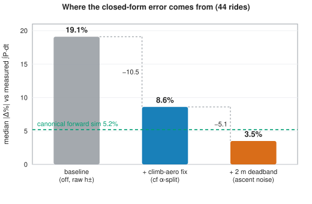

<!-- DRAFT v2 — IMRAD paper, revised after the six-lens adversarial review
     (2026-07-27) and the author's preliminary feedback. Single-language draft
     for review; the pt-BR mirror is produced only after this shape is approved
     (from then on the lockstep rule applies). Sources of truth:
     research/journal/MODEL_COMPARISON_JOURNAL.md (numbers), journal.qmd
     (reproduction map). All values are the current, re-baselined ones
     (G = 9.7864), verified against src/harness/bootstrap_ci.py and the
     harness CSVs. Math in LaTeX ($...$); render target is pandoc/KaTeX. -->

# A Closed-Form Model for the Mechanical Energy of Cycling a Route, Tested on 1,343 Power-Meter Rides

**Danilo Lessa Bernardineli** — Pedal Hidrográfico, São Paulo

## Abstract

**Background.** The energy of cycling a route has three parts: a cost for every kilometre of distance, a cost for every metre climbed, and a partial refund for every metre descended. Yet the quantity is hard to obtain: route planners optimise time or "hilliness", not energy; the tools that do estimate it are simulation-based, with route-level accuracy unpublished; and the physics literature validates instantaneous power or speed, not the route-level energy integral. A closed form simple enough to evaluate by hand (or a million times per second in a router) would unlock the quantity for planners and riders alike — if it can be trusted.

**Methods.** We test four models built on one three-term closed form, $E \approx \alpha\,x + \beta\,(h_+ - \varepsilon\,h_-)$ — a flat cost rate $\alpha$ per metre of distance $x$, a climbing rate $\beta$ per metre of ascent $h_+$, and a refund of the fraction $\varepsilon$ of the descended height $h_-$ — against the mechanical energy $\int P\,dt$ measured by power meters on 1,343 rides (1,387 ride-evaluations across five corpora) from three riders in São Paulo. The reference is a forward-dynamics simulation of the standard cycling power balance [Martin et al. 1998], run on the same physical constants, so every gap between the two is the model's fault, not the parameters'. Each ride's measured power feeds both models, so accuracy here means consistency of the energy accounting, not blind prediction. Every behavioural constant is calibrated on one rider and frozen; the only per-rider input is total mass, inverted from each rider's own climbing data.

**Results.** The four models have a median error (against calibration measurements) of 3.5% [95% CI 2.0, 5.6] (form 3, elevation smoothed), 5.9% [3.6, 8.3] (form 4, elevation corrected), 8.6% [7.2, 11.0] (form 2, split) and 19.1% [17.3, 21.5] (form 1, original), with the reference simulation at 5.2% [3.8, 7.3]. The two corrections carry almost all of the gain — the original form was charging climb aerodynamics at the flat reference speed and counting sub-metre elevation noise as lifting work — and the best form is statistically indistinguishable from, and nominally better than, the simulation (paired sign test $p = 0.65$; $n = 44$ limits power). For the descent term we derive a coasting-limit expression, $\varepsilon(s) = \min(1, (\alpha/\beta)/s)$, and calibrate one constant against power-measured descent balances: the **coasting deficit** $\varepsilon_0 = 0.13$, the share of the coasting refund the rider never collects. Frozen and carried to two independent riders' full histories, the law holds at 3.5–6.2% median error on every corpus with the terrain-appropriate $\varepsilon$ rule, and the coasting deficit recurs on every rider (measured gaps 0.12–0.19 across parameter choices).

**Conclusions.** The best-performing model is $E = \alpha_r\,x + \alpha_a\,x_{\mathrm{flat}} + \beta\,(h_+ - \varepsilon\,h_-)$ — form 3: air resistance $\alpha_a$ charged only over the non-climbing distance $x_{\mathrm{flat}}$, rolling $\alpha_r$ still over all of $x$, elevation totals smoothed. It accounts for measured route energy as well as a full simulation does (3.5% [2.0, 5.6] vs the simulation's 5.2% [3.8, 7.3]); its totals-only approximation (form 4), which instead corrects the raw elevation totals by subtracting $c \approx 3$ m of phantom climb per kilometre of route, performs nearly as well (5.9% [3.6, 8.3]) while needing just distance, ascent and descent — computable by hand, with no specialized software. Descent recovery has a geometry (the coasting limit) and a habit (the deficit); the deficit constant transfers across riders, while the dynamic term's extra accuracy over a single flat constant is rider- and parameter-dependent — a flat $\varepsilon \approx 0.20$ suffices in urban stop-go riding. The law is cheap enough to serve as a per-edge routing cost at the elevation-sampling scale it was calibrated on.

## Terminology

Symbols and named concepts used throughout, in order of appearance in the model. Grades are written as percent in the text and used as fractions in formulas. The *value* column gives the number used when the quantity is assumed or calibrated; otherwise it gives the variable's scope — **rider variable** (fixed per rider), **route variable** (computed from route geometry, given the rider's constants), **ride variable** (measured or evaluated once per recorded ride), **local variable** (varies along the route), **instantaneous variable** (varies per second).

| symbol | unit | value | name | meaning |
|---|---|---|---|---|
| $E$ | J | ride variable | route mechanical energy | Pedal energy the rider spends over the route; ground truth is the power-meter integral $\int P\,dt$, coasting zeros included. |
| $x$ | m | route variable | route distance | Ground distance of the route. |
| $h_+$, $h_-$ | m | route variable | total ascent, total descent | Sums of all climbing and all dropping over the route, from the raw profile; the deadband-smoothed totals are written $\tilde h_+$, $\tilde h_-$ ([§1.2](#1.2)). |
| $x_+$, $x_-$, $x_{\mathrm{flat}}$ | m | route variable | climbing, descending, non-climbing distance | Distance ridden on grades ≥ 2%, distance ridden descending, and the non-climbing complement $x - x_+$; air resistance is charged only on $x_{\mathrm{flat}}$. |
| $s$ | — | local variable | grade (slope) | Rise over run of a route segment; negative on descents. |
| $m$ | kg | rider variable | total system mass | Rider + bicycle + gear. Inverted from a corpus's own climbing data wherever the rider is treated as unknown ([§2.3](#2.3)). |
| $g$ | m/s² | 9.7864 | local gravity | São Paulo's measured value (IAG-USP absolute gravimetry). |
| $C_{rr}$ | — | 0.008 | rolling-resistance coefficient | Rolling drag as a fraction of weight (literature-typical value). |
| $C_dA$ | m² | 0.40 | drag area | Frontal area × aerodynamic drag coefficient (literature-typical value). |
| $\rho$ | kg/m³ | 1.13 | air density | Literature-typical value at São Paulo's altitude. |
| $k_{\mathrm{eff}}$ | — | 0.98 | drivetrain efficiency | Fraction of leg power that reaches the wheel (literature-typical value). |
| $v_f$ | m/s | rider variable | flat reference speed | Cruising speed on flat ground; sets the aero charge and anchors the two models' agreement. |
| $P$ | W | instantaneous variable | pedal power | Rider's instantaneous power, measured per second by the power meter. |
| $\alpha_r$, $\alpha_a$ | J/m | rider variable | rolling, aero cost rates | Energy per metre of distance for rolling resistance, and for air resistance at $v_f$; their sum $\alpha$ is the flat cost rate. |
| $\beta$ | J/m | rider variable | climbing cost rate | Energy per metre of height gained: $mg/k_{\mathrm{eff}}$. |
| $s_*$; $s_+$, $s_-$ | — | rider variable | flat-resistance grade; gravity-dominated regimes | Break-even slope $s_* = \alpha/\beta$ (≈ 1.6–2%) where gravity equals flat resistance. Beyond it gravity dominates: ascents $s_+$ ($s > s_*$, speed collapses), descents $s_-$ ($s < -s_*$, surplus braked away). |
| $s_=$ | — | — | flat band | Grades with $\lvert s\rvert < s_*$: resistance dominates gravity, the aero charge at $v_f$ is fair, and descents refund fully. The frozen 2% climb gate approximates its upper boundary. |
| $\varepsilon$ | — | route variable | descent-recovery factor | Fraction of descent potential energy refunded as forward progress, $\in [0,1]$; estimated by the dynamic $\varepsilon_d = \mathrm{clamp}_{[0,1]}(\varepsilon_{\mathrm{coast}} - \varepsilon_0)$ or by a flat constant $\varepsilon_f$ ([§1.3](#1.3)). |
| $\varepsilon_{\mathrm{coast}}$ | — | route variable | coasting-limit recovery | Geometry-only ideal: $\min(1, s_*/s)$, drop-weighted over the route's descents. Needs no power data. |
| $\varepsilon_{\mathrm{bal}}$ | — | ride variable | measured descent balance | What a ride actually recovered, solved from its own power stream on 30 m segments ([§2.2](#2.2)). |
| $\varepsilon_0$ | — | 0.13 | coasting deficit | Near-constant gap between ideal and measured recovery — the refund share riders never collect. Calibrated once, then frozen. |
| $c$ | m/km | ≈ 3 | ascent-noise rate | Phantom climbing accumulated per kilometre of route by elevation noise; subtracted from raw totals. Calibrated once, then frozen. |
| $\tau$ | m | 2 | deadband threshold | Elevation changes smaller than $\tau$ are ignored when summing $h_+$ and $h_-$. |
| $\Delta\%$ | % | ride variable | per-ride signed error | $(E_{\mathrm{model}} - E_{\mathrm{meas}})/E_{\mathrm{meas}}$; corpora are summarized by medians of $\Delta\%$ and $\lvert\Delta\%\rvert$. |

## 1. Introduction

### 1.1 An absent quantity

How much energy does it take to cycle a route? The question is basic — it decides how far a commuter can ride, how a collective plans a group ride through hilly terrain, whether a cargo-bike delivery round is feasible — and yet a trustworthy answer is hard to come by. Production bicycle routers cost *time*, with heuristic hill penalties — none costs energy per edge. The tools that do estimate ride energy are simulation-based pacing planners or platforms' post-hoc estimates: opaque to their users and, to our knowledge, never validated against measured route-level power in the open literature. The sports-science literature validates the *instantaneous* power balance to high precision [Martin et al. 1998; Dahmen et al. 2011] but not the route-level energy integral; route-choice models absorb elevation into fitted coefficients with no physical form [Scarf & Grehan 2005]. Energy is not so much absent from the toolbox as locked inside simulations — out of reach of a router that must cost thousands of edges, and of a rider with pen and paper.

Two audiences would use it if it were computable, and they impose opposite constraints. A routing engine must evaluate thousands of candidate edges, which rules out forward simulation and demands a closed form. A rider — or anyone teaching riders — needs something even stricter: a formula that works with pen and paper, from the three numbers any map already gives (distance, total ascent, total descent). Both constraints point to the same object, and Occam points there too: the simplest law that survives contact with measured data is the one worth deploying.

### 1.2 The proposed law

We propose an approximation that decomposes the mechanical work of a ride into three terms: (1) a cost per metre of horizontal distance — rolling and aerodynamic resistance — expressed by the rate $\alpha$; (2) a cost per metre of ascent — a gravitational *deposit* — expressed by the rate $\beta$; and (3) a partial *refund* per metre of descent — the deposit withdrawn back as forward progress — expressed by the recovery factor $\varepsilon$. Terms 1 and 2 are widely known: together they are the textbook steady-speed energy integral, resting on physics validated since the equation-of-motion experiments [di Prampero et al. 1979; Martin et al. 1998]. Term 3 is novel. It has been touched only obliquely in nearby literatures — as a per-grade coasting idle limit in a speed-choice model [Bigazzi & Lindsey 2019], and as per-instant regeneration efficiencies or symmetric potential terms in electric-vehicle energy models — but never as a route-level, closed-form recovery factor; [§1.3](#1.3) develops it and [§4.2](#4.2) maps the prior art. The three terms give the shape every form in this study shares,

$$E \;\approx\; \alpha\,x \;+\; \beta\,(h_+ - \varepsilon\,h_-),$$

with one flat cost rate $\alpha = \alpha_r + \alpha_a$, one climbing rate $\beta$ and one recovery factor $\varepsilon$, where

$$\alpha_r = \frac{C_{rr}\,m g}{k_{\mathrm{eff}}}, \qquad \alpha_a = \frac{\tfrac{1}{2}\rho\,C_dA\,v_f^2}{k_{\mathrm{eff}}}, \qquad \beta = \frac{m g}{k_{\mathrm{eff}}}.$$

We evaluate four forms of this family. They are not independent alternatives but a causal chain of refinements, each step addressing the previous form's main limitation: form 1, the shared shape as-is, led to form 2 (splitting the flat rate), which led to form 3 (smoothing the elevation), which led to form 4 (approximating the smoothing when only totals are available). Writing $\tilde h_\pm$ for the deadband-smoothed elevation totals:

1. **original** — air resistance at the flat reference speed over the whole distance; raw elevation totals:
   $$E_1 \;\approx\; \alpha\,x \;+\; \beta\,(h_+ - \varepsilon\,h_-);$$
2. **split** — the aero part gated off climbs, rolling still paid everywhere:
   $$E_2 \;\approx\; \alpha_r\,x \;+\; \alpha_a\,x_{\mathrm{flat}} \;+\; \beta\,(h_+ - \varepsilon\,h_-);$$
3. **split + elevation smoothed** — the elevation profile deadband-filtered point by point before summing, so $\tilde h_\pm$ are noise-free (the form we propose):
   $$E_3 \;\approx\; \alpha_r\,x \;+\; \alpha_a\,x_{\mathrm{flat}} \;+\; \beta\,(\tilde h_+ - \varepsilon\,\tilde h_-);$$
4. **split + elevation correction** — form 3, with the smoothed totals approximated from the raw ones, for when only $x$, $h_+$ and $h_-$ are known:
   $$E_4 \;\approx\; \alpha_r\,x \;+\; \alpha_a\,x_{\mathrm{flat}} \;+\; \beta\,(\tilde h_+ - \varepsilon\,\tilde h_-), \qquad \tilde h_\pm \approx h_\pm - c\,x.$$

All four forms are derived from the route-energy integral in [Appendix A](#appendix-a), and all four are scored against measured energy in [§3.1](#3.1) ([Table 2](#tab2)). All symbols and their plain-word meanings are collected in [Terminology](#terminology); [Figure 1](#fig1) maps each term of the proposed form onto a route profile; the filter threshold $\tau$ and the noise rate $c$ are specified below.

The family's physical ingredients are well validated, but only below the route scale: the underlying power balance against steady-velocity trials on flat ground [Martin et al. 1998], and simulators built on it against speed on real tracks [Dahmen et al. 2011] — never against the route-level energy integral. Two systematic errors that only exist at that integral scale — one born when the closed form lumps aero into a single reference speed, one born when noisy elevation steps are summed into $h_+$ — therefore had no occasion to be noticed, let alone corrected. We propose two corrections; both are calibrated on a single corpus and then frozen ([§2.3](#2.3)).

- **Climb-aero split.** The original form bills air resistance at $v_f$ over the whole distance, but on ascent-dominated grades ($s_+$) speed falls far below $v_f$, so it over-charges every climb. The correction charges aero only over the non-climbing distance $x_{\mathrm{flat}} = x - x_+$; the frozen 2% gate defining $x_+$ is a rounded, rider-generic stand-in for the flat-resistance grade $s_*$.
- **Elevation deadband.** Recorded and DEM elevation profiles carry sub-metre noise whose positive half-steps all count toward $h_+$ — a measurement artifact, not lifting work [Rapaport 2011]. Form 3 removes it with a backlash (deadband) filter of threshold $\tau = 2\,\mathrm{m}$, which leaves sustained climbs intact; form 4 approximates the smoothed totals from raw ones, $\tilde h_\pm \approx h_\pm - c\,x$, achieving the same on totals alone — **subtract about 3 m of phantom climbing per kilometre of route** ($c = 0.003$ with $x$ and $h_\pm$ in metres; adopted from a measured noise-accumulation rate of 3.2 m/km, per-ride IQR 2.7–3.8). Example: a 50 km ride whose raw profile reports 600 m of ascent is corrected to $600 - 3 \times 50 = 450$ m.

### 1.3 The descent term: a coasting limit and a coasting deficit

The refund is the term prior knowledge leaves least determined — and the one with the most to offer, because it turns a difficult phenomenon (what a rider actually does downhill) into something measurable and transferable. The question it answers: when a route descends $h_-$ metres, how much of the potential energy $m g h_-$ returns as forward progress rather than being lost to over-speed drag and braking? Published models either ignore descents, treat them symmetrically with climbs, or handle recovery per-instant, as the electric-vehicle literature does [Yuan et al. 2024; Ahmadi et al. 2024; Perger & Auer 2020]. We could locate no closed-form, route-level descent-recovery term validated against measured power.

We derive one in [Appendix A](#appendix-a) as the exact upper bound of recovery — the coasting limit (no pedalling, no braking), since the legs can never return energy: a descent of grade $s$ recovers the fraction of its potential energy not consumed by rolling and flat-reference air resistance,

$$\varepsilon_{\mathrm{coast}}(s) = \min\!\left(1,\ \frac{\alpha/\beta}{s}\right).$$

This is the descent-side mirror of the climb gate: within the flat band ($s_=$) every joule of drop offsets resistance one-for-one and the refund is total; on descent-dominated grades ($s_-$) the surplus must be dumped to over-speed drag or brakes, so the recoverable fraction decays as $1/s$ ([Figure 2](#fig2)). The same idle limit appears, per grade, in Bigazzi & Lindsey's utility-based speed-choice model [Bigazzi & Lindsey 2019]; here it is lifted to a route level — aggregating drop-weighted over a route's descent profile gives a geometry-only estimate $\varepsilon_{\mathrm{coast}}$ that needs no power data.

Real riders do not ride the coasting limit: they pedal into descents and brake before corners, so their measured recovery sits below the bound by construction. Our hypothesis is that this shortfall is a constant offset — the **coasting deficit** $\varepsilon_0$ — so that the working estimator is

$$\varepsilon \;\approx\; \mathrm{clamp}_{[0,1]}\big(\varepsilon_{\mathrm{coast}} - \varepsilon_0\big),$$

with $\varepsilon_0$ calibrated once against power-measured descent balances ([§2.2](#2.2), [§3.2](#3.2)) and then frozen. We call this estimator the **dynamic $\varepsilon$**, written $\varepsilon_d$ — it adapts to each route's descent geometry — in contrast to a **flat $\varepsilon$**, written $\varepsilon_f$: a single constant for every route, the alternative it is scored against throughout. What the deficit *is* — geometry or habit — and whether it transfers across riders are empirical questions, answered in [§3.2](#3.2)–[§3.3](#3.3).

### 1.4 Aim, hypotheses, and scope

**The aim of this study** is to test whether the closed form above accounts for the measured mechanical energy of real rides as well as a full simulation does. Three hypotheses, each tested against measured power:

1. **Attribution.** The closed form's error is not diffuse: the two corrected mechanisms — the climb-aero over-charge and ascent noise — account for almost all of it, and the corrected law reaches statistical parity with the forward simulation it approximates ([§3.1](#3.1)).
2. **Calibration.** The gap between the coasting ideal and riders' measured descent balances is a single constant, not a function of the route ([§3.2](#3.2)).
3. **Transfer.** Calibrated on one rider and frozen, the energy law and the coasting deficit carry to independent riders' complete histories; whether the dynamic estimator's ($\varepsilon_d$) extra accuracy over a single flat constant also carries is part of the test ([§3.3](#3.3)).

One scope statement applies throughout: each ride is evaluated with its own measured power inputs, and each rider's mass is implied from their own climbing data ([§2.3](#2.3)). Our accuracy figures therefore measure the **consistency of the energy accounting** — whether the law maps a route's geometry and a rider's effort onto the measured energy — not blind route prediction, which would additionally require predicting the rider's power.

## 2. Methods

### 2.1 The reference simulation and the shared-constants design

The reference is a distance-marching forward integration of the standard cycling power balance [Martin et al. 1998; di Prampero et al. 1979]:

$$m\,\frac{dv}{ds}\,v = \frac{k_{\mathrm{eff}}\,P}{v} - C_{rr}\,m g \cos\theta - \tfrac{1}{2}\rho\,C_dA\,(v + w)^2 - m g \sin\theta,$$

with pedal power $P$ per grade regime extracted from each ride's own power stream, signed relative wind $w$, and a safe-speed brake cap on descents. The integrator uses a semi-implicit kinetic-energy update that conserves energy to machine precision (the identity $k_{\mathrm{eff}} E_{\mathrm{legs}} = \Delta KE + W_{rr} + W_{\mathrm{aero}} + W_{\mathrm{grav}} + W_{\mathrm{brake}}$ is asserted per ride to $\leq 10^{-6}$ relative).

The design principle that makes the comparison meaningful: **both models read the same physical constants** — mass, $C_{rr}$, $C_dA$, $\rho$, $k_{\mathrm{eff}}$, wind — per ride. The flat reference speed is likewise shared and derived per ride: the flat-regime pedal power is extracted from the ride's own power stream (speed-gated, time-weighted), and $v_f$ is the speed at which the flat power balance closes — so on flat ground the two models agree by construction, and every gap between them is modelling error, not a parameter mismatch. Gravity is São Paulo's measured local value ([Terminology](#terminology)); all corpora were ridden in the São Paulo metropolitan region.

### 2.2 Measuring descent recovery

To measure what a rider actually recovers on descents — the quantity the [§1.3](#1.3) hypothesis is calibrated against — we solve the descent energy balance for each ride:

$$\varepsilon_{\mathrm{bal}} = \frac{\alpha\,x_- - E_{\mathrm{legs},-}}{\beta\,h_-},$$

where $x_-$ is the route's descending distance (the descent-side sibling of $x_+$), $E_{\mathrm{legs},-}$ is the pedal energy $\int P\,dt$ spent while descending, and the balance is evaluated on 30 m route segments with $\alpha$ computed at each ride's *measured* flat speed (deliberately — using the model's reference speed here would let a parameter mismatch masquerade as recovery). This inversion of an energy identity to expose a hidden quantity follows the logic of Chung's virtual-elevation method [Chung 2012]. The coasting deficit is then the measured offset $\varepsilon_{\mathrm{coast}} - \varepsilon_{\mathrm{bal}}$, calibrated on one corpus and tested for constancy and transfer in [§3.2](#3.2)–[§3.3](#3.3).

### 2.3 Data, ground truth, and evaluation protocol

**Datasets.** Five corpora — 1,343 unique rides, 1,387 ride-evaluations (D1 is a subset of D5) — all ridden in and around São Paulo, all with per-second power meters ([Table 1](#tab1); [Figure 4](#fig4) draws every analysed route on one map).

**Table 1.** The five corpora and their roles.

| corpus | rides (clean) | character | role |
|---|--:|---|---|
| D1 longões | 44 | long brevet-style rides, open terrain (author) | calibration + primary comparison |
| D2 censo | 62 | urban stop-go group rides, generic rider assumed | out-of-domain regime test |
| D3 P. Paz | 441 | independent rider's full history, fast open-road | frozen-constant transfer |
| D4 JAAM | 219 | independent rider's full history, gentle terrain, strong descent-pedaller | frozen-constant transfer |
| D5 author-full | 621 | author's complete history (superset of D1) | large-sample in-sample validation |

The roles, precisely:

- **calibration** — the corpus where everything tunable is tuned: both behavioural constants and the correction variants are fixed here, once, and frozen thereafter;
- **primary comparison** — the closed-form-vs-simulation contest of [§3.1](#3.1); because it shares the calibration corpus, it can support only parity-where-derived — which is what the next three roles exist to extend;
- **out-of-domain regime test** — the riding context changes (urban stop-go, fully generic assumed rider) while every constant stays frozen: does the law break when the *style of riding* changes?
- **frozen-constant transfer** — the *rider* changes: two independent full histories, constants frozen, only mass data-implied. The strongest out-of-sample evidence here: did calibration capture cycling, or just the calibration rider?
- **large-sample in-sample validation** — deliberately *not* independent (the calibration rider's complete history): it validates the machinery at scale — mass inversion against a known weight, the filters, the parser — not the law.

The design in one line: **fit → contest → change the regime → change the rider → stress the machinery**, each step removing one alternative explanation for the previous step's success ([Figure 3](#fig3)).

.](figs/fig12-routes-map.png)

Ground truth is the raw $\int P\,dt$ per ride, coasting zeros included. Inclusion filters, applied identically everywhere:

- sport = cycling; virtual rides excluded via the FIT manufacturer field;
- power coverage > 50% of samples; altitude coverage ≥ 99%;
- distance ≥ 20 km;
- a physical floor: $E_{\mathrm{legs}} \geq m g\,\tilde h_+/k_{\mathrm{eff}}$ — a measured energy below the climbing potential energy means the route was not fully pedalled (power dropouts, walking) — with a cadence-based cross-check for walked segments.

The independent riders' exports were shared with consent and are never published; all analysis code and output schemas are public.

**Rider mass without a scale.** Which corpora get an inverted mass follows from the roles above: the transfer corpora (D3–D4), where mass is genuinely unknown — and D5, where the author is deliberately processed as if he were an unknown rider, so the machinery's output can be graded against his known weight. For these, total mass is inverted from the corpus's own sustained-climb (≥ 3% over ≥ 100 m) energy balances: $\hat m = m_0\,(E_{\mathrm{meas}} - E_{\mathrm{aero}})/(E_{\mathrm{grav}} + E_{\mathrm{roll}})$, where $m_0$ is the generic prior mass (78 kg) whose gravity and rolling energies scale linearly with mass; per-ride median over rides with ≥ 200 m of sustained climbing. This yields 74.5 kg [IQR 69.1–78.4] for D3, 101.9 kg [95.9–109.0] for D4, and 74.7 kg [67.7–81.0] for D5 — validated against the author's known ≈ 73 kg ([§3.4](#3.4)). Note $\hat m g$ is invariant under a change of gravity constant by construction. All other constants take the literature-typical values listed in [Terminology](#terminology) — mid-range published field values for an upright rider on typical asphalt. They are deliberately *not* fitted per rider from the ride data: estimating $C_{rr}$ or $C_dA$ from the same energy measurements the models are scored on would let the parameters absorb modelling error, making the accuracy figures partly self-fulfilling. Shared priors keep the scoreboard falsifiable; [§3.4](#3.4) tests every conclusion's sensitivity to that choice with independently fitted per-rider constants.

**Protocol.** The comparison statistic is the per-ride signed error $\Delta\%$ ([Terminology](#terminology)); we report medians of $|\Delta\%|$ and of $\Delta\%$ with bootstrap 95% CIs and compare models pairwise with exact sign tests. Conventions: CIs are percentile bootstrap ($10^4$ resamples) over rides resampled independently within a corpus; sign tests drop tied rides (e.g. effective $n$ = 436 of 441 and 215 of 219 on the transfer corpora); rides within one rider are not independent, and D1 ⊂ D5 — so cross-corpus agreement should be read as consistency, not as five independent replications. Both behavioural constants ($\varepsilon_0$; the noise rate $c$) are fit on D1 only and **frozen** for D2–D5. For the descent term we carry two frozen variants everywhere — the dynamic $\varepsilon_d$ and a flat $\varepsilon_f = 0.20$ — and report both; where a corpus's own in-sample best is quoted, it is labelled as such. A gate script re-derives every published median from the per-ride outputs and fails loudly on any mismatch; the full provenance is a public lab journal with an executable mirror.

## 3. Results

### 3.1 Two corrections take the closed form to parity with simulation

On the 44-ride calibration corpus, the original form 1 errs by 19.1% median [17.3, 21.5] and over-predicts nearly every ride (+19.1% [+17.3, +21.6] median signed). The split alone (form 2) halves the error to 8.6% [7.2, 11.0] (better than form 1 on 43 of 44 rides; the median ride spends 21% of its distance climbing); smoothing the elevation with the 2 m deadband (form 3, the proposed law) removes the ascent-noise half ([Table 2](#tab2), [Figure 5](#fig5)).

**Table 2.** Calibration-corpus scoreboard: median $\lvert\Delta\%\rvert$ [95% CI] and median signed $\Delta\%$ per model variant (44 rides; the corrections are in-sample here).

| model (D1, in-sample for the corrections) | median $\lvert\Delta\%\rvert$ | 95% CI | median $\Delta\%$ [95% CI] |
|---|--:|:--|--:|
| **form 3, split + elevation smoothed (proposed)** | **3.5** | [2.0, 5.6] | +2.1 [+0.5, +4.3] |
| forward simulation | 5.2 | [3.8, 7.3] | −1.8 [−3.9, +0.3] |
| form 4, split + elevation correction | 5.9 | [3.6, 8.3] | −0.6 [−2.7, +2.4] |
| form 2, split only | 8.6 | [7.2, 11.0] | +8.4 [+6.8, +11.0] |
| form 1, original | 19.1 | [17.3, 21.5] | +19.1 [+17.3, +21.6] |

The corrected closed form beats the simulation's median, but the CIs overlap and the paired test does not separate them (closer on 24 of 44 rides; sign test $p = 0.65$, and $n = 44$ limits the power of that test). The defensible claim is **parity on the corpus the corrections were derived on** — which is still the practically decisive outcome, since the closed form is the one cheap enough to evaluate per edge in a router, and [§3.3](#3.3) tests it off this corpus. Form 4, which needs nothing but $x$, $h_+$, $h_-$, also ties the simulation (5.9 [3.6, 8.3] vs 5.2 [3.8, 7.3]).

Two checks support the attribution. First, on *sustained* climbs (2,535 sections ≥ 3% over ≥ 100 m, 54% of all ascent) the measured energy matches the expected gravity + rolling + aero to within 4% (41,790 vs 43,233 kJ; ratio 0.97) — the gravity term needs no discount; what inflates raw $h_+$ is the noise and rollers the deadband removes. Second, carried frozen to the urban corpus (D2) with a fully generic assumed rider, the law with $\varepsilon_d$ lands at 7.7% [6.0, 9.3] median with form 3 (6.4% [4.8, 8.6] with form 4) against the simulation's 6.6% [4.7, 8.7] — parity again, with nothing refit. The flat $\varepsilon_f = 0.20$ does better still on this corpus (4.7% [3.3, 6.2] with form 3; 3.9% [3.2, 6.1] with form 4, parity with the simulation at $p = 0.70$) — but that constant was itself selected in-sample on these urban rides, so those two medians read as a fitted benchmark, not as transfer; the frozen-variant numbers are the honest headline here.

### 3.2 The coasting deficit: descent recovery has a geometry and a habit

Descent recovery is unambiguously real: setting $\varepsilon = 0$ over-predicts every corpus (on the urban rides alone, by +7.2% [+4.9, +9.2] median with form 3 and +10.4% [+8.2, +13.7] with form 4). On the calibration corpus, the measured $\varepsilon_{\mathrm{bal}}$ tracks the geometry-only $\varepsilon_{\mathrm{coast}}$ exactly where descents carry energy: the correlation rises from 0.30 (all rides) to 0.60 (descent-energy-weighted) to 0.77 on real descents (mean descent grade ≥ 3%; 0.82 at ≥ 3.5%) ([Figure 6](#fig6)).

These correlations are partly part–whole (the two quantities share their dominant term $\alpha/\beta$), so the statistic we lead with is error reduction: on real descents, the calibrated line $\varepsilon_{\mathrm{coast}} - 0.13$ reaches RMS 0.08 against a best-flat-constant baseline of RMS 0.13 — a 37% reduction, computed on unrounded values, in-sample. A worked example, from one ride near the median residual: $\alpha/\beta = 0.0204$ (from the same six constants and the ride's measured flat speed) and mean descent grade 3.4%, so $\varepsilon_{\mathrm{coast}} = 0.0204/0.034 = 0.60$; subtracting the deficit, $0.60 - 0.13 = 0.47$; the measured balance is 0.47.

![**Figure 6.** Geometry-only $\varepsilon_{\mathrm{coast}}$ vs the power-measured $\varepsilon_{\mathrm{bal}}$, one point per ride (area ∝ descent energy). On real descents the calibrated line $\varepsilon = \varepsilon_{\mathrm{coast}} - 0.13$ tracks the measurements; the shaded band is the 95% bootstrap CI of the median offset on that subset, [0.10, 0.17]. Gentle rides scatter but carry ≈ 0 descent energy. (The two axes share their dominant term $\alpha/\beta$, so visual agreement partly reflects shared inputs — the error-reduction statistic in the text is the load-bearing one.)](figs/fig4-eps-scatter.svg)

The residual between ideal and measured is a near-constant −0.13, and its *character* matters. The route-geometry covariates we tested all fail to explain it: curviness and unpaved fraction fit with the wrong sign (twisty, rough rides are the mountainous ones that recover *more*), and on the urban corpus no braking-density predictor survives ($R^2 \leq 0.14$; a mechanistic braking-energy subtraction over-corrects). On a descent, gravity — not the legs — repays what a red light took, so stop-go density does not move $\varepsilon$. The pattern is consistent with a rider-behaviour interpretation: the deficit encodes *how the rider descends* — residual pedalling into the descent, braking before corners. If so, it should transfer across routes but vary with descent style across riders — a testable prediction ([§3.3](#3.3)).

Two boundaries complete the picture. On flat terrain the clamp-to-1 prediction inverts — gentle rides are pedalled *through* dips, so measured $\varepsilon \to 0$ — harmlessly, since such rides carry ≈ 0 descent energy (this is why the estimator must be restricted to real descents; over all 44 rides it loses to a flat constant). And in urban stop-go riding, $\varepsilon_{\mathrm{coast}}$ over-credits recovery; a flat $\varepsilon \approx 0.20$ fits better there. Notably, the frozen $\varepsilon_d$ transferred to the urban corpus comes within 0.01 RMS of the flat constant selected in-sample *on that corpus* (0.09 vs 0.08) — the calibration survives the regime change even where the geometry itself stops helping.

### 3.3 Transfer: what survives being frozen and carried to other riders

With every behavioural constant frozen from the calibration rider, the energy law reproduces two independent riders' full histories to 3.5–5.8% median error with the regime-appropriate $\varepsilon$ ([Table 3](#tab3)).

**Table 3.** Frozen-constant transfer to the two independent riders: median $|\Delta\%|$ [95% CI] with median signed $\Delta\%$ [95% CI] in parentheses; all four form × $\varepsilon$ combinations are frozen, best per rider in bold.

| frozen model | D3 (P. Paz, 441 rides) | D4 (JAAM, 219 rides) |
|---|---|---|
| form 3, dynamic $\varepsilon_d$ | 5.8 [5.3, 6.4] (+4.3 [+3.1, +4.9]) | 5.5 [4.4, 6.4] (−4.7 [−5.7, −3.7]) |
| form 4, dynamic $\varepsilon_d$ | **4.9** [4.4, 5.8] (+0.6 [−0.1, +1.3]) | 9.0 [7.9, 9.7] (−8.4 [−9.5, −7.5]) |
| form 3, flat $\varepsilon_f = 0.20$ | 10.1 [9.3, 10.7] (+10.0 [+8.8, +10.7]) | **3.5** [3.1, 4.2] (+0.4 [−0.8, +1.2]) |
| form 4, flat $\varepsilon_f = 0.20$ | 6.8 [6.0, 7.6] (+5.4 [+4.1, +6.6]) | 5.6 [4.8, 6.4] (−4.3 [−5.0, −3.3]) |
| forward simulation | 6.8 [6.2, 7.8] (+5.0 [+3.8, +5.9]) | 5.4 [4.9, 6.1] (−5.0 [−5.8, −4.3]) |

The grid matches the regime rule from [§3.2](#3.2) — the dynamic estimator wins on the open-road rider (D3), the flat constant on the gentle-terrain rider (D4) — and adds a sharper observation: the form × $\varepsilon$ interaction is itself regime-dependent. Form 4 with $\varepsilon_d$ is the *best* cell on P. Paz (4.9, the journal's published headline for that corpus) and the *worst* on JAAM (9.0), where the scalar elevation correction and the dynamic estimator compound on gentle terrain. With the regime-appropriate $\varepsilon$, the law stays at or better than simulation parity on both riders. Adding the calibration-regime corpora (D1 3.5% [2.0, 5.6], D2 4.7% [3.3, 6.2] with the regime-appropriate $\varepsilon$; D5 6.2% [5.6, 6.9], [§3.4](#3.4)), the law holds at **3.5–6.2% median error on every corpus** when the [§3.2](#3.2) regime rule picks the $\varepsilon$ variant.

**The coasting deficit recurs on every rider.** P. Paz's measured gap between $\varepsilon_{\mathrm{coast}}$ and $\varepsilon_{\mathrm{bal}}$ on real descents is 0.12; JAAM's is 0.13 [0.10, 0.19]; the author's full history gives 0.13; the calibration value was 0.13. (The gap's sign is structural — $\varepsilon_{\mathrm{coast}}$ upper-bounds $\varepsilon_{\mathrm{bal}}$ — so we count this as *consistent across riders*, not as three independent confirmations.)

**The dynamic estimator's extra accuracy over a flat constant is rider-dependent.** For P. Paz, a coasting-style descender on open roads, the frozen estimator's descent-recovery error (RMS 0.091 on real descents) beats even his own in-sample best flat constant (0.139) by 35% — under the generic assumed physics; under his fitted constants the margin collapses to a tie ([§3.4](#3.4)). For JAAM, who pedals his descents (measured $\varepsilon_{\mathrm{bal}}$ 0.17–0.28 on mostly gentle terrain), the frozen estimator fails outright on the gentle bulk (RMS 0.47 vs a flat constant's 0.16) and on his few real descents ($n = 20$) sits at RMS 0.091 — against the frozen flat 0.20's 0.111 the difference is inconclusive (−0.020, 95% CI [−0.074, +0.025]), and against his own in-sample best flat (0.086) it is a tie. The practical rule stands: dynamic $\varepsilon_d$ on open, coastable terrain (mean descent grade ≥ 3%); flat $\varepsilon_f \approx 0.20$ otherwise; either way the deficit constant carries.

### 3.4 Robustness

**Fitted versus assumed physics.** An independent per-activity parameter fit (virtual-elevation family [Chung 2012]) puts P. Paz's effective $C_dA$ near 0.26 against the assumed 0.40. Re-running everything under his fitted constants ([Table 4](#tab4)) leaves the energy law's accuracy intact (~4–7% median either way; the simulation's bias flips +5.0 → −6.9) but collapses the 35% descent-term margin to a tie (RMS 0.082 vs 0.086), and shifts his measured deficit gap from 0.12 to 0.19 (the lower $C_dA$ lowers $\alpha$, hence $\varepsilon_{\mathrm{bal}}$ drops 0.36 → 0.14). JAAM's numbers are robust to the same swap (gap 0.13 either way; tie either way). Under each rider's best-guess physics, then, both independent riders tell the same story — the dynamic estimator ties a flat constant — and the deficit's *recurrence* is robust while its *value* on one rider is parameter-sensitive. We keep the assumed-physics numbers as the headline (the whole $\varepsilon$ framework, including $\varepsilon_0$, is defined under them) and read the fitted rerun as the honest error bar: the 35% margin should not be leaned on, and the gap is 0.12–0.19 rather than a point value.

**Table 4.** Fitted versus assumed physics: each independent rider re-evaluated under his own fitted constants (P. Paz $C_dA$ 0.26, $C_{rr}$ 0.0053, $m$ 80.9 kg; JAAM 0.32, 0.011, 103.4 kg). Medians carry 95% CIs; the RMS pairs are point statistics.

| | P. Paz, assumed | P. Paz, fitted | JAAM, assumed | JAAM, fitted |
|---|--:|--:|--:|--:|
| simulation median $\lvert\Delta\%\rvert$ (signed [95% CI]) | 6.8 [6.2, 7.8] (+5.0 [+3.8, +5.9]) | 7.5 [6.6, 8.7] (−6.9 [−8.1, −5.7]) | 5.4 [4.9, 6.1] (−5.0 [−5.8, −4.3]) | 5.0 [4.3, 5.6] (−4.0 [−4.9, −3.1]) |
| dynamic-$\varepsilon$ RMS vs own best flat (real descents) | 0.091 vs 0.139 | 0.082 vs 0.086 | 0.091 vs 0.086 | 0.089 vs 0.086 |
| measured deficit gap | 0.12 | 0.19 | 0.13 | 0.13 |

**Mass.** The implied-mass machinery validates in-sample: the author's full history returns 74.7 kg (sustained-climb inversion) and 71.4 kg (independent parameter fit) against a known ≈ 73 kg, and resolves an earlier 79.9 kg calibration-subset estimate as genuine brevet loadout. Sweeping P. Paz's mass 70/74.5/78 kg moves the frozen-estimator RMS only 0.096/0.091/0.088 — no conclusion in this section changes within the plausible range.

**Physical-constants sweep.** A pre-registered 108-point sweep over $C_dA \times C_{rr} \times \rho$ (lab journal, Entry 29) extends the two-point checks above to a map. Three structural facts were confirmed: $\rho$ and $C_dA$ enter every quantity only as their product (exact to float precision — the map is two-dimensional); the mass inversion *compensates* (±3 kg of $\hat m$ against ±60% parameter excursions, with the law's medians moving only by points); and the D3 dynamic-vs-flat verdict flips exactly where the fitted rerun said it would, as $\rho C_dA$ falls. Two hopes were refuted: the deficit gap's value is monotone in $\rho C_dA$ (spanning −0.07 to +0.19 across the grid — so $\varepsilon_0 = 0.13$ means *at the prior, at this scale*, while the positive gap's recurrence holds across the plausible region), and no parameter choice minimizes error across the model variants simultaneously — each variant's apparent gain (~1–2 points) is a signed-bias cancellation pointing in a different corner for each rider, which is the circularity argument of [§2.3](#2.3) measured rather than argued.

**In-sample validation at scale.** On the author's 621 clean rides the frozen grid replays the calibration story at fourteen times the sample ([Table 5](#tab5)): form 3 with $\varepsilon_d$ and the simulation are statistically indistinguishable (6.2 vs 6.1, both with near-zero bias), the flat constant loses on the author's open terrain — the [§3.2](#3.2) regime rule confirmed at scale — and the coasting deficit recurs (measured gap 0.13 on 210 real descents).

**Table 5.** In-sample validation at scale (D5, the author's 621 clean rides): median $\lvert\Delta\%\rvert$ [95% CI] and median signed $\Delta\%$, frozen constants throughout.

| model | median $\lvert\Delta\%\rvert$ | 95% CI | median $\Delta\%$ [95% CI] |
|---|--:|:--|--:|
| forward simulation | 6.1 | [5.5, 6.7] | +0.1 [−0.9, +0.9] |
| **form 3, dynamic $\varepsilon_d$** | **6.2** | [5.6, 6.9] | −0.3 [−1.6, +0.6] |
| form 4, flat $\varepsilon_f = 0.20$ | 6.9 | [6.2, 7.5] | +3.8 [+2.8, +5.0] |
| form 4, dynamic $\varepsilon_d$ | 7.1 | [6.4, 8.1] | −1.9 [−3.0, −1.4] |
| form 3, flat $\varepsilon_f = 0.20$ | 8.1 | [7.3, 8.7] | +5.6 [+4.1, +6.6] |

## 4. Discussion

### 4.1 Applications and implications

**What the result licenses.** The closed form's error was never diffuse: two identifiable artifacts carried it, and once they are corrected we measured no accuracy cost on our corpora for abandoning simulation at the route level. That licenses three concrete uses.

*Routing.* The corrected law is $O(1)$ per edge and its inputs — length, ascent, descent, grade — are exactly what a DEM-backed router already has. A production deployment exists (the *Simujaules* energy-field router, which serves this law as its per-edge cost); one constraint from [§4.4](#4.4) applies: the behavioural constants are tied to the elevation-sampling scale they were calibrated on (30 m), so a deployment on a different DEM resolution must re-fit them or pre-smooth the raster.

*Planning by hand.* The law needs three numbers a route page already shows — distance, total ascent, total descent — and arithmetic a phone calculator covers. No simulation software, no app, no code. That makes the energy of a proposed route computable by anyone, which for a self-organized cycling collective is the difference between a model members can check and a black box they must trust. Occam earns his keep: the simplest law that survives the data is also the one that is teachable in an afternoon.

*Physiology-adjacent estimates.* Mechanical kJ converts to food energy with a happy coincidence: at typical muscular efficiency (~24%), 1 mechanical kJ costs almost exactly 1 food kcal ($1/0.24 \approx 4.2 \approx$ kJ per kcal), so the law's output doubles as a meal-planning number for long rides.

**The calculation recipe.** For a rider of total system mass $m$ (rider + bike + gear, kg) and flat cruising speed $v_f$:

> 1. **Constants** (defaults: $C_{rr} = 0.008$, $C_dA = 0.40\ \mathrm{m^2}$, $\rho = 1.13\ \mathrm{kg/m^3}$, $k_{\mathrm{eff}} = 0.98$, $g = 9.79\ \mathrm{m/s^2}$):
>    $\alpha_r = C_{rr}\,m g/k_{\mathrm{eff}}$ · $\alpha_a = \tfrac{1}{2}\rho\,C_dA\,v_f^2/k_{\mathrm{eff}}$ · $\beta = m g/k_{\mathrm{eff}}$.
> 2. **If you know your flat power $P$ instead of your cruising speed** (the power you hold on a flat stretch — not the whole-ride average, which mixes climbs and coasting zeros): $v_f$ is the speed at which flat power balances, $P = (\alpha_r + \alpha_a(v_f))\,v_f$ — the same anchor the study uses to match the two models ([§2.1](#2.1)). Guess-and-check converges in two or three tries because $P$ grows steeply with speed; see the worked example.
> 3. **Correct the elevation totals**: subtract 3 m per km of route from both $h_+$ and $h_-$ (skip if your source already smooths).
> 4. **Choose $\varepsilon$**: descents mostly steeper than 3% mean grade → the dynamic $\varepsilon_d = \min(1, (\alpha/\beta)/\bar s) - 0.13$; urban stop-go or gentle terrain → the flat $\varepsilon_f = 0.20$.
> 5. **Sum**: $E = \alpha_r x + \alpha_a x_{\mathrm{flat}} + \beta h_+ - \varepsilon\,\beta h_-$, with $x_{\mathrm{flat}} \approx 0.8\,x$ on rolling terrain (the calibration corpus's median ride climbs for 21% of its distance).
>
> This is form 4 — the proposed law with the scalar elevation correction, for totals-only inputs ([Table 2](#tab2); 5.9% [3.6, 8.3] median): step 3 is the scalar stand-in for the deadband filter, and the split enters through $x_{\mathrm{flat}}$ in step 5 — rolling is paid over all of $x$, air only off the climbs.
>
> **Worked example** — 75 kg system, flat power $P = 50$ W, 25 km city ride, raw totals 200 m up / 200 m down.
>
> 1. Constants: $\alpha_r = 0.008 \times 75 \times 9.79/0.98 = 6.0$ J/m; $\beta = 75 \times 9.79/0.98 = 749$ J/m.
> 2. Speed from power: guess 14 km/h (4 m/s) → $(6.0 + 3.7) \times 4 = 39$ W, too low; guess 18 km/h (5 m/s) → $(6.0 + 5.8) \times 5 = 59$ W, too high; guess 16.6 km/h (4.6 m/s) → $(6.0 + 4.9) \times 4.6 = 50$ W ✓. So $v_f = 4.6$ m/s and $\alpha_a = 4.9$ J/m.
> 3. Corrected totals: $200 - 3 \times 25 = 125$ m of climb (descent likewise 125 m).
> 4. City riding → $\varepsilon = 0.20$.
> 5. Rolling: $6.0 \times 25{,}000 = 150$ kJ. Aero ($x_{\mathrm{flat}} = 0.8 \times 25 = 20$ km): $4.9 \times 20{,}000 = 98$ kJ. Climb: $0.749 \times 125 = 94$ kJ. Descent refund: $0.20 \times 0.749 \times 125 = 19$ kJ.
> 6. **Total: $150 + 98 + 94 - 19 \approx 320$ kJ — roughly 320 kcal of food.**
>
> (Same route in open mountains with mean descent grade 4%: $\alpha/\beta = 10.9/749 = 1.45\%$, so $\varepsilon = 0.0145/0.04 - 0.13 \approx 0.23$, and the refund grows to 22 kJ.)

**What the descent term means.** Recovery has a *geometry* (the coasting limit, parameter-free) and a *habit* (the coasting deficit, one constant). The geometry sets the ceiling; the habit sets the discount; and it is the habit constant — not the geometry's residual detail — that transfers across riders. A planner that knows nothing about a rider should use the dynamic $\varepsilon_d$ on open terrain and the flat $\varepsilon_f = 0.20$ in cities, and none of the route-side predictors we tested improved on that rule — what remains looks like behaviour, not geometry.

### 4.2 Relation to prior work

The forward model we benchmark against is the extensively validated instantaneous power balance [Martin et al. 1998; Dahmen et al. 2011]; our contribution is not there but in the route-level closed form and its assessment against measured route energy, which we did not find elsewhere. The nearest bodies of work treat recovery per-instant or symmetrically: Bigazzi & Lindsey's speed-choice model carries the same coasting/braking idle limit we build on, but applies it to per-grade steady-state speed choice, never to a route-level closed form [Bigazzi & Lindsey 2019]; EV energy models carry regeneration efficiencies or symmetric potential terms [Yuan et al. 2024; Ahmadi et al. 2024; Perger & Auer 2020]; route-choice models fit elevation coefficients with no physical form [Scarf & Grehan 2005]. The ascent-inflation artifact we correct is a measurement pathology already diagnosed *for cycling* by Rapaport, who supplies the diagnosis — and anticipates the roller-momentum intuition — but no correction; ours folds the correction into the energy law itself [Rapaport 2011]. Our parameter-inversion machinery follows the energy-balance logic of Chung's virtual-elevation method [Chung 2012].

To our knowledge the lumped, closed-form, route-level $\varepsilon$ — and a calibrated recovery constant shown to recur across riders — has no located precedent in the road-cycling-power and elevation-aware-routing literature we searched. That is a corpus-bounded claim about our search, not a proof of primacy.

### 4.3 Limitations

All accuracy figures are conditioned on each ride's measured power inputs and a data-implied mass: they measure the consistency of the energy accounting, not blind prediction, which additionally requires a power model. The evidence base is one metropolitan region and three riders (two independent); the $\varepsilon$ correlations on the calibration corpus are in-sample and part–whole (we lead with error reductions for that reason). The headline numbers use literature-typical prior physics; the fitted-physics rerun ([§3.4](#3.4)) shows the law's accuracy and the deficit's recurrence survive that choice, but the dynamic estimator's margin over a flat constant and one rider's gap value do not — so the transferable content is the law, the regime rule, and the deficit's recurrence, not the 35% figure. The deficit's recurrence is consistency-across-riders rather than three independent confirmations, since its sign is structural. The behavioural constants are tied to the 30 m elevation-sampling scale ([§4.4](#4.4)). Finally, the corpus is power-meter-equipped riders, who may descend differently from the general population.

### 4.4 Further developments

Four directions of future research extend this work. The first two already carry preliminary results in the project's lab journal; the last two are designed but not yet executed.

#### A time dual

Defining an effective flat distance $x^* = x + k_+ h_+ - k_- h_-$ — extending the equivalent-distance idea of Scarf & Grehan [2005] to descents — makes $k_-$ the time-image of $\varepsilon$, inter-derivable through the shared descent power. Tested on measured moving times, the ascent half transfers to an unseen rider (6.6% [5.9, 7.2] median vs a 7.6% [7.0, 8.5] naive baseline; sign test $p = 0.011$ at the data-implied mass, though the paired advantage is mass-sensitive — the win rate decays 65%/56%/52% and $p$ reaches 0.36 across a 70/74.5/78 kg sweep — while the 6.6% level itself is mass-robust). The descent bridge, like $\varepsilon$'s residual, is behaviour-limited.

#### The coasting deficit: constancy questioned, and the hypotheses already spent

The [§1.3](#1.3) hypothesis — that the shortfall from the coasting ideal is one constant — has survived a fair amount of hostile testing, and its refinements are the natural next work. Candidate *explanations* we investigated and rejected: route curviness and unpaved fraction as braking proxies (both fit with the wrong sign — the twisty, rough rides are the mountainous ones that recover *more*, [§3.2](#3.2)); stop-and-go braking density on the urban corpus (no predictor survives, $R^2 \leq 0.14$); and a mechanistic braking-energy subtraction (over-corrects). Candidate *dependencies* that do bite: the elevation-sampling scale — within one scale the deficit behaves as the constant hypothesised, but the behavioural constants ($c$, $\varepsilon_0$, the climb threshold) are functions of the sampling interval and terrain regime, and deploying the law on a 5 m DEM measurably over-charges relative to the 30 m scale everything here is calibrated at, unless the constants are re-fitted or the raster pre-smoothed; and the assumed physics — one rider's measured gap moves 0.12 → 0.19 under his fitted constants ([§3.4](#3.4)). The refined statement: the deficit's *recurrence* is robust, its *value* is conditional on scale and physics. Untested route-side candidates remain (surface roughness, junction density, sight lines, weather).

#### Per-rider physics without circularity

The physical constants are literature-typical priors by design ([§2.3](#2.3)): fitting $C_{rr}$ or $C_dA$ to the same ride energies the models are scored on would let the parameters absorb modelling error, making the accuracy figures partly self-fulfilling. The estimator available today — the virtual-elevation family [Chung 2012] — reads $C_dA$ from fast, flat segments, where riders are tucked or drafting, so it recovers the aero-position value rather than the whole-ride average; used as a model input it *worsens* prediction (P. Paz's bias flips +5.0 → −6.9, [Table 4](#tab4)). The sensitivity map of [§3.4](#3.4) turns that risk from argument into measurement: the would-be gains from moving the constants are signed-bias cancellations pointing in different corners for different riders and variants — there is no common better direction to tune toward. What remains, therefore, are the routes that bring *external* information. One is data separation: constants fitted on one slice of a rider's history — or on dedicated coast-down or loop protocols — and scored on another. The other is fully experimental — reproduce the analysis under conditions where all four constants are precisely *known*: a weighed rider and bike, tyres with bench-measured $C_{rr}$ on a known surface, a measured drag area, logged weather. That removes the priors from the error budget entirely, at the cost of controlled rides replacing found ones. Both routes fold naturally into the blind-prediction protocol below.

#### Blind prediction

Closing the gap between accounting consistency and true route forecasting requires a pre-registered protocol with the rider's power model held out; this is planned.

## 5. Conclusions

A closed form with six physical constants and two calibrated numbers accounts for the measured mechanical energy of real routes as well as a forward simulation does — 3.5% [2.0, 5.6] median error on the calibration corpus (simulation: 5.2% [3.8, 7.3]), 3.5–6.2% on every corpus once the descent variant follows the terrain rule, across 1,343 rides and three riders. Its two historical failure modes are identified and cheap to fix: gate the aero term off climbs, and subtract ≈ 3 m of phantom ascent per kilometre. Descent recovery, the term the literature leaves unspecified, decomposes into a parameter-free geometry — the coasting limit $\min(1,(\alpha/\beta)/s)$ — and a single behavioural constant, the coasting deficit $\varepsilon_0 = 0.13$, whose recurrence across riders (gaps 0.12–0.19 under all parameter choices) is the study's most portable empirical fact. The law runs per-edge in a router at the sampling scale it was calibrated on, and runs on paper for everyone else. What it does not yet do is predict a ride before it is ridden — that requires a power model and a pre-registered blind test, and is the natural next step.

## Data and code availability

All analysis code, the forward simulator, the parsers, the per-entry lab journal, its executable mirror, and the statistical gate battery are public at `github.com/danlessa/bicycling-energy-model` (stdlib-only Python; no build step). Per-ride GPS tracks and the independent riders' exports are private by design (shared with consent, never committed); every published number regenerates from one documented harness command per dataset, and a bootstrap gate script fails loudly if any published median stops reproducing.

## AI-assistance declaration

The analysis harnesses, the lab journal's bookkeeping, and drafts of this text were produced with substantial LLM assistance (Anthropic Claude), under continuous author direction and review; all data collection, modelling decisions, calibration choices, and final claims are the author's. The full provenance — including mistakes caught and corrected — is preserved in the public lab journal.

## References

- **[Ahmadi et al. 2024]** Ahmadi, S., Tack, G., Harabor, D., Kilby, P. & Jalili, M. (2024). *Efficient Energy-Optimal Path Planning for Electric Vehicles Considering Vehicle Dynamics.* arXiv:2411.12964.
- **[Bigazzi & Lindsey 2019]** Bigazzi, A. & Lindsey, R. (2019). *A utility-based bicycle speed choice model with time and energy factors.* Transportation 46(3):995–1009.
- **[Chung 2012]** Chung, R. (2012). *Estimating CdA with a power meter* (the "virtual elevation" method). Technical note. <http://anonymous.coward.free.fr/wattage/cda/indirect-cda.pdf>
- **[Dahmen et al. 2011]** Dahmen, T., Byshko, R., Saupe, D., Röder, M. & Mantler, S. (2011). *Validation of a model and a simulator for road cycling on real tracks.* Sports Engineering 14(2–4):95–110. <https://www.uni-konstanz.de/mmsp/pubsys/publishedFiles/DaSa11.pdf>
- **[di Prampero et al. 1979]** di Prampero, P. E., Cortili, G., Mognoni, P. & Saibene, F. (1979). *Equation of motion of a cyclist.* J. Appl. Physiol. 47(1):201–206.
- **[Martin et al. 1998]** Martin, J. C., Milliken, D. L., Cobb, J. E., McFadden, K. L. & Coggan, A. R. (1998). *Validation of a Mathematical Model for Road Cycling Power.* J. Appl. Biomech. 14(3):276–291.
- **[Perger & Auer 2020]** Perger, T. & Auer, H. (2020). *Energy efficient route planning for electric vehicles with special consideration of the topography and battery lifetime.* Energy Efficiency 13:1705–1726.
- **[Rapaport 2011]** Rapaport, D. C. (2011). *Evaluating cumulative ascent: Mountain biking meets Mandelbrot.* Int. J. Mod. Phys. C 22(3):209–217.
- **[Scarf & Grehan 2005]** Scarf, P. & Grehan, P. (2005). *An empirical basis for route choice in cycling.* J. Sports Sci. 23(9):919–925.
- **[Yuan et al. 2024]** Yuan, X. et al. (2024). *Data-driven evaluation of electric vehicle energy consumption for generalizing standard testing to real-world driving.* Patterns 5(4):100950.

## Appendix A — Deriving the four forms from the route-energy integral

**A.1 The exact integral.** Integrating the power balance of [§2.1](#2.1) over a route of length $x$ gives the wheel-level work–energy identity

$$k_{\mathrm{eff}}\,E \;=\; \underbrace{C_{rr}\,m g \int_0^x \cos\theta\,dx'}_{W_{rr}} \;+\; \underbrace{\tfrac{1}{2}\rho\,C_dA \int_0^x v^2\,dx'}_{W_{\mathrm{aero}}} \;+\; \underbrace{m g\,(h_+ - h_-)}_{W_{\mathrm{grav}}} \;+\; W_{\mathrm{brake}} \;+\; \Delta KE,$$

where $\theta$ is the local slope angle, $v(x')$ the actual speed profile, $W_{\mathrm{brake}}$ the energy dissipated in the brakes, and $\Delta KE$ the net change of kinetic energy. (The simulation asserts this identity per ride to $\leq 10^{-6}$ relative.) Three simplifications are near-exact at bicycle grades: $\cos\theta \approx 1$ (error < 0.5% below 8%); $\Delta KE \approx 0$ for a rest-to-rest ride (the kinetic term telescopes); and the split of $W_{\mathrm{grav}}$ into a climb payment $m g\,h_+$ and a descent release $m g\,h_-$.

**A.2 Form 1 — one reference speed and a lumped refund.** Two moves produce $E_1$. First, replace the unknown speed profile by the flat reference speed, $v(x') \to v_f$, so $W_{\mathrm{aero}} \approx \tfrac{1}{2}\rho C_dA\,v_f^2\,x$ and the first two integrals collapse to $\alpha\,x$ with $\alpha = (C_{rr} m g + \tfrac{1}{2}\rho C_dA v_f^2)/k_{\mathrm{eff}}$. Second, absorb the descent-specific losses into a recovery factor. On a descent segment $i$ with horizontal length $\Delta x_i$, drop $h_i$ and actual speed $v_{d,i}$, those losses are

$$W_{\mathrm{waste},i} \;:=\; \underbrace{\tfrac{1}{2}\rho\,C_dA\,\big(v_{d,i}^2 - v_f^2\big)\,\Delta x_i}_{\text{drag in excess of the flat-reference bill}} \;+\; \underbrace{W_{\mathrm{brake},i}}_{\text{braking}}.$$

Define the segment's recovery as the fraction of the released potential energy $mg\,h_i$ that escapes those losses — the share that instead does useful work, covering rolling and air resistance the rider would otherwise pay with the legs:

$$\varepsilon_i \;:=\; 1 - \frac{W_{\mathrm{waste},i}}{mg\,h_i}.$$

This waste form can be turned into a balance a power meter can measure. Writing $E_{\mathrm{legs},i}$ for the pedal energy actually spent on the segment ($\int P\,dt$ restricted to it), the segment's own energy balance is $k_{\mathrm{eff}}E_{\mathrm{legs},i} = C_{rr}mg\,\Delta x_i + \tfrac{1}{2}\rho C_dA\,v_{d,i}^2\,\Delta x_i + W_{\mathrm{brake},i} - mg\,h_i$; substituting it into $W_{\mathrm{waste},i}$ gives

$$mg\,h_i - W_{\mathrm{waste},i} \;=\; \underbrace{C_{rr}mg\,\Delta x_i + \tfrac{1}{2}\rho C_dA\,v_f^2\,\Delta x_i}_{k_{\mathrm{eff}}\,\alpha\,\Delta x_i} \;-\; k_{\mathrm{eff}}E_{\mathrm{legs},i},$$

with $\alpha$ and $\beta$ the rates of [§1.2](#1.2). Dividing by $mg\,h_i = k_{\mathrm{eff}}\,\beta\,h_i$ cancels $k_{\mathrm{eff}}$ and leaves

$$\varepsilon_i \;=\; \frac{\alpha\,\Delta x_i - E_{\mathrm{legs},i}}{\beta\,h_i}$$

— equivalently, the leg energy the descent saves versus riding $\Delta x_i$ on the flat, as a fraction of the released potential energy. Rearranged, each descent segment pays $E_{\mathrm{legs},i} = \alpha\,\Delta x_i - \varepsilon_i\,\beta\,h_{-,i}$: the flat bill minus its own credit. Summing leg energy over all segments (flats and climbs pay $\alpha\,\Delta x + \beta\,\Delta h_+$ under the $v_f$ lump) gives

$$E \;=\; \alpha\,x + \beta\,h_+ - \beta\sum_i \varepsilon_i\,h_{-,i}$$

— already the three-term law, except the credit is a sum. Writing it as $\varepsilon\,\beta\,h_-$ with a single scalar and $h_- = \sum_i h_{-,i}$ forces

$$\varepsilon \;=\; \frac{\sum_i \varepsilon_i\,h_{-,i}}{\sum_i h_{-,i}}:$$

the **drop-weighted** average is not a modelling choice but the unique scalar for which $E_1$ is exact — the weight is the drop $h_{-,i}$ because that is what each $\varepsilon_i$ multiplies. Aggregated over a ride this is the measured balance of [§2.2](#2.2), $\varepsilon_{\mathrm{bal}} = (\alpha x_- - E_{\mathrm{legs},-})/(\beta h_-)$ with $x_- = \sum_i \Delta x_i$. Form 1's remaining error therefore sits entirely in the $v_f$ lump and in the raw elevation totals — which is what forms 2–4 remove.

**A.3 Form 2 — reprice the climbs.** On an ascent-dominated grade ($s > s_*$) the quasi-steady speed follows from the power balance with aero small, $v_c \approx k_{\mathrm{eff}} P / (m g\,(C_{rr} + s))$, far below $v_f$ — so charging aero at $v_f$ over the climbing distance $x_+$ over-charges by $\approx \alpha_a x_+$ (the *dominant* error of form 1, [§3.1](#3.1)). Restricting the aero charge to the non-climbing distance removes it:

$$E_2 \;=\; E_1 - \alpha_a\,x_+ \;=\; \alpha_r\,x + \alpha_a\,x_{\mathrm{flat}} + \beta\,(h_+ - \varepsilon\,h_-).$$

The exact repricing would charge climb aero at $v_c$; zeroing it is the closed form's one-parameter-cheaper approximation, licensed because $v_c^2 \ll v_f^2$ beyond the 2% gate.

**A.4 Forms 3–4 — measure the ascent that costs work.** The $\Delta KE \approx 0$ simplification holds route-level, but the raw sum $h_+$ silently violates its premise at small scales: a sub-metre up-step inside a roller is paid by momentum — a kinetic fluctuation that telescopes away — and altitude jitter is not lifting work at all [Rapaport 2011]. Both inflate $h_+$ without appearing in $E$; on sustained climbs, where neither exists, the full $\beta\,\Delta h$ is paid with no discount ([§3.1](#3.1)). The deadband filter ($\tau = 2$ m) removes exactly the sub-scale part, giving $\tilde h_\pm$ and form 3. When only totals are known, the observation that jitter accrues per unit *distance* (a per-sample process, not a terrain one; measured 3.2 m/km) linearises the filter into $\tilde h_\pm \approx h_\pm - c\,x$, giving form 4.

**A.5 The coasting limit.** In A.2 the per-segment recovery $\varepsilon_i$ depends on rider behaviour ($v_{d,i}$, braking), not on the grade. Grade-dependence emerges in the limit: the legs can never return energy, $E_{\mathrm{legs},i} \geq 0$ — and both freewheeling and braking leave the legs idle with the same saving $\alpha\,\Delta x_i$. Setting $E_{\mathrm{legs},i} = 0$ in the definition of $\varepsilon_i$ eliminates the behavioural degrees of freedom, and with $h_i/\Delta x_i = s_i$ what remains is a function of grade alone:

$$\varepsilon_{\mathrm{coast}}(s) \;=\; \min\!\Big(1,\ \frac{\alpha\,\Delta x}{\beta\,h}\Big) \;=\; \min\!\Big(1,\ \frac{s_*}{s}\Big), \qquad s_* = \frac{\alpha}{\beta},$$

the clamp being the flat-band case $s < s_*$: there the rider pedals lightly to hold $v_f$, saving exactly the gravity assist and no more. Drop-weighting over the profile (or lumping with the mean descent grade $\bar s = h_-/x_-$) gives the route-level estimator of [§1.3](#1.3). Real riders keep $E_{\mathrm{legs},-} > 0$ and brake before corners, so $\varepsilon_{\mathrm{bal}}$ sits below $\varepsilon_{\mathrm{coast}}$; the hypothesis that this shortfall is a constant — the coasting deficit $\varepsilon_0$ — is calibrated in [§3.2](#3.2).
