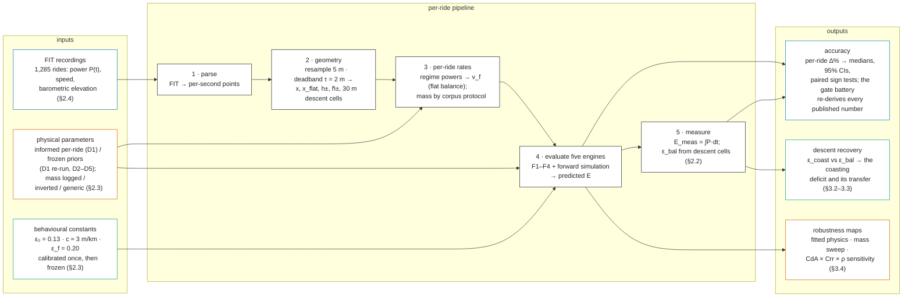
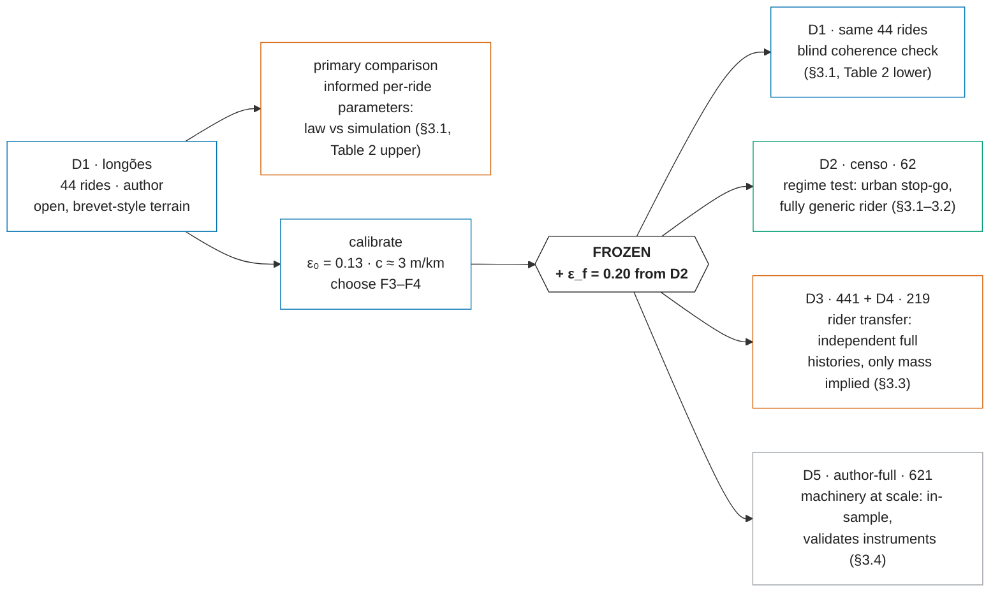

<!-- DRAFT v2 — IMRAD paper, revised after the six-lens adversarial review
     (2026-07-27) and the author's preliminary feedback. Single-language draft
     for review; the pt-BR mirror is produced only after this shape is approved
     (from then on the lockstep rule applies). Sources of truth:
     research/journal/MODEL_COMPARISON_JOURNAL.md (numbers), journal.qmd
     (reproduction map). All values are the current, re-baselined ones
     (G = 9.7864), verified against src/harness/bootstrap_ci.py and the
     harness CSVs. Math in LaTeX ($...$); render target is pandoc/KaTeX. Figures 3-4 are
     mermaid blocks: the publish pipeline must render them (mermaid.js via
     CDN+SRI in the /modelo/ template, or pre-render at build); GitHub
     renders them natively. -->

# A Closed-Form Model for the Mechanical Energy of Cycling a Route, Tested on 1,285 Power-Meter Rides

**Danilo Lessa Bernardineli** — Dynamical Systems Group; Pedal Hidrográfico, São Paulo

## Abstract

**Background.** The energy of cycling a route has three parts: a cost per kilometre of distance, a cost per metre climbed, and a partial refund per metre descended. Yet the quantity is hard to obtain: route planners optimise time, and the research prototypes that cost energy leave route-level accuracy unpublished; the tools that estimate it are simulation-based, with route-level accuracy unpublished; the physics literature validates instantaneous power or speed, never the route-level integral. A closed form simple enough for pen and paper — or a million edge evaluations per second in a router — would unlock it, if it can be trusted.

**Methods.** We test four models built on one three-term closed form, $E \approx \alpha\,x + \beta\,(h_+ - \varepsilon\,h_-)$ — flat cost rate $\alpha$, climbing rate $\beta$, refunded fraction $\varepsilon$ of the descent $h_-$ — against the power-meter energy $\int P\,dt$ of 1,285 unique rides (1,387 evaluations; five overlapping corpora, three São Paulo-based riders; the urban corpus re-evaluates the author's recordings as a generic rider). The reference is a forward-dynamics simulation [Martin et al. 1998] run on the same constants per ride, so gaps are modelling error; each ride's measured power feeds both engines, so accuracy means consistency of the energy accounting, not blind prediction. The calibration corpus uses condition-informed per-ride parameters (logged mass; judged $C_{rr}$, $C_dA$, air density, wind, $\varepsilon$) and is re-run blind as a check; every other corpus is blind under one shared literature-typical set, with mass the only per-rider input. All behavioural constants are calibrated once and frozen.

**Results.** With informed parameters the four models err by 3.5% [95% CI 2.0, 5.6] (F3, elevation smoothed), 5.9% [3.6, 8.3] (F4, elevation corrected), 8.6% [7.2, 11.0] (F2, split) and 19.1% [17.3, 21.5] (F1, original) median; the simulation errs by 5.2% [3.8, 7.3]. Two corrections carry the gain: not charging climb aerodynamics at the flat reference speed, and not counting sub-metre elevation noise as climbing. The best form shows no detectable difference from the simulation ($p = 0.65$, $n = 44$). Blind, the corrected forms cluster at 7.6–8.2% versus the simulation's 8.4% (F3 vs simulation $p = 1.00$): parity is protocol-independent; the ≈ 3–5-point shift prices condition knowledge, in-sample. For the descent term we derive the coasting limit $\varepsilon_{\mathrm{coast}}(s) = \min(1, (\alpha/\beta)/s)$ and calibrate the **coasting deficit** — the refund share riders never collect — at $\varepsilon_0 = 0.13$ *under the shared priors and sampling scale*. Frozen, the law pools to **5.6% [5.2, 6.2] over the independent riders' 660 rides** against the simulation's 6.3% [5.8, 6.8]; adding the author's in-sample history (n = 1,281) gives 5.9% vs 6.2%, with 3.5–6.2% per corpus there and 6.4–7.7% on the urban regime test. The deficit recurs on every rider (gaps 0.12–0.19 across physics choices).

**Conclusions.** The proposed F3, $E = \alpha_r\,x + \alpha_a\,x_{\mathrm{flat}} + \beta\,(\tilde h_+ - \varepsilon\,\tilde h_-)$ — air resistance only off the climbs, smoothed totals $\tilde h_\pm$ — matches the simulation under both protocols (pooled over the independent riders: 5.6% vs 6.3%); F4, its totals-only approximation (subtract $c \approx 3$ m of phantom climb per kilometre), performs nearly as well and is computable by hand from distance, ascent, descent and a rough climbing share.

Descent recovery has a geometry (the coasting limit) and a habit (the deficit): the deficit transfers across riders, while the dynamic term's edge over a flat constant is rider- and parameter-dependent — flat $\varepsilon \approx 0.20$ suffices in urban riding. Under fully automatic per-ride physics — constants inverted from each ride's own recording, deficit frozen — the pooled error falls to 3.9% [3.6, 4.1]. The law is cheap enough to serve as a per-edge routing cost at the sampling scale it was calibrated on.

**Keywords:** cycling energetics, active transportation, route planning, energy-optimal routing, power meter data, elevation gain estimation, digital elevation models, closed-form approximation, forward-dynamics simulation, open science

## Contributions

1. **A hand-computable route-energy law.** The three-term form $E = \alpha_r\,x + \alpha_a\,x_{\mathrm{flat}} + \beta\,(\tilde h_+ - \varepsilon\,\tilde h_-)$ and its totals-only approximation (F4), derived from the route-energy integral ([Appendix A](#appendix-a)) and validated against a forward simulation and 1,285 measured rides from three riders ([§3](#3.1)).
2. **Two failure modes of the naive closed form, identified, attributed and cheaply fixed**: climb aerodynamics charged at the flat reference speed, and sub-metre elevation noise (plus momentum-paid micro-relief) counted as climbing — with independent attribution checks for each ([§3.1](#3.1)).
3. **A parameter-free descent-recovery geometry**: the coasting limit $\varepsilon_{\mathrm{coast}}(s) = \min(1, (\alpha/\beta)/s)$, derived, with the deficit's exact ledger identity $\delta = E_{\mathrm{legs},-}/(\beta h_-)$ ([Appendix A](#appendix-a)).
4. **The coasting deficit $\varepsilon_0 \approx 0.13$** — a portable behavioural constant recurring across three riders (measured gaps 0.12–0.14), its mechanism identified — pedalling *occupancy* fades with grade, *intensity* is the rider-level carrier (no ride-level estimator upgrade survives out-of-sample) — and its conditionality mapped: the value travels with $\rho C_dA$ and the sampling scale ([§3.2](#3.2)–[§3.5](#3.5), [§4.4](#4.4)).
5. **A regime rule for the descent term** — dynamic $\varepsilon_d$ on open terrain, flat $\varepsilon_f$ in stop-go — together with its scope condition: only the (cost, refund) *pair* is identified by ride energies, so the rule holds per physics protocol and inverts if the law is re-paired without re-calibration ([§3.5](#3.5), [§4.3](#4.3)).
6. **A frozen-constants transfer methodology with a dual calibration protocol**: constants calibrated once and carried blind to independent riders and to 14× scale; an informed-vs-blind pair of calibration runs that prices per-ride condition knowledge; every published number re-derived by a gate battery, with per-entry research packages ([§2.3](#2.3)).
7. **Fully automatic per-ride physics**: a segment-based mass inversion validated against logged and known masses, and a regime-consistent aero estimator that restores the law's honest pairing with no human judgment — pooled 3.9% [3.6, 4.1] over 1,296 rides with the behavioural constants still frozen (physics read per ride from its own recording, so partially in-sample per ride; [§3.5](#3.5), [Tables 5](#tab5)–[6](#tab6)).
8. **Sensitivity maps for the shared constants**: the exact $\rho \cdot C_dA$ degeneracy, the robustness of the mass inversion, and the engine-lockstep result explaining why paired model conclusions survive parameter uncertainty that absolute errors do not ([§3.4](#3.4)).
9. **A physical reading of the smoothing scale**: rider momentum as a travel-limited suspension ($h_{KE} = v^2/2g$; dissipation length $\lambda = m/\rho C_dA$, exact and $C_{rr}$-free), first evidence for a speed-dependent deadband, and measured bounds showing direct momentum recycling is energetically minor at ride grain ([§4.4](#4.4)).

## Terminology

Symbols used throughout; grades are percent in the text, fractions in formulas; "—" in the unit column marks dimensionless quantities; corpus labels D1–D5 are defined in [Table 1](#tab1). Display equations are numbered (1)–(7) in the main text and (A1)–(A9) in the appendix; the four model forms are named and tagged F1–F4.

Notation rule — aggregation scopes: a physical parameter or measurement carries its scope as a subscript — $_t$ instant, $_i$ local (30 m cell), $_r$ ride, $_p$ person, $_c$ corpus. On variables the scope sits in the subscript ($s_i$, $h_{-,i}$); on functions it enters through the argument ($\varepsilon_{\mathrm{coast}}(s_i)$). E.g. $C_{dA,r}$ is one ride's aero, $C_{dA,p}$ one person's fitted aero. A **bare parameter symbol is a frozen constant** (the value column below). Two declared exemptions: letter subscripts that are *names*, not scopes ($\alpha_r$ rolling, $\alpha_a$ aero, $v_f$ flat, $\varepsilon_d$/$\varepsilon_f$ variants, $k_{\mathrm{eff}}$); and the geometry and energy symbols ($E$, $x$, $h_\pm$, …), which are ride-level by definition, with their scope stated in the table. The four physical constants below carry their frozen-protocol values; the informed calibration run judged them per ride ([§2.3](#2.3)). The *value* column gives the constant used, or the variable's scope: **person**, **ride**, **local** (along the route), **instant** (per second).

| symbol | unit | value | name | meaning |
|---|---|---|---|---|
| $E$ | J | ride | route mechanical energy | Pedal energy over the route; ground truth is the power-meter integral $\int P\,dt$. |
| $x$ | m | ride | route distance | Ground distance. |
| $h_+$, $h_-$ | m | ride | total ascent, descent | Summed climbing / dropping, raw profile; deadband-smoothed totals are $\tilde h_+$, $\tilde h_-$ ([§1.2](#1.2)). |
| $x_+$, $x_-$, $x_{\mathrm{flat}}$ | m | ride | climbing, descending, non-climbing distance | Distance on grades ≥ 2%, descending distance, and $x - x_+$; aero is charged only on $x_{\mathrm{flat}}$. |
| $s$ | — | local | grade (slope) | Rise over run (2% in text ≡ 0.02 in formulas); negative on descents in the regime definitions, magnitude in descent formulas ($\bar s = h_-/x_-$). |
| $m$ | kg | person | total system mass | Person + bicycle + gear; logged per ride on D1 ($m_r$), the generic constant 78 kg on D2, or inverted per person from climbing data on D3–D5 ($\hat m_p$) ([§2.3](#2.3)). |
| $g$ | m/s² | 9.7864 | local gravity | São Paulo's measured value (IAG-USP). |
| $C_{rr}$ | — | 0.008 | rolling-resistance coefficient | Rolling drag as a fraction of weight. |
| $C_dA$ | m² | 0.40 | drag area | Frontal area × drag coefficient. |
| $\rho$ | kg/m³ | 1.13 | air density | At São Paulo's altitude. |
| $k_{\mathrm{eff}}$ | — | 0.98 | drivetrain efficiency | Fraction of leg power reaching the wheel. |
| $w$ | m/s | 0 | headwind | Zero in every frozen run; the informed D1 run judged it per ride. |
| $v_f$ | m/s | ride | flat reference speed | Flat cruising speed, derived per ride from its own flat-regime power ([§2.1](#2.1)); sets the aero charge, anchors the two models. |
| $P$ | W | instant | pedal power | Measured per second by the power meter. |
| $\alpha_r$, $\alpha_a$ | J/m | person, ride | rolling, aero cost rates | Energy per metre for rolling, and for air at the relative speed $v_f + w$ (so $\alpha_a$ inherits $v_f$'s per-ride scope); $\alpha = \alpha_r + \alpha_a$. |
| $\beta$ | J/m | person | climbing cost rate | Energy per metre climbed: $mg/k_{\mathrm{eff}}$. |
| $s_*$; $s_+$, $s_-$ | — | person | flat-resistance grade; gravity-dominated regimes | Break-even slope $s_* = \alpha/\beta$ (≈ 1.6–2%); beyond it gravity dominates — ascents $s_+$ collapse speed, descents $s_-$ shed the surplus gravitational power to over-speed drag or braking. |
| $s_=$ | — | — | flat band | $\lvert s\rvert < s_*$: resistance dominates, aero at $v_f$ is fair, descents refund fully; the 2% gate approximates its edge. |
| $\varepsilon$ | — | ride | descent-recovery factor | Fraction of descent potential energy refunded; measured values can be negative (Appendix A). |
| $\varepsilon_d$ | — | ride | dynamic $\varepsilon$ | $\varepsilon_{\mathrm{coast}} - \varepsilon_0$ (unclamped; positive on every ride measured) — adapts to descent geometry ([§1.3](#1.3)). |
| $\varepsilon_f$ | — | 0.20 | flat $\varepsilon$ | One constant for every route; selected on D2, frozen. |
| $\varepsilon_{\mathrm{coast}}$ | — | ride | coasting-limit recovery | Geometry-only ideal $\min(1, s_*/s)$, drop-weighted; needs no power data. |
| $\varepsilon_{\mathrm{bal}}$ | — | ride | measured descent balance | What a ride actually recovered: one ride-level quotient over its descent cells (30 m grid), from its own power stream ([§2.2](#2.2)). |
| $\varepsilon_0$ | — | 0.13 | coasting deficit | Gap between ideal and measured recovery; 0.13 at the shared priors and 30 m scale (0.10–0.19 across plausible physics and pairings, [§3.4](#3.4)–[§3.5](#3.5)); recurrence robust, value conditional. |
| $c$ | m/km | ≈ 3 | ascent-noise rate | Phantom climb per route-km, subtracted from raw totals; measured ([§2.4](#2.4)), frozen. |
| $\tau$ | m | 2 | deadband threshold | Elevation changes below $\tau$ are ignored when summing $h_\pm$. |
| $\Delta\%$ | % | ride | per-ride signed error | $(E_{\mathrm{model}} - E_{\mathrm{meas}})/E_{\mathrm{meas}}$; corpora summarized by medians of $\Delta\%$, $\lvert\Delta\%\rvert$. |

## 1. Introduction

### 1.1 An absent quantity

How much energy does it take to cycle a route? The question is basic — it determines how far a commuter can ride, how a collective plans a group ride through hilly terrain, whether a cargo-bike delivery round is feasible — and yet a trustworthy answer is hard to come by. Production bicycle routers cost *time*, with heuristic hill penalties; research prototypes have costed energy per edge [Shirabe 2008; Hrnčíř et al. 2017; Cakir et al. 2026], but their route-level accuracy against measured power is unpublished (our own experimental deployment, [§4.1](#4.1), is the exception that motivated this study).

The tools that do estimate ride energy are simulation-based pacing planners or platforms' post-hoc estimates: opaque to their users and, to our knowledge, never validated against measured route-level power in the open literature. The sports-science literature validates the *instantaneous* power balance to high precision [Martin et al. 1998; Dahmen et al. 2011] but not the route-level energy integral; route-choice models absorb elevation into fitted coefficients with no physical form [Scarf & Grehan 2005]. Energy is not so much absent from the toolbox as locked inside simulations — out of reach of a router that must cost thousands of edges, and of a rider with pen and paper.

Two audiences would use it if it were computable, and they impose opposite constraints. A routing engine must evaluate thousands of candidate edges, which rules out forward simulation and demands a closed form. A rider — or anyone teaching riders — needs something even stricter: a formula that works with pen and paper, from the three numbers any map already gives (distance, total ascent, total descent). Both constraints point to the same object, and Occam points there too: the simplest law that survives contact with measured data is the one worth deploying.

### 1.2 The proposed law

#### 1.2.1 The three-term shape

We propose an approximation that decomposes the mechanical work of a ride into three terms: (1) a cost per metre of horizontal distance — rolling and aerodynamic resistance — expressed by the rate $\alpha$; (2) a cost per metre of ascent — a gravitational *deposit* — expressed by the rate $\beta$; and (3) a partial *refund* per metre of descent — the deposit withdrawn back as forward progress — expressed by the recovery factor $\varepsilon$. Terms 1 and 2 are widely known: together they are the textbook steady-speed energy integral, resting on physics validated since the equation-of-motion experiments [di Prampero et al. 1979; Martin et al. 1998]. Term 3 is novel. It has been touched only obliquely in nearby literatures — as a per-grade coasting idle limit in a speed-choice model [Bigazzi & Lindsey 2019], and as per-instant regeneration efficiencies or symmetric potential terms in electric-vehicle energy models — but never as a route-level, closed-form recovery factor; [§1.3](#1.3) develops it and [§4.2](#4.2) maps the prior art. The three terms give the shape every form in this study shares, eq. (1),

$$E \;\approx\; \alpha\,x \;+\; \beta\,(h_+ - \varepsilon\,h_-), \tag{1}
$$

with one flat cost rate $\alpha = \alpha_r + \alpha_a$, one climbing rate $\beta$ and one recovery factor $\varepsilon$, whose rates eq. (2) fixes:

$$\alpha_r = \frac{C_{rr}\,m g}{k_{\mathrm{eff}}}, \qquad \alpha_a = \frac{\tfrac{1}{2}\rho\,C_dA\,(v_f + w)^2}{k_{\mathrm{eff}}}, \qquad \beta = \frac{m g}{k_{\mathrm{eff}}}, \tag{2}
$$

with $w$ the headwind, zero throughout the frozen protocol (so $\alpha_a$ reduces to the $v_f^2$ form there) and judged per ride in the informed calibration run ([§2.3](#2.3)).

#### 1.2.2 The four forms

We evaluate four forms of this family. They are not independent alternatives but a causal chain of refinements, each step addressing the previous form's main limitation: F1, the shared shape as-is, led to F2 (splitting the flat rate), which led to F3 (smoothing the elevation), which led to F4 (approximating the smoothing when only totals are available). Writing $\tilde h_\pm$ for the deadband-smoothed elevation totals:

1. **original** — air resistance at the flat reference speed over the whole distance; raw elevation totals:
   $$E_1 \;\approx\; \alpha\,x \;+\; \beta\,(h_+ - \varepsilon\,h_-); \tag{F1}
$$
2. **split** — the aero part gated off climbs, rolling still paid everywhere:
   $$E_2 \;\approx\; \alpha_r\,x \;+\; \alpha_a\,x_{\mathrm{flat}} \;+\; \beta\,(h_+ - \varepsilon\,h_-); \tag{F2}
$$
3. **split + elevation smoothed** — the elevation profile deadband-filtered point by point before summing, so $\tilde h_\pm$ are noise-free (the form we propose):
   $$E_3 \;\approx\; \alpha_r\,x \;+\; \alpha_a\,x_{\mathrm{flat}} \;+\; \beta\,(\tilde h_+ - \varepsilon\,\tilde h_-); \tag{F3}
$$
4. **split + elevation correction** — F3, with the smoothed totals approximated from the raw ones, for when only $x$, $h_+$ and $h_-$ are known:
   $$E_4 \;\approx\; \alpha_r\,x \;+\; \alpha_a\,x_{\mathrm{flat}} \;+\; \beta\,(\tilde h_+ - \varepsilon\,\tilde h_-), \qquad \tilde h_\pm \approx h_\pm - c\,x. \tag{F4}
$$

All four forms are derived from the route-energy integral in [Appendix A](#appendix-a), and all four are scored against measured energy in [§3.1](#3.1) ([Table 2](#tab2)). All symbols and their plain-word meanings are collected in [Terminology](#terminology); [Figure 1](#fig1) maps each term of the proposed form onto a route profile; the filter threshold $\tau$ and the noise rate $c$ are specified below.

). The deadband filter addresses both — measurement hygiene and, in part, a kinetic-energy accountability mechanism.](figs/fig9-anatomy.svg)

#### 1.2.3 The two corrections

The family's physical ingredients are well validated, but only below the route scale: the underlying power balance against steady-velocity trials on flat ground [Martin et al. 1998], and simulators built on it against speed on real tracks [Dahmen et al. 2011] — never against the route-level energy integral. Two systematic errors that only exist at that integral scale — one born when the closed form lumps aero into a single reference speed, one born when noisy elevation steps are summed into $h_+$ — therefore had no occasion to be noticed, let alone corrected. We propose two corrections; both are calibrated on a single corpus and then frozen ([§2.3](#2.3)).

- **Climb-aero split.** The original form bills air resistance at $v_f$ over the whole distance, but on ascent-dominated grades ($s_+$) speed falls far below $v_f$, so it over-charges every climb. The correction charges aero only over the non-climbing distance $x_{\mathrm{flat}} = x - x_+$; the frozen 2% gate defining $x_+$ is a rounded, rider-generic stand-in for the flat-resistance grade $s_*$.
- **Elevation deadband.** Recorded and DEM (digital elevation model — terrain heights from mapping data) elevation profiles carry sub-metre noise whose positive half-steps all count toward $h_+$ — a measurement artifact, not lifting work [Rapaport 2011]. F3 removes it with a backlash (deadband) filter of threshold $\tau = 2\,\mathrm{m}$, which leaves sustained climbs intact. F4 approximates the smoothed totals from raw ones, $\tilde h_\pm \approx h_\pm - c\,x$, achieving the same on totals alone: **subtract about 3 m of phantom climbing per kilometre of route** ($c = 0.003$ with $x$ and $h_\pm$ in metres). The rate is measured on the calibration corpus — methodology in [§2.4](#2.4), evidence in [§3.1](#3.1). Example: a 50 km ride whose raw profile reports 600 m of ascent is corrected to $600 - 3 \times 50 = 450$ m.

### 1.3 The descent term: a coasting limit and a coasting deficit

#### 1.3.1 The coasting limit

The refund is the term prior knowledge leaves least determined — and the one with the most to offer, because it turns a difficult phenomenon (what a rider actually does downhill) into something measurable and transferable. The question it answers: when a route descends $h_-$ metres, how much of the potential energy $m g h_-$ returns as forward progress rather than being lost to over-speed drag and braking? No model we located answers it at route level in closed form ([§4.2](#4.2) maps the nearby literatures).

We derive one, eq. (3), in [Appendix A](#appendix-a) as the exact upper bound of recovery — the coasting limit (no pedalling), since the legs can never return energy: a descent of grade $s$ recovers the fraction of its potential energy not consumed by rolling and flat-reference air resistance,

$$\varepsilon_{\mathrm{coast}}(s) = \min\!\left(1,\ \frac{\alpha/\beta}{s}\right). \tag{3}
$$

This is the descent-side mirror of the climb gate: within the flat band ($s_=$) every joule of drop offsets resistance one-for-one and the refund is total; on descent-dominated grades ($s_-$) the surplus must be dumped to over-speed drag or brakes, so the recoverable fraction decays as $1/s$ ([Figure 2](#fig2)). The same idle limit appears, per grade, in Bigazzi & Lindsey's utility-based speed-choice model [Bigazzi & Lindsey 2019]; here it is lifted to a route level — aggregating drop-weighted over a route's descent profile gives a geometry-only estimate $\varepsilon_{\mathrm{coast}}$ that needs no power data.

#### 1.3.2 The coasting deficit and the dynamic estimator

Real riders do not ride the coasting limit: they pedal into descents, so their measured recovery sits below the bound by construction. (Braking, counter-intuitively, cancels out of the measured balance — it dissipates gravity's share of the ledger, never the legs' — so the shortfall is carried by descent pedalling, with braking acting only indirectly through the re-pedalling it forces; [Appendix A](#appendix-a).) Our hypothesis is that this shortfall is a constant offset — the **coasting deficit** $\varepsilon_0$ — so that the working estimator is

$$\varepsilon_d(s_i) \;=\; \varepsilon_{\mathrm{coast}}(s_i) - \varepsilon_0 \tag{4}
$$

$$\varepsilon_d \;=\; \frac{\sum_i h_{-,i}\,\varepsilon_d(s_i)}{\sum_i h_{-,i}} \tag{5}
$$

Eq. (4) is the per-segment statement — the recovery a descent cell of grade $s_i$ should show; eq. (5) drop-weights it over the route's 30 m descent cells (drops $h_{-,i}$) into **one scalar per route**, the $\varepsilon_d$ every table scores. Since $\varepsilon_0$ is constant, eq. (5) equals the route's drop-weighted $\varepsilon_{\mathrm{coast}}$ minus $\varepsilon_0$. The constant $\varepsilon_0$ is calibrated once against power-measured descent balances ([§2.2](#2.2), [§3.2](#3.2)) and then frozen.

The deficit is not a free-floating correction. [Appendix A](#appendix-a) gives its exact ledger identity, $\delta = E_{\mathrm{legs},-}/(\beta h_-)$ — **the deficit *is* the descent pedal energy, over the scaled drop** — which as a ratio of two powers reads $\delta = k_{\mathrm{eff}}\bar P_{\mathrm{desc}}/(m g \bar s \bar v)$: what the legs add over what gravity releases. At 80 kg on a 5% descent at 36 km/h gravity supplies ≈ 390 W, so $\varepsilon_0 = 0.13$ is ≈ 50 W of pedalling. That identity factors the deficit into a **magnitude** and a **probability**, $\bar P_{\mathrm{desc}} = \mathrm{occ}(s)\,I(s)$, and the two are not symmetric: magnitude is nearly pinned — riders who pedal a descent do so at essentially their own flat power — while occupancy spans ninefold between riders and falls steeply with grade. Descent pedalling is close to binary: coast, or ride normally. **Holding $\varepsilon_0$ constant is therefore a hypothesis about occupancy, not about effort**, and the identity's $1/s$ suggests a competitor — a deficit scaling inversely with descent grade. Both are carried to [§2.2](#2.2) and scored in [§3.2](#3.2).

We call this estimator the **dynamic $\varepsilon$**, written $\varepsilon_d$ — it adapts to each route's descent geometry — in contrast to a **flat $\varepsilon$**, written $\varepsilon_f$: a single constant for every route, the alternative it is scored against throughout. The estimator is deliberately *unclamped*: it lives in $[-\varepsilon_0,\, 1-\varepsilon_0]$ by construction ($0 \leq \varepsilon_{\mathrm{coast}} \leq 1$), and a negative prediction — possible only on mean descent grades beyond $s_*/\varepsilon_0 \approx 15\%$, steeper than anything in the corpora — is not unphysical either, since measured recovery *can* go negative (a rider who pedals a descent harder than the flat bill). On the 1,300-odd rides where the estimator is defined it never left $(0, 1)$; [Appendix A](#appendix-a) states the exact bounds, and a grade-resolved refinement that *fades* the deficit on steep grades was tested and resolved in [§4.4](#4.4): the fade is the confirmed mechanism at segment grain, and the constant is its correct ride-level summary. What the deficit *is* — geometry or habit — and whether it transfers across riders are empirical questions, answered in [§3.2](#3.2)–[§3.3](#3.3).

### 1.4 Aim, hypotheses, and scope

**The aim of this study** is to test whether the closed form above accounts for the measured mechanical energy of real rides as well as a full simulation does. Three hypotheses, each tested against measured power:

1. **Attribution.** The closed form's error is not diffuse: the two corrected mechanisms — the climb-aero over-charge and ascent noise — account for almost all of it, and the corrected law reaches statistical parity with the forward simulation it approximates ([§3.1](#3.1)).
2. **Calibration.** On genuine descents (mean descent grade ≥ 3%), the gap between the coasting ideal and riders' measured descent balances is a single constant, not a function of the route ([§3.2](#3.2)).
3. **Transfer.** Calibrated on one rider and frozen, the energy law and the coasting deficit carry to independent riders' complete histories; whether the dynamic estimator's ($\varepsilon_d$) extra accuracy over a single flat constant also carries is part of the test ([§3.3](#3.3)).

One scope statement applies throughout: each ride is evaluated with its own measured power inputs, and mass is the one per-rider input — logged on the calibration corpus, implied from each independent rider's own climbing data, generic on the urban corpus ([§2.3](#2.3)). Our accuracy figures therefore measure the **consistency of the energy accounting** — whether the law maps a route's geometry and a rider's effort onto the measured energy — not blind route prediction, which would additionally require predicting the rider's power.

## 2. Methods

[Figure 3](#fig3) maps the whole study in one view — the inputs, the per-ride pipeline, and the outputs; the subsections detail each stage, and [Figure 4](#fig4) (in [§2.3](#2.3)) shows how the corpora relate.

**Figure 3.** The study pipeline: inputs, the per-ride pipeline, and outputs. Every arrow is one deterministic harness step; all outputs regenerate from the inputs with one command per corpus.

### 2.1 The reference simulation and the shared-constants design

The reference is given by eq. (6) — a distance-marching forward integration of the standard cycling power balance [Martin et al. 1998; di Prampero et al. 1979]:

$$m\,v\,\frac{dv}{dx'} = \frac{k_{\mathrm{eff}}\,P}{v} - C_{rr}\,m g \cos\theta - \tfrac{1}{2}\rho\,C_dA\,(v + w)^2 - m g \sin\theta, \tag{6}
$$

with pedal power $P$ per grade regime extracted from each ride's own power stream, signed relative wind $w$, and a safe-speed brake cap on descents. The integrator uses a semi-implicit kinetic-energy update that conserves energy to machine precision (the identity $k_{\mathrm{eff}} E_{\mathrm{legs}} = \Delta KE + W_{rr} + W_{\mathrm{aero}} + W_{\mathrm{grav}} + W_{\mathrm{brake}}$ is asserted per ride to $\leq 10^{-6}$ relative).

The design principle that makes the comparison meaningful: **both models read the same physical constants** — mass, $C_{rr}$, $C_dA$, $\rho$, $k_{\mathrm{eff}}$, and the headwind $w$ (held at zero throughout the frozen protocol) — per ride. The flat reference speed is likewise shared and derived per ride: the flat-regime pedal power is extracted from the ride's own power stream (speed-gated, time-weighted), and $v_f$ is the speed at which the flat power balance closes — so on flat ground the two models agree by construction, and every gap between them is modelling error, not a parameter mismatch. Gravity is São Paulo's measured local value ([Terminology](#terminology)); the corpora are overwhelmingly São Paulo rides, and the handful of away rides retained (other Brazilian states, a few European tours) shift $g$ — hence $\beta$ — by under 0.3%, well inside every published band.

### 2.2 Measuring descent recovery

To measure what a rider actually recovers on descents — the quantity the [§1.3](#1.3) hypothesis is calibrated against — we solve the descent energy balance for each ride ([Appendix A](#appendix-a) derives this quantity and its bounds):

$$\varepsilon_{\mathrm{bal}} = \frac{\alpha\,x_- - E_{\mathrm{legs},-}}{\beta\,h_-}, \tag{7}
$$

where, in eq. (7), $x_-$ is the route's descending distance (the descent-side sibling of $x_+$), $E_{\mathrm{legs},-}$ is the pedal energy $\int P\,dt$ spent while descending, and the balance is a single ride-level aggregate over descent cells identified on a 30 m grid, with $\alpha$ computed at each ride's *measured* flat speed (deliberately — using the model's reference speed here would let a parameter mismatch masquerade as recovery). This inversion of an energy identity to expose a hidden quantity follows the logic of Chung's virtual-elevation method [Chung 2012]. The coasting deficit is then the measured offset $\varepsilon_{\mathrm{coast}} - \varepsilon_{\mathrm{bal}}$, calibrated on one corpus and tested for constancy and transfer in [§3.2](#3.2)–[§3.3](#3.3).

**Forms of the deficit, and how they are contested.** Because [§1.3.2](#1.3)'s identity makes $\delta$ a ratio of powers, "$\varepsilon_0$ is a constant" is one candidate among several, and we score it against the alternatives rather than assuming it. Four are carried forward: the **frozen constant** $\delta = \varepsilon_0$; a **rider constant**, one number per rider; a **grade-inverse** form $\delta = k/\bar s$, taking the $1/s$ of the identity to the ride's drop-weighted mean descent grade $\bar s$; and an **encounter fraction** $\delta = a + b\varphi$, where $\varphi$ is the share of a ride's drop falling below the rider's own half-pedalling grade. The forms differ sharply in cost: the grade-inverse needs one route statistic and one universal constant, while the encounter fraction needs a fitted threshold per rider.

The contest is decided **out of sample**, not by fit. Each rider's history is split by chronological ride index into a fitting half and a scoring half; every constant, coefficient and per-rider quantity is estimated on the fitting half alone, and forms are ranked by median $|\delta_{\mathrm{pred}} - \delta_{\mathrm{meas}}|$ on the scoring half, with a paired sign test against the best single constant. Held-out scoring is what makes the comparison fair across forms with different parameter counts: an estimator that buys fit with parameters loses it again on rides it has not seen. Information criteria are reported as corroboration only — where BIC and the held-out score disagree, we follow the held-out score (lab journal, Entry 45).

### 2.3 Data, ground truth, and evaluation protocol

#### 2.3.1 Datasets and roles

**Datasets.** Five corpora — 1,285 unique rides, 1,387 ride-evaluations (D1 ⊂ D5, and 58 of D2's 62 rides are the author's recordings also in D5, re-evaluated as a generic rider) — ridden overwhelmingly in and around São Paulo (a few away rides retained; [§2.1](#2.1)), all with per-second power meters ([Table 1](#tab1); [Figure 5](#fig5) draws every analysed route on one map).

**Table 1.** The five corpora and their roles.

| corpus | rides (clean) | character | role |
|---|--:|---|---|
| D1 longões | 44 | long brevet-style rides, open terrain (author) | calibration + primary comparison |
| D2 censo | 62 | urban stop-go group rides, generic rider assumed | out-of-domain regime test |
| D3 P. Paz | 441 | independent rider's full history, fast open-road | frozen-constant transfer |
| D4 JAAM | 219 | independent rider's full history, gentle terrain, strong descent-pedaller | frozen-constant transfer |
| D5 author-full | 621 | author's complete history (superset of D1) | large-sample in-sample validation |

The roles, precisely:

- **calibration** — the corpus where nearly everything tunable is tuned: $\varepsilon_0$, $c$ and the correction variants are fixed here, once ($\varepsilon_f$ is the exception, selected on D2), and frozen thereafter;
- **primary comparison** — the closed-form-vs-simulation contest of [§3.1](#3.1); because it shares the calibration corpus, it can support only parity-where-derived — which is what the next three roles exist to extend;
- **out-of-domain regime test** — the riding context changes (urban stop-go, fully generic assumed rider) while every constant stays frozen: does the law break when the *style of riding* changes?
- **frozen-constant transfer** — the *rider* changes: two independent full histories, constants frozen, only mass data-implied. The strongest out-of-sample evidence here: did calibration capture cycling, or just the calibration rider?
- **large-sample in-sample validation** — deliberately *not* independent (the calibration rider's complete history): it validates the machinery at scale — mass inversion against a known weight, the filters, the parser — not the law.

The design in one line: **fit → contest → change the regime → change the rider → stress the machinery**, each step removing one alternative explanation for the previous step's success ([Figure 4](#fig4)).

**Figure 4.** The study design: $\varepsilon_0$, $c$ and the form choice are calibrated on D1 ($\varepsilon_f$ is selected on D2) and all are frozen; the frozen model is then carried to a different riding regime, two different riders, and the calibration rider's full history at scale, and back to the same 44 rides as the blind coherence check (the informed-parameter primary comparison of Table 2's upper block sits *outside* the frozen chain). Throughout, each ride's own measured power and the shared constants feed both engines, scored as $\Delta\%$ against the measured $\int P\,dt$.

's clean corpora in both directions — rides the analysis excluded may be drawn, and analysed rides without enough usable GPS after the trim are not.](figs/fig12-routes-map.png)

#### 2.3.2 Ground truth and inclusion

Ground truth is the raw $\int P\,dt$ per ride, coasting zeros included. Inclusion filters, applied identically everywhere:

- sport = cycling; virtual rides excluded via the FIT manufacturer field;
- power coverage > 50% of samples; altitude coverage ≥ 99%;
- distance ≥ 20 km (D1 and D3–D5; the censo corpus is the collective's curated census roster, which includes three shorter rides);
- a physical floor: $E_{\mathrm{legs}} \geq m g\,\tilde h_+/k_{\mathrm{eff}}$ — a measured energy below the climbing potential energy means the route was not fully pedalled (power dropouts, walking) — with a cadence-based cross-check for walked segments.

The independent riders' exports were shared with consent and are never published; all analysis code and output schemas are public.

#### 2.3.3 The parameter protocols

**The two parameter protocols.** The calibration corpus is evaluated with *condition-informed per-ride parameters* — literature-anchored values adjusted by the author's judgment of each ride's conditions. Six of the seven fields vary per ride: the *logged* system mass 71–80 kg (loadout — a record, not a guess, and identical in the blind re-run), plus five judged fields — $C_{rr,r}$ 0.004–0.020 (surface), $C_{dA,r}$ 0.32–0.40 (setup), air density $\rho_r$ 1.01–1.22 kg/m³ (weather and altitude), signed head/tailwind $w_r$ −7 to +5 km/h, and the recovery $\varepsilon_r$ 0.10–0.60 (hand-chosen); only $k_{\mathrm{eff}} = 0.98$ is fixed. The judged five are best guesses, not measurements, but better-informed than any single shared set ([§4.3](#4.3) owns this choice; [§3.1](#3.1) re-runs D1 blind as the coherence check). Every other corpus is evaluated *blind* under the frozen literature-typical set of [Terminology](#terminology), wind zero. 

**Mass.** Mass is the one per-rider input everywhere. On D1 it is *known* — the ride log records each brevet's system mass, used unchanged in both runs. Which corpora get an *inverted* mass follows from the roles above: the transfer corpora (D3–D4), where mass is genuinely unknown — and D5, where the author is deliberately processed as if he were an unknown rider, so the machinery's output can be graded against his known weight. For these, total mass is inverted from the corpus's own sustained-climb (≥ 3% over ≥ 100 m) energy balances, $\hat m_p = m_0\,(E_{\mathrm{meas}} - E_{\mathrm{aero}})/(E_{\mathrm{grav}} + E_{\mathrm{roll}})$, taken as the per-ride median over rides with ≥ 200 m of sustained climbing. Here $m_0$ is the generic prior mass (78 kg) whose gravity and rolling energies scale linearly with mass, and $E_{\mathrm{aero}}$ is charged at each climb segment's *measured* speed — not the model's $v_f$ — so the inversion is independent of the reference-speed machinery.

This yields 74.5 kg [IQR (interquartile range) 69.1–78.4] for D3, 101.9 kg [95.9–109.0] for D4, and 74.7 kg [67.7–81.0] for D5 — validated against the author's known ≈ 73 kg ([§3.4](#3.4), [§3.5](#3.5)). Note $\hat m_p\,g$ is invariant under a change of gravity constant by construction. One scope note: the inversion needs sustained climbs to exist — a history ridden in genuinely flat geography leaves no qualifying rides and falls back to the generic 78 kg prior, so the machinery's per-rider input degrades gracefully but does degrade there.

**Why priors, not fits.** All other constants take the literature-typical values listed in [Terminology](#terminology) — mid-range published field values for an upright rider on typical asphalt. They are deliberately *not* fitted per rider from the ride data: estimating $C_{rr}$ or $C_dA$ from the same energy measurements the models are scored on would let the parameters absorb modelling error, making the accuracy figures partly self-fulfilling. Shared priors keep the scoreboard falsifiable; [§3.4](#3.4) tests every conclusion's sensitivity to that choice with independently fitted per-rider constants. The same logic is why no purely statistical competitor — a regression of $E$ on $x$ and $h_+$, say — appears on the scoreboard: fitted to the calibration data it is exactly the parameter-absorption this paragraph forbids, and it cannot take the frozen-transfer test at all without refitting on the new rider, which concedes the contest the transfer corpora exist to hold.

#### 2.3.4 Evaluation protocol

**Protocol.** The comparison statistic is the per-ride signed error $\Delta\%$ ([Terminology](#terminology)); we report medians of $|\Delta\%|$ and of $\Delta\%$ with bootstrap 95% confidence intervals (CIs) and compare models pairwise with exact sign tests. Conventions: CIs are percentile bootstrap ($10^4$ resamples) over rides resampled independently within a corpus; sign tests drop tied rides (e.g. effective $n$ = 436 of 441 and 215 of 219 on the transfer corpora); rides within one rider are not independent, D1 ⊂ D5, and an activity-level join shows 58 of the 62 clean censo rides are the author's own recordings also present in D5 — so cross-corpus agreement should be read as consistency, not as five independent replications. And because each history repeats routes and seasons, the iid resampling likely understates interval width — the brackets read as conditional on the realized route mix.

P-values are reported unadjusted for multiplicity: roughly a dozen paired tests are quoted across the tables, so at $\alpha = 0.05$ one nominally significant result is expected by chance — individual $p$-values read as descriptive evidence, while the paper's claims rest on the [§1.4](#1.4) hypotheses and on medians with CIs.

Both behavioural constants ($\varepsilon_0$; the noise rate $c$) are fit on D1 only; the flat constant's value $\varepsilon_f = 0.20$ was selected on the urban corpus as the median-error minimum of an ε-grid sweep (step 0.05, grid 0–0.25 plus the dynamic variant; the corpus's own descent balance reads ≈ 0.23, the nearby physical value) — so D2's own $\varepsilon_f$ numbers read as in-sample. All are then **frozen**. For the descent term we carry the two frozen variants everywhere — the dynamic $\varepsilon_d$ and the flat $\varepsilon_f$ — and report both; where a corpus's own in-sample best is quoted, it is labelled as such. A gate script re-derives every published corpus median and CI band — and the paired tests, descent statistics and noise rate this paper leans on — from the per-ride outputs, failing loudly on any mismatch; the full provenance is a public lab journal with an executable mirror.

### 2.4 Elevation sources and the noise-rate measurement

Every corpus is evaluated on the ride recordings' **own elevation streams** from the FIT files — consumer head units, barometric where the device carries one — resampled to 5 m steps. No DEM enters the evaluation anywhere; DEM-served elevation belongs to the deployment context and its scale-dependence ([§4.4](#4.4)).

Consumer barometers are the best consumer-grade ascent source — cumulative-ascent consistency at the 1.5–3% level between units [Menaspà et al. 2014] — but whether a device over- or under-reads ascent depends on the *benchmark's* smoothing scale, because cumulative ascent has no scale-free true value [Rapaport 2011]: field comparisons disagree even on the sign for exactly this reason (the project's ascent-error survey collates them; lab journal, Entry 24). The jitter itself has mundane physical origins: short-period pressure fluctuation at the sensor port (gusts, speed changes), sensor resolution steps, and GPS altitude scatter where no barometer is present — slow weather drift, by contrast, moves *absolute* altitude far more than it moves $h_+$. This paper therefore fixes its scales explicitly, and they differ by constant: $c$ and $\tau$ live on the 5 m-resampled profile (the deadband is the work-bearing threshold there), while $\varepsilon_0$ is calibrated on the 30 m descent cells of [§2.2](#2.2) — the same 30 m grid a DEM-backed deployment samples. "The calibration scale" in the Discussion means the latter.

The noise rate $c$ is measured on the calibration corpus as a per-ride quantity: the raw ascent total minus the deadband-filtered one, divided by route length. Two properties justify the construction. First, the removed metres do no measurable work — the sustained-climb energy check ([§3.1](#3.1)) shows the filtered profile still pays the full gravity bill where real climbing lives.

The second property: the removal accumulates with *distance*, not with climbing — a per-sample jitter process — the property [§2.4](#2.4) requires of F4's scalar version $\tilde h_\pm \approx h_\pm - c\,x$. The measured rate — 3.1 m per route-km median, IQR 2.6–3.7 ([§3.1](#3.1)) — is adopted as $c \approx 3$ m/km. The rate is a property of the *elevation source at this pipeline's scale* (consumer barometric recordings, 5 m resampling), not a universal: DEM-derived profiles carry their own, larger noise rates, and the project's journal measures per-source ascent corrections and a 5 m-DEM re-fit of the equivalent scalar (Entries 6 and 19–21) — map-derived totals therefore need a source-appropriate $c$, exactly as the scale-dependence of [§4.4](#4.4) predicts. The ascent-error literature validates per-point elevation or device totals against reference surfaces; validating the ascent total against *measured pedalling energy*, as the climb check does, is this study's addition.

## 3. Results

### 3.1 Two corrections take the closed form to parity with simulation

On the 44-ride calibration corpus — evaluated, per the calibration protocol of [§2.3](#2.3), with the author's condition-informed per-ride parameters — the original F1 errs by 19.1% median [17.3, 21.5] and over-predicts nearly every ride (+19.1% [+17.3, +21.6] median signed). The split alone (F2) halves the error to 8.6% [7.2, 11.0] (better than F1 on 43 of 44 rides; the median ride spends 21% of its distance climbing); smoothing the elevation with the 2 m deadband (F3, the proposed law) removes the ascent-noise half ([Table 2](#tab2), [Figure 6](#fig6)).

**Table 2.** Calibration-corpus scoreboard (44 rides): median $\lvert\Delta\%\rvert$ [95% CI] and median signed $\Delta\%$. Upper block: the calibration run — condition-informed per-ride parameters (logged mass, identical in both runs; judged $C_{rr}$, $C_dA$, air density and head/tailwind; a hand-chosen per-ride $\varepsilon$; [§2.3](#2.3) gives the ranges). Lower block (italic): the same forms re-run *blind* under the frozen protocol every other corpus uses — one shared literature-typical constants set, dynamic $\varepsilon_d$ — in the upper block's row order, so each form's informed→blind shift reads straight down.

| model (D1) | median $\lvert\Delta\%\rvert$ | 95% CI | median $\Delta\%$ [95% CI] |
|---|--:|:--|--:|
| **F3, split + elevation smoothed (proposed)** | **3.5** | [2.0, 5.6] | +2.1 [+0.5, +4.3] |
| forward simulation | 5.2 | [3.8, 7.3] | −1.8 [−3.9, +0.3] |
| F4, split + elevation correction | 5.9 | [3.6, 8.3] | −0.6 [−2.7, +2.4] |
| F2, split only | 8.6 | [7.2, 11.0] | +8.4 [+6.8, +11.0] |
| F1, original | 19.1 | [17.3, 21.5] | +19.1 [+17.3, +21.6] |
| *frozen (blind): F3* | *8.2* | *[4.5, 10.8]* | *+2.2 [−2.5, +4.5]* |
| *frozen (blind): forward simulation* | *8.4* | *[5.1, 10.9]* | *+2.5 [−1.6, +7.1]* |
| *frozen (blind): F4* | *7.6* | *[5.6, 11.6]* | *−0.5 [−5.0, +3.7]* |
| *frozen (blind): F2* | *7.9* | *[5.5, 13.6]* | *+4.9 [+0.9, +10.9]* |
| *frozen (blind): F1* | *14.9* | *[10.6, 22.6]* | *+14.0 [+10.2, +22.5]* |

#### 3.1.1 Parity with the simulation

The corrected closed form and the simulation are statistically indistinguishable (F3 closer on 24 of 44 rides; sign test $p = 0.65$) — no detectable difference, though equivalence is not formally tested and $n = 44$ limits statistical power. That parity is the practically decisive outcome: the closed forms are the ones cheap enough to evaluate per edge in a router, and [§3.3](#3.3) tests them off this corpus.

#### 3.1.2 The blind re-run and the attribution checks

The *blind* re-run (Table 2's lower block) is the coherence check: under the frozen protocol every other corpus uses — one shared literature-typical constants set, zero wind, dynamic $\varepsilon_d$ — the corrected forms cluster at 7.6–8.2% and the simulation at 8.4%, still statistically indistinguishable (F3 vs simulation: 22 of 44, $p = 1.00$; F4: 17 of 44, $p = 0.17$). Three readings follow. First, parity is protocol-independent — the corrected forms and the simulation move together, consistent with the sensitivity sweeps' finding ([§3.4](#3.4); lab journal, Entries 29–30) that parameter changes move both engines' absolute error at the several-point scale, in lockstep.

The second reading: the informed→blind shift is form-specific: +4.6 points on the proposed F3 and +3.2 on the simulation, but only +1.8 on F4 — and F1–F2 actually *improve* blind, their standing biases partially cancelling under the frozen $\varepsilon_d$. Read on the proposed-form/simulation pair, the ≈ 3–5-point shift is an in-sample point estimate of what condition-informed per-ride judgment buys over one constants-fit-all set — an *upper* bound, since the hand-chosen per-ride $\varepsilon$ shades into per-ride fitting; the gap motivates the per-ride-inference and measured-constants routes of [§4.4](#4.4). Third, blind, D1 is the *hardest* corpus — long wind-exposed brevets are where zero-wind generic constants bite hardest — and the transfer corpora, equally heterogeneous but judgment-less, carry that same blind penalty in all their numbers.

Three checks support the attribution. First, on *sustained* climbs (2,535 sections ≥ 3% over ≥ 100 m, 54% of all ascent) the measured energy matches the expected gravity + rolling + aero to within 3–5% (informed: 41,790 vs 43,233 kJ, ratio 0.97; frozen: vs 43,979 kJ, ratio 0.95) — the gravity term needs no discount; what inflates raw $h_+$ is the noise and rollers the deadband removes. Second, the deadband's premise is itself a measurement: across the 44 rides, raw minus deadband-filtered ascent accumulates at **3.1 m per route-kilometre** (median; IQR 2.6–3.7) — and it accumulates with *distance*, not with climbing, which is what licenses F4's scalar version and sets $c \approx 3$. Together with the first check — the full $\beta\,\Delta h$ is paid where no sub-metre undulation exists — this locates the removed metres outside the real climbs.

The third check: carried frozen to the urban corpus (D2) with a fully generic assumed rider, the law with $\varepsilon_d$ lands at parity with the simulation (7.7% with F3 and 6.4% with F4 against 6.6%; paired sign tests vs the simulation $p = 0.37$ and $p = 0.53$; [Table 3](#tab3), D2 column, carries the CIs), with nothing refit. The flat $\varepsilon_f = 0.20$ does better still there (4.7% / 3.9%, parity at $p = 0.70$) — but that constant was itself selected in-sample on these urban rides, so those medians read as a fitted benchmark, not as transfer; the frozen-variant numbers are the honest headline.

### 3.2 The coasting deficit: descent recovery has a geometry and a habit

Descent recovery is unambiguously real: with F3, setting $\varepsilon = 0$ over-predicts every corpus (on the urban rides alone by +7.2% [+4.9, +9.2] median; F4's version of the check is confounded on gentle terrain by the scalar correction's own bias). On the calibration corpus, the measured $\varepsilon_{\mathrm{bal}}$ tracks the geometry-only $\varepsilon_{\mathrm{coast}}$ exactly where descents carry energy: the correlation rises from 0.30 (all rides) to 0.60 (descent-energy-weighted) to 0.77 on real descents (mean descent grade ≥ 3%; 0.82 at ≥ 3.5%) ([Figure 7](#fig7)).

These correlations are partly part–whole (the two quantities share their dominant term $\alpha/\beta$), so the statistic we lead with is error reduction: on real descents, the calibrated line $\varepsilon_{\mathrm{coast}} - 0.13$ reaches RMS (root-mean-square — the typical size of a miss) 0.08 against a best-flat-constant baseline of RMS 0.13 — a 37% reduction, computed on unrounded values, in-sample. A worked example, from the ride nearest the subset's median residual (Afora): drop-weighted over its descent cells, $\varepsilon_{\mathrm{coast}} = 0.44$; subtracting the deficit, $0.44 - 0.13 = 0.31$; the measured balance is 0.31.

![**Figure 7.** Geometry-only $\varepsilon_{\mathrm{coast}}$ vs the power-measured $\varepsilon_{\mathrm{bal}}$, one point per ride (area ∝ descent energy). On real descents the calibrated line $\varepsilon = \varepsilon_{\mathrm{coast}} - 0.13$ tracks the measurements; the shaded band is the 95% bootstrap CI of the median offset on that subset, [0.10, 0.17]. Gentle rides scatter but carry ≈ 0 descent energy. (The two axes share their dominant term $\alpha/\beta$, so visual agreement partly reflects shared inputs — the error-reduction statistic in the text is the load-bearing one.)](figs/fig4-eps-scatter.svg)

The residual between ideal and measured is a near-constant −0.13, and its *character* matters. The route-geometry covariates we tested all fail to explain it: curviness and unpaved fraction fit with the wrong sign (twisty, rough rides are the mountainous ones that recover *more*), and on the urban corpus no braking-density predictor survives ($R^2 \leq 0.14$; a mechanistic braking-energy subtraction over-corrects). On a descent, gravity — not the legs — repays what a red light took, so stop-go density does not move $\varepsilon$. The pattern is consistent with a rider-behaviour interpretation: the deficit encodes *how the rider descends* — residual pedalling into the descent (braking cancels out of the balance itself; [§1.3](#1.3), [Appendix A](#appendix-a)). If so, the deficit should transfer across routes but vary with descent style across riders — a testable prediction ([§3.3](#3.3)). (Bicycle setup — gearing that permits pedalling at speed, riding position — and regional riding culture could plausibly shape that habit's baseline; within these corpora they are unresolved, all three riders being São Paulo road cyclists.)

#### 3.2.1 A grade-inverse competitor to the constant

Scored out of sample across nine rider-corpora and 513 held-out rides (lab journal, Entry 45), the frozen $\varepsilon_0 = 0.13$ is confirmed as an excellent *constant* — it is statistically indistinguishable from the best single constant refitted on these data ($p = 0.86$) — but it is beaten by a form that lets the deficit fall with descent grade:

$$\delta(\bar s) \;=\; \frac{k}{\bar s}, \qquad k = 0.0051 \tag{8}
$$

with $\bar s$ the ride's drop-weighted mean descent grade as a fraction. Eq. (8) carries **one universal constant and no rider parameter**, and cuts the held-out median error from 0.067 to 0.055, winning on 344 of 513 rides ($p < 10^{-4}$). Its interpretation is that $\varepsilon_0 = 0.13$ was never a universal number but the grade-inverse form *evaluated at the calibration corpus's terrain*: eq. (8) returns 0.131 at $\bar s = 3.9\%$, D1's typical descent, and correctly predicts a smaller deficit on steeper ground — which is why the Alpine rider of [§3.3](#3.3) shows 0.080 where the constant expects 0.13. The $1/\bar s$ is not fitted structure but the identity's own: gravity releases more power on steep ground, so a given wattage of residual pedalling refunds a smaller *share* of it.

Two forms with more parameters were also tested and do **not** displace eq. (8) in practice. A per-rider constant reaches 0.047 but needs one fitted number per rider; an encounter-fraction form reaches 0.043 but needs a fitted per-rider threshold *and* the route's full grade distribution. Both are stronger on accuracy and far weaker on deployability, and neither is available to a planner meeting a new rider. Two further forms — evaluating the physical curve at the mean grade, and integrating it per cell — are *decisively worse* here despite winning on a closely related quantity, because they are built from the unclamped identity while $\varepsilon_{\mathrm{coast}}$ is clamped: a reminder that a deficit model must be fitted on the quantity it will be subtracted from.

#### 3.2.2 Boundaries

Two boundaries complete the picture. On flat terrain the clamp-to-1 prediction inverts — gentle rides are pedalled *through* dips, so measured $\varepsilon \to 0$ — harmlessly, since such rides carry ≈ 0 descent energy (this is why the estimator must be restricted to real descents; over all 44 rides it loses to a flat constant). And in urban stop-go riding, $\varepsilon_{\mathrm{coast}}$ over-credits recovery; a flat $\varepsilon \approx 0.20$ fits better there. A consistent reading is that the limit is a *free-run* bound: it assumes the descent's momentum is spent against drag and rolling over the run-out, but a dense grid spends it against infrastructure — mid-descent stops are repaid by gravity (above), while the light at the *bottom* of the hill confiscates exactly the run-out the geometry promised — so the coasting limit is systematically inaccessible and a lower flat constant absorbs the loss. Notably, the frozen $\varepsilon_d$ transferred to the urban corpus comes within 0.01 RMS of the flat constant selected in-sample *on that corpus* (0.09 vs 0.08) — the calibration survives the regime change even where the geometry itself stops helping.

### 3.3 Transfer: what survives being frozen and carried to other riders

#### 3.3.1 The frozen grid

With every behavioural constant frozen ($\varepsilon_0$ and $c$ from D1, $\varepsilon_f$ from D2), the energy law reproduces two independent riders' full histories to 3.5–5.8% median error with the regime-appropriate $\varepsilon$ — F3 with $\varepsilon_d$ on the open-road rider (5.8), with $\varepsilon_f$ on the gentle-terrain rider (3.5) ([Table 3](#tab3)).

**Table 3.** Frozen-constant results on every non-calibration corpus: the urban regime test (D2), the two independent riders (D3–D4, transfer), the author's full history (D5, in-sample machinery validation at scale), and the D3–D5 pool. All four form × ε combinations are frozen; best out-of-sample law per corpus in bold (starred in-sample cells excluded). The flat constant is ε_f = 0.20. Starred cells are in-sample: ε_f was selected on D2. D2 is excluded from the pool because 58 of its 62 rides are already in D5. † marks D5, the calibration rider's own history. Subcolumns: *error* = median $\lvert\Delta\%\rvert$, *bias* = median signed $\Delta\%$. Brackets are 95% CIs throughout; the pooled column's are stratified bootstrap (rides resampled within each corpus, then pooled). Signed medians print with ties-away rounding; the D5 simulation's exact signed median is +0.05.

<table>
<thead>
<tr><th rowspan="2">frozen model</th><th colspan="2">D2 · censo · 62</th><th colspan="2">D3 · P. Paz · 441</th><th colspan="2">D4 · JAAM · 219</th><th colspan="2">D5 · author · 621†</th><th colspan="2">D3–D5 · pooled · 1,281</th></tr>
<tr><th>error</th><th>bias</th><th>error</th><th>bias</th><th>error</th><th>bias</th><th>error</th><th>bias</th><th>error</th><th>bias</th></tr>
</thead>
<tbody>
<tr><td>F3 · εd</td><td>7.7 [6.0,9.3]</td><td>−5.1 [−7.6,−2.2]</td><td>5.8 [5.3,6.4]</td><td>+4.3 [+3.1,+4.9]</td><td>5.5 [4.4,6.4]</td><td>−4.7 [−5.7,−3.7]</td><td><strong>6.2</strong> [5.6,6.9]</td><td>−0.3 [−1.6,+0.6]</td><td><strong>5.9</strong> [5.5,6.2]</td><td>+0.4 [−0.1,+1.1]</td></tr>
<tr><td>F4 · εd</td><td><strong>6.4</strong> [4.8,8.6]</td><td>−3.4 [−4.9,−0.3]</td><td><strong>4.9</strong> [4.4,5.8]</td><td>+0.6 [−0.1,+1.3]</td><td>9.0 [7.9,9.7]</td><td>−8.4 [−9.5,−7.5]</td><td>7.1 [6.4,8.1]</td><td>−1.9 [−3.0,−1.4]</td><td>6.6 [6.3,7.1]</td><td>−2.4 [−3.0,−1.9]</td></tr>
<tr><td>F3 · εf</td><td>4.7* [3.3,6.2]</td><td>−0.9 [−3.3,+1.1]</td><td>10.1 [9.3,10.7]</td><td>+10.0 [+8.8,+10.7]</td><td><strong>3.5</strong> [3.1,4.2]</td><td>+0.4 [−0.8,+1.2]</td><td>8.1 [7.3,8.7]</td><td>+5.6 [+4.1,+6.6]</td><td>7.5 [7.0,8.0]</td><td>+5.9 [+5.2,+6.5]</td></tr>
<tr><td>F4 · εf</td><td>3.9* [3.2,6.1]</td><td>+1.0 [−1.6,+3.5]</td><td>6.8 [6.0,7.6]</td><td>+5.4 [+4.1,+6.6]</td><td>5.6 [4.8,6.4]</td><td>−4.3 [−5.0,−3.3]</td><td>6.9 [6.2,7.5]</td><td>+3.8 [+2.8,+5.0]</td><td>6.6 [6.1,7.0]</td><td>+2.8 [+2.2,+3.5]</td></tr>
<tr><td>simulation</td><td>6.6 [4.7,8.7]</td><td>−3.5 [−6.4,−1.8]</td><td>6.8 [6.2,7.8]</td><td>+5.0 [+3.8,+5.9]</td><td>5.4 [4.9,6.1]</td><td>−5.0 [−5.8,−4.3]</td><td>6.1 [5.5,6.7]</td><td>+0.1 [−0.9,+0.9]</td><td>6.2 [5.9,6.6]</td><td>+0.7 [+0.1,+1.3]</td></tr>
</tbody>
</table>

The grid — and [Figure 8](#fig8), its one-glance version — matches the regime rule from [§3.2](#3.2): the dynamic estimator wins on the open-road rider (D3), the flat constant on the gentle-terrain rider (D4) — and adds a sharper observation: the form × $\varepsilon$ interaction is itself regime-dependent. F4 with $\varepsilon_d$ is the *best* cell on P. Paz (4.9, that corpus's best cell) and the *worst* on JAAM (9.0), where the scalar elevation correction and the dynamic estimator compound on gentle terrain. With the regime-appropriate $\varepsilon$, the law stays at or better than simulation parity on both riders.

Across the frozen transfer and scale corpora (D3–D5, [Table 3](#tab3)) the law holds at **3.5–6.2% median error** when the [§3.2](#3.2) regime rule picks the $\varepsilon$ variant; the frozen urban test sits at 6.4–7.7% (its flat constant being in-sample there), and the calibration corpus itself at 3.5% informed to 8.2% blind ([Table 2](#tab2)). Pooled over the transfer riders alone (D3+D4, $n = 660$; stratified bootstrap, rides resampled within each corpus), F3 with $\varepsilon_d$ reads **5.6% [5.2, 6.2]** against the simulation's 6.3% [5.8, 6.8] (signed: +1.1 [+0.4, +1.7] vs +1.3 [+0.6, +2.0]) — the genuinely out-of-sample number. Adding D5 (the calibration rider's own history, in-sample for the machinery) gives the full-pool 5.9% [5.5, 6.2] vs 6.2% [5.9, 6.6]. Per-ride allegiance splits across corpora — the law significantly closer on D3 (280/441, $p < 10^{-4}$), the simulation on D5 (351/621, $p = 0.0013$) — so the pooled tie is median parity, not per-ride equivalence.

#### 3.3.2 The deficit recurs; the estimator's edge is rider-dependent

**The coasting deficit recurs on every rider.** P. Paz's measured gap between $\varepsilon_{\mathrm{coast}}$ and $\varepsilon_{\mathrm{bal}}$ on real descents is 0.12 [0.10, 0.14]; JAAM's is 0.13 [0.10, 0.19]; the author's full history gives 0.14 [0.12, 0.16]; the calibration value was 0.13. (Positivity of the gap is structural only at the true physics — computed under assumed constants it is an empirical finding, and the sweep's implausible low-$\rho C_dA$ corners can invert it ([§3.4](#3.4)) — so we count the recurrence as *consistent across riders*, not as three independent confirmations.)

**The dynamic estimator's extra accuracy over a flat constant is rider-dependent.** For P. Paz, a coasting-style descender on open roads, the frozen estimator's descent-recovery error (RMS 0.096 on 161 real descents) beats even his own in-sample best flat constant (0.145) by 34% — under the generic assumed physics; under his fitted constants the margin collapses to a statistical tie ([§3.4](#3.4)). For JAAM, who pedals his descents (measured $\varepsilon_{\mathrm{bal}}$ 0.17–0.28 on mostly gentle terrain), the frozen estimator fails outright on the gentle bulk (RMS 0.47 vs a flat constant's 0.16). On his few real descents ($n = 21$) it sits at RMS 0.090: against the frozen flat 0.20's 0.111 the difference is inconclusive (−0.020, 95% CI [−0.070, +0.024]); against his own in-sample best flat constant (0.28, RMS 0.085) it is a tie. The practical rule stands: dynamic $\varepsilon_d$ on open, coastable terrain (mean descent grade ≥ 3%); flat $\varepsilon_f \approx 0.20$ otherwise; either way the deficit constant carries.

### 3.4 Robustness

#### 3.4.1 Fitted versus assumed physics

An independent per-activity parameter fit (virtual-elevation family [Chung 2012]) puts P. Paz's effective $C_{dA,p}$ near 0.26 against the assumed 0.40. Re-running everything under his fitted constants ([Table 4](#tab4)) leaves the energy law's accuracy intact: 4.7–7.0% median either way (Table 4's law row; the simulation's bias flips +5.0 → −6.9). But it collapses the 34% descent-term margin to a statistical tie (RMS 0.085 vs 0.089) and shifts his measured deficit gap from 0.12 to 0.19 — the lower $C_{dA,p}$ lowers $\alpha$, hence $\varepsilon_{\mathrm{bal}}$ drops 0.36 → 0.14. JAAM's numbers are robust to the same swap (gap 0.13 → 0.12; tie either way). Under each rider's best-guess physics, then, both independent riders tell the same story — the dynamic estimator ties a flat constant — and the deficit's *recurrence* is robust while its *value* on one rider is parameter-sensitive. We keep the assumed-physics numbers as the headline (the whole $\varepsilon$ framework, including $\varepsilon_0$, is defined under them) and read the fitted rerun as the honest error bar: the 34% margin should not be leaned on, and the gap is 0.12–0.19 rather than a point value.

**Table 4.** Fitted versus assumed physics: each independent rider re-evaluated under his own fitted constants ($C_{dA,p}$ 0.26, $C_{rr,p}$ 0.0053, $m_p$ 80.9 kg for P. Paz; 0.32, 0.011, 103.4 kg for JAAM). Medians carry 95% CIs; the RMS pairs are point statistics.

| | P. Paz, assumed | P. Paz, fitted | JAAM, assumed | JAAM, fitted |
|---|--:|--:|--:|--:|
| energy law (F3, $\varepsilon_d$) median (signed) | 5.8 [5.3, 6.4] (+4.3 [+3.1, +4.9]) | 7.0 [6.2, 7.6] (−6.2 [−7.1, −5.3]) | 5.5 [4.4, 6.4] (−4.7 [−5.7, −3.7]) | 4.7 [4.0, 5.7] (−3.5 [−4.6, −2.8]) |
| simulation median $\lvert\Delta\%\rvert$ (signed [95% CI]) | 6.8 [6.2, 7.8] (+5.0 [+3.8, +5.9]) | 7.5 [6.6, 8.7] (−6.9 [−8.1, −5.7]) | 5.4 [4.9, 6.1] (−5.0 [−5.8, −4.3]) | 5.0 [4.3, 5.6] (−4.0 [−4.9, −3.1]) |
| dynamic-$\varepsilon$ RMS vs own best flat (real descents; $n$ = 161 / 21) | 0.096 vs 0.145 | 0.085 vs 0.089 | 0.090 vs 0.085 | 0.088 vs 0.085 |
| measured deficit gap [95% CI] | 0.12 [0.10, 0.14] | 0.19 [0.17, 0.20] | 0.13 [0.10, 0.19] | 0.12 [0.10, 0.17] |

#### 3.4.2 Mass and the physical-constants sweep

**Mass.** The implied-mass machinery validates in-sample: the author's full history returns 74.7 kg (sustained-climb inversion) and 71.4 kg (independent parameter fit) against a known ≈ 73 kg, and a parameter fit restricted to the 44 calibration brevets returns 79.9 kg — resolved as genuine loadout rather than bias, matching the logged 71–80 kg range of those rides. Sweeping P. Paz's mass 70/74.5/78 kg moves the frozen-estimator RMS only 0.101/0.096/0.092 (against his own in-sample flat constant's 0.153/0.145/0.139) — no conclusion in this section changes within the plausible range.

**The sweep.** A pre-registered 108-point sweep over $C_dA \times C_{rr} \times \rho$ (lab journal, Entry 29) extends the two-point checks above to a map: six registered predictions, three confirmed and three refuted. Confirmed: $\rho$ and $C_dA$ enter every quantity only as their product (exact to float precision — the map is two-dimensional); the mass inversion *compensates* (±3 kg of $\hat m_p$ against ±60% parameter excursions, with the law's medians moving only by points); and the D3 dynamic-vs-flat verdict flips exactly where the fitted rerun said it would, as $\rho C_dA$ falls.

Refuted: the deficit gap's value is *not* parameter-free — it is monotone in $\rho C_dA$, spanning −0.07 to +0.19 across the grid, so $\varepsilon_0 = 0.13$ means *at the prior, at this scale* (the positive gap's recurrence holds across the plausible region). The priors do *not* sit at an error minimum: variants with signed bias improve when the constants move against the bias — the anchor is a prior, not an optimum. And there is no universal common minimizer: cells minimizing every variant at once exist on only two of four corpora, in different corners for different riders, so each variant's apparent gain (~1–2 points) is signed-bias cancellation — the circularity argument of [§2.3](#2.3) measured rather than argued.

A companion sweep of the *simulation* (one-at-a-time; journal Entry 30) quantifies the shared-constants design of [§2.1](#2.1): both engines' absolute errors move in lockstep by up to ±6 points across the excursions, while the model-vs-model gap moves by 9–14× less on the transfer riders — which is why the paired conclusions survive parameter uncertainty that the absolute numbers do not.

#### 3.4.3 In-sample validation at scale

On the author's 621 clean rides the frozen grid replays the calibration story at fourteen times the sample ([Table 3](#tab3), D5 column): F3 with $\varepsilon_d$ and the simulation land within 0.1 point of each other (6.2 vs 6.1, both with near-zero bias) — though at this sample size the per-ride sign test *can* separate them, in the simulation's favour: the D5 half of the allegiance split behind [§3.3](#3.3)'s pooled-tie caveat, and the mirror image of D3. The flat constant loses on the author's open terrain — the [§3.2](#3.2) regime rule confirmed at scale — and the coasting deficit recurs (measured gap 0.14 [0.12, 0.16] on 221 real descents).

### 3.5 Fully automatic per-ride physics

#### 3.5.1 Per-ride inversion

The last rung of the parameter ladder — priors (Tables 2–3), rider-level fits (Table 4) — is fully automatic *per-ride* inversion: every ride's own power stream sets its $\hat m_r$, $\hat C_{rr,r}$ and $\hat C_{dA,r}$, with no human judgment (lab journal, Entry 33, pre-registered). The recipe: rides are segmented into strict climbs (grade ≥ 2% throughout, ≥ 40 m gain) and strict in-band flats (≥ 1 km), transients clipped, segments kept only if well-behaved (no braking events, power present ≥ 90% of the time, no stops); mass comes from a temporally-spread subset of the climbs (an average-mass estimator), $C_{rr}$ from the *remaining* climbs at the prior $C_dA$ (segment-disjoint, breaking the per-climb $m$–$C_{rr}$ collinearity), and $C_dA$ from the flats; head/tailwind is zero for round trips and half the historical daily ground wind projected on the net bearing otherwise. Fields with no qualifying segment fall back to the priors, flagged.

The mass estimator *validates*: corpus medians land at 75.4 kg (D3, anchor 74.5), 98.7 (D4, anchor 101.9), 73.7 (D5, anchor 74.7, known ≈ 73), and inside the logged 71–80 range on D1. The inverted $C_{rr}$ centres on 0.0083–0.0095 (the 0.008 prior was a good guess); the inverted $C_dA$ comes out *low* everywhere (0.26–0.39) — an **effective** aero that absorbs drafting and position, not a wind-tunnel number.

**Table 5.** The [Table 3](#tab3) analogue under per-ride inverted physics ($\hat m_r$, $\hat C_{rr,r}$, $\hat C_{dA,r}$ from each ride's own segments; priors as flagged fallbacks). Populations differ slightly from Table 3 (this experiment's eligibility is parse + power + ≥ 3 km): D2 n = 69, D5 n = 636, pooled n = 1,296; the pooled column is a stratified bootstrap (rides resampled within each corpus). Cells: median $\lvert\Delta\%\rvert$ [95% CI] · median signed $\Delta\%$ [95% CI]; best law per corpus in bold. Table 3's fourth combination, F4 · $\varepsilon_d$, is omitted for space; under this protocol it is worse than F4 · $\varepsilon_f$ on every corpus (medians 7.1 / 9.7 / 9.3 on D3–D5), consistent with the pairing flip described below. Because the constants are read from the ride being scored, this is partially in-sample per ride — it answers "can the ride's telemetry replace judgment and priors?", not the frozen-transfer question.

| model | D2 · 69 | D3 · 441 | D4 · 219 | D5 · 636 | D3–D5 pooled · 1,296 |
|---|--:|--:|--:|--:|--:|
| F3 · $\varepsilon_d$ | 7.0 [5.4, 9.5] · −3.1 [−4.7, −1.1] | 5.1 [4.6, 5.5] · −3.8 [−4.4, −3.2] | 6.0 [5.2, 6.5] · −5.2 [−6.2, −4.4] | 7.5 [7.1, 8.0] · −4.0 [−4.7, −3.2] | 6.3 [6.0, 6.6] · −4.2 [−4.5, −3.7] |
| F3 · $\varepsilon_f$ | 5.8 [4.9, 7.8] · −0.5 [−1.7, +2.4] | **3.2** [2.7, 3.6] · +0.2 [−0.3, +0.7] | **3.1** [2.6, 3.3] · −0.4 [−1.2, +0.4] | **5.3** [4.6, 6.1] · +0.9 [+0.3, +1.8] | **3.8** [3.6, 4.1] · +0.4 [−0.0, +0.8] |
| F4 · $\varepsilon_f$ | **5.4** [3.2, 7.1] · +2.4 [−0.5, +6.1] | 4.8 [4.3, 5.2] · −3.0 [−3.6, −2.5] | 6.4 [5.9, 7.0] · −5.3 [−6.1, −4.4] | 5.8 [5.3, 6.3] · −0.4 [−1.1, +0.3] | 5.7 [5.2, 6.0] · −2.4 [−2.7, −1.9] |
| simulation | 7.8 [4.7, 9.5] · −2.2 [−4.7, +1.4] | 5.7 [5.3, 6.2] · −4.6 [−5.2, −4.0] | 5.8 [4.9, 6.5] · −4.9 [−6.0, −4.3] | 7.2 [6.7, 7.9] · −3.5 [−4.3, −2.6] | 6.4 [6.1, 6.7] · −4.3 [−4.7, −3.9] |

Two results stand out. First, the **flat-ε law under automatic physics** reaches 3.2 / 3.1 / 5.3% on the three riders with near-zero bias (+0.2 / −0.4 / +0.9), pooling to **3.8% [3.6, 4.1]** over the 1,296 rides — about two points better than the frozen pool's best (5.9% [5.5, 6.2]) at the same near-zero bias, CIs disjoint; on D3 the move is a collapse from the frozen run's 10.1% (bias +10.0): the effective $C_dA$ prices the drafting the frozen prior cannot see.

Second, the **regime rule flips**: with the lower effective $\alpha$, $\varepsilon_{\mathrm{coast}}$ shrinks and the frozen $\varepsilon_0 = 0.13$ over-refunds, so $\varepsilon_f$ beats $\varepsilon_d$ on *every* corpus — including the open terrain where $\varepsilon_d$ won under priors. (Read accuracy and bias together: $\varepsilon_d$'s apparent D3 gain, 5.8 → 5.1, swaps a +4.3 bias for a −3.8 one — substitution, not improvement — while the $\varepsilon_f$ gains carry their biases to near zero with disjoint CIs, the real move.) This is the sweep's refuted P2 made concrete: the deficit's value travels with its physics ([§4.4](#4.4)), and the [§3.2](#3.2) regime rule is a statement about a (physics, ε-variant) *pair*. Parity with the simulation persists throughout (within 0.6 points on the three rider corpora, 0.9 on the thin-coverage urban column, biases moving together — the lockstep again). Fully-inverted subsets do better still (2.6–4.6%) but are selection-biased toward mountainous rides and are not comparable to corpus medians.

#### 3.5.2 The residual, closed: the regime-consistent aero

Table 5's shared −4…−5-point bias (both engines, in lockstep) says the missing cost is input-side, and a registered two-arm experiment located it (lab journal, Entry 35). *Braking*, measured as deceleration in excess of the physics coasting decel on non-descent cells, survives its own validity checks only in the strict reading (excess > 0.3 m/s² with the cadence at zero) at **≈ 0.6–0.8% of ride energy on the open corpora and ≈ 1.3–1.4% on the stop-heavier ones** — real, small, not the residual.

The residual is the *flats-selection bias* of Table 5's segment-inverted $\hat C_dA$: the well-behaved flats are the fastest, most sheltered riding, so that estimator under-prices the ride's true air losses (its implied flat speed overshoots the measured one by 1–1.5 km/h). The fix needs no segments at all — invert the aero from the ride's flat regime *pair*, $\hat C_{dA,r}^{\mathrm{reg}} = (k_{\mathrm{eff}} P_{\mathrm{flat}}/v_{\mathrm{meas}} - \hat C_{rr,r}\,\hat m_r g)/(\tfrac{1}{2}\rho v_{\mathrm{meas}}^2)$, which closes the flat balance at the *measured* flat speed by construction. Under it — with $\varepsilon_0 = 0.13$ still frozen, nothing about ε re-fitted — the dynamic-ε law and the simulation snap back together:

**Table 6.** Table 5 re-run with the regime-consistent aero $\hat C_{dA,r}^{\mathrm{reg}}$ (all else unchanged: per-ride $\hat m_r$, $\hat C_{rr,r}$, wind; $\varepsilon_0 = 0.13$ frozen). Cells: median $\lvert\Delta\%\rvert$ [95% CI] · median signed $\Delta\%$ [95% CI]; best law per corpus in bold; pooled = stratified bootstrap. D2's $\hat C_dA^{\mathrm{reg}}$ (median 0.62) is a stop-go *total-loss* coefficient rather than aero — its column reads as a regime signature, not a drag measurement.

| model | D2 · 69 | D3 · 441 | D4 · 219 | D5 · 636 | D3–D5 pooled · 1,296 |
|---|--:|--:|--:|--:|--:|
| F3 · $\varepsilon_d$ | **4.6** [2.7, 6.1] · +1.4 [−0.3, +3.7] | **3.1** [2.8, 3.3] · −1.3 [−1.8, −0.8] | 3.2 [2.8, 3.6] · −2.7 [−3.1, −2.2] | **4.9** [4.6, 5.3] · −0.5 [−1.2, −0.1] | **3.9** [3.6, 4.1] · −1.4 [−1.8, −1.0] |
| F3 · $\varepsilon_f$ | 8.0 [6.4, 10.6] · +6.4 [+4.8, +8.3] | 4.0 [3.3, 4.7] · +3.6 [+2.6, +4.4] | **2.8** [2.1, 3.4] · +2.5 [+1.9, +3.1] | 5.9 [5.1, 6.7] · +4.8 [+4.0, +5.7] | 4.5 [4.1, 4.8] · +3.8 [+3.4, +4.2] |
| F4 · $\varepsilon_f$ | 8.4 [7.2, 11.2] · +8.0 [+6.3, +10.3] | 3.9 [3.5, 4.3] · −0.2 [−0.8, +0.6] | 4.2 [3.7, 4.8] · −2.4 [−3.2, −1.9] | 5.3 [4.7, 5.9] · +3.5 [+2.5, +4.5] | 4.5 [4.2, 4.8] · +0.8 [+0.2, +1.3] |
| simulation | 7.6 [4.6, 9.9] · +4.6 [+3.0, +7.8] | 3.2 [2.8, 3.6] · −1.2 [−1.6, −0.5] | 3.3 [2.6, 3.6] · −2.4 [−2.8, −1.8] | 5.1 [4.8, 5.7] · +0.3 [−0.3, +1.2] | 4.0 [3.7, 4.2] · −0.8 [−1.1, −0.5] |

The pairing story completes symmetrically: $\varepsilon_d$ returns to small bias everywhere and **pools to 3.9% [3.6, 4.1] against the simulation's 4.0% [3.7, 4.2]** — the best frozen-behaviour numbers in the study, with the regime rule intact — while $\varepsilon_f$, unbiased under Table 5's under-priced aero, flips to *under*-refunding (+2.5 to +4.8 on D3–D5; +6.4 on the disclaimed urban column): its Table 5 win was compensation, not recovery.

The law-matching ε rises toward $\varepsilon_d$ on the three rider corpora (D3 0.21 → 0.34, D4 0.17 → 0.37, D5 0.23 → 0.33), leaving a small unexplained remainder (−0.5 to −2.7 points, largest for the heaviest rider). A final registered check regressed $\varepsilon_0$ itself per corpus (lab journal, Entry 36). The balance-level deficit is a tight band: 0.10–0.13 across the four non-urban corpora under both physics protocols, the urban corpus reading lower (0.07 regime / 0.09 frozen, with its stop-go composite-α caveat). Corpus-fitted values transfer *worse* than the frozen 0.13 on two corpora and buy at most 0.7 points on one (the heaviest rider's, where the fitted excess is a costume for his identified cost-side remainder; plus 0.2 marginally on the author's). And the fitted-minus-measured $\varepsilon_0$ gap reproduces each corpus's leftover bias exactly — the remainder is not ε-shaped. The practical consequence for planners is the recipe warning of [§4.1](#4.1): derive the aero from flat power at the *measured* flat speed and the frozen behavioural constants work as designed, fully automatically.

### 3.6 The hypotheses, resolved

Against [§1.4](#1.4): H1 (attribution and parity): supported — two mechanisms carry the correction (under the frozen protocol the deadband's contribution appears in the bias rather than the median), and no paired test separates the corrected forms from the simulation at $n = 44$ (equivalence not formally tested; [§3.1](#3.1)). H2 (a single constant on genuine descents): confirmed at the shared physics and 30 m scale — no route covariate we tested explains the residual, and the constant offset cuts descent-recovery RMS from 0.13 to 0.08 on real descents ([§3.2](#3.2)); outside the hypothesis's ≥ 3% scope the geometry stops helping ([§3.2](#3.2)), and its *value* is conditional on $\rho C_dA$ and sampling scale (the sweep above, [§4.4](#4.4)). H3 (transfer): the law and the deficit transfer; the dynamic estimator's extra accuracy over a flat constant is rider-, parameter- and *pairing*-dependent — under a ride-consistent aero it returns on the open corpora and pooled (3.9% vs 4.5%), while gentle terrain still favours the flat constant (D4: 2.8 vs 3.2), the regime rule intact ([§3.3](#3.3), [Table 6](#tab6)).

## 4. Discussion

### 4.1 Applications and implications

#### 4.1.1 What the result licenses

The closed form's error was never diffuse: two identifiable artifacts carried it, and once they are corrected we measured no accuracy cost on our corpora for abandoning simulation at the route level. That licenses three concrete uses.

*Routing.* The corrected law is $O(1)$ per edge and its inputs — length, ascent, descent, grade — are exactly what a DEM-backed router already has. A production deployment exists (the *Simujaules* energy-field router, <https://simujaules.pedalhidrografi.co>, which serves this law as its per-edge cost); one constraint from [§4.4](#4.4) applies: the behavioural constants are tied to the elevation-sampling scale they were calibrated on (30 m), so a deployment on a different DEM resolution must re-fit them or pre-smooth the raster.

*Planning by hand.* The law starts from three numbers any route page already shows — distance, total ascent, total descent — adds a rough climbing share and the rider's own flat cruising speed, and needs no arithmetic beyond a phone calculator. (One scope note: the ≈ 3 m/km correction is calibrated on barometric ride recordings; DEM-served route pages need a source-appropriate rate — [§2.4](#2.4) — or none if the source already smooths.) No simulation software, no app, no code. That makes the energy of a proposed route computable by anyone, which for a self-organized cycling collective is the difference between a model members can check and a black box they must trust. This is not hypothetical: *Pedal Hidrográfico* uses the law in practice to judge whether a planned tour is adequate for its participants, operationalized as a spreadsheet any member can run — no code involved. In that day-to-day use, predictions have landed within very roughly ~5% of riders' measured energies, give or take ten points (a field impression, not one of this paper's gated statistics). Occam earns his keep: the simplest law that survives the data is also the one that is teachable in an afternoon.

*Physiology-adjacent estimates.* Mechanical kJ converts to food energy with a happy coincidence: typical muscular efficiency (~24%) means each mechanical kJ costs ≈ 4.2 kJ of metabolic energy, and 1 food kcal = 4.184 kJ — so 1 mechanical kJ ≈ 1 food kcal, and the law's output doubles as a meal-planning number for long rides.

#### 4.1.2 The calculation recipe

For a rider of total system mass $m$ (rider + bike + gear, kg) and flat cruising speed $v_f$:

> 1. **Constants** (defaults: $C_{rr} = 0.008$, $C_dA = 0.40\ \mathrm{m^2}$, $\rho = 1.13\ \mathrm{kg/m^3}$, $k_{\mathrm{eff}} = 0.98$, $g = 9.79\ \mathrm{m/s^2}$):
>    $\alpha_r = C_{rr}\,m g/k_{\mathrm{eff}}$ · $\alpha_a = \tfrac{1}{2}\rho\,C_dA\,v_f^2/k_{\mathrm{eff}}$ · $\beta = m g/k_{\mathrm{eff}}$.
> 2. **If you know your flat power $P$ instead of your cruising speed** (the power you hold on a flat stretch — not the whole-ride average, which mixes climbs and coasting zeros): $v_f$ is the speed at which flat power balances, $P = (\alpha_r + \alpha_a(v_f))\,v_f$ — the same anchor the study uses to match the two models ([§2.1](#2.1)). Guess-and-check converges in two or three tries because $P$ grows steeply with speed; see the worked example. As anchors, at the step-1 defaults with a 75 kg system: 50 W → 16.6 km/h, 100 W → 23.2 km/h, 150 W → 27.6 km/h, 200 W → 31.1 km/h (a few kg of mass barely moves these — drag dominates the flat balance).
> 3. **Correct the elevation totals**: subtract 3 m per km of route from both $h_+$ and $h_-$ — a rate measured on barometric ride recordings; DEM/map-derived profiles need their own, larger rate ([§2.4](#2.4)), and skip this step if your source already smooths.
> 4. **Choose $\varepsilon$**: with profile software use the dynamic $\varepsilon_d$, eq. (5), now with the **grade-inverse deficit of eq. (8)** in place of the frozen $\varepsilon_0$ — subtract $0.0051/\bar s$ rather than $0.13$, where $\bar s$ is the ride's total drop over its descending distance. It costs one extra division, needs no rider parameter, and matters most where terrain is steep (at $\bar s = 6\%$ it refunds 0.085, not 0.13). By hand, without a profile, use the flat $\varepsilon_f = 0.20$: it under-refunds open descents, so the estimate errs safe. (The mean-grade pencil shortcut for $\varepsilon_{\mathrm{coast}}$ itself was tested and rejected — journal Entry 42 — so eq. (8) refines the deficit term, not the coasting limit.)
> 5. **Sum**: $E = \alpha_r x + \alpha_a x_{\mathrm{flat}} + \beta h_+ - \varepsilon\,\beta h_-$. The climbing-distance share is the recipe's fourth route input: read it from the profile if you have one, or use $\boldsymbol{x_{\mathrm{flat}} \approx 0.8\,x}$ as a rolling-terrain default (the calibration corpus's median ride climbs for 21% of its distance).
>
> One caution outside the steps: the constants work as a *set* — $\varepsilon_0$ and $\varepsilon_f$ are calibrated against the step-1 priors, and carrying them to different physics mis-pairs them ([§4.3](#4.3)). If you substitute your own measured or fitted $C_dA$/$C_{rr}$, re-fit $\varepsilon_0$ on a few of your own rides, or derive the aero from your flat power and *measured* flat speed, which restores the pairing automatically ([§3.5](#3.5)).
>
> This is F4 — the proposed law with the scalar elevation correction ([Table 2](#tab2); 5.9% [3.6, 8.3] median with condition-informed parameters, 7.6% [5.6, 11.6] blind — the best form under the blind protocol): step 3 is the scalar stand-in for the deadband filter, and the split enters through $x_{\mathrm{flat}}$ in step 5 — rolling is paid over all of $x$, air only off the climbs. Note the unit switch: the rates are in J/m, so divide by 1{,}000 for kJ ($\beta = 749$ J/m $= 0.749$ kJ/m in the example).
>
> **Worked example** — 75 kg system, flat power $P = 50$ W, 25 km city ride, raw totals 200 m up / 200 m down.
>
> 1. Constants: $\alpha_r = 0.008 \times 75 \times 9.79/0.98 = 6.0$ J/m; $\beta = 75 \times 9.79/0.98 = 749$ J/m.
> 2. Speed from power: guess 14 km/h (4 m/s) → $(6.0 + 3.7) \times 4 = 39$ W, too low; guess 18 km/h (5 m/s) → $(6.0 + 5.8) \times 5 = 59$ W, too high; guess 16.6 km/h (4.6 m/s) → $(6.0 + 4.9) \times 4.6 = 50$ W ✓. So $v_f = 4.6$ m/s and $\alpha_a = 4.9$ J/m.
> 3. Corrected totals: $200 - 3 \times 25 = 125$ m of climb (descent likewise 125 m).
> 4. City riding → $\varepsilon = 0.20$.
> 5. Rolling: $6.0 \times 25{,}000 = 150$ kJ. Aero ($x_{\mathrm{flat}} = 0.8 \times 25 = 20$ km): $4.9 \times 20{,}000 = 98$ kJ. Climb: $0.749 \times 125 = 94$ kJ. Descent refund: $0.20 \times 0.749 \times 125 = 19$ kJ.
> 6. **Total: $150 + 98 + 94 - 19 \approx 320$ kJ — roughly 320 kcal of food.**
>
> (Same route in open mountains: the software estimator, eq. (5), typically reads $\varepsilon_d \approx 0.3$–0.5 there and grows the refund accordingly; the hand estimate with $\varepsilon_f = 0.20$ stands as a conservative floor on the refund.)

#### 4.1.3 What the descent term means

Recovery has a *geometry* (the coasting limit, parameter-free) and a *habit* (the coasting deficit, one constant). The geometry sets the ceiling; the habit sets the discount; and it is the habit constant — not the geometry's residual detail — that transfers across riders. A planner that knows nothing about a rider should use the dynamic $\varepsilon_d$ on open terrain and the flat $\varepsilon_f = 0.20$ in cities, and none of the route-side predictors we tested improved on that rule — what remains looks like behaviour, not geometry.

### 4.2 Relation to prior work

The forward model we benchmark against is the extensively validated instantaneous power balance [Martin et al. 1998; Dahmen et al. 2011]; our contribution is not there but in the route-level closed form and its assessment against measured route energy, which we did not find elsewhere. The nearest bodies of work treat recovery per-instant or symmetrically: Bigazzi & Lindsey's speed-choice model carries the same coasting/braking idle limit we build on, but applies it to per-grade steady-state speed choice, never to a route-level closed form [Bigazzi & Lindsey 2019]; EV energy models carry regeneration efficiencies or symmetric potential terms [Yuan et al. 2024; Ahmadi et al. 2024; Perger & Auer 2020]; route-choice models fit elevation coefficients with no physical form [Scarf & Grehan 2005].

Energy-as-edge-weight routing itself has research prototypes — minimum-work shortest paths [Shirabe 2008], tri-criteria bicycle routing with elevation gain [Hrnčíř et al. 2017], and metabolic-energy edge weights with Dijkstra/A* and energy-budget accessibility on a street graph [Cakir et al. 2026] — but none reports route-level accuracy against measured pedal energy, which is exactly the number a cost function needs defended. The ascent-inflation artifact we correct is a measurement pathology already diagnosed *for cycling* by Rapaport, who supplies the diagnosis — and anticipates the roller-momentum intuition — but no correction; ours folds the correction into the energy law itself [Rapaport 2011]. Our parameter-inversion machinery follows the energy-balance logic of Chung's virtual-elevation method [Chung 2012].

To our knowledge the lumped, closed-form, route-level $\varepsilon$ — and a calibrated recovery constant shown to recur across riders — has no located precedent in the road-cycling-power and elevation-aware-routing literature we searched. That is a corpus-bounded claim about our search, not a proof of primacy.

### 4.3 Limitations

#### 4.3.1 Informed calibration and selection optimism

The calibration rests on the informed-parameters run: per-ride best-guess constants from literature values and the author's judgment, chosen because useful beats blind for the study's purpose. The known coherence cost is that the hand-chosen per-ride $\varepsilon$ shades into per-ride fitting; the fully frozen re-run of [§3.1](#3.1) is the check, and the ≈ 3–5-point shift on the proposed-form/simulation pair bounds, in-sample, what the judgment buys. Model *selection* — the correction chain, the $\tau = 2$ m threshold, the choice of F3–F4 — was itself performed on the calibration corpus, so D1's numbers (and even its blind re-run, which inherits the selected forms) carry selection optimism the other corpora do not.

The defense is structural: D3–D5 never touched the selection process and serve as the held-out validation set, which is why the pooled D3–D5 figure — not the calibration one — is this paper's headline accuracy claim.

#### 4.3.2 Accounting consistency, not blind prediction

All accuracy figures are conditioned on each ride's measured power inputs and a data-implied or logged mass: they measure the consistency of the energy accounting, not blind prediction, which additionally requires a power model.

#### 4.3.3 Broad in conditions, narrow in riders

Within the corpora, terrain and context vary as widely as the region allows — urban stop-go group rides, 200 km-class brevets, gravel and rough surfaces (the informed run's per-ride $C_{rr}$ spans 0.004–0.020), rain and wind (air density 1.01–1.22 kg/m³, head/tailwinds −7 to +5 km/h), solo and group riding — and the law holds across that spread. The rider sample, by contrast, is three people in one metropolitan region, all conventional road-position cyclists with power meters, and the transfer evidence rests on exactly two of them: "transfers across riders" therefore means *consistency over a very small sample*, not a population estimate.

Vehicle classes outside the sample could shift the deficit constant or worse — recumbents change the drag regime that sets $s_*$; e-bikes break the leg-energy accounting outright unless motor output is metered separately; and descent habit itself may track gearing, position, or riding culture ([§3.2](#3.2)). The $\varepsilon$ correlations on the calibration corpus are in-sample and part–whole (we lead with error reductions for that reason). The deficit's recurrence is consistency-across-riders rather than three independent confirmations, since its sign is structural.

One condition is frozen rather than spanned: wind is zero everywhere outside the informed run. A steady headwind acts on the balance like an invisible grade — at a 25 km/h cruise, a 10 km/h headwind adds $\tfrac{1}{2}\rho C_dA\,(2 v w + w^2)$ per metre, the cost of roughly an extra 1.4% slope at the frozen constants — so the blind figures on exposed, unidirectional routes inherit an error the route geometry cannot reveal. Round trips partly cancel it, and the wind-exposed brevets being blind D1's hardest rides ([§3.1](#3.1)) is this concession showing up in the data.

#### 4.3.4 The (α, ε) pairing and the constants' scope

The headline numbers use literature-typical prior physics; the fitted-physics rerun ([§3.4](#3.4)) shows the law's accuracy and the deficit's recurrence survive that choice, but the dynamic estimator's margin over a flat constant and one rider's gap value do not — so the transferable content is the law, the regime rule, and the deficit's recurrence, not the 34% figure.

More fundamentally, **only the (cost, refund) *pair* is identified by ride energies**: the behavioural constants are calibrated against the frozen priors. An ε fitted to match a ride's energy responds to a cost-side (α) error with lever $x/(\beta h_-)$ — whole-ride distance per unit drop — while the dynamic estimator can respond only with lever $x_-/(\beta h_-)$, several times smaller: no descent-geometry estimator can absorb a mis-priced α. Re-pair the physics without re-fitting and the regime rule can invert (measured in the lab journal, Entries 33 and 35); pair the law with a *ride-consistent* α (aero from flat power at the measured flat speed) and the frozen $\varepsilon_0$ works as designed ([§3.5](#3.5), [Table 6](#tab6)). The behavioural constants are likewise tied to the 30 m elevation-sampling scale ([§4.4](#4.4)).

### 4.4 Further developments

Five directions of future research extend this work. The first three already carry preliminary results in the project's lab journal; the last two are designed but not yet executed.

#### 4.4.1 A time dual

Defining an effective flat distance $x^* = x + k_+ h_+ - k_- h_-$ — extending the equivalent-distance idea of Scarf & Grehan [2005] to descents — makes $k_-$ the time-image of $\varepsilon$, inter-derivable through the shared descent power. Tested on measured moving times, the ascent half transfers to an unseen rider (6.6% [5.9, 7.2] median vs a 7.6% [7.0, 8.5] naive baseline; sign test $p = 0.012$ on 243 of 433 rides at the data-implied mass, though the paired advantage is mass-sensitive — the win rate decays toward chance and the test loses significance at the top of a 70/74.5/78 kg sweep — while the 6.6% level itself is mass-robust). The descent bridge, like $\varepsilon$'s residual, is behaviour-limited.

#### 4.4.2 The coasting deficit: constancy questioned, and the hypotheses already spent

The [§1.3](#1.3) hypothesis — that the shortfall from the coasting ideal is one constant — survived the route-geometry explanations we could test ([§3.2](#3.2)) but not two dependencies: the elevation-sampling scale ($c$, $\varepsilon_0$ and the climb threshold are all functions of the sampling interval and terrain regime, so a 5 m-DEM deployment over-charges relative to the 30 m calibration scale unless they are re-fitted or the raster pre-smoothed) and the assumed physics ([§3.4](#3.4)). The refined statement to carry forward: the deficit's *recurrence* is robust, its *value* is conditional on scale and physics.

The open work is threefold. First, the untested candidates — route-side (surface roughness, junction density, sight lines, weather) and rider-side (bicycle setup, gearing, riding position, regional riding culture). Second, a scale-aware $\varepsilon_0(\Delta x)$ that would let one calibration serve several deployment resolutions.

Third, a *grade-resolved* deficit. The balance form of [Appendix A](#appendix-a) makes the deficit's identity exact on real descents: $\delta = E_{\mathrm{legs},-}/(\beta\,h_-)$ — the descent pedal energy over the scaled drop — which factorizes into pedalling *occupancy* × pedal *intensity* ÷ released gravitational power, each observable in the power stream. If the deficit is residual pedalling, occupancy should fade on descents too steep to pedal into — an S-shaped pedalling-probability curve.

A pre-registered test (lab journal, Entry 34) measured both factors at 30 m-cell grain across the three riders and returned a two-level verdict. The *mechanism* is confirmed, and universally: pedalling occupancy falls monotonically with cell grade for all three riders (e.g. 0.62 → 0.05 across 1.5–20% for the second rider), faster than the dilution null (the same pedalling divided by more released gravitational power), while intensity is roughly flat in grade and strongly rider-conditional — the deficit's grade shape is occupancy, its size carrier is the rider's descent power habit. But the S-curve *estimator* fails its registered ride-level test (0 of 3 riders improve on the frozen constant out-of-sample): ride-mean descent grade blurs the cell-level curve — given full freedom the fitted logistic reconstructs $\varepsilon_0 \approx 0.13$ at typical grades — and the frozen constant transfers across time better than any train-half refit. The refined statement: **the S-curve is the mechanism; the constant is its correct ride-level summary.** A grade-resolved deficit would pay only at per-segment grain — the router's per-edge realisation, where the companion paper picks it up.

#### 4.4.3 The deadband as a suspension: momentum, τ, and roller terrain

A late observation (lab journal, Entries 37–40) reinterprets the smoothing scale itself. The kinetic energy of cruising is worth a height $h_{KE} = v^2/2g$ — 2.5 to 6.3 m at 25–40 km/h — so the rider–terrain system behaves as a travel-limited suspension: the KE ↔ PE exchange over a roller is the spring, drag along the traverse is the damper (excess speed decays with the exact, $C_{rr}$-free length $\lambda = m/\rho C_dA \approx 170\text{–}230$ m; wind rescales it by $v/(v+w)$), and bumps beyond the travel bottom out onto the legs. Strikingly, the fitted $\tau = 2$ m equals $h_{KE}$ at the calibration rider's cruising speed — suggesting the deadband is not only measurement hygiene ([§2.4](#2.4)) but partly a *momentum filter*, whose scale should then vary with rider speed.

The evidence so far is honest but partial: an error-optimal-τ sweep is confounded wherever the model carries a standing bias (the optimum tracks the bias, not the filter — the sensitivity-sweep lesson again), but on the one corpus clean of that confound the optimum lands exactly on the momentum prediction ($\tau^* = 3.5$ m [3.0, 5.0] against $h_{KE} = 3.1$ m for the heaviest rider, cruising at 28 km/h — the fastest corpus carries a residual bias slope and reads as uninformative there — with $\tau = 3$ beating $\tau = 2$ on 137 of 215 rides, $p = 7\times10^{-5}$).

Direct momentum *recycling* between adjacent hills, by contrast, is measured to be energetically sub-resolution at ride grain (at most ≈ 0.5% of ride energy) — yet roller-rich rides are systematically over-predicted on every corpus (rank correlations up to +0.44), an unattributed route-geometry effect whose registered prime suspect is exactly this under-filtered 2–6 m band. The published constants stay ($\tau = 2$ m; the basins are flat within CIs), but the refinement is registered: a speed-dependent deadband $\tau \approx \eta\,v_f^2/2g$, tested as a *prediction* on a new rider rather than a fit — and, if it holds, F4's scalar $c$ inherits the same speed dependence.

#### 4.4.4 Per-rider physics without circularity

The physical constants are literature-typical priors by design ([§2.3](#2.3)): fitting $C_{rr}$ or $C_dA$ to the same ride energies the models are scored on would let the parameters absorb modelling error, making the accuracy figures partly self-fulfilling. The estimator available today — the virtual-elevation family [Chung 2012] — reads $C_dA$ from fast, flat segments, where riders are tucked or drafting, so it recovers the aero-position value rather than the whole-ride average; used as a model input it *worsens* prediction (P. Paz's bias flips +5.0 → −6.9, [Table 4](#tab4)).

The sensitivity map of [§3.4](#3.4) turns that risk from argument into measurement: the would-be gains from moving the constants are signed-bias cancellations pointing in different corners for different riders and variants — there is no common better direction to tune toward. What remains, therefore, are the routes that bring *external* information. One is per-ride inference from sources *other than* the energy target: archived weather for the wind, map surface tags for $C_{rr}$ — the [§3.1](#3.1) informed-parameters run bounds, in-sample, what such condition knowledge is worth (≈ 3–5 points on the proposed-form/simulation pair), and the transfer corpora, equally heterogeneous but judgment-less, are where it would pay. Another is data separation: constants fitted on one slice of a rider's history — or on dedicated coast-down or loop protocols — and scored on another. The other is fully experimental — reproduce the analysis under conditions where all four constants are precisely *known*: a weighed rider and bike, tyres with bench-measured $C_{rr}$ on a known surface, a measured drag area, logged weather. That removes the priors from the error budget entirely, at the cost of controlled rides replacing found ones. All three routes fold naturally into the blind-prediction protocol below.

#### 4.4.5 Blind prediction

Closing the gap between accounting consistency and true route forecasting requires a pre-registered protocol with the rider's power model held out; this is planned.

## 5. Conclusions

Across 1,285 unique rides and three riders, a closed form with a handful of physical constants and three calibrated numbers accounts for the measured mechanical energy of real routes as well as a forward simulation does — median parity under both protocols, with per-ride allegiances splitting at scale ([§3.3](#3.3)). On the calibration corpus with condition-informed per-ride parameters it errs by 3.5% [2.0, 5.6] median (simulation: 5.2% [3.8, 7.3]), and by 8.2% [4.5, 10.8] vs 8.4% [5.1, 10.9] re-run blind under one shared constants set. Pooled over the two independent riders' 660 frozen rides it reads 5.6% [5.2, 6.2] against the simulation's 6.3% [5.8, 6.8] (5.9% vs 6.2% with the author's in-sample history added; 3.5–6.2% per corpus on those corpora, 6.4–7.7% on the frozen urban test); under fully automatic per-ride physics the pooled error falls to 3.9% [3.6, 4.1] — the study's best frozen-behaviour figure ([Table 6](#tab6)).

Its two historical failure modes are identified and cheap to fix: gate the aero term off climbs, and subtract ≈ 3 m of phantom ascent per kilometre. Descent recovery, the term the literature leaves unspecified, decomposes into a parameter-free geometry — the coasting limit $\min(1,(\alpha/\beta)/s)$ — and a single behavioural constant, the coasting deficit: $\varepsilon_0 = 0.13$ at the literature priors and the 30 m sampling scale, 0.12–0.19 across plausible physics. The deficit's *recurrence* across riders, positive throughout the plausible region of the sensitivity sweep, is the study's most portable empirical fact; its *value* is conditional, and travels only with its priors and scale. The law runs per-edge in a router at the sampling scale it was calibrated on, and runs on paper for everyone else. What it does not yet do is predict a ride before it is ridden — that requires a power model and a pre-registered blind test, and is the natural next step.

## Data and code availability

All analysis code, the forward simulator, the parsers, the per-entry lab journal, its executable mirror, and the statistical gate battery are public at `github.com/danlessa/bicycling-energy-model` (stdlib-only Python; no build step). Per-ride GPS tracks and the independent riders' exports are private by design (shared with consent, never committed); every published number regenerates from one documented harness command per dataset, and a bootstrap gate script fails loudly if any published median stops reproducing.

## AI-assistance declaration

The analysis harnesses, the lab journal's bookkeeping, and drafts of this text were produced with substantial LLM assistance (Anthropic Claude), under continuous author direction and review; all data collection, modelling decisions, calibration choices, and final claims are the author's. The full provenance — including mistakes caught and corrected — is preserved in the public lab journal.

## References

- **[Ahmadi et al. 2024]** Ahmadi, S., Tack, G., Harabor, D., Kilby, P. & Jalili, M. (2024). *Efficient Energy-Optimal Path Planning for Electric Vehicles Considering Vehicle Dynamics.* arXiv:2411.12964.
- **[Bigazzi & Lindsey 2019]** Bigazzi, A. & Lindsey, R. (2019). *A utility-based bicycle speed choice model with time and energy factors.* Transportation 46(3):995–1009.
- **[Cakir et al. 2026]** Cakir, E., Gratzer, A., Schirrer, A., Canestrini, N., Alinaghi, N., Giannopoulos, I., Kölbl, R. & Kozek, M. (2026). *Physiological energy demand-based routing and accessibility for cycling.* Transp. Res. Interdiscip. Perspect. 35:101777. <https://doi.org/10.1016/j.trip.2025.101777>
- **[Chung 2012]** Chung, R. (2012). *Estimating CdA with a power meter* (the "virtual elevation" method). Technical note. <http://anonymous.coward.free.fr/wattage/cda/indirect-cda.pdf>
- **[Dahmen et al. 2011]** Dahmen, T., Byshko, R., Saupe, D., Röder, M. & Mantler, S. (2011). *Validation of a model and a simulator for road cycling on real tracks.* Sports Engineering 14(2–4):95–110. <https://www.uni-konstanz.de/mmsp/pubsys/publishedFiles/DaSa11.pdf>
- **[di Prampero et al. 1979]** di Prampero, P. E., Cortili, G., Mognoni, P. & Saibene, F. (1979). *Equation of motion of a cyclist.* J. Appl. Physiol. 47(1):201–206.
- **[Hrnčíř et al. 2017]** Hrnčíř, J., Žilecký, P., Song, Q. & Jakob, M. (2017). *Practical Multicriteria Urban Bicycle Routing.* IEEE Trans. Intell. Transp. Syst. 18(3):493–504.
- **[Martin et al. 1998]** Martin, J. C., Milliken, D. L., Cobb, J. E., McFadden, K. L. & Coggan, A. R. (1998). *Validation of a Mathematical Model for Road Cycling Power.* J. Appl. Biomech. 14(3):276–291.
- **[Menaspà et al. 2014]** Menaspà, P., Impellizzeri, F. M., Haakonssen, E. C., Martin, D. T. & Abbiss, C. R. (2014). *Consistency of Commercial Devices for Measuring Elevation Gain.* Int. J. Sports Physiol. Perform. 9(5):884–886.
- **[Perger & Auer 2020]** Perger, T. & Auer, H. (2020). *Energy efficient route planning for electric vehicles with special consideration of the topography and battery lifetime.* Energy Efficiency 13:1705–1726.
- **[Rapaport 2011]** Rapaport, D. C. (2011). *Evaluating cumulative ascent: Mountain biking meets Mandelbrot.* Int. J. Mod. Phys. C 22(3):209–217.
- **[Shirabe 2008]** Shirabe, T. (2008). *Minimum work paths in elevated networks.* Networks 52(2):88–97.
- **[Scarf & Grehan 2005]** Scarf, P. & Grehan, P. (2005). *An empirical basis for route choice in cycling.* J. Sports Sci. 23(9):919–925.
- **[Yuan et al. 2024]** Yuan, X. et al. (2024). *Data-driven evaluation of electric vehicle energy consumption for generalizing standard testing to real-world driving.* Patterns 5(4):100950.

## Appendix A — Deriving the four forms from the route-energy integral

#### A.1 The exact integral

Integrating the power balance of [§2.1](#2.1) over a route of length $x$ gives the wheel-level work–energy identity

$$k_{\mathrm{eff}}\,E \;=\; \underbrace{C_{rr}\,m g \int_0^x \cos\theta\,dx'}_{W_{rr}} \;+\; \underbrace{\tfrac{1}{2}\rho\,C_dA \int_0^x v^2\,dx'}_{W_{\mathrm{aero}}} \;+\; \underbrace{m g\,(h_+ - h_-)}_{W_{\mathrm{grav}}} \;+\; W_{\mathrm{brake}} \;+\; \Delta KE, \tag{A1}
$$

where $\theta$ is the local slope angle, $v(x')$ the actual speed profile, $W_{\mathrm{brake}}$ the energy dissipated in the brakes, and $\Delta KE$ the net change of kinetic energy. (The simulation asserts this identity per ride to $\leq 10^{-6}$ relative.) Three simplifications are near-exact at bicycle grades: $\cos\theta \approx 1$ (error < 0.5% below 8%); $\Delta KE \approx 0$ for a rest-to-rest ride (the kinetic term telescopes); and the split of $W_{\mathrm{grav}}$ into a climb payment $m g\,h_+$ and a descent release $m g\,h_-$.

#### A.2 F1 — one reference speed and a lumped refund

Two moves produce $E_1$. First, replace the unknown speed profile by the flat reference speed, $v(x') \to v_f$, so $W_{\mathrm{aero}} \approx \tfrac{1}{2}\rho C_dA\,v_f^2\,x$ and the first two integrals collapse to $\alpha\,x$ with $\alpha = (C_{rr} m g + \tfrac{1}{2}\rho C_dA v_f^2)/k_{\mathrm{eff}}$. Second, absorb the descent-specific losses into a recovery factor. On a descent segment $i$ with horizontal length $\Delta x_i$, drop $h_i$ and actual speed $v_{d,i}$, those losses are

$$W_{\mathrm{waste},i} \;:=\; \underbrace{\tfrac{1}{2}\rho\,C_dA\,\big(v_{d,i}^2 - v_f^2\big)\,\Delta x_i}_{\text{drag in excess of the flat-reference bill}} \;+\; \underbrace{W_{\mathrm{brake},i}}_{\text{braking}}. \tag{A2}
$$

Define the segment's recovery as the fraction of the released potential energy $mg\,h_i$ that escapes those losses — the share that instead does useful work, covering rolling and air resistance the rider would otherwise pay with the legs:

$$\varepsilon_i \;:=\; 1 - \frac{W_{\mathrm{waste},i}}{mg\,h_i}. \tag{A3}
$$

This waste form can be turned into a balance a power meter can measure. Writing $E_{\mathrm{legs},i}$ for the pedal energy actually spent on the segment ($\int P\,dt$ restricted to it), the segment's own energy balance is $k_{\mathrm{eff}}E_{\mathrm{legs},i} = C_{rr}mg\,\Delta x_i + \tfrac{1}{2}\rho C_dA\,v_{d,i}^2\,\Delta x_i + W_{\mathrm{brake},i} + \Delta KE_i - mg\,h_i$, where $\Delta KE_i$ is the segment's kinetic-energy change — it telescopes away within a contiguous descent but leaves a net entry/exit boundary term, so the identities below hold up to that term (dropped hereafter for clarity; it is why $\varepsilon_{\mathrm{bal}}$ aggregates all descent cells into one ride-level quotient, where the entry/exit speeds are ordinary riding speeds, rather than forming per-cell recoveries). Substituting into $W_{\mathrm{waste},i}$ gives

$$mg\,h_i - W_{\mathrm{waste},i} \;=\; \underbrace{C_{rr}mg\,\Delta x_i + \tfrac{1}{2}\rho C_dA\,v_f^2\,\Delta x_i}_{k_{\mathrm{eff}}\,\alpha\,\Delta x_i} \;-\; k_{\mathrm{eff}}E_{\mathrm{legs},i}, \tag{A4}
$$

with $\alpha$ and $\beta$ the rates of [§1.2](#1.2). Dividing by $mg\,h_i = k_{\mathrm{eff}}\,\beta\,h_i$ cancels $k_{\mathrm{eff}}$ and leaves

$$\varepsilon_i \;=\; \frac{\alpha\,\Delta x_i - E_{\mathrm{legs},i}}{\beta\,h_i} \tag{A5}
$$

— equivalently, the leg energy the descent saves versus riding $\Delta x_i$ on the flat, as a fraction of the released potential energy. Rearranged, each descent segment (writing $h_{-,i} = h_i$ for its drop) pays $E_{\mathrm{legs},i} = \alpha\,\Delta x_i - \varepsilon_i\,\beta\,h_{-,i}$: the flat bill minus its own credit. Summing leg energy over all segments (flats and climbs pay $\alpha\,\Delta x + \beta\,\Delta h_+$ under the $v_f$ lump) gives

$$E \;=\; \alpha\,x + \beta\,h_+ - \beta\sum_i \varepsilon_i\,h_{-,i} \tag{A6}
$$

— already the three-term law, except the credit is a sum. Writing it as $\varepsilon\,\beta\,h_-$ with a single scalar and $h_- = \sum_i h_{-,i}$ forces

$$\varepsilon \;=\; \frac{\sum_i \varepsilon_i\,h_{-,i}}{\sum_i h_{-,i}}: \tag{A7}
$$

the **drop-weighted** average is not a modelling choice but the unique scalar for which $E_1$ is exact — the weight is the drop $h_{-,i}$ because that is what each $\varepsilon_i$ multiplies. Aggregated over a ride this is the measured balance of [§2.2](#2.2), $\varepsilon_{\mathrm{bal}} = (\alpha x_- - E_{\mathrm{legs},-})/(\beta h_-)$ with $x_- = \sum_i \Delta x_i$. F1's remaining error therefore sits entirely in the $v_f$ lump and in the raw elevation totals — which is what F2–F4 remove.

#### A.3 F2 — reprice the climbs

On an ascent-dominated grade ($s > s_*$) the quasi-steady speed follows from the power balance with aero small, $v_c \approx k_{\mathrm{eff}} P / (m g\,(C_{rr} + s))$, far below $v_f$ — so charging aero at $v_f$ over the climbing distance $x_+$ over-charges by $\approx \alpha_a x_+$ (the *dominant* error of F1, [§3.1](#3.1)). Restricting the aero charge to the non-climbing distance removes it:

$$E_2 \;=\; E_1 - \alpha_a\,x_+ \;=\; \alpha_r\,x + \alpha_a\,x_{\mathrm{flat}} + \beta\,(h_+ - \varepsilon\,h_-). \tag{A8}
$$

The exact repricing would charge climb aero at $v_c$; zeroing it is the closed form's one-parameter-cheaper approximation. The license is asymptotic, not sharp: $v_c^2 \ll v_f^2$ holds well beyond the gate but only partially at the 2% boundary itself — the step gate approximates a smooth transition, and its residual is part of F2–3's remaining error.

#### A.4 F3–4 — measure the ascent that costs work

The $\Delta KE \approx 0$ simplification holds route-level, but the raw sum $h_+$ silently violates its premise at small scales: a sub-metre up-step inside a roller is paid by momentum — a kinetic fluctuation that telescopes away — and altitude jitter is not lifting work at all [Rapaport 2011]. Both inflate $h_+$ without appearing in $E$; on sustained climbs, where neither exists, the full $\beta\,\Delta h$ is paid with no discount ([§3.1](#3.1)). The deadband filter ($\tau = 2$ m) removes exactly the sub-scale part, giving $\tilde h_\pm$ and F3. When only totals are known, the observation that jitter accrues per unit *distance* (a per-sample process, not a terrain one; measured 3.1 m/km, [§2.4](#2.4)) linearises the filter into $\tilde h_\pm \approx h_\pm - c\,x$, giving F4.

#### A.5 The coasting limit

In A.2 the per-segment recovery $\varepsilon_i$ depends on rider behaviour ($v_{d,i}$, braking), not on the grade. Grade-dependence emerges in the limit: the legs can never return energy, $E_{\mathrm{legs},i} \geq 0$ — and both freewheeling and braking leave the legs idle with the same saving $\alpha\,\Delta x_i$. Setting $E_{\mathrm{legs},i} = 0$ in the balance form (A5) eliminates the behavioural degrees of freedom, and with $h_i/\Delta x_i = s_i$ what remains is a function of grade alone:

$$\varepsilon_{\mathrm{coast}}(s) \;=\; \min\!\Big(1,\ \frac{\alpha\,\Delta x}{\beta\,h}\Big) \;=\; \min\!\Big(1,\ \frac{s_*}{s}\Big), \qquad s_* = \frac{\alpha}{\beta}, \tag{A9}
$$

the clamp being the flat-band case $s < s_*$: there the rider pedals lightly to hold $v_f$, saving exactly the gravity assist and no more. Drop-weighting over the profile (or lumping with the mean descent grade $\bar s = h_-/x_-$) gives the route-level estimator of [§1.3](#1.3). Real riders keep $E_{\mathrm{legs},-} > 0$ on descents, so $\varepsilon_{\mathrm{bal}}$ sits below $\varepsilon_{\mathrm{coast}}$ (braking cancels out of the balance — see the Bounds paragraph); the hypothesis that this shortfall is a constant — the coasting deficit $\varepsilon_0$ — is calibrated in [§3.2](#3.2).

#### A.6 Bounds

The two sides are asymmetric. The upper bound is a theorem on descent-dominated grades: for $s_i \geq s_*$, $E_{\mathrm{legs},i} \geq 0$ gives $\varepsilon_i \leq \varepsilon_{\mathrm{coast}}(s_i) = s_*/s_i$. In the flat band the cap at 1 is a convention, not a bound — a rider coasting a shallow cell pays its drag below the $v_f$ bill and the balance form can read $\varepsilon_i > 1$ there; the real-descent restriction ($\bar s \geq 3\%$) keeps the calibration in the regime where the bound binds. There is **no physical lower bound** — but not by way of braking: setting $E_{\mathrm{legs},i} = 0$ in the balance form gives $\varepsilon_i = \alpha\,\Delta x_i/(\beta\,h_i) > 0$ *regardless of how much braking occurred*, because brakes dissipate gravity's share of the ledger, never the legs'.

(A force-ceiling argument — maximal tyre friction $\mu\,m g\cos\theta$ sustained over the whole descent — would suggest arbitrarily deep negatives, but the energy budget binds long before the friction limit: sustaining that force without pedal input stops the bike within metres.) Negative recovery therefore requires $E_{\mathrm{legs},i} > \alpha\,\Delta x_i$ — pedalling the descent harder than the flat bill — which is legs-funded, bounded only by rider power, and observed on a few rides in the calibration corpus.

(The braked-away energy is not free for the rider: after the speed drop they re-pedal to regain speed, and that replacement energy does appear in $E_{\mathrm{legs}}$ — on the *following* segments, booked as pedalling, which is exactly how the balance accounts it.) The estimator is accordingly published *unclamped*: $\varepsilon_{\mathrm{coast}} \in [0, 1]$ by construction bounds it to $[-\varepsilon_0,\, 1-\varepsilon_0]$, and it could go negative only where $\varepsilon_{\mathrm{coast}} < \varepsilon_0$ — mean descent grades beyond $s_*/\varepsilon_0 \approx 15\%$, which no ride in any corpus reaches (minimum observed value: $+0.01$). Earlier versions clamped to $[0, 1]$; both halves are provably inert on the data (the top because $\varepsilon_{\mathrm{coast}} \leq 1$ already, the floor because the corpora never trigger it), so every published number is identical either way — the clamp was removed as dead weight, not as a change of model. The *per-edge* realisation deployed in the router keeps its floor: single 30 m edges beyond 15% are common even where ride means are not.
