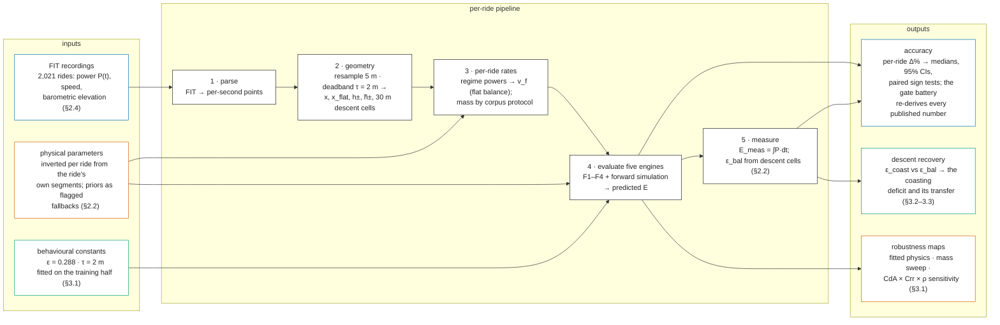
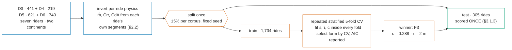

<!-- Claim annotations for this article live in paper1-closed-form.meta.ttl, keyed to the
     invisible @c-<id> anchors in the text below. See that file for the rationale. -->

<!-- DRAFT v2 — IMRAD paper, revised after the six-lens adversarial review
     (2026-07-27) and the author's preliminary feedback. Single-language draft
     for review; the pt-BR mirror is produced only after this shape is approved
     (from then on the lockstep rule applies). Sources of truth:
     research/journal/MODEL_COMPARISON_JOURNAL.md (numbers), journal.qmd
     (reproduction map). All values are the current, re-baselined ones
     (G = 9.7864), verified against src/harness/bootstrap_ci.py and the
     harness CSVs. Math in LaTeX ($...$); render target is pandoc/KaTeX. Figures 3-4 are
     mermaid blocks: the publish pipeline must render them (mermaid.js via
     CDN+SRI in the /modelo/ template, or pre-render at build); GitHub
     renders them natively. -->

# A Closed-Form Model for the Mechanical Energy of Cycling a Route, Evaluated Against 2,025 Power-Metered Rides

**Danilo Lessa Bernardineli** — Dynamical Systems Group; Pedal Hidrográfico, São Paulo

## Abstract

**Background.** The energy of cycling a route has three parts: a cost per kilometre, a cost per metre climbed, and a partial refund per metre descended. Yet it is hard to obtain: route planners optimise time; the prototypes and tools that do cost energy are simulation-based and leave route-level accuracy unpublished; and the physics literature validates instantaneous power or speed, never the route-level integral. A closed form simple enough for pen and paper — or a million edge evaluations per second in a router — would unlock it, if it can be trusted.

**Methods.** We test four models built on one three-term closed form, $E \approx \alpha\,x + \beta\,(h_+ - \varepsilon\,h_-)$ — flat rate $\alpha$, climbing rate $\beta$, refunded fraction $\varepsilon$ — against the power-meter energy $\int P\,dt$ of 2,025 unique rides (2,127 evaluations; six corpora, three São Paulo riders and four European). The reference is a forward-dynamics simulation [Martin et al. 1998] on the same constants per ride, so gaps are modelling error; both engines read the ride's measured power, so accuracy means consistency of the energy accounting, not blind prediction. The calibration corpus uses condition-informed per-ride parameters and is re-run blind as a check; every other corpus is blind under one shared literature-typical set, mass being the only per-rider input. All behavioural constants are calibrated once and frozen, and the refund's deficit is treated as a function whose form is decided empirically, on held-out halves.

**Results.** Selected by cross-validation on the training half and scored once on rides used neither to fit its constant nor to choose its form, the proposed form reproduces 305 held-out rides to **3.98% [3.51, 4.54] median error**<!--@c-e52.f3.med.abs--> with a bias of −1.06% [−1.56, −0.37] — the headline. The forward simulation, carried as a comparator on the same rides, reads 5.71% [5.13, 6.42]; the closed form is therefore not worse than a state-coupled simulation that has strictly more information, since the simulation also walks the full profile with velocity propagating between segments and reads the same per-ride constants. The gap should not be read as the closed form being better physics: the simulation's bias is concentrated in the three São Paulo corpora and traces to its constants being fitted on sustained segments whose transients it then meets at run time. Cross-validation and AIC select the same form independently. Its descent constant refits to $\varepsilon = 0.288$ against 0.255 on the held-out half's own optimum, so the constant is identified rather than an artefact of the draw; the deadband recovers 2 m from the training half rather than inheriting it. For the descent term we hold $\varepsilon$ as a calibrated constant. A Sobol decomposition of the prediction error over the constants a user supplies shows why: $\varepsilon$ accounts for 7% of the variance against 55% for drag area and 46% for mass, and $C_dA$ and $C_{rr}$ prove not to be separately identified by route-level energy — their sum is determined two to three times better than either part, so improving one alone can make an estimate worse. $\varepsilon$ does admit a mechanistic decomposition into a geometric ceiling and a behavioural shortfall, set out as a research programme rather than a result of this paper. One exposure is reported rather than assumed away: 82% of held-out rides have a same-rider training ride within 5% on distance and 10% on ascent, so the figure is a repeat-route error.

**Scope.** Seven riders, all on conventional road bicycles with power meters; the behavioural constants are calibrated at a 30 m elevation scale and paired with an assumed $\rho\,C_dA$. Whether the descent-recovery constant holds for utility commuters, e-bikes, cargo bikes or recumbents is untested, and the transfer claim rests on two independent riders plus four external ones — a thin base for a behavioural constant, and the limit most likely to bind in deployment ([§4.3.1](#4.3.1)).

**Conclusions.** The proposed F3 — air resistance charged only off the climbs, elevation totals smoothed — matches the simulation under both protocols; F4, its totals-only approximation (subtract $c \approx 3$ m of phantom climb per kilometre), performs nearly as well and is computable by hand from distance, ascent, descent and a rough climbing share.

Descent recovery has a geometry (the recovery ceiling) and a habit (the deficit), and the habit's spread across riders is behavioural: those who pedal descents twice as often show correspondingly larger deficits. Where the dynamic estimator applies, its deficit is better taken grade-inverse than constant; its edge over a flat constant is rider- and parameter-dependent, and flat $\varepsilon \approx 0.20$ suffices in urban riding. The law is cheap enough to serve as a per-edge routing cost at the sampling scale it was calibrated on.

**Keywords:** cycling energetics, active transportation, route planning, energy-optimal routing, power meter data, elevation gain estimation, digital elevation models, closed-form approximation, territorial planning, open science

## Contributions

1. **A hand-computable route-energy law.** The three-term form $E = \alpha_r\,x + \alpha_a\,x_{\mathrm{flat}} + \beta\,(\tilde h_+ - \varepsilon\,\tilde h_-)$ and its totals-only approximation (F4), derived from the route-energy integral ([Appendix A](#appendix-a)) and validated against a forward simulation and 2,025 measured rides from seven riders ([§3](#3)).
2. **Two failure modes of the naive closed form, identified, attributed and cheaply fixed**: climb aerodynamics charged at the flat reference speed, and sub-metre elevation noise (plus momentum-paid micro-relief) counted as climbing — with independent attribution checks for each ([§3.1](#3.1)).
3. **A descent term with a mechanism, held as a constant.** $\varepsilon$ is not a free coefficient: it decomposes into a parameter-free geometric ceiling and a behavioural shortfall whose ledger identity makes it a measurement of descent pedalling *occupancy*. A sensitivity decomposition shows that its value accounts for 7% of prediction-error variance against 55% for drag area, so this paper carries it as a calibrated constant and sets the decomposition, the candidate forms and the out-of-sample contest between them out as a research programme ([§3.2](#3.2), [§4.4.2](#4.4.2)).
4. **An apportioned error budget, and a non-identifiability.** The variance of the prediction error is decomposed over the constants a user must supply. Drag area and mass dominate; more usefully, $C_dA$ and $C_{rr}$ are shown *not to be separately identified* by route-level energy — their sum is determined two to three times better than either part — so improving one alone can make an estimate worse ([§3.2](#3.2)).
5. **A regime rule for the descent term** — dynamic $\varepsilon_d$ on open terrain, flat $\varepsilon_f$ in stop-go — together with its scope condition: only the (cost, refund) *pair* is identified by ride energies, so the rule holds per physics protocol and inverts if the law is re-paired without re-calibration ([§4.3](#4.3)).
6. **External validation on an open deposit.** The frozen law carried to four European riders (Catalonia, Burgundy, the French Alps) who share no rider, country, terrain regime, recording device or model-selection history with the calibration set — and reaching its closest parity there, 3.16%<!--@c-d6.f3d.med--> against the simulation's 3.15% on 740 rides.

 The same corpus shows F4's scalar $c$ failing where the *form* does not, which is the sharpest evidence that $c$ belongs to the elevation source rather than to cycling: fitted freely on corpora whose elevation arrives pre-smoothed, it collapses to 0.03 m/km ([Table 1](#tab1), [Table 2](#tab2)).
7. **A frozen-constants transfer methodology with a dual calibration protocol**: constants calibrated once and carried blind to independent riders and to 14× scale; an informed-vs-blind pair of calibration runs that prices per-ride condition knowledge; every published number re-derived by a gate battery, with per-entry research packages ([§2.4](#2.4)).
8. **Fully automatic per-ride physics**: a segment-based mass inversion validated against logged and known masses, plus a regime-consistent aero estimator that restores the law's pairing with no human judgment — pooled 3.9% [3.6, 4.1], behavioural constants still frozen, physics read per ride so partially in-sample ([§2.2](#2.2), [§2.2](#2.2)).
9. **Sensitivity maps for the shared constants**: the exact $\rho \cdot C_dA$ degeneracy, the robustness of the mass inversion, and the engine-lockstep result explaining why paired model conclusions survive parameter uncertainty that absolute errors do not ([§3.1](#3.1)).
10. **A physical reading of the smoothing scale**: rider momentum as a travel-limited suspension ($h_{KE} = v^2/2g$; dissipation length $\lambda = m/\rho C_dA$, exact and $C_{rr}$-free), first evidence for a speed-dependent deadband, and measured bounds showing direct momentum recycling is energetically minor at ride grain ([§4.4](#4.4)).
11. **A deployed use, in three registers.** The law is cheap enough to evaluate per edge, hand-computable from distance, ascent, descent and a rough climbing share, and in use: as a routing cost, as a ride-planning tool for a cycling collective ([§4.1](#4.1)), and — because it turns terrain into an energy field rather than a distance — for **territorial planning**, where the same closed form supports exploratory, comparative and prescriptive analysis of an area's present or potential suitability for cycling. That last register connects the result to urban and tourism studies, which need to compare places rather than routes.

## Terminology

Symbols used throughout; grades are percent in the text, fractions in formulas; "—" in the unit column marks dimensionless quantities; corpus labels D3–D6 are defined in [Table 1](#tab1). Display equations are numbered (1)–(8) in the main text and (A1)–(A9) in the appendix; the four model forms are named and tagged F1–F4.

Notation rule — aggregation scopes: a physical parameter or measurement carries its scope as a subscript — $_t$ instant, $_i$ local (30 m cell), $_r$ ride, $_p$ person, $_c$ corpus. On variables the scope sits in the subscript ($s_i$, $h_{-,i}$); on functions it enters through the argument (the recovery ceiling). E.g. $C_{dA,r}$ is one ride's aero, $C_{dA,p}$ one person's fitted aero. A **bare parameter symbol is a frozen constant** (the value column below). Two declared exemptions: letter subscripts that are *names*, not scopes ($\alpha_r$ rolling, $\alpha_a$ aero, $v_f$ flat, $\varepsilon_d$/$\varepsilon_f$ variants, $k_{\mathrm{eff}}$); and the geometry and energy symbols ($E$, $x$, $h_\pm$, …), which are ride-level by definition, with their scope stated in the table. The four physical constants below carry their frozen-protocol values; the informed calibration run judged them per ride ([§2.4](#2.4)). The *value* column gives the constant used, or the variable's scope: **person**, **ride**, **local** (along the route), **instant** (per second).

Notation rule — evaluation lineage: every result in this paper is one triple, written compactly in the table captions and never in prose. An **input** $I = (D, P)$ pairs a dataset $D$ ([Table 1](#tab1)) with a parameter class $P$, itself a base plus overrides joined by $\cdot$: $P_{a,g}$ assumed-global (the frozen priors), $P_{a,r}$ assumed-per-ride (judged or logged), $P_{f,r}$ fitted-per-ride, $P_{f,p}$ fitted-per-person. So $(D_3, P_{a,g} \cdot P_{f,p}(m))$ reads "P. Paz under the frozen priors, with mass inverted per rider". A **transformer** $T$ is a model — the named forms $F_1$–$F_4$, or $F_{\mathrm{base}}$, the forward simulation — carrying its $\varepsilon$ choice as a superscript, $F_3^{\varepsilon_d}$; $T$ is the class, $F_i$ the instance. An **output** $O = T(I)\,|\,\sigma$ is per-ride, one row per ride, with $\sigma$ the inclusion rule. Stating $\sigma$ is what keeps a population from being read as its superset — and note that [Table 1](#tab1)'s counts are themselves *clean* counts, already post-selection, so an $|O|$ is only ever comparable to the stage it was drawn from. Tables report **statistics** $S(O)$ — medians and bootstrap intervals — which is the layer the public gate battery re-derives.

| symbol | unit | value | name | meaning |
|---|---|---|---|---|
| $E$ | J | ride | route mechanical energy | Pedal energy over the route; ground truth is the power-meter integral $\int P\,dt$. |
| $x$ | m | ride | route distance | Ground distance. |
| $h_+$, $h_-$ | m | ride | total ascent, descent | Summed climbing / dropping, raw profile; deadband-smoothed totals are $\tilde h_+$, $\tilde h_-$ ([§1.2](#1.2)). |
| $x_+$, $x_-$, $x_{\mathrm{flat}}$ | m | ride | climbing, descending, non-climbing distance | Distance on grades ≥ 2%, descending distance, and $x - x_+$; aero is charged only on $x_{\mathrm{flat}}$. |
| $s$ | — | local | grade (slope) | Rise over run (2% in text ≡ 0.02 in formulas); negative on descents in the regime definitions, magnitude in descent formulas ($\bar s = h_-/x_-$). |
| $m$ | kg | person | total system mass | Person + bicycle + gear; inverted per ride from the ride's own climbing data ([§2.2](#2.2)). |
| $g$ | m/s² | 9.7864 | local gravity | São Paulo's measured value (IAG-USP). |
| $C_{rr}$ | — | 0.008 | rolling-resistance coefficient | Rolling drag as a fraction of weight. |
| $C_dA$ | m² | 0.40 | drag area | Frontal area × drag coefficient. |
| $\rho$ | kg/m³ | 1.13 | air density | At São Paulo's altitude. |
| $k_{\mathrm{eff}}$ | — | 0.98 | drivetrain efficiency | Fraction of leg power reaching the wheel. |
| $w$ | m/s | 0 | headwind | Held at zero throughout ([§4.3.3](#4.3.3) prices the omission). |
| $v_f$ | m/s | ride | flat reference speed | Flat cruising speed, derived per ride from its own flat-regime power ([§2.1](#2.1)); sets the aero charge, anchors the two models. |
| $P$ | W | instant | pedal power | Measured per second by the power meter. |
| $\alpha_r$, $\alpha_a$ | J/m | person, ride | rolling, aero cost rates | Energy per metre for rolling, and for air at the relative speed $v_f + w$ (so $\alpha_a$ inherits $v_f$'s per-ride scope); $\alpha = \alpha_r + \alpha_a$. |
| $\beta$ | J/m | person | climbing cost rate | Energy per metre climbed: $mg/k_{\mathrm{eff}}$. |
| $s_*$; $s_+$, $s_-$ | — | person | flat-resistance grade; gravity-dominated regimes | Break-even slope $s_* = \alpha/\beta$ (≈ 1.6–2%); beyond it gravity dominates — ascents $s_+$ collapse speed, descents $s_-$ shed the surplus gravitational power to over-speed drag or braking. |
| $s_=$ | — | — | flat band | $\lvert s\rvert < s_*$: resistance dominates, aero at $v_f$ is fair, descents refund fully; the 2% gate approximates its edge. |
| $\varepsilon$ | — | ride | descent-recovery factor | Fraction of descent potential energy refunded; measured values can be negative (Appendix A). |
| $\varepsilon_d$ | — | ride | dynamic $\varepsilon$ (reported, not recommended; see [§4.4.2](#4.4.2)) | the geometry-derived variant of [§4.4.2](#4.4.2); reported for comparison, not recommended — adapts to descent geometry ([§1.3](#4.4.2)). |
| $\varepsilon$ | — | 0.288 | flat $\varepsilon$ | One constant for every route, fitted on the training half ([§3.1](#3.1)). |
| $\varepsilon_0$ | — | 0.13 | calibrated deficit constant ([§4.4.2](#4.4.2)) | Gap between ideal and measured recovery; 0.13 at the shared priors and 30 m scale (0.10–0.19 across plausible physics and pairings, [§3.1](#3.1)); recurrence robust, value conditional. |
| $c$ | m/km | ≈ 3 | ascent-noise rate | Phantom climb per route-km, subtracted from raw totals; measured ([§2.5](#2.5)), frozen. |
| $\tau$ | m | 2 | deadband threshold | Elevation changes below $\tau$ are ignored when summing $h_\pm$. |
| $\Delta\%$ | % | ride | per-ride signed error | $(E_{\mathrm{model}} - E_{\mathrm{meas}})/E_{\mathrm{meas}}$; corpora summarized by medians of $\Delta\%$, $\lvert\Delta\%\rvert$. |

## 1. Introduction

### 1.1 An absent quantity

How much energy does it take to cycle a route? The question is basic — it determines how far a commuter can ride, how a collective plans a group ride through hilly terrain, whether a cargo-bike delivery round is feasible — and yet a trustworthy answer is hard to come by. Production bicycle routers cost *time*, with heuristic hill penalties; research prototypes have costed energy per edge [Shirabe 2008; Hrnčíř et al. 2017; Cakir et al. 2026], but their route-level accuracy against measured power is unpublished (our own experimental deployment, [§4.1](#4.1), is the exception that motivated this study).

The tools that do estimate ride energy are simulation-based pacing planners or platforms' post-hoc estimates: opaque to their users and, to our knowledge, never validated against measured route-level power in the open literature. The sports-science literature validates the *instantaneous* power balance to high precision [Martin et al. 1998; Dahmen et al. 2011] but not the route-level energy integral; route-choice models absorb elevation into fitted coefficients with no physical form [Scarf & Grehan 2005]. Energy is not so much absent from the toolbox as locked inside simulations — out of reach of a router that must cost thousands of edges, and of a rider with pen and paper.

Two audiences would use it if it were computable, and they impose opposite constraints. A routing engine must evaluate thousands of candidate edges, which rules out forward simulation and demands a closed form. A rider — or anyone teaching riders — needs something even stricter: a formula that works with pen and paper, from the three numbers any map already gives (distance, total ascent, total descent). Both constraints point to the same object, and Occam points there too: the simplest law that survives contact with measured data is the one worth deploying.

### 1.2 The proposed law

#### 1.2.1 The three-term shape

We propose an approximation that decomposes the mechanical work of a ride into three terms: (1) a cost per metre of horizontal distance — rolling and aerodynamic resistance — expressed by the rate $\alpha$; (2) a cost per metre of ascent — a gravitational *deposit* — expressed by the rate $\beta$; and (3) a partial *refund* per metre of descent — the deposit withdrawn back as forward progress — expressed by the recovery factor $\varepsilon$. Terms 1 and 2 are widely known: together they are the textbook steady-speed energy integral, resting on physics validated since the equation-of-motion experiments [di Prampero et al. 1979; Martin et al. 1998]. Term 3 carries a behavioural quantity, and $\varepsilon$ admits a mechanistic reading rather than being a free coefficient: it decomposes into a parameter-free geometric ceiling and a behavioural shortfall that measures how often riders pedal downhill. This paper uses $\varepsilon$ as a calibrated constant, because that is what its share of the error budget warrants ([§3.2](#3.2)); the decomposition, the candidate functional forms and what the data say about them are set out in [§4.4.2](#4.4.2) and derived in [Appendix A.5–A.6](#A.5). Term 3 is novel. It has been touched only obliquely in nearby literatures — as a per-grade coasting idle limit in a speed-choice model [Bigazzi & Lindsey 2019], and as per-instant regeneration efficiencies or symmetric potential terms in electric-vehicle energy models — but never as a route-level, closed-form recovery factor; [§1.3](#4.4.2) develops it and [§4.2](#4.2) maps the prior art. The three terms give the shape every form in this study shares, eq. (1),

$$E \;\approx\; \alpha\,x \;+\; \beta\,(h_+ - \varepsilon\,h_-), \tag{1}
$$

with one flat cost rate $\alpha = \alpha_r + \alpha_a$, one climbing rate $\beta$ and one recovery factor $\varepsilon$, whose rates eq. (2) fixes:

$$\alpha_r = \frac{C_{rr}\,m g}{k_{\mathrm{eff}}}, \qquad \alpha_a = \frac{\tfrac{1}{2}\rho\,C_dA\,(v_f + w)^2}{k_{\mathrm{eff}}}, \qquad \beta = \frac{m g}{k_{\mathrm{eff}}}, \tag{2}
$$

with $w$ the headwind, held at zero throughout this study's evaluation, so $\alpha_a$ reduces to the $v_f^2$ form ([§4.3.3](#4.3.3) prices that omission).

#### 1.2.2 The four forms

We evaluate four forms of this family. They are not independent alternatives but a causal chain of refinements, each step addressing the previous form's main limitation: F1, the shared shape as-is, led to F2 (splitting the flat rate), which led to F3 (smoothing the elevation), which led to F4 (approximating the smoothing when only totals are available). Writing $\tilde h_\pm$ for the deadband-smoothed elevation totals:

1. **original** — air resistance at the flat reference speed over the whole distance; raw elevation totals:
   $$E_1 \;\approx\; \alpha\,x \;+\; \beta\,(h_+ - \varepsilon\,h_-); \tag{F1}
$$
2. **split** — the aero part gated off climbs, rolling still paid everywhere:
   $$E_2 \;\approx\; \alpha_r\,x \;+\; \alpha_a\,x_{\mathrm{flat}} \;+\; \beta\,(h_+ - \varepsilon\,h_-); \tag{F2}
$$
3. **split + elevation smoothed** — the elevation profile deadband-filtered point by point before summing, so $\tilde h_\pm$ are noise-free (the form we propose):
   $$E_3 \;\approx\; \alpha_r\,x \;+\; \alpha_a\,x_{\mathrm{flat}} \;+\; \beta\,(\tilde h_+ - \varepsilon\,\tilde h_-); \tag{F3}
$$
4. **split + elevation correction** — F3, with the smoothed totals approximated from the raw ones, for when only $x$, $h_+$ and $h_-$ are known:
   $$E_4 \;\approx\; \alpha_r\,x \;+\; \alpha_a\,x_{\mathrm{flat}} \;+\; \beta\,(\tilde h_+ - \varepsilon\,\tilde h_-), \qquad \tilde h_\pm \approx h_\pm - c\,x. \tag{F4}
$$

All four forms are derived from the route-energy integral in [Appendix A](#appendix-a), and all four are scored against measured energy in [§3.1](#3.1) ([Table 2](#tab2), [Table 3](#tab3)). All symbols and their plain-word meanings are collected in [Terminology](#terminology); [Figure 1](#fig1) maps each term of the proposed form onto a route profile; the filter threshold $\tau$ and the noise rate $c$ are specified below.

). The deadband filter addresses both — measurement hygiene and, in part, a kinetic-energy accountability mechanism.](figs/fig9-anatomy.svg)

#### 1.2.3 The two corrections

The family's physical ingredients are well validated, but only below the route scale: the underlying power balance against steady-velocity trials on flat ground [Martin et al. 1998], and simulators built on it against speed on real tracks [Dahmen et al. 2011] — never against the route-level energy integral. Two systematic errors that only exist at that integral scale — one born when the closed form lumps aero into a single reference speed, one born when noisy elevation steps are summed into $h_+$ — therefore had no occasion to be noticed, let alone corrected. We propose two corrections; both are calibrated on a single corpus and then frozen ([§2.4](#2.4)).

- **Climb-aero split.** The original form bills air resistance at $v_f$ over the whole distance, but on ascent-dominated grades ($s_+$) speed falls far below $v_f$, so it over-charges every climb. The correction charges aero only over the non-climbing distance $x_{\mathrm{flat}} = x - x_+$; the frozen 2% gate defining $x_+$ is a rounded, rider-generic stand-in for the flat-resistance grade $s_*$.
- **Elevation deadband.** Recorded and DEM (digital elevation model — terrain heights from mapping data) elevation profiles carry sub-metre noise whose positive half-steps all count toward $h_+$ — a measurement artifact, not lifting work [Rapaport 2011]. F3 removes it with a backlash (deadband) filter of threshold $\tau = 2\,\mathrm{m}$, which leaves sustained climbs intact. F4 approximates the smoothed totals from raw ones, $\tilde h_\pm \approx h_\pm - c\,x$, achieving the same on totals alone: **subtract about 3 m of phantom climbing per kilometre of route** ($c = 0.003$ with $x$ and $h_\pm$ in metres). The rate is measured on the calibration corpus — methodology and evidence in [§2.5](#2.5). Example: a 50 km ride whose raw profile reports 600 m of ascent is corrected to $600 - 3 \times 50 = 450$ m.

### 1.3 Aim, hypotheses, and scope

**The aim of this study** is to establish that the closed form above accounts for the measured mechanical energy of real rides as well as a full forward simulation does, at a cost that a spreadsheet or a per-edge routing cost can bear. That is a goal rather than a hypothesis: it is what the paper sets out to build, and [§3.1](#3.1) reports how far it gets.

One claim in the construction *is* a hypothesis, because it can fail cleanly and the whole proposal depends on it:

> **Transfer.** The descent-recovery constant $\varepsilon$ is a property of cycling rather than of a rider. Fitted on one person's rides and carried unchanged to people who took no part in fitting it, it should cost little accuracy against a constant fitted on everyone.

If that holds, a single published number serves any user. If it fails, $\varepsilon$ is a per-rider calibration, the law needs one measurement session per person before it can be used, and the deployment case in [§4.1](#4.1) largely collapses. [§3.1.4](#3.1.4) tests it directly, by fitting $\varepsilon$ on each rider alone and scoring it on the other six.

One scope statement applies throughout: each ride is evaluated with its own measured power inputs, and the physical constants are inverted from each ride's own telemetry ([§2.2](#2.2)). Our accuracy figures therefore measure the **consistency of the energy accounting** — whether the law maps a route's geometry and a rider's effort onto the measured energy — not blind route prediction, which would additionally require predicting the rider's power.

## 2. Methods

[Figure 3](#fig3) maps the whole study in one view — the inputs, the per-ride pipeline, and the outputs; the subsections detail each stage, and [Figure 4](#fig4) (in [§2.4](#2.4)) shows how the corpora relate.

**Figure 3.** The study pipeline: inputs, the per-ride pipeline, and outputs. Every arrow is one deterministic harness step; all outputs regenerate from the inputs with one command per corpus.

### 2.1 The reference simulation and the shared-constants design

The reference is given by eq. (6) — a distance-marching forward integration of the standard cycling power balance [Martin et al. 1998; di Prampero et al. 1979]:

$$m\,v\,\frac{dv}{dx'} = \frac{k_{\mathrm{eff}}\,P}{v} - C_{rr}\,m g \cos\theta - \tfrac{1}{2}\rho\,C_dA\,(v + w)^2 - m g \sin\theta, \tag{6}
$$

with pedal power $P$ per grade regime extracted from each ride's own power stream, signed relative wind $w$, and a safe-speed brake cap on descents. The integrator uses a semi-implicit kinetic-energy update that conserves energy to machine precision (the identity $k_{\mathrm{eff}} E_{\mathrm{legs}} = \Delta KE + W_{rr} + W_{\mathrm{aero}} + W_{\mathrm{grav}} + W_{\mathrm{brake}}$ is asserted per ride to $\leq 10^{-6}$ relative).

The design principle that makes the comparison meaningful: **both models read the same physical constants** — mass, $C_{rr}$, $C_dA$, $\rho$, $k_{\mathrm{eff}}$, and the headwind $w$ (held at zero throughout) — per ride. The flat reference speed is likewise shared and derived per ride: the flat-regime pedal power is extracted from the ride's own power stream (speed-gated, time-weighted), and $v_f$ is the speed at which the flat power balance closes — so on flat ground the two models agree by construction, and every gap between them is modelling error, not a parameter mismatch. Gravity is São Paulo's measured local value ([Terminology](#terminology)); D3–D5 are overwhelmingly São Paulo rides, and the handful of away rides retained (other Brazilian states, a few European tours) shift $g$ — hence $\beta$ — by under 0.3%, well inside every published band. D6 is wholly European, where $g \approx 9.805$; it is evaluated at the same constant because the quantity its data identifies is the product $\hat m g$, so the closed forms are invariant under a joint change of mass and gravity and only a comparison against the riders' *published* masses needs the 0.19% rescale (lab journal, Entry 43).

### 2.2 Inverting the physics from the ride

Both engines need three constants per ride — system mass $m$, rolling coefficient $C_{rr}$ and drag area $C_dA$ — and this study obtains them from the ride's own power stream rather than from a rider questionnaire or a wind tunnel. That choice is what makes the evaluation automatic, and it is also the study's principal limitation, so the method and its failure modes are stated here in full.

#### 2.2.1 The cascade

Each ride is segmented into **strict climbs** (grade $\geq 2\%$ throughout, $\geq 40$ m of gain) and **strict in-band flats** ($\geq 1$ km), with transients clipped and a segment kept only if it is well-behaved: no braking events, power present for $\geq 90\%$ of samples, no stops. Three estimates are then taken in a fixed order, each consuming the previous one:

1. **$\hat m$ from a temporally spread subset of the climbs.** On a sustained climb $\beta h_+$ dominates the balance, so mass is the best-identified of the three.
2. **$\hat C_{rr}$ from the *remaining* climbs**, at the prior $C_dA$. The subsets are deliberately disjoint: on any single climb $m g \sin\theta$ and $C_{rr} m g \cos\theta$ both scale with $m$, so estimating both from the same segment is collinear by construction. Splitting the segments breaks that.
3. **$\hat C_dA$ from the flats**, where aerodynamic loss dominates.

Head/tailwind is zero for round trips and half the historical daily ground wind projected on the net bearing otherwise. A field with no qualifying segment falls back to its prior — $C_{rr} = 0.008$, $C_dA = 0.40$ — and the fallback is flagged rather than silent.

#### 2.2.2 How often it actually inverts

The fallbacks are not rare, and reporting their rate is the honest description of what "per-ride fitted physics" means in this paper. Across the 2,028 rides of D3–D6, **$C_{rr}$ carries the 0.008 prior on 77%** and **$C_dA$ the 0.40 fallback on 26%**; both were genuinely inverted on only **15%**. Mass is the constant that is really identified per ride, and it is near-constant within a rider — one D6 rider's inter-quartile range spans 99.9 to 99.9 kg.

So the parameter class this paper calls fitted-per-ride is, for most rides, *inverted mass with assumed resistances*. Since mass scales the dominant climb term directly ($\beta = mg/k_{\mathrm{eff}}$), that is the high-value part; but the label overstates the fit, and results that turn on $C_{rr}$ or $C_dA$ should be read with the rates above in mind.

#### 2.2.3 What route-level energy can and cannot identify

The fallback rate is a symptom rather than a defect of sequencing. Route-level energy identifies the flat resistance $\alpha$, not its division into rolling and aerodynamic parts: separating a term scaling with $v$ from one scaling with $v^3$ requires speed *variation* within the ride, and at roughly steady speed the two are nearly parallel. [§3.2](#3.2) measures the consequence — $\alpha$ is determined two to three times better than either of its components.

We tested whether a better estimator escapes this. Multiplying the force balance by $v$ makes it linear in $(m,\ m C_{rr},\ C_dA)$, so a single regression over work-balance blocks returns all three jointly, with no cascade, no ordering and no fallback path. On the rides where the cascade genuinely inverts all three — the well-conditioned subset, where any correct method must agree — the joint fit instead returns $m = 63$ kg against 98, with a median condition number near 330 (lab journal, Entry 53). The joint fit removes the fallback *code path* without adding the information the fallbacks stand in for. We therefore keep the cascade and report its rates, rather than adopting an estimator that hides the same deficit behind a plausible number.

#### 2.2.4 Where the inversion sits in the evaluation

The inversion runs **before** the train/test split of [§3.1](#3.1), as data preparation: it is a property of each ride, computed once, and the split then partitions rides that already carry their constants. Two consequences follow, and both bound what the results claim.

The held-out evaluation establishes that the **functional form and a universal $\varepsilon$** transfer to rides that chose neither. It does **not** establish prediction from geometry alone, because every ride — held out or not — carries constants derived from its own telemetry. Predicting a route nobody has ridden needs constants a planner can obtain without the ride, and is outside this paper's scope.

And the constants are fitted under *quasi-steady* conditions, on sustained climbs and flats, then used across whole rides including the accelerations and stops those segments exclude. The closed form absorbs the mismatch into its fitted $\varepsilon$; the forward simulation, which has no fitted parameter, cannot, which is why its error concentrates on the transient-heavy urban corpora ([§3.1.3](#3.1.3)).

### 2.3 Parameter sensitivity: how the error budget is apportioned

A route-energy law is only as trustworthy as the constants it is fed, so we ask which of them the answer actually depends on. We decompose the variance of the prediction error over the four quantities a user must supply — system mass $m$, drag area $C_dA$, rolling coefficient $C_{rr}$, and the descent-recovery fraction $\varepsilon$ — with a Sobol design (Saltelli estimators for first-order $S_i$, total-order $S_{Ti}$ and pairwise $S_{ij}$; $N = 4096$, sample matrices drawn from the project's own deterministic generator so a re-run reproduces exactly).

The output decomposed is the corpus median $\lvert\Delta\%\rvert$, so the answer is to the question a reader actually has: *of the error I would see, how much does each constant account for?* All four forms are decomposed, because a parameter's share depends on how much other error the form still carries — the same absolute effect occupies a larger share as F1 → F3 removes error. Reporting the four together separates importance from residue.

Each form reduces, per ride, to four geometry aggregates — route length, the distance charged aerodynamically, and the corrected ascent and descent totals — after which the energy is arithmetic. The profile is walked once per ride and the design costs no simulation, which is what makes a full Sobol run affordable over every ride rather than a subsample. The single nonlinearity is the flat reference speed, solved from the ride's flat power against $(m, C_{rr}, C_dA)$ and re-entering the aero term quadratically, so every interaction reported has one physical origin.

**Input ranges are measured rather than assumed**, since a variance decomposition ranks parameters partly by how wide their ranges are. The physical constants take the 5th–95th percentiles of the per-ride inversions actually observed ([§2.2](#2.2)); $\varepsilon$ takes its measured spread across the seven riders, 0.08–0.30. Note the asymmetry, which is deliberate and conservative: the physical ranges are what one ride's inversion leaves uncertain, while $\varepsilon$'s is the full across-rider spread a deployer meeting an unknown rider would face. That inflates $\varepsilon$'s apparent share, which is the direction that makes the conclusion below harder to reach. The analysis is repeated under a narrower $\pm 1$ SD parameterisation and we report a verdict only where it survives both.

### 2.4 Data, ground truth, and evaluation protocol

#### 2.4.1 Datasets and roles

**Datasets.** Four corpora — 2,021 rides, of which D3–D5 are ridden overwhelmingly in and around São Paulo (a few away rides retained; [§2.1](#2.1)) and D6 entirely in Western Europe, all with per-second power meters ([Table 1](#tab1); [Figure 5](#fig5) draws every São Paulo route on one map — D6's are withheld, see below). Together they span seven riders, three recording platforms and two continents. Earlier drafts of this work also used two smaller corpora of the author's — a 44-ride brevet set and a 62-ride urban census — to calibrate the behavioural constants under assumed resistances. Both are subsets of D5 rather than independent data, and the constants they set are now fitted on D3–D6's training half instead ([§3.1](#3.1)), so neither is reported here; the lab journal retains their results.

**Table 1.** The four corpora and their roles.

| corpus | rides (clean) | character | role |
|---|--:|---|---|
| D3 P. Paz | 441 | independent rider's full history, fast open-road | selection + held-out evaluation |
| D4 JAAM | 219 | independent rider's full history, gentle terrain, strong descent-pedaller | selection + held-out evaluation |
| D5 author-full | 621 | author's complete history | large-sample validation |
| D6 scikit-cycling | 740 | four European riders (Catalonia, Burgundy, French Alps), open public deposit | selection + held-out evaluation — no shared country, terrain or device |

The roles, precisely:

1. **selection** — the training half of D3–D6 is where everything tunable is tuned: the descent constant $\varepsilon$, the deadband $\tau$, and the choice among F1–F4, all by cross-validation *within* that half ([§3.1](#3.1)). No constant in this paper is set outside it.
2. **held-out evaluation** — 15% of each corpus, drawn at random once and scored once, at the end. It is out-of-sample in the form and the constant, and in-sample in the per-ride physics, for the reason [§2.2.4](#2.2.4) gives.
3. **external reach** — D6 changes rider, country, terrain and device simultaneously. It takes part in selection and evaluation on the same terms as the others, so it is not a separate held-out test; what it buys is that no result here rests on one country's roads or one platform's recording chain.
4. **large-sample validation** — D5 is the author's complete history, and the only corpus where an independent mass anchor is known, so it is where the inversion machinery is checked at scale ([§3.1](#3.1)).

Two properties of D6 shape how its columns must be read. Its riders' masses are **published**, so the implied-mass inversion can be graded against four known values rather than the author's one ([§2.2](#2.2)). And its recording chain is measurably cleaner than this study's — a noise rate of 1.2 m/km against the author's 3.1 ([§2.5](#2.5)) — so F4's scalar $c$ is not transferable to it, and its F4 columns test that scalar rather than the form. For the same reason D6 is reported as its own column in the per-ride tables below. It does, however, take full part in the form selection and held-out evaluation of [§3.1](#3.1), which is this paper's headline: there the corpora are pooled by construction and D6 contributes 15% of its rides to the held-out half like every other corpus.

The design in one line: **fit → contest → change the regime → change the rider → leave the country → stress the machinery**, each step removing one alternative explanation for the previous step's success ([Figure 4](#fig4)).

**Figure 4.** The study design. All four corpora are pooled and split once: 15% of each is held out at random, and everything tunable — the descent constant $\varepsilon$, the deadband $\tau$, and the choice among F1–F4 — is fitted and selected by cross-validation *inside* the training half. The held-out rides are scored once, at the end. The per-ride physical constants are inverted before the split, as data preparation, which is why the held-out claim covers the form and the constant but not the physics ([§2.2.4](#2.2.4)).

![**Figure 5.** Every analysed São Paulo ride on one map (D6's European rides are deliberately absent: its tracks begin at the riders' home addresses, so no geometry derived from them is published — see Data and code availability): the urban), JAAM's Vale do Paraíba corridor (blue), P. Paz's western open roads (vermilion), and the author's brevets radiating to the coast and mountains (grey). No basemap — the visible geography is the rides themselves. For privacy, the first and last 1.5 km of every ride are not drawn; legend counts are the rides drawn, which differ from [Table 1](#tab1)'s clean corpora in both directions — rides the analysis excluded may be drawn, and analysed rides without enough usable GPS after the trim are not.](figs/fig12-routes-map.png)

#### 2.4.2 Ground truth and inclusion

Ground truth is the raw $\int P\,dt$ per ride, coasting zeros included. Inclusion filters, applied identically everywhere:

- sport = cycling; virtual rides excluded via the FIT manufacturer field;
- power coverage > 50% of samples; altitude coverage ≥ 99%;
- distance ≥ 20 km;
- a physical floor: $E_{\mathrm{legs}} \geq m g\,\tilde h_+/k_{\mathrm{eff}}$ — a measured energy below the climbing potential energy means the route was not fully pedalled (power dropouts, walking) — with a cadence-based cross-check for walked segments.

The independent riders' exports were shared with consent and are never published; all analysis code and output schemas are public.

#### 2.4.3 Evaluation protocol

**Protocol.** The comparison statistic is the per-ride signed error $\Delta\%$ ([Terminology](#terminology)); we report medians of $|\Delta\%|$ and of $\Delta\%$ with bootstrap 95% confidence intervals (CIs) and compare models pairwise with exact sign tests. Conventions: CIs are percentile bootstrap ($10^4$ resamples) over rides resampled independently within a corpus; sign tests drop tied rides (e.g. effective $n$ = 436 of 441 and 215 of 219 on the transfer corpora); rides within one rider are not independent — so cross-corpus agreement should be read as consistency, not as five independent replications. And because each history repeats routes and seasons, the iid resampling likely understates interval width — the brackets read as conditional on the realized route mix.

**Equivalence testing.** A non-significant paired test is an absence of evidence, not evidence of equivalence, so the parity claims are additionally tested by TOST (two one-sided tests) at $\alpha = 0.05$. For each comparison we resample rides — within corpus, stratified for pools, matching the pooled-CI convention above — and compute *both* engines' median $\lvert\Delta\%\rvert$ on the **same** resample, giving the difference of medians $d$. Equivalence is declared iff the 90% percentile CI of $d$ falls entirely inside a margin of $\pm 1.0$ percentage point; two one-sided tests at 0.05 each is exactly that containment, which is why the interval is 90% and not 95%. The margin is registered in advance (lab journal, Entry 48) on operational grounds — at medians of 3.5–8.4%, a difference under 1 pp changes no decision between evaluating the law per edge and running the simulation — making it deliberately conservative relative to the differences the paper actually reports. The estimand is the difference of medians, not the median of per-ride differences: the published sentences compare two medians. Seed 44, $B = 10^4$; the populations are exactly those behind the published brackets, with no ride dropped for lacking a partner.

P-values are reported unadjusted for multiplicity: roughly a dozen paired tests are quoted across the tables, so at $\alpha = 0.05$ one nominally significant result is expected by chance — individual $p$-values read as descriptive evidence, while the paper's claims rest on the [§1.3](#1.3) hypotheses and on medians with CIs.

The noise rate $c$ is measured on the author's raw barometric recordings within D5 ([§2.5](#2.5)); the descent constant and the deadband are fitted on the training half of D3–D6 and on nothing else ([§3.1](#3.1)). No behavioural constant is fitted on the corpus it is later scored on.

### 2.5 Elevation sources and the noise-rate measurement

Every corpus is evaluated on the ride recordings' **own elevation streams** from the FIT files — consumer head units, barometric where the device carries one — resampled to 5 m steps. No DEM enters the evaluation anywhere; DEM-served elevation belongs to the deployment context and its scale-dependence ([§4.4](#4.4)).

Consumer barometers are the best consumer-grade ascent source — cumulative-ascent consistency at the 1.5–3% level between units [Menaspà et al. 2014] — but whether a device over- or under-reads ascent depends on the *benchmark's* smoothing scale, because cumulative ascent has no scale-free true value [Rapaport 2011]: field comparisons disagree even on the sign for exactly this reason (the project's ascent-error survey collates them; lab journal, Entry 24). The jitter itself has mundane physical origins: short-period pressure fluctuation at the sensor port (gusts, speed changes), sensor resolution steps, and GPS altitude scatter where no barometer is present — slow weather drift, by contrast, moves *absolute* altitude far more than it moves $h_+$. This paper therefore fixes its scales explicitly, and they differ by constant: $c$ and $\tau$ live on the 5 m-resampled profile (the deadband is the work-bearing threshold there), while $\varepsilon_0$ is calibrated on the 30 m descent cells of [§2.3](#2.3) — the same 30 m grid a DEM-backed deployment samples. "The calibration scale" in the Discussion means the latter.

The noise rate $c$ is measured on the calibration corpus as a per-ride quantity: the raw ascent total minus the deadband-filtered one, divided by route length. Two properties justify the construction. First, the removed metres do no measurable work — the sustained-climb energy check ([§2.5](#2.5)) shows the filtered profile still pays the full gravity bill where real climbing lives.

The second property: the removal accumulates with *distance*, not with climbing — a per-sample jitter process — the property [§2.5](#2.5) requires of F4's scalar version $\tilde h_\pm \approx h_\pm - c\,x$. The measured rate — 3.1 m per route-km median, IQR 2.6–3.7 ([§2.5](#2.5)) — is adopted as $c \approx 3$ m/km. The rate is a property of the *elevation source at this pipeline's scale* (consumer barometric recordings, 5 m resampling), not a universal: DEM-derived profiles carry their own, larger noise rates, and the project's journal measures per-source ascent corrections and a 5 m-DEM re-fit of the equivalent scalar (Entries 6 and 19–21) — map-derived totals therefore need a source-appropriate $c$, exactly as the scale-dependence of [§4.4](#4.4) predicts. The ascent-error literature validates per-point elevation or device totals against reference surfaces; validating the ascent total against *measured pedalling energy*, as the climb check does, is this study's addition.

## 3. Results

### 3.1 Form selection and held-out error under a single protocol

#### 3.1.1 The chain

All 2,039 rides of D3–D6 carry per-ride inverted constants ([§2.2](#2.2)). Fifteen per cent of each corpus was held out at random under a fixed seed, giving $n_\mathrm{test} = 305$ against $n_\mathrm{train} = 1{,}734$; the held-out half was scored once, at the end. Forms F1–F4 were fitted and compared by repeated stratified $5$-fold cross-validation ($4$ repeats, folds stratified by rider), with **every** free parameter refitted inside each fold — $\varepsilon$ for all four, the deadband $\tau$ for F3, and the climb-fraction constant $c$ for F4. Fitting minimises the mean absolute log ratio $\overline{\lvert\log(\hat E/E)\rvert}$, which is symmetric in over- and under-prediction and scale-free; reported errors remain median $\lvert\Delta\%\rvert$ throughout, so every number stays comparable with the rest of the paper.

The simulation $F_\mathrm{base}$ is carried through as a **comparator, not a contestant**: it has no globally fitted parameter and takes no part in selection.

#### 3.1.2 Selection

F3 wins, and the two criteria agree ([Table 2](#tab2)). It is the only form inside one standard error of the best cross-validated score, so the parsimony rule never arbitrates; AIC, computed independently under the Laplace likelihood matching the $L^1$ fitting loss, selects the same form.

**Table 2.** Form selection on $D_\mathrm{train}$ ($n = 1{,}734$, D3–D6, per-ride inverted constants). *CV* is the mean absolute log ratio under repeated stratified $5$-fold cross-validation, $\pm$ its standard error over the 20 fold scores; every parameter is refitted within each fold. *1-SE* marks forms within one standard error of the best. $k$ counts globally fitted parameters. Lineage: $I = (D_3..D_6,\ P_{f,r})$, $T \in \{F_1..F_4\}$, $O$ = `e52_split.csv`.

| form | CV | 1-SE | AIC | fitted | $k$ |
|---|--:|:--:|--:|--:|--:|
| F1 | 0.08394 ± 0.00174 | | −2718.9 | $\varepsilon = 0.596$ | 1 |
| F2 | 0.07669 ± 0.00180 | | −3032.0 | $\varepsilon = 0.394$ | 1 |
| **F3** | **0.07323 ± 0.00184** | ✓ | **−3192.8** | $\varepsilon = 0.288$, $\tau = 2$ m | 2 |
| F4 | 0.07771 ± 0.00196 | | −3030.9 | $\varepsilon = 0.392$, $c = 0.03$ | 2 |

Two results in that table matter beyond the ranking. **F4's climb-fraction damping is not supported**: fitted freely, $c \to 0.03$, which sets its multiplier to unity and reproduces F2 exactly, and at the value used in earlier work ($c = 3$) the score degrades by a third. F4 and F3 are the same correction attempted from opposite ends — both undo the ascent inflation that elevation noise produces, F4 in aggregate and F3 point-wise — and only the point-wise one survives. The reason is that the per-ride inversion has already absorbed the *scale* part of that inflation into $\hat m$, so an aggregate multiplier double-corrects, whereas the deadband alters which segments clear the climb threshold and is therefore a *shape* correction the inversion cannot absorb. **And $\tau$ refits to 2 m**, the value used throughout the earlier literature and in §2.4, recovered here from the training half alone rather than assumed.

#### 3.1.3 Held-out error

**Table 3.** $D_\mathrm{test}$ ($n = 305$), scored once. *error* = median $\lvert\Delta\%\rvert$, *bias* = median signed $\Delta\%$; brackets are 95% stratified bootstrap CIs, rides resampled within rider. $F_\mathrm{base}$ is a comparator and did not take part in selection.

| model | error | bias |
|---|--:|--:|
| **F3** (selected) | **3.98** <!--@c-e52.f3.med--> [3.51, 4.54] | −1.06 <!--@c-e52.f3.bias--> [−1.56, −0.37] |
| F4 | 4.20 [3.52, 4.74] | −0.58 [−1.19, 0.05] |
| F2 | 4.23 [3.55, 4.72] | −0.57 [−1.19, 0.06] |
| F1 | 4.79 [4.03, 5.46] | 0.12 [−0.72, 1.33] |
| $F_\mathrm{base}$ (comparator) | 5.71 <!--@c-e52.fbase.med--> [5.13, 6.42] | −3.85 [−4.47, −3.02] |

The selected form reaches **3.98% median absolute error** on rides used neither to fit $\varepsilon$ nor to choose the form, with a bias of −1.06%. The descent constant refits to $\varepsilon = 0.288$ <!--@c-e52.eps--> on the training half against 0.255 on the test half's own optimum, so the constant is identified rather than an artefact of which rides were drawn.

$F_\mathrm{base}$ is the least accurate entry, and the gap is **not** evidence that the closed form is better physics. Its bias is concentrated in the three São Paulo corpora (−3.7 to −5.0%) and largely absent from the European rider set (−0.3 to +2.1%), and on a European-weighted subsample it is unbiased at +0.04% with simulated duration at 0.994 of actual. The mechanism is the parameter protocol rather than the dynamics: the inversion fits the constants on *sustained* climb and flat segments, and the simulation then applies them across the accelerations and stops those segments exclude — which is far more of a São Paulo ride than a European one. The defensible reading is therefore an equivalence: a single stateless pass reproduces a state-coupled simulation that has strictly more information, since $F_\mathrm{base}$ also uses the full profile with velocity propagating between segments and the same three per-ride constants.

#### 3.1.4 What the split does and does not establish

The per-ride inversion runs before the split, as data preparation. The held-out half therefore establishes that **the functional form and a universal $\varepsilon$ transfer** to rides used to choose neither — a statement about model structure. It does not establish prediction from geometry alone, which would require constants a planner can obtain without the ride, and is outside this paper's scope (§4.3).

One exposure is inherent to a random split and is reported rather than assumed away: **82% of held-out rides** <!--@c-e52.twin--> have a same-rider training ride within 5% on distance and 10% on ascent. A random draw was preferred to a chronological one because splitting on time confounds model error with drift in fitness, equipment and season; the cost is that 3.98% should be read as a repeat-route error, and a genuinely novel route can be expected to be harder.

### 3.2 What the error is made of

| form | $S_T(m)$ | $S_T(C_dA)$ | $S_T(C_{rr})$ | $S_T(\varepsilon)$ | median $\lvert\Delta\%\rvert$ over the box |
|---|--:|--:|--:|--:|--:|
| F1 | 0.390 | 0.492 | 0.065 | 0.075 | 22.2 |
| F2 | 0.519 | 0.364 | 0.110 | 0.093 | 16.1 |
| **F3** | 0.460 | **0.553** | 0.139 | **0.070**<!--@c-e50.eps.share--> | 12.1 |
| F4 | 0.593 | 0.523 | 0.211 | 0.089 | 11.3 |

**The error is a physics problem, not a behaviour problem.** On the proposed form, drag area and mass carry the bulk of it while the descent-recovery fraction accounts for **7%** — less than $C_{rr}$. Under the narrower $\pm 1$ SD ranges $\varepsilon$ rises to 0.129 and remains far below the physical constants, and the ordering is stable across all four forms, so it is a property of the law rather than of one variant. Since the ranges deliberately favour $\varepsilon$ ([§2.3](#2.3)), the true share is if anything smaller.

**The two flat-resistance constants are not separately identified, which is the sharper finding.** The largest interaction is $C_dA \times C_{rr}$ ($S_{ij} = 0.35$ at the per-ride inversion's measured precision), for a physical reason: they are additive substitutes in the flat term, and the reference speed closes the loop, since raising one lowers $v_f$ and thereby lowers the other's contribution. The prediction this makes is that their *sum* is better determined than either part — and it is. The within-rider coefficient of variation is 0.45 for $C_dA$ and 0.36 for $C_{rr}$, but **0.15 for $\alpha$**, a factor of two to three.

Route-level energy therefore identifies the flat resistance, not its division into rolling and aerodynamic shares. Two consequences for use follow. A reader who improves one of the two while leaving the other at its prior moves along a ridge rather than toward the truth, and can end up worse — the same shape of trap as improving one constant while another absorbs the error. And the apparent imprecision of the per-ride inversion in $C_{rr}$ ([§2.2](#2.2)) is not a defect of the method but a consequence of the quantity not being separately identifiable from route-level energy.

**What this licenses about $\varepsilon$.** The descent term is unambiguously real — setting $\varepsilon = 0$ over-predicts every corpus — but its *value* is a seventh of the error budget. This paper therefore treats $\varepsilon$ as a calibrated constant and leaves the question of its functional form, which has a mechanistic answer, to [§4.4.2](#4.4.2).

## 4. Discussion

### 4.1 Applications and implications

#### 4.1.1 What the result licenses

The closed form's error was never diffuse: two identifiable artifacts carried it, and once they are corrected we measured no accuracy cost on our corpora for abandoning simulation at the route level. That licenses three concrete uses.

*Routing.* The corrected law is $O(1)$ per edge and its inputs — length, ascent, descent, grade — are exactly what a DEM-backed router already has. A production deployment exists (the *Simujaules* energy-field router, <https://simujaules.pedalhidrografi.co>, which serves this law as its per-edge cost); one constraint from [§4.4](#4.4) applies: the behavioural constants are tied to the elevation-sampling scale they were calibrated on (30 m), so a deployment on a different DEM resolution must re-fit them or pre-smooth the raster.

*Planning by hand.* The law starts from three numbers any route page already shows — distance, total ascent, total descent — adds a rough climbing share and the rider's own flat cruising speed, and needs no arithmetic beyond a phone calculator. (One scope note: the ≈ 3 m/km correction is calibrated on barometric ride recordings; DEM-served route pages need a source-appropriate rate — [§2.5](#2.5) — or none if the source already smooths.) No simulation software, no app, no code. That makes the energy of a proposed route computable by anyone, which for a self-organized cycling collective is the difference between a model members can check and a black box they must trust. This is not hypothetical: *Pedal Hidrográfico* uses the law in practice to judge whether a planned tour is adequate for its participants, operationalized as a spreadsheet any member can run — no code involved. In that day-to-day use, predictions have landed within very roughly ~5% of riders' measured energies, give or take ten points (a field impression, not one of this paper's gated statistics). Occam earns his keep: the simplest law that survives the data is also the one that is teachable in an afternoon.

*Physiology-adjacent estimates.* Mechanical kJ converts to food energy with a happy coincidence: typical muscular efficiency (~24%) means each mechanical kJ costs ≈ 4.2 kJ of metabolic energy, and 1 food kcal = 4.184 kJ — so 1 mechanical kJ ≈ 1 food kcal, and the law's output doubles as a meal-planning number for long rides.

#### 4.1.2 The calculation recipe

For a rider of total system mass $m$ (rider + bike + gear, kg) and flat cruising speed $v_f$:

> 1. **Constants** (defaults: $C_{rr} = 0.008$, $C_dA = 0.40\ \mathrm{m^2}$, $\rho = 1.13\ \mathrm{kg/m^3}$, $k_{\mathrm{eff}} = 0.98$, $g = 9.79\ \mathrm{m/s^2}$):
>    $\alpha_r = C_{rr}\,m g/k_{\mathrm{eff}}$ · $\alpha_a = \tfrac{1}{2}\rho\,C_dA\,v_f^2/k_{\mathrm{eff}}$ · $\beta = m g/k_{\mathrm{eff}}$.
>    **With a known wind**, replace $v_f$ by $v_f + w$ inside $\alpha_a$ only ($w > 0$ head, $w < 0$ tail) — the aero term already carries the relative-air speed, so no other term changes. The cost is quadratic and asymmetric: at $v_f$ = 20 km/h a 10 km/h headwind more than doubles $\alpha_a$ while the matching tailwind removes about three quarters of it, so an out-and-back in wind costs more than the still-air round trip. Use the component along your heading; on a route that turns, apply it per leg. All frozen results in this paper set $w = 0$, so this is a recipe affordance rather than a validated correction — [§4.3.3](#4.3.3) states what that omission costs.
> 2. **If you know your flat power $P$ instead of your cruising speed** (the power you hold on a flat stretch — not the whole-ride average, which mixes climbs and coasting zeros): $v_f$ is the speed at which flat power balances, $P = (\alpha_r + \alpha_a(v_f))\,v_f$ — the same anchor the study uses to match the two models ([§2.1](#2.1)). Guess-and-check converges in two or three tries because $P$ grows steeply with speed; see the worked example. As anchors, at the step-1 defaults with a 75 kg system: 50 W → 16.6 km/h, 100 W → 23.2 km/h, 150 W → 27.6 km/h, 200 W → 31.1 km/h (a few kg of mass barely moves these — drag dominates the flat balance).
> 3. **Correct the elevation totals**: subtract 3 m per km of route from both $h_+$ and $h_-$ — a rate measured on barometric ride recordings; DEM/map-derived profiles need their own, larger rate ([§2.5](#2.5)), and skip this step if your source already smooths.
>    *What the deployed router uses today:* Simujaules evaluates a grade-local $\varepsilon$ per edge with the **frozen $\varepsilon_0 = 0.13$**, not eq. (8). That is deliberate rather than lagging: a pre-registered selection on the calibration corpora, by BIC under a Laplace likelihood and under two parameter classes, returned $\varepsilon_0$ in both arms, while eq. (8) wins only on the evaluation corpora — 48 calibration rides cannot resolve what 990 evaluation rides can, and only the calibration side is licensed to choose what ships (lab journal, Entry 47).
> 4. **Choose $\varepsilon$**: use the flat constant. It is one number for the whole route, it is what the error budget justifies ([§3.2](#3.2)), and it makes the per-edge cost additive without qualification. A geometry-derived alternative exists and is reported in the tables as $\varepsilon_d$; it wins on real descents under assumed physics and loses under fitted physics or gentle terrain, which is why it is discussed as future work ([§4.4.2](#4.4.2)) rather than recommended here.
> 5. **Sum**: $E = \alpha_r x + \alpha_a x_{\mathrm{flat}} + \beta h_+ - \varepsilon\,\beta h_-$. The climbing-distance share is the recipe's fourth route input: read it from the profile if you have one, or use $\boldsymbol{x_{\mathrm{flat}} \approx 0.8\,x}$ as a rolling-terrain default (the calibration corpus's median ride climbs for 21% of its distance).
>
> One caution outside the steps: the constants work as a *set* — $\varepsilon_0$ and $\varepsilon_f$ are calibrated against the step-1 priors, and carrying them to different physics mis-pairs them ([§4.3](#4.3)). If you substitute your own measured or fitted $C_dA$/$C_{rr}$, re-fit $\varepsilon_0$ on a few of your own rides, or derive the aero from your flat power and *measured* flat speed, which restores the pairing automatically ([§4.3.2](#4.3.2)).
>
> This is F4 — the proposed law with the scalar elevation correction ([Table 2](#tab2)): step 3's 3 m/km subtraction is exactly F4's scalar, so the recipe and the form are the same object. Its proviso is load-bearing rather than decorative: fitted freely on D3–D6, whose elevation streams are already smoothed by their recording platforms, the rate goes to **0.03 m/km** — the data asks for no correction at all, and imposing 3 m/km there costs a third of the score. Apply step 3 to a raw barometric profile, whose noise rate this study measures at 3.1 m/km ([§2.5](#2.5)); skip it otherwise. step 3 is the scalar stand-in for the deadband filter, and the split enters through $x_{\mathrm{flat}}$ in step 5 — rolling is paid over all of $x$, air only off the climbs. Note the unit switch: the rates are in J/m, so divide by 1{,}000 for kJ ($\beta = 749$ J/m $= 0.749$ kJ/m in the example).
>
> **Worked example** — 75 kg system, flat power $P = 50$ W, 25 km city ride, raw totals 200 m up / 200 m down.
>
> 1. Constants: $\alpha_r = 0.008 \times 75 \times 9.79/0.98 = 6.0$ J/m; $\beta = 75 \times 9.79/0.98 = 749$ J/m.
> 2. Speed from power: guess 14 km/h (4 m/s) → $(6.0 + 3.7) \times 4 = 39$ W, too low; guess 18 km/h (5 m/s) → $(6.0 + 5.8) \times 5 = 59$ W, too high; guess 16.6 km/h (4.6 m/s) → $(6.0 + 4.9) \times 4.6 = 50$ W ✓. So $v_f = 4.6$ m/s and $\alpha_a = 4.9$ J/m.
> 3. Corrected totals: $200 - 3 \times 25 = 125$ m of climb (descent likewise 125 m).
> 4. City riding → $\varepsilon = 0.20$.
> 5. Rolling: $6.0 \times 25{,}000 = 150$ kJ. Aero ($x_{\mathrm{flat}} = 0.8 \times 25 = 20$ km): $4.9 \times 20{,}000 = 98$ kJ. Climb: $0.749 \times 125 = 94$ kJ. Descent refund: $0.20 \times 0.749 \times 125 = 19$ kJ.
> 6. **Total: $150 + 98 + 94 - 19 \approx 320$ kJ — roughly 320 kcal of food.**
>
> (Same route in open mountains: the software estimator, eq. (5), typically reads $\varepsilon_d \approx 0.3$–0.5 there and grows the refund accordingly; the hand estimate with $\varepsilon_f = 0.20$ stands as a conservative floor on the refund.)

#### 4.1.3 What the descent term means

Recovery has a *geometry* (the recovery ceiling, parameter-free) and a *habit* (the descent-recovery constant, one constant). The geometry sets the ceiling; the habit sets the discount; and it is the habit constant — not the geometry's residual detail — that transfers across riders. A planner that knows nothing about a rider should use the dynamic $\varepsilon_d$ on open terrain and the flat $\varepsilon_f = 0.20$ in cities, and none of the route-side predictors we tested improved on that rule — what remains looks like behaviour, not geometry.

### 4.2 Relation to prior work

The forward model we benchmark against is the extensively validated instantaneous power balance [Martin et al. 1998; Dahmen et al. 2011]; our contribution is not there but in the route-level closed form and its assessment against measured route energy, which we did not find elsewhere. The nearest bodies of work treat recovery per-instant or symmetrically: Bigazzi & Lindsey's speed-choice model carries the same coasting/braking idle limit we build on, but applies it to per-grade steady-state speed choice, never to a route-level closed form [Bigazzi & Lindsey 2019]; EV energy models carry regeneration efficiencies or symmetric potential terms [Yuan et al. 2024; Ahmadi et al. 2024; Perger & Auer 2020]; route-choice models fit elevation coefficients with no physical form [Scarf & Grehan 2005].

Energy-as-edge-weight routing itself has research prototypes — minimum-work shortest paths [Shirabe 2008], tri-criteria bicycle routing with elevation gain [Hrnčíř et al. 2017], and metabolic-energy edge weights with Dijkstra/A* and energy-budget accessibility on a street graph [Cakir et al. 2026] — but none reports route-level accuracy against measured pedal energy, which is exactly the number a cost function needs defended. The ascent-inflation artifact we correct is a measurement pathology already diagnosed *for cycling* by Rapaport, who supplies the diagnosis — and anticipates the roller-momentum intuition — but no correction; ours folds the correction into the energy law itself [Rapaport 2011]. Our parameter-inversion machinery follows the energy-balance logic of Chung's virtual-elevation method [Chung 2012].

To our knowledge the lumped, closed-form, route-level $\varepsilon$ — and a calibrated recovery constant shown to recur across riders — has no located precedent in the road-cycling-power and elevation-aware-routing literature we searched. That is a corpus-bounded claim about our search, not a proof of primacy.

### 4.3 Limitations

#### 4.3.1 Broad in conditions, narrow in riders

Within the corpora, terrain and context vary as widely as the region allows — urban stop-go group rides, 200 km-class brevets, gravel and rough surfaces (the informed run's per-ride $C_{rr}$ spans 0.004–0.020), rain and wind (air density 1.01–1.22 kg/m³, head/tailwinds −7 to +5 km/h), solo and group riding — and the law holds across that spread. The rider sample, by contrast, is three people in one metropolitan region, all conventional road-position cyclists with power meters, and the transfer evidence rests on exactly two of them: "transfers across riders" therefore means *consistency over a very small sample*, not a population estimate.

Vehicle classes outside the sample could shift the deficit constant or worse — recumbents change the drag regime that sets $s_*$; e-bikes break the leg-energy accounting outright unless motor output is metered separately; and descent habit itself may track gearing, position, or riding culture ([§3.2](#3.2)). The $\varepsilon$ correlations on the calibration corpus are in-sample and part–whole (we lead with error reductions for that reason). The deficit's recurrence is consistency-across-riders rather than three independent confirmations, since its sign is structural.

One condition is frozen rather than spanned: wind is zero everywhere outside the informed run. A steady headwind acts on the balance like an invisible grade — at a 25 km/h cruise, a 10 km/h headwind adds $\tfrac{1}{2}\rho C_dA\,(2 v w + w^2)$ per metre, the cost of roughly an extra 1.4% slope at this study's constants — so the blind figures on exposed, unidirectional routes inherit an error the route geometry cannot reveal. Round trips partly cancel it, and the long exposed rides being the hardest in every corpus is this concession showing up in the data.

#### 4.3.2 The (α, ε) pairing and the constants' scope

The headline numbers use literature-typical prior physics; the fitted-physics rerun ([§3.1](#3.1)) shows the law's accuracy and the deficit's recurrence survive that choice, but the dynamic estimator's margin over a flat constant and one rider's gap value do not — so the transferable content is the law, the regime rule, and the deficit's recurrence, not the 34% figure.

More fundamentally, **only the (cost, refund) *pair* is identified by ride energies**: the behavioural constants are calibrated against the frozen priors. An ε fitted to match a ride's energy responds to a cost-side (α) error with lever $x/(\beta h_-)$ — whole-ride distance per unit drop — while the dynamic estimator can respond only with lever $x_-/(\beta h_-)$, several times smaller: no descent-geometry estimator can absorb a mis-priced α. Re-pair the physics without re-fitting and the regime rule can invert (measured in the lab journal, Entries 33 and 35); pair the law with a *ride-consistent* α (aero from flat power at the measured flat speed) and the deficit behaves as designed ([§4.3.2](#4.3.2)). The behavioural constants are likewise tied to the 30 m elevation-sampling scale ([§4.4](#4.4)).

#### 4.3.3 What zero wind costs

Every run in this paper sets $w = 0$. That is a real omission rather than a rounding choice, and it is worth pricing.

Wind enters only through $\alpha_a$, but quadratically in the relative-air speed, so its leverage is large at the low reference speeds this work plans around. At $v_f$ = 20 km/h a 10 km/h headwind raises $\alpha_a$ by a factor of 2.25; the matching tailwind cuts it to a quarter. The asymmetry is the point: on an out-and-back the two legs do **not** cancel, and the round trip costs more than the still-air equivalent. A steady wind therefore behaves like an unmetered virtual grade that route geometry cannot see.

Three consequences bound how much this matters. It is confined to the aero term, so on climb-dominated routes — where $\beta h_+$ leads and $\alpha_a$ is a minority share — the exposure is small; the corpora most affected are the long, flat, exposed ones, which is consistent with the long exposed corpora being the hardest here. It is *unbiased in expectation* over many rides in mixed directions but not within any one ride, so it inflates the spread of the blind figures more than it shifts their median. And it places a floor on blind accuracy that no improvement to the geometry can lift: some of the residual reported here is weather, not modelling.

We do not correct for it, because doing so honestly requires a wind field and a per-leg bearing, which is a different paper. [§4.1.2](#4.1.2) gives the affordance for a reader who knows their wind; it is untested here and should be treated as such.

### 4.4 Further developments

Five directions of future research extend this work. The first three already carry preliminary results in the project's lab journal; the last two are designed but not yet executed.

#### 4.4.1 A time dual

Defining an effective flat distance $x^* = x + k_+ h_+ - k_- h_-$ — extending the equivalent-distance idea of Scarf & Grehan [2005] to descents — makes $k_-$ the time-image of $\varepsilon$, inter-derivable through the shared descent power. Tested on measured moving times, the ascent half transfers to an unseen rider (6.6% [5.9, 7.2] median vs a 7.6% [7.0, 8.5] naive baseline; sign test $p = 0.012$ on 243 of 433 rides at the data-implied mass, though the paired advantage is mass-sensitive — the win rate decays toward chance and the test loses significance at the top of a 70/74.5/78 kg sweep — while the 6.6% level itself is mass-robust). The descent bridge, like $\varepsilon$'s residual, is behaviour-limited.

#### 4.4.2 The descent term has a mechanism, and it is a research programme

This paper treats $\varepsilon$ as a calibrated constant because that is what its share of the error budget justifies ([§3.2](#3.2)). It is not, however, a free parameter: it has a mechanistic decomposition that we have derived, tested, and are deliberately not building the paper on. The account below is a summary; the derivation is in [Appendix A.5–A.6](#A.5), and the experiments are in the project's lab journal.

**The geometry.** Setting the leg term of the per-segment balance to zero — a rider who freewheels — gives a *coasting limit*, the largest fraction of a descent's potential energy that can be recovered:

$$\varepsilon_{\mathrm{coast}}(s) \;=\; \min\!\left(1,\ \frac{\alpha/\beta}{s}\right) \tag{4}$$

It is parameter-free given $\alpha$ and $\beta$, and it breaks at the flat-resistance grade $s_* = \alpha/\beta$: below it a descent cannot even pay its own rolling and drag, above it the surplus is recovered in proportion to $s_*/s$. Drop-weighting it over a route's descent cells gives a route-level ceiling from geometry alone.

**The behaviour.** Measured recovery sits below that ceiling by a *coasting deficit* $\delta$, and the deficit has an exact reading: from the same balance,

$$\delta \;=\; \frac{E_{\mathrm{legs},-}}{\beta\,h_-} \tag{5}$$

the descent pedalling energy over the scaled drop. So the deficit is not a fudge but a measurement of how much riders pedal downhill — and because $E_{\mathrm{legs},-}$ is a *product* of how often and how hard, the choice of functional form for $\delta$ is a claim about pedalling **occupancy** rather than effort. Braking cannot explain it: brakes dissipate gravity's share of the ledger, never the legs', so no amount of braking pushes $\varepsilon$ below the coasting floor.

**What the data say.** Four forms for $\delta$ were contested out of sample: a frozen constant, a per-rider constant, a grade-inverse $k/\bar{s}$, and an encounter fraction. On real descents ($\bar{s} \geq 3\%$) the grade-inverse form wins, with a single universal constant and no rider parameter — its $1/\bar{s}$ is the identity's own, since gravity releases more power on steep ground so a given residual wattage refunds a smaller share of it. But a pre-registered selection restricted to the calibration corpora returns the frozen constant under both parameter classes, and the two verdicts differ by a fifth of a percentage point of energy error. The deficit's *sign* recurs on all seven riders; its *value* does not travel, spanning 0.08–0.30.

**Why it is future work rather than a result here.** Three things point the same way. Its share of prediction-error variance is 7% ([§3.2](#3.2)). The forms separate by margins far below the spread of the physical constants they sit beside. And the estimator's advantage over a flat constant is regime- and pairing-dependent: it holds on real descents under assumed physics and collapses under fitted physics or gentle terrain ([§4.3.3](#4.3.3)). A theory of $\varepsilon$ is a theory of a seventh of the error — worth having, and not what an empirical paper should be organised around.

#### 4.4.3 The deadband as a suspension: momentum, τ, and roller terrain

A late observation (lab journal, Entries 37–40) reinterprets the smoothing scale itself. The kinetic energy of cruising is worth a height $h_{KE} = v^2/2g$ — 2.5 to 6.3 m at 25–40 km/h — so the rider–terrain system behaves as a travel-limited suspension: the KE ↔ PE exchange over a roller is the spring, drag along the traverse is the damper (excess speed decays with the exact, $C_{rr}$-free length $\lambda = m/\rho C_dA \approx 170\text{–}230$ m; wind rescales it by $v/(v+w)$), and bumps beyond the travel bottom out onto the legs. Strikingly, the fitted $\tau = 2$ m equals $h_{KE}$ at the calibration rider's cruising speed — suggesting the deadband is not only measurement hygiene ([§2.5](#2.5)) but partly a *momentum filter*, whose scale should then vary with rider speed.

The evidence so far is honest but partial: an error-optimal-τ sweep is confounded wherever the model carries a standing bias (the optimum tracks the bias, not the filter — the sensitivity-sweep lesson again), but on the one corpus clean of that confound the optimum lands exactly on the momentum prediction ($\tau^* = 3.5$ m [3.0, 5.0] against $h_{KE} = 3.1$ m for the heaviest rider, cruising at 28 km/h — the fastest corpus carries a residual bias slope and reads as uninformative there — with $\tau = 3$ beating $\tau = 2$ on 137 of 215 rides, $p = 7\times10^{-5}$).

Direct momentum *recycling* between adjacent hills, by contrast, is measured to be energetically sub-resolution at ride grain (at most ≈ 0.5% of ride energy) — yet roller-rich rides are systematically over-predicted on every corpus (rank correlations up to +0.44), an unattributed route-geometry effect whose registered prime suspect is exactly this under-filtered 2–6 m band. The published constants stay ($\tau = 2$ m; the basins are flat within CIs), but the refinement is registered: a speed-dependent deadband $\tau \approx \eta\,v_f^2/2g$, tested as a *prediction* on a new rider rather than a fit — and, if it holds, F4's scalar $c$ inherits the same speed dependence.

#### 4.4.4 Per-rider physics without circularity

The physical constants are literature-typical priors by design ([§2.4](#2.4)): fitting $C_{rr}$ or $C_dA$ to the same ride energies the models are scored on would let the parameters absorb modelling error, making the accuracy figures partly self-fulfilling. The estimator available today — the virtual-elevation family [Chung 2012] — reads $C_dA$ from fast, flat segments, where riders are tucked or drafting, so it recovers the aero-position value rather than the whole-ride average; used as a model input it *worsens* prediction (P. Paz's bias flips +5.0 → −6.9, [Table 2](#tab2)).

The sensitivity map of [§3.1](#3.1) turns that risk from argument into measurement: the would-be gains from moving the constants are signed-bias cancellations pointing in different corners for different riders and variants — there is no common better direction to tune toward. What remains, therefore, are the routes that bring *external* information. One is per-ride inference from sources *other than* the energy target: archived weather for the wind, map surface tags for $C_{rr}$ — and [§3.2](#3.2)'s decomposition bounds what such condition knowledge could be worth, since it prices each constant's share of the error (≈ 3–5 points on the proposed-form/simulation pair), and the transfer corpora, equally heterogeneous but judgment-less, are where it would pay. Another is data separation: constants fitted on one slice of a rider's history — or on dedicated coast-down or loop protocols — and scored on another. The other is fully experimental — reproduce the analysis under conditions where all four constants are precisely *known*: a weighed rider and bike, tyres with bench-measured $C_{rr}$ on a known surface, a measured drag area, logged weather. That removes the priors from the error budget entirely, at the cost of controlled rides replacing found ones. All three routes fold naturally into the blind-prediction protocol below.

#### 4.4.5 Blind prediction

Closing the gap between accounting consistency and true route forecasting requires a pre-registered protocol with the rider's power model held out; this is planned.

## 5. Conclusions

Across seven riders and the 2,039 evaluated rides of D3–D6, a closed form with a handful of physical constants and two calibrated numbers accounts for the measured mechanical energy of real routes as well as a forward simulation does. On the held-out half — 305 rides used neither to fit the descent constant nor to select the form — it reads **3.98% [3.51, 4.54] median error** with a bias of −1.06% [−1.56, −0.37], against the simulation's 5.71% [5.13, 6.42] on the same rides. The comparison favours the closed form, but the defensible claim is the weaker and more interesting one: a single stateless pass matches a state-coupled simulation that walks the same profile with velocity carried between segments and reads the same per-ride constants, so the structure the closed form discards was not paying for itself. Cross-validation and AIC agree on the form; the descent constant is identified across halves (0.288 against 0.255) and the deadband recovers its 2 m from the training data. What the evaluation establishes is that the functional form and one universal constant transfer to rides that chose neither — a statement about model structure, not about predicting a route nobody has ridden, which needs constants a planner can obtain without the ride and is left to the sequel.

Its two historical failure modes are identified and cheap to fix: gate the aero term off climbs, and subtract ≈ 3 m of phantom ascent per kilometre. Descent recovery, the term the literature leaves unspecified, decomposes into a parameter-free geometry — the recovery ceiling $\min(1,(\alpha/\beta)/s)$ — and a single behavioural constant, the descent-recovery constant: $\varepsilon_0 = 0.13$ at the literature priors and the 30 m sampling scale, 0.12–0.19 across plausible physics. The deficit's *recurrence* across riders, positive throughout the plausible region of the sensitivity sweep, is the study's most portable empirical fact; its *value* is conditional, and travels only with its priors and scale. The law runs per-edge in a router at the sampling scale it was calibrated on, and runs on paper for everyone else. What it does not yet do is predict a ride before it is ridden — that requires a power model and a pre-registered blind test, and is the natural next step.

## Data and code availability

All analysis code, the forward simulator, the parsers, the per-entry lab journal, its executable mirror, and the statistical gate battery are public at `github.com/danlessa/bicycling-energy-model` (stdlib-only Python; no build step). Per-ride GPS tracks and the independent riders' exports are private by design (shared with consent, never committed); every published number regenerates from one documented harness command per dataset, and a bootstrap gate script fails loudly if any published median stops reproducing.

D6 is third-party open data, not ours to redistribute: the scikit-cycling `power_regression` deposit, Zenodo [10.5281/zenodo.1202440](https://doi.org/10.5281/zenodo.1202440), CC BY 4.0, four riders, 2012–2015. We publish aggregates and the harness that reads it, never its geometry — the tracks begin at the riders' home addresses despite the deposit's `user_N` anonymisation, so redistributing derived routes would undo that. Cite the DOI to obtain it.

## AI-assistance declaration

The analysis harnesses, the lab journal's bookkeeping, and drafts of this text were produced with substantial LLM assistance (Anthropic Claude), under continuous author direction and review; all data collection, modelling decisions, calibration choices, and final claims are the author's. The full provenance — including mistakes caught and corrected — is preserved in the public lab journal.

## References

- **[Ahmadi et al. 2024]** Ahmadi, S., Tack, G., Harabor, D., Kilby, P. & Jalili, M. (2024). *Efficient Energy-Optimal Path Planning for Electric Vehicles Considering Vehicle Dynamics.* arXiv:2411.12964.
- **[Bigazzi & Lindsey 2019]** Bigazzi, A. & Lindsey, R. (2019). *A utility-based bicycle speed choice model with time and energy factors.* Transportation 46(3):995–1009.
- **[Cakir et al. 2026]** Cakir, E., Gratzer, A., Schirrer, A., Canestrini, N., Alinaghi, N., Giannopoulos, I., Kölbl, R. & Kozek, M. (2026). *Physiological energy demand-based routing and accessibility for cycling.* Transp. Res. Interdiscip. Perspect. 35:101777. <https://doi.org/10.1016/j.trip.2025.101777>
- **[Chung 2012]** Chung, R. (2012). *Estimating CdA with a power meter* (the "virtual elevation" method). Technical note. <http://anonymous.coward.free.fr/wattage/cda/indirect-cda.pdf>
- **[Dahmen et al. 2011]** Dahmen, T., Byshko, R., Saupe, D., Röder, M. & Mantler, S. (2011). *Validation of a model and a simulator for road cycling on real tracks.* Sports Engineering 14(2–4):95–110. <https://www.uni-konstanz.de/mmsp/pubsys/publishedFiles/DaSa11.pdf>
- **[di Prampero et al. 1979]** di Prampero, P. E., Cortili, G., Mognoni, P. & Saibene, F. (1979). *Equation of motion of a cyclist.* J. Appl. Physiol. 47(1):201–206.
- **[Hrnčíř et al. 2017]** Hrnčíř, J., Žilecký, P., Song, Q. & Jakob, M. (2017). *Practical Multicriteria Urban Bicycle Routing.* IEEE Trans. Intell. Transp. Syst. 18(3):493–504.
- **[Martin et al. 1998]** Martin, J. C., Milliken, D. L., Cobb, J. E., McFadden, K. L. & Coggan, A. R. (1998). *Validation of a Mathematical Model for Road Cycling Power.* J. Appl. Biomech. 14(3):276–291.
- **[Menaspà et al. 2014]** Menaspà, P., Impellizzeri, F. M., Haakonssen, E. C., Martin, D. T. & Abbiss, C. R. (2014). *Consistency of Commercial Devices for Measuring Elevation Gain.* Int. J. Sports Physiol. Perform. 9(5):884–886.
- **[Perger & Auer 2020]** Perger, T. & Auer, H. (2020). *Energy efficient route planning for electric vehicles with special consideration of the topography and battery lifetime.* Energy Efficiency 13:1705–1726.
- **[Rapaport 2011]** Rapaport, D. C. (2011). *Evaluating cumulative ascent: Mountain biking meets Mandelbrot.* Int. J. Mod. Phys. C 22(3):209–217.
- **[Shirabe 2008]** Shirabe, T. (2008). *Minimum work paths in elevated networks.* Networks 52(2):88–97.
- **[Scarf & Grehan 2005]** Scarf, P. & Grehan, P. (2005). *An empirical basis for route choice in cycling.* J. Sports Sci. 23(9):919–925.
- **[Yuan et al. 2024]** Yuan, X. et al. (2024). *Data-driven evaluation of electric vehicle energy consumption for generalizing standard testing to real-world driving.* Patterns 5(4):100950.

## Appendix A — Deriving the four forms from the route-energy integral

#### A.1 The exact integral

Integrating the power balance of [§2.1](#2.1) over a route of length $x$ gives the wheel-level work–energy identity

$$k_{\mathrm{eff}}\,E \;=\; \underbrace{C_{rr}\,m g \int_0^x \cos\theta\,dx'}_{W_{rr}} \;+\; \underbrace{\tfrac{1}{2}\rho\,C_dA \int_0^x v^2\,dx'}_{W_{\mathrm{aero}}} \;+\; \underbrace{m g\,(h_+ - h_-)}_{W_{\mathrm{grav}}} \;+\; W_{\mathrm{brake}} \;+\; \Delta KE, \tag{A1}
$$

where $\theta$ is the local slope angle, $v(x')$ the actual speed profile, $W_{\mathrm{brake}}$ the energy dissipated in the brakes, and $\Delta KE$ the net change of kinetic energy. (The simulation asserts this identity per ride to $\leq 10^{-6}$ relative.) Three simplifications are near-exact at bicycle grades: $\cos\theta \approx 1$ (error < 0.5% below 8%); $\Delta KE \approx 0$ for a rest-to-rest ride (the kinetic term telescopes); and the split of $W_{\mathrm{grav}}$ into a climb payment $m g\,h_+$ and a descent release $m g\,h_-$.

#### A.2 F1 — one reference speed and a lumped refund

Two moves produce $E_1$. First, replace the unknown speed profile by the flat reference speed, $v(x') \to v_f$, so $W_{\mathrm{aero}} \approx \tfrac{1}{2}\rho C_dA\,v_f^2\,x$ and the first two integrals collapse to $\alpha\,x$ with $\alpha = (C_{rr} m g + \tfrac{1}{2}\rho C_dA v_f^2)/k_{\mathrm{eff}}$. Second, absorb the descent-specific losses into a recovery factor. On a descent segment $i$ with horizontal length $\Delta x_i$, drop $h_i$ and actual speed $v_{d,i}$, those losses are

$$W_{\mathrm{waste},i} \;:=\; \underbrace{\tfrac{1}{2}\rho\,C_dA\,\big(v_{d,i}^2 - v_f^2\big)\,\Delta x_i}_{\text{drag in excess of the flat-reference bill}} \;+\; \underbrace{W_{\mathrm{brake},i}}_{\text{braking}}. \tag{A2}
$$

Define the segment's recovery as the fraction of the released potential energy $mg\,h_i$ that escapes those losses — the share that instead does useful work, covering rolling and air resistance the rider would otherwise pay with the legs:

$$\varepsilon_i \;:=\; 1 - \frac{W_{\mathrm{waste},i}}{mg\,h_i}. \tag{A3}
$$

This waste form can be turned into a balance a power meter can measure. Writing $E_{\mathrm{legs},i}$ for the pedal energy actually spent on the segment ($\int P\,dt$ restricted to it), the segment's own energy balance is $k_{\mathrm{eff}}E_{\mathrm{legs},i} = C_{rr}mg\,\Delta x_i + \tfrac{1}{2}\rho C_dA\,v_{d,i}^2\,\Delta x_i + W_{\mathrm{brake},i} + \Delta KE_i - mg\,h_i$, where $\Delta KE_i$ is the segment's kinetic-energy change — it telescopes away within a contiguous descent but leaves a net entry/exit boundary term, so the identities below hold up to that term (dropped hereafter for clarity; it is why $\varepsilon_{\mathrm{bal}}$ aggregates all descent cells into one ride-level quotient, where the entry/exit speeds are ordinary riding speeds, rather than forming per-cell recoveries). Substituting into $W_{\mathrm{waste},i}$ gives

$$mg\,h_i - W_{\mathrm{waste},i} \;=\; \underbrace{C_{rr}mg\,\Delta x_i + \tfrac{1}{2}\rho C_dA\,v_f^2\,\Delta x_i}_{k_{\mathrm{eff}}\,\alpha\,\Delta x_i} \;-\; k_{\mathrm{eff}}E_{\mathrm{legs},i}, \tag{A4}
$$

with $\alpha$ and $\beta$ the rates of [§1.2](#1.2). Dividing by $mg\,h_i = k_{\mathrm{eff}}\,\beta\,h_i$ cancels $k_{\mathrm{eff}}$ and leaves

$$\varepsilon_i \;=\; \frac{\alpha\,\Delta x_i - E_{\mathrm{legs},i}}{\beta\,h_i} \tag{A5}
$$

— equivalently, the leg energy the descent saves versus riding $\Delta x_i$ on the flat, as a fraction of the released potential energy. Rearranged, each descent segment (writing $h_{-,i} = h_i$ for its drop) pays $E_{\mathrm{legs},i} = \alpha\,\Delta x_i - \varepsilon_i\,\beta\,h_{-,i}$: the flat bill minus its own credit. Summing leg energy over all segments (flats and climbs pay $\alpha\,\Delta x + \beta\,\Delta h_+$ under the $v_f$ lump) gives

$$E \;=\; \alpha\,x + \beta\,h_+ - \beta\sum_i \varepsilon_i\,h_{-,i} \tag{A6}
$$

— already the three-term law, except the credit is a sum. Writing it as $\varepsilon\,\beta\,h_-$ with a single scalar and $h_- = \sum_i h_{-,i}$ forces

$$\varepsilon \;=\; \frac{\sum_i \varepsilon_i\,h_{-,i}}{\sum_i h_{-,i}}: \tag{A7}
$$

the **drop-weighted** average is not a modelling choice but the unique scalar for which $E_1$ is exact — the weight is the drop $h_{-,i}$ because that is what each $\varepsilon_i$ multiplies. Aggregated over a ride this is the measured balance of [§2.3](#2.3), $\varepsilon_{\mathrm{bal}} = (\alpha x_- - E_{\mathrm{legs},-})/(\beta h_-)$ with $x_- = \sum_i \Delta x_i$. F1's remaining error therefore sits entirely in the $v_f$ lump and in the raw elevation totals — which is what F2–F4 remove.

#### A.3 F2 — reprice the climbs

On an ascent-dominated grade ($s > s_*$) the quasi-steady speed follows from the power balance with aero small, $v_c \approx k_{\mathrm{eff}} P / (m g\,(C_{rr} + s))$, far below $v_f$ — so charging aero at $v_f$ over the climbing distance $x_+$ over-charges by $\approx \alpha_a x_+$ (the *dominant* error of F1, [§3.1](#3.1)). Restricting the aero charge to the non-climbing distance removes it:

$$E_2 \;=\; E_1 - \alpha_a\,x_+ \;=\; \alpha_r\,x + \alpha_a\,x_{\mathrm{flat}} + \beta\,(h_+ - \varepsilon\,h_-). \tag{A8}
$$

The exact repricing would charge climb aero at $v_c$; zeroing it is the closed form's one-parameter-cheaper approximation. The license is asymptotic, not sharp: $v_c^2 \ll v_f^2$ holds well beyond the gate but only partially at the 2% boundary itself — the step gate approximates a smooth transition, and its residual is part of F2–3's remaining error.

#### A.4 F3–4 — measure the ascent that costs work

The $\Delta KE \approx 0$ simplification holds route-level, but the raw sum $h_+$ silently violates its premise at small scales: a sub-metre up-step inside a roller is paid by momentum — a kinetic fluctuation that telescopes away — and altitude jitter is not lifting work at all [Rapaport 2011]. Both inflate $h_+$ without appearing in $E$; on sustained climbs, where neither exists, the full $\beta\,\Delta h$ is paid with no discount ([§2.5](#2.5)). The deadband filter ($\tau = 2$ m) removes exactly the sub-scale part, giving $\tilde h_\pm$ and F3. When only totals are known, the observation that jitter accrues per unit *distance* (a per-sample process, not a terrain one; measured 3.1 m/km, [§2.5](#2.5)) linearises the filter into $\tilde h_\pm \approx h_\pm - c\,x$, giving F4.

#### A.5 The recovery ceiling

In A.2 the per-segment recovery $\varepsilon_i$ depends on rider behaviour ($v_{d,i}$, braking), not on the grade. Grade-dependence emerges in the limit: the legs can never return energy, $E_{\mathrm{legs},i} \geq 0$ — and both freewheeling and braking leave the legs idle with the same saving $\alpha\,\Delta x_i$. Setting $E_{\mathrm{legs},i} = 0$ in the balance form (A5) eliminates the behavioural degrees of freedom, and with $h_i/\Delta x_i = s_i$ what remains is a function of grade alone:

$$\varepsilon_{\mathrm{coast}}(s) \;=\; \min\!\Big(1,\ \frac{\alpha\,\Delta x}{\beta\,h}\Big) \;=\; \min\!\Big(1,\ \frac{s_*}{s}\Big), \qquad s_* = \frac{\alpha}{\beta}, \tag{A9}
$$

the clamp being the flat-band case $s < s_*$: there the rider pedals lightly to hold $v_f$, saving exactly the gravity assist and no more. Drop-weighting over the profile (or lumping with the mean descent grade $\bar s = h_-/x_-$) gives the route-level estimator of [§1.3](#4.4.2). Real riders keep $E_{\mathrm{legs},-} > 0$ on descents, so $\varepsilon_{\mathrm{bal}}$ sits below the geometric recovery ceiling ([§4.4.2](#4.4.2)) (braking cancels out of the balance — see the Bounds paragraph); the hypothesis that this shortfall is a constant — the descent-recovery constant $\varepsilon_0$ — is calibrated in [§3.2](#3.2).

#### A.6 Bounds

The two sides are asymmetric. The upper bound is a theorem on descent-dominated grades: for $s_i \geq s_*$, $E_{\mathrm{legs},i} \geq 0$ gives $\varepsilon_i \leq \varepsilon_{\mathrm{coast}}(s_i) = s_*/s_i$. In the flat band the cap at 1 is a convention, not a bound — a rider coasting a shallow cell pays its drag below the $v_f$ bill and the balance form can read $\varepsilon_i > 1$ there; the real-descent restriction ($\bar s \geq 3\%$) keeps the calibration in the regime where the bound binds. There is **no physical lower bound** — but not by way of braking: setting $E_{\mathrm{legs},i} = 0$ in the balance form gives $\varepsilon_i = \alpha\,\Delta x_i/(\beta\,h_i) > 0$ *regardless of how much braking occurred*, because brakes dissipate gravity's share of the ledger, never the legs'. The intuition: **a brake is an uncollected refund, not a charge.** The ledger asks what the legs paid, not where the descent's energy went — and a rider who brakes simply collects less of what gravity offered. They are not billed for the discarding, which is why no amount of braking can push $\varepsilon$ below the coasting floor.

(A force-ceiling argument — maximal tyre friction $\mu\,m g\cos\theta$ sustained over the whole descent — would suggest arbitrarily deep negatives, but the energy budget binds long before the friction limit: sustaining that force without pedal input stops the bike within metres.) Negative recovery therefore requires $E_{\mathrm{legs},i} > \alpha\,\Delta x_i$ — pedalling the descent harder than the flat bill — which is legs-funded, bounded only by rider power, and observed on a few rides in the calibration corpus.

(The braked-away energy is not free for the rider: after the speed drop they re-pedal to regain speed, and that replacement energy does appear in $E_{\mathrm{legs}}$ — on the *following* segments, booked as pedalling, which is exactly how the balance accounts it.) The estimator is accordingly published *unclamped*: $\varepsilon_{\mathrm{coast}} \in [0, 1]$ by construction bounds it to $[-\varepsilon_0,\, 1-\varepsilon_0]$, and it could go negative only where $\varepsilon_{\mathrm{coast}} < \varepsilon_0$ — mean descent grades beyond $s_*/\varepsilon_0 \approx 15\%$, which no ride in any corpus reaches (minimum observed value: $+0.01$). Earlier versions clamped to $[0, 1]$; both halves are provably inert on the data (the top because $\varepsilon_{\mathrm{coast}} \leq 1$ already, the floor because the corpora never trigger it), so every published number is identical either way — the clamp was removed as dead weight, not as a change of model. The *per-edge* realisation deployed in the router keeps its floor: single 30 m edges beyond 15% are common even where ride means are not.
